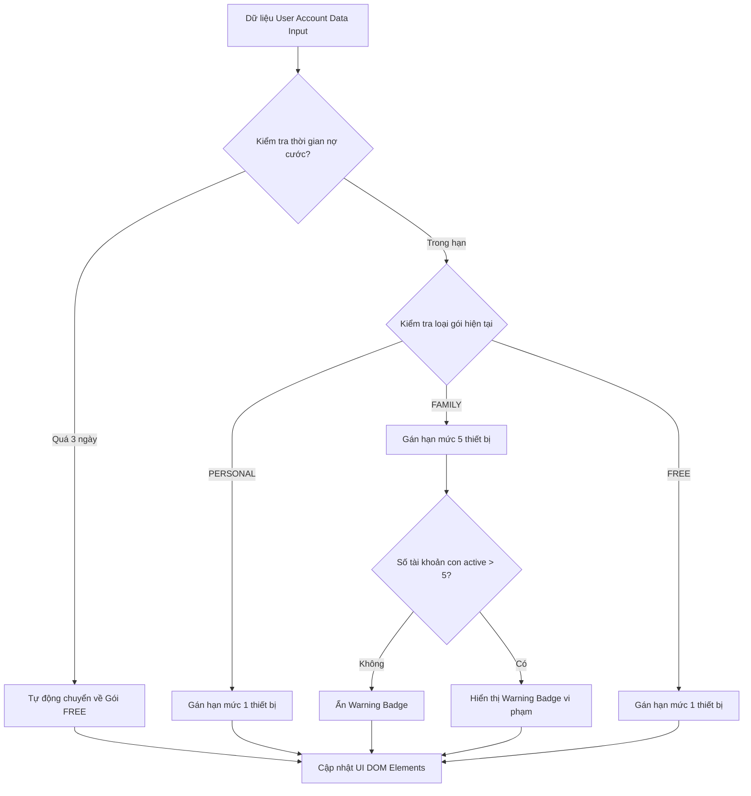

### 1. Mục tiêu bài tập
- **Thao tác DOM API thuần thục**: Sử dụng thành thạo các phương thức truy xuất HTML Element (`document.getElementById`, `document.querySelector`) để lấy thông tin và cập nhật giao diện.
- **Thay đổi nội dung & Thuộc tính DOM**: Biết cách cập nhật linh hoạt `textContent`, `innerHTML`, thao tác với `classList` (`add`, `remove`) và thay đổi style hiển thị của các thẻ HTML.
- **Tư duy kiểm thử Input/Output trên DOM**: Tiếp nhận dữ liệu cấu hình đầu vào (Input Object), áp dụng logic nghiệp vụ hệ thống SaaS để cập nhật trạng thái hiển thị chính xác lên giao diện UI (Output DOM).

---


### 2. Bối cảnh & Mô tả bài toán
Bạn là một Lập trình viên Frontend tại công ty phát triển nền tảng xem phim & nghe nhạc trực tuyến **SaaS Subscription Service**. Hệ thống cần hiển thị thông tin bảng điều khiển (Dashboard) quản lý gói tài khoản của người dùng dựa trên dữ liệu cấu hình được cung cấp từ backend.

Khi thông tin người dùng được nạp vào hệ thống, trang web cần tự động truy xuất các thẻ HTML và thay đổi nội dung, màu sắc badge trạng thái, hạn mức thiết bị xem cùng lúc và danh sách các tính năng được truy cập theo đúng cấp độ gói đăng ký.



---


### 3. Quy tắc nghiệp vụ (Business Rules)

Dữ liệu đầu vào là một đối tượng `userData` có dạng:
```javascript
const userData = {
  userName: "Nguyễn Văn A",
  planType: "FAMILY", // Nhận 1 trong các giá trị: "PERSONAL", "FAMILY", "FREE"
  paymentOverdueDays: 0, // Số ngày quá hạn thanh toán
  activeSubAccounts: 6 // Số lượng tài khoản con đang hoạt động
};
```


#### Quy tắc 1: Xử lý nợ cước thanh toán
- Nếu `paymentOverdueDays > 3`: Tài khoản tự động bị hạ cấp về gói `"FREE"`. 
  - Phần hiển thị trạng thái (`#account-status`) ghi nội dung: `"Đã hạ cấp về Miễn phí (Quá hạn thanh toán)"`.
  - Xóa class `status-success`, `status-secondary` và thêm class `status-danger` vào thẻ `#account-status`.


#### Quy tắc 2: Phân quyền theo hạng gói dịch vụ (Subscription Plan)
- **Gói Cá nhân (`PERSONAL`)**:
  - Tên hiển thị (`#plan-name`): `"Gói Cá Nhân"`
  - Trạng thái (`#account-status`): `"Đang hoạt động"` (thêm class `status-success`).
  - Số thiết bị tối đa (`#max-devices`): `"1 thiết bị"`
  - Danh sách tính năng (`#feature-list`):
    - `<li>Phát nội dung HD</li>`
    - `<li>1 thiết bị phát cùng lúc</li>`
- **Gói Gia đình (`FAMILY`)**:
  - Tên hiển thị (`#plan-name`): `"Gói Gia Đình"`
  - Trạng thái (`#account-status`): `"Đang hoạt động"` (thêm class `status-success`).
  - Số thiết bị tối đa (`#max-devices`): `"5 thiết bị"`
  - Danh sách tính năng (`#feature-list`):
    - `<li>Phát nội dung 4K Ultra HD</li>`
    - `<li>Tối đa 5 thiết bị phát cùng lúc</li>`
    - `<li>Quản lý tài khoản thành viên gia đình</li>`
  - **Kiểm tra vi phạm số lượng tài khoản con**: Nếu `activeSubAccounts > 5`, hiển thị thẻ cảnh báo `#warning-badge` với nội dung: `"Cảnh báo: Đã vượt quá 5 tài khoản gia đình cho phép!"` và gán thuộc tính `style.display = "block"`. Ngược lại, ẩn thẻ cảnh báo bằng `style.display = "none"`.
- **Gói Miễn phí (`FREE`)** (Trong trường hợp không nợ cước):
  - Tên hiển thị (`#plan-name`): `"Gói Miễn Phí"`
  - Trạng thái (`#account-status`): `"Tài khoản Miễn phí"` (thêm class `status-secondary`).
  - Số thiết bị tối đa (`#max-devices`): `"1 thiết bị"`
  - Danh sách tính năng (`#feature-list`):
    - `<li>Phát nội dung SD (Có quảng cáo)</li>`

---


### 4. Yêu cầu kỹ thuật & Triển khai


#### 4.1 Cấu trúc HTML Ban Đầu (Cho sẵn)
Lập trình viên tạo file `index.html` với cấu trúc như bên dưới (không sửa đổi `id` của thẻ):

```html
<!DOCTYPE html>
<html lang="vi">
<head>
  <meta charset="UTF-8">
  <title>SaaS Subscription Dashboard</title>
  <style>
    .status-success { color: #2e7d32; font-weight: bold; }
    .status-danger { color: #c62828; font-weight: bold; }
    .status-secondary { color: #666666; font-style: italic; }
    .warning { background-color: #ffebee; color: #c62828; padding: 8px; border-radius: 4px; margin-top: 10px; }
  </style>
</head>
<body>
  <div id="subscription-card">
    <h2 id="user-name">Tên người dùng</h2>
    <p>Gói dịch vụ: <strong id="plan-name">---</strong></p>
    <p>Trạng thái: <span id="account-status">---</span></p>
    <p>Giới hạn thiết bị: <span id="max-devices">---</span></p>
    
    <h3>Tính năng khả dụng:</h3>
    <ul id="feature-list"></ul>

    <div id="warning-badge" class="warning" style="display: none;"></div>
  </div>

  <script src="./app.js"></script>
</body>
</html>
```


#### 4.2 Triển khai hàm JavaScript trong file `app.js`
Viết hàm `renderSubscriptionDashboard(userData)` tiếp nhận một object thông tin người dùng và thực hiện cập nhật toàn bộ thông tin lên HTML DOM.

```javascript
function renderSubscriptionDashboard(userData) {
  // TODO: Truy xuất các DOM Elements cần thiết
  // TODO: Xử lý logic nợ cước & hạ cấp tài khoản
  // TODO: Cập nhật textContent, classList, innerHTML và style cho từng element
}
```


#### 4.3 Ràng buộc phạm vi công nghệ (Forbidden Scope)
- **KHÔNG** sử dụng bắt sự kiện (`addEventListener`, `onclick`, ...).
- **KHÔNG** sử dụng Form Submit.
- **KHÔNG** sử dụng `fetch`, `axios` hoặc `localStorage`.
- Chỉ sử dụng kiến thức DOM API cơ bản của Session 17 (Truy xuất & Cập nhật nội dung/thuộc tính).

---


### 5. Quy chuẩn nộp bài
- Cấu trúc thư mục dự án:
  ```text
  logistics-saas-dom/
  ├── index.html
  └── app.js
  ```
- File `app.js` chứa khai báo hàm `renderSubscriptionDashboard(userData)` và lời gọi hàm thử nghiệm với dữ liệu mẫu ở cuối file.