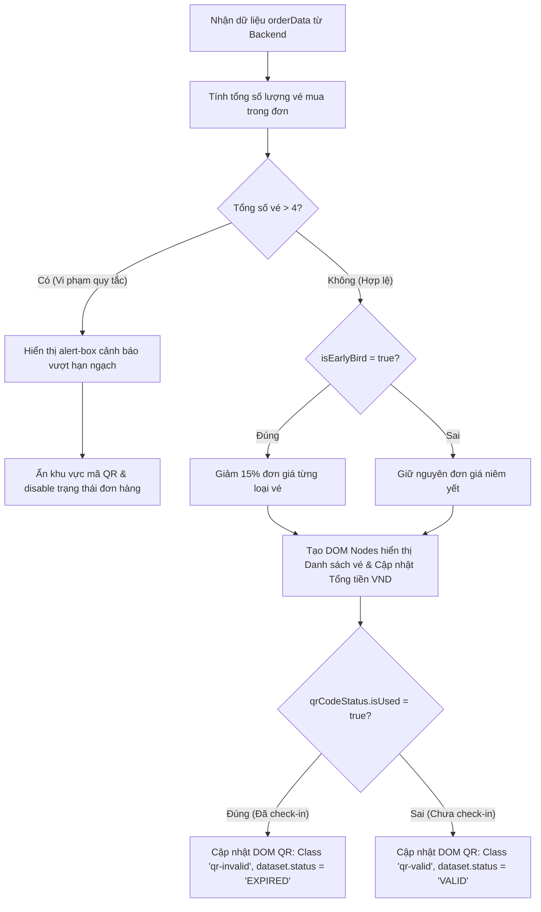

### 1. Mục tiêu bài tập
Sau khi hoàn thành bài tập này, học viên sẽ có khả năng:
- **Thao tác thành thạo DOM Tree API**: Truy xuất các phần tử HTML chính xác bằng `document.getElementById`, `document.querySelector` và `document.querySelectorAll`.
- **Thay đổi thuộc tính và nội dung Element**: Sử dụng `textContent`, `innerHTML`, `classList` (`add`, `remove`, `contains`), `style`, và tùy biến thuộc tính dữ liệu (`dataset`, `setAttribute`).
- **Tạo và gắn DOM Node động**: Khởi tạo phần tử mới bằng `createElement` và chèn vào cây DOM bằng `appendChild` / `insertAdjacentHTML`.
- **Áp dụng quy tắc nghiệp vụ FinTech (Event Ticketing)**: Tính toán chính xác ưu đãi Early Bird 15%, kiểm soát hạn ngạch vé (tối đa 4 vé/tài khoản) và cập nhật trạng thái hiển thị của mã QR Check-in dùng 1 lần mà **chưa cần sử dụng Event Listener hay Bộ nhớ đệm (LocalStorage)**.

---


### 2. Bối cảnh & Mô tả bài toán
Bạn đang là Lập trình viên Front-end tại hệ thống bán vé sự kiện và nhạc hội **Ticketbox** (FinTech / Event Ticketing). Bạn được giao nhiệm vụ phát triển module hiển thị và cập nhật **Bảng xác nhận đơn hàng & Trạng thái vé (Ticket Checkout & Check-in Dashboard)** cho đại nhạc hội *"Rikkei Live Concert 2025"*.

Hệ thống nhận một đối tượng dữ liệu đơn hàng (`orderData`) từ phía Server và lập trình viên cần dùng **thuần DOM API** để cập nhật toàn bộ giao diện cho khách hàng kiểm tra trước khi tiến hành bước soát vé tại cổng.


#### Sơ đồ luồng xử lý dữ liệu và cập nhật DOM (Workflow):



---


### 3. Quy tắc nghiệp vụ (Business Rules)

1. **Hạn ngạch mua vé (Ticket Quantity Limit)**:
   - Tổng số lượng vé trong đơn vị tính bằng: `totalQuantity = sum(zone.quantity)`.
   - Mỗi tài khoản **chỉ được mua tối đa 4 vé** cho 1 đêm diễn.
   - Nếu `totalQuantity > 4`:
     - Hiển thị thẻ `#alert-box` bằng cách thêm class `alert-show`, đổi màu nền thành cảnh báo lỗi.
     - Thay đổi `textContent` của `#alert-box` thành: `"Rất tiếc! Mỗi tài khoản chỉ được mua tối đa 4 vé cho 1 đêm diễn."`
     - Cập nhật phần tử `#qr-section` thành thuộc tính `style.display = "none"`.
   - Nếu `totalQuantity <= 4`:
     - Thẻ `#alert-box` phải ẩn (xóa class `alert-show`).
     - Thẻ `#qr-section` hiển thị bình thường (`style.display = "block"`).

2. **Quy tắc tính giá ưu đãi Early Bird (15% Discount)**:
   - Nếu `isEarlyBird === true`: Đơn giá thực tế áp dụng cho mỗi khu vực vé được giảm 15% so với giá gốc (`unitPrice * 0.85`).
   - Nếu `isEarlyBird === false`: Đơn giá giữ nguyên 100% (`unitPrice`).
   - **Thành tiền từng loại vé** = `Đơn giá áp dụng * Số lượng`.
   - **Tổng thanh toán đơn hàng** = Tổng Thành tiền của tất cả khu vực vé trong đơn.
   - Tất cả giá tiền hiển thị trên DOM phải được định dạng theo chuẩn tiền tệ Việt Nam (`VND`), ví dụ: `1.700.000 VNĐ` (gợi ý dùng `Intl.NumberFormat('vi-VN')`).

3. **Quản lý mã QR Check-in (One-Time QR Code)**:
   - Đối tượng `qrCodeStatus` gồm: `{ code: "QR-889911", isUsed: boolean }`.
   - Nếu `isUsed === true` (Mã QR đã được quét check-in ở cổng):
     - Gắn class `qr-expired` và xóa class `qr-active` tại phần tử `#qr-code-box`.
     - Đổi thuộc tính `dataset.status` của `#qr-code-box` thành `"EXPIRED"`.
     - Cập nhật text phần tử `#qr-status-text` thành: `"MÃ QR ĐÃ SỬ DỤNG CHECK-IN (HẾT HIỆU LỰC)"`.
   - Nếu `isUsed === false` và đơn hàng hợp lệ:
     - Gắn class `qr-active` và xóa class `qr-expired` tại phần tử `#qr-code-box`.
     - Đổi thuộc tính `dataset.status` của `#qr-code-box` thành `"VALID"`.
     - Cập nhật text phần tử `#qr-status-text` thành: `"Mã QR hợp lệ - Quét 1 lần duy nhất tại cổng vào"`.
     - Cập nhật text phần tử `#qr-code-display` thành giá trị của `code`.

---


### 4. Yêu cầu kỹ thuật & Triển khai


#### 4.1. Cấu trúc HTML ban đầu (`index.html`)

```html
<!DOCTYPE html>
<html lang="vi">
<head>
  <meta charset="UTF-8">
  <title>Ticketbox - Chi Tiết Đặt Vé</title>
  <link rel="stylesheet" href="css/style.css">
</head>
<body>
  <div class="container">
    <h1>XÁC NHẬN ĐƠN HÀNG VÉ XEM CA NHẠC</h1>
    
    <!-- Khối thông báo lỗi/hợp lệ -->
    <div id="alert-box" class="alert-box"></div>

    <!-- Thông tin tổng quan sự kiện -->
    <div class="event-info">
      <h2 id="event-title">---</h2>
      <p>Mã đơn hàng: <strong id="order-id">---</strong></p>
      <span id="early-bird-badge" class="badge">---</span>
    </div>

    <!-- Bảng danh sách loại vé -->
    <table class="ticket-table">
      <thead>
        <tr>
          <th>Khu vực (Zone)</th>
          <th>Đơn giá gốc</th>
          <th>Giá áp dụng</th>
          <th>Số lượng</th>
          <th>Thành tiền</th>
        </tr>
      </thead>
      <tbody id="ticket-list-body">
        <!-- DOM JS sẽ chèn các dòng <tr> vào đây -->
      </tbody>
    </table>

    <!-- Tổng tiền -->
    <div class="summary-box">
      <h3>Tổng tiền thanh toán: <span id="total-amount">0 VNĐ</span></h3>
    </div>

    <!-- Khu vực mã QR Check-in -->
    <div id="qr-section" class="qr-section">
      <h3>MÃ QR CHECK-IN CỔNG</h3>
      <div id="qr-code-box" class="qr-code-box" data-status="UNKNOWN">
        <span id="qr-code-display">---</span>
      </div>
      <p id="qr-status-text" class="qr-status-text">---</p>
    </div>
  </div>

  <script src="js/main.js"></script>
</body>
</html>
```


#### 4.2. Dữ liệu đầu vào mẫu (Test Cases in `main.js`)

```javascript
// Dữ liệu mẫu 1: Đơn hàng hợp lệ + Early Bird (Giảm 15%) + QR chưa dùng
const mockOrderValidEarlyBird = {
  orderId: "TKB-2025-001",
  eventName: "Rikkei Live Concert: Sky Night 2025",
  isEarlyBird: true,
  ticketZones: [
    { zoneName: "VIP Zone", unitPrice: 2000000, quantity: 2 },
    { zoneName: "Zone A", unitPrice: 1000000, quantity: 1 }
  ],
  qrCodeStatus: {
    code: "QR-SKY-8899",
    isUsed: false
  }
};

// Dữ liệu mẫu 2: Đơn hàng vi phạm (Vượt quá 4 vé)
const mockOrderExceedLimit = {
  orderId: "TKB-2025-002",
  eventName: "Rikkei Live Concert: Sky Night 2025",
  isEarlyBird: false,
  ticketZones: [
    { zoneName: "GA Standing", unitPrice: 500000, quantity: 3 },
    { zoneName: "Zone B", unitPrice: 800000, quantity: 2 }
  ], // Tổng 5 vé => Lỗi!
  qrCodeStatus: {
    code: "QR-SKY-0000",
    isUsed: false
  }
};

// Dữ liệu mẫu 3: Đơn hàng hợp lệ nhưng QR đã sử dụng
const mockOrderUsedQR = {
  orderId: "TKB-2025-003",
  eventName: "Rikkei Seminar: FinTech Trends 2025",
  isEarlyBird: false,
  ticketZones: [
    { zoneName: "Standard Pass", unitPrice: 300000, quantity: 1 }
  ],
  qrCodeStatus: {
    code: "QR-FIN-1234",
    isUsed: true
  }
};
```


#### 4.3. Yêu cầu chi tiết hàm xử lý DOM `renderTicketDashboard(orderData)`

Học viên phải viết hàm `renderTicketDashboard(order)` trong `js/main.js` để thực hiện các công việc sau:

1. **Truy xuất các element**: Lấy ra toàn bộ các thẻ HTML cần thao tác qua ID hoặc Class selector.
2. **Cập nhật thông tin chung**:
   - Gán tên sự kiện vào `#event-title`.
   - Gán mã đơn hàng vào `#order-id`.
   - Kiểm tra `order.isEarlyBird`:
     - Nếu `true`: Gán `textContent` cho `#early-bird-badge` là `"Ưu đãi Early Bird (-15%)"`, thêm class `badge-success`.
     - Nếu `false`: Gán `textContent` là `"Mở bán chính thức (Standard)"`, thêm class `badge-secondary`.
3. **Kiểm tra tổng số lượng vé**:
   - Tính tổng số lượng vé trong mảng `ticketZones`.
   - Nếu tổng > 4: Xử lý theo **Quy tắc nghiệp vụ 1**, ẩn danh sách vé và trả về sớm (early return).
4. **Render danh sách vé động vào `<tbody>`**:
   - Làm sạch danh sách cũ bằng `tbody.innerHTML = ''`.
   - Duyệt qua từng item trong `ticketZones`:
     - Tính đơn giá áp dụng (`unitPrice * 0.85` nếu Early Bird, ngược lại giữ nguyên `unitPrice`).
     - Tính thành tiền cho item = `đơn giá áp dụng * quantity`.
     - Tạo phần tử `<tr>` mới, cập nhật HTML hiển thị thông tin từng dòng (dùng `document.createElement('tr')` hoặc chuỗi Template String vừa đủ).
     - Đưa dòng `<tr>` mới vào `#ticket-list-body`.
5. **Cập nhật Tổng tiền**:
   - Cộng dồn thành tiền của các dòng vé.
   - Định dạng dạng VNĐ và gán vào `#total-amount`.
6. **Xử lý hiển thị QR Check-in**:
   - Cập nhật trạng thái hiển thị của phần tử `#qr-code-box`, `#qr-code-display`, và `#qr-status-text` theo **Quy tắc nghiệp vụ 3**.


#### 4.4. Các điều cấm (Forbidden Scope)
-  **KHÔNG** sử dụng `addEventListener` hoặc thuộc tính gán sự kiện trực tiếp như `onclick`, `onsubmit`.
-  **KHÔNG** sử dụng `Fetch API`, `Axios` hay gọi dữ liệu bất đồng bộ.
-  **KHÔNG** sử dụng `localStorage` hay `sessionStorage`.
- Bài tập này chỉ tập trung 100% vào kỹ năng **Query DOM, Đọc/Ghi thuộc tính Element và Thao tác DOM Node**.

---


### 5. Quy chuẩn nộp bài

- **Cấu trúc thư mục**:
  ```text
  student-id_hw3/
  ├── index.html
  ├── css/
  │   └── style.css
  └── js/
      └── main.js
  ```
- **Quy định file script**: File `js/main.js` chứa toàn bộ code xử lý DOM và gọi thử nghiệm hàm `renderTicketDashboard(mockOrderValidEarlyBird)` ở cuối file để hiển thị kết quả mặc định trên trình duyệt.
- Mã nguồn cần comment giải thích rõ từng bước xử lý DOM API.