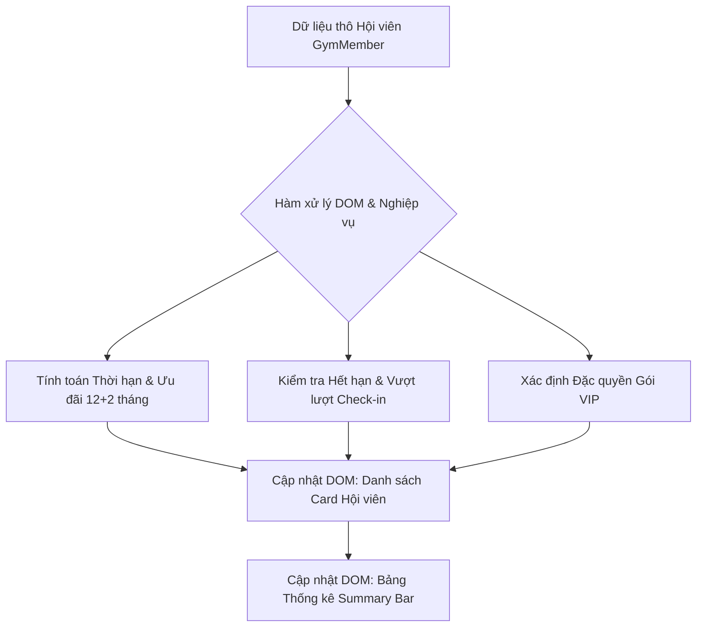

### 1. Mục tiêu bài tập
Sau khi hoàn thành bài tập này, học viên sẽ có khả năng:
- **Thành thạo kỹ thuật truy xuất DOM**: Sử dụng linh hoạt `document.querySelector`, `querySelectorAll`, `getElementById`, và các thuộc tính điều hướng (node navigation) để truy cập chính xác các phần tử HTML trong giao diện phức tạp.
- **Thao tác & Thay đổi nội dung DOM**: Sử dụng thành thạo `textContent`, `innerText`, `innerHTML` để cập nhật dữ liệu hiển thị động cho giao diện người dùng.
- **Quản lý thuộc tính và CSS Class**: Sử dụng `setAttribute`, `getAttribute`, `classList.add()`, `classList.remove()`, `classList.toggle()` để làm mới trạng thái giao diện (Badge status, highlight cảnh báo) dựa trên logic nghiệp vụ.
- **Xử lý logic nghiệp vụ Quản lý Phòng Gym (GYM_FITNESS)**: Áp dụng thuật toán tính toán ưu đãi gói tập, thời hạn hết hạn, cảnh báo vi phạm lượt check-in và đặc quyền hội viên VIP trực tiếp lên cấu trúc cây DOM.

---


### 2. Bối cảnh & Mô tả bài toán
Hệ thống phần mềm quản lý phòng tập **Rikkei Fitness Center** đang trong quá trình nâng cấp giao diện bảng điều khiển (Dashboard) dành cho bộ phận Lễ tân và Quản lý. 

Mỗi khi trang web tải xong, giao diện cần tự động đọc danh sách dữ liệu hội viên check-in trong ngày, áp dụng các quy tắc ưu đãi/cảnh báo nghiệp vụ fitness, tính toán ngày hết hạn gói tập, và render (hiển thị) lại toàn bộ danh sách thẻ hội viên (Member Cards) cũng như cập nhật các chỉ số tổng quan ở Bảng thống kê (Summary Bar) mà không được làm mới lại trang web hay sử dụng API từ bên ngoài.



---


### 3. Quy tắc nghiệp vụ (Business Rules)

1. **Quy tắc Tính thời hạn & Khuyến mãi gói tập (`MembershipPackage`)**:
   - Gói tập 12 tháng (`durationMonths = 12`): Được **tặng thêm 2 tháng** miễn phí (Tổng thời hạn tính toán = 14 tháng).
   - Các gói khác (1, 3, 6 tháng): Giữ nguyên thời hạn.
   - Ngày hết hạn (`expiryDate`) = `startDate` + Tổng số tháng thời hạn.
   - *Hiển thị DOM*: Với gói 12 tháng, bắt buộc chèn một thẻ `<span class="badge badge-bonus">+2 Tháng Tặng</span>` vào thẻ card hội viên.

2. **Quy tắc Kiểm tra Trạng thái Thẻ Check-in (`CheckInLog`)**:
   - Nếu `expiryDate < currentDate` (Ngày hiện tại giả định: `2024-10-25`): Hội viên **Đã hết hạn**. Cần đổi nhãn trạng thái thành `HẾT HẠN`, áp dụng class CSS `.card-expired` cho thẻ hội viên.
   - Nếu `checkInCountToday > maxDailyCheckIn`: Hội viên **Vượt quá lượt check-in trong ngày**. Thêm nhãn cảnh báo `<span class="badge badge-danger">Vượt giới hạn ngày</span>`.
   - Nếu không vi phạm: Nhãn trạng thái hiển thị `HỢP LỆ` với class CSS `.card-valid`.

3. **Quy tắc Đặc quyền Hội viên VIP (`packageType = 'VIP'`)**:
   - Hội viên đăng ký gói VIP được miễn phí tủ đồ cá nhân (Locker) và khăn tắm.
   - *Hiển thị DOM*: Chèn danh sách các nhãn đặc quyền:
     `<div class="vip-perks"><span class="perk-item"> Tủ đồ miễn phí</span><span class="perk-item"> Khăn tắm miễn phí</span></div>` vào giao diện card của hội viên VIP.
   - Gói `STANDARD` không hiển thị phần này.

4. **Quy tắc Thống kê Bảng điều khiển (Summary Dashboard Bar)**:
   Cập nhật các số liệu thống kê vào các phần tử DOM tương ứng:
   - Tổng số lượt check-in hôm nay (`#total-checkins`)
   - Tổng số hội viên vi phạm/cảnh báo (`#total-warnings`) - tính gồm các thẻ hết hạn hoặc vượt quá lượt check-in.
   - Tổng số hội viên VIP đang hoạt động (`#total-vip`).

---


### 4. Yêu cầu kỹ thuật & Triển khai


#### 4.1. Cấu trúc HTML & Dữ liệu đầu vào
Học viên tạo file `index.html` chứa vùng chứa khung tổng quan và container danh sách hội viên:

```html
<div class="dashboard-container">
  <!-- Bảng thống kê Summary Bar -->
  <div id="summary-bar" class="summary-bar">
    <div class="summary-card">Tổng Check-in: <span id="total-checkins">0</span></div>
    <div class="summary-card">Cảnh báo/Vi phạm: <span id="total-warnings">0</span></div>
    <div class="summary-card">Hội viên VIP: <span id="total-vip">0</span></div>
  </div>

  <!-- Danh sách Thẻ Hội viên sẽ render vào đây -->
  <div id="member-list" class="member-list"></div>
</div>
```

Trong file `script.js`, sử dụng mảng dữ liệu mẫu sau để thực hiện logic:

```javascript
const CURRENT_DATE_STR = "2024-10-25";

const gymMembersData = [
  {
    id: "GYM-8801",
    fullName: "Nguyễn Văn Anh",
    packageType: "VIP",
    durationMonths: 12,
    startDate: "2023-11-01",
    checkInCountToday: 1,
    maxDailyCheckIn: 1,
    trainerAssigned: "HLV. Trần Huấn"
  },
  {
    id: "GYM-8802",
    fullName: "Lê Thị Bích",
    packageType: "STANDARD",
    durationMonths: 3,
    startDate: "2024-06-01",
    checkInCountToday: 2,
    maxDailyCheckIn: 1,
    trainerAssigned: null
  },
  {
    id: "GYM-8803",
    fullName: "Phạm Minh Cường",
    packageType: "VIP",
    durationMonths: 6,
    startDate: "2024-01-15",
    checkInCountToday: 1,
    maxDailyCheckIn: 2,
    trainerAssigned: "HLV. Lê Vũ"
  },
  {
    id: "GYM-8804",
    fullName: "Hoàng Ngọc Dũng",
    packageType: "STANDARD",
    durationMonths: 12,
    startDate: "2023-09-10",
    checkInCountToday: 3,
    maxDailyCheckIn: 2,
    trainerAssigned: null
  }
];
```


#### 4.2. Yêu cầu viết Mã nguồn JavaScript (`script.js`)

1. **Hàm tính toán thời gian `calculateExpiryDate(startDateStr, durationMonths)`**:
   - Nhận vào chuỗi ngày bắt đầu dạng `YYYY-MM-DD` và số tháng.
   - Cộng thêm số tháng (nếu `durationMonths === 12` thì cộng 14).
   - Trả về chuỗi ngày hết hạn định dạng `YYYY-MM-DD`.

2. **Hàm khởi tạo và render danh sách hội viên `renderGymMembers(members)`**:
   - Sử dụng `document.getElementById('member-list')` để lấy phần tử container.
   - Duyệt qua từng hội viên trong mảng `members`, tính toán các logic nghiệp vụ (thời hạn, hết hạn, vi phạm lượt check-in, gói VIP).
   - Xây dựng cấu trúc phần tử HTML cho từng thẻ bằng DOM API (hoặc Template String kết hợp `innerHTML`/`innerText`).
   - Gắn các CSS class phù hợp (`card-expired`, `card-valid`, `badge-bonus`, `badge-danger`, v.v.) và thuộc tính `data-member-id`.

3. **Hàm cập nhật Bảng thống kê `updateSummaryDashboard(members)`**:
   - Sử dụng `document.querySelector` hoặc `document.getElementById` để truy xuất các phần tử `#total-checkins`, `#total-warnings`, `#total-vip`.
   - Cập nhật giá trị hiển thị bằng thuộc tính `textContent` hoặc `innerText`.

4. **Yêu cầu tuân thủ nguyên tắc ràng buộc**:
   - **TUYỆT ĐỐI KHÔNG** sử dụng `addEventListener`, sự kiện click/submit (thuộc Session 19).
   - **TUYỆT ĐỐI KHÔNG** sử dụng `fetch API` hoặc `localStorage`.
   - Script phải tự động chạy toàn bộ luồng logic và cập nhật DOM ngay sau khi tải mã nguồn.


#### 4.3. Xử lý ngoại lệ và trường hợp biên (Edge Cases)
- Trừơng hợp dữ liệu `trainerAssigned` bị `null` hoặc `undefined`: Hiển thị "Chưa đăng ký HLV".
- Trường hợp số tháng tập không hợp lệ ($\le 0$): Gán mặc định là 1 tháng.
- Trường hợp danh sách `members` bị rỗng (`[]`): Render thông báo *"Hiện chưa có lượt check-in nào trong ngày"* vào khung `#member-list` và cập nhật chỉ số summary về 0.

---


### 5. Quy chuẩn nộp bài
- **Cấu trúc thư mục**:
  ```text
  gym-dom-management/
  ├── index.html
  ├── style.css
  └── script.js
  ```
- **Quy định đặt tên**:
  - Mã HTML Semantic, thụt lề chuẩn 2 spaces.
  - Tên hàm JavaScript viết theo chuẩn `camelCase` (ví dụ: `calculateExpiryDate`, `updateSummaryDashboard`).
  - Class CSS viết theo chuẩn `kebab-case` (ví dụ: `member-card`, `status-badge`).