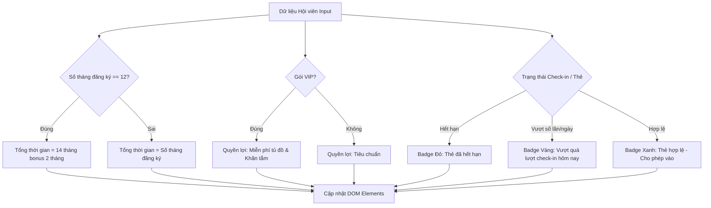

### 1. Mục tiêu bài tập
- **Thao tác DOM Tree**: Thành thạo việc truy xuất các HTML Element bằng các phương thức `document.getElementById()`, `document.querySelector()`.
- **Thay đổi Nội dung & Thuộc tính**: Sử dụng thành thạo `textContent`, `innerHTML`, `classList` (hoặc `className`), và `setAttribute()` để hiển thị thông tin động trên giao diện web.
- **Áp dụng Nghiệp vụ Real-world**: Chuyển đổi logic xử lý dữ liệu hội viên phòng Gym (GYM_FITNESS) thành các thay đổi trực quan trên giao diện ứng dụng quản lý phòng tập.

---


### 2. Bối cảnh & Mô tả bài toán
Tại phòng tập **Rikkei Fitness Center**, bộ phận lễ tân cần một màn hình thẻ thông tin hội viên (Member Dashboard Card) tự động cập nhật chi tiết ngay khi dữ liệu hội viên được tải lên hệ thống. Màn hình này giúp nhân viên kiểm soát nhanh: thời hạn gói tập, các ưu đãi đi kèm (VIP), và tình trạng check-in trong ngày để phát hiện hội viên gian lận hoặc hết hạn thẻ.

Dưới đây là sơ đồ luồng xử lý và hiển thị thông tin hội viên lên giao diện:



---


### 3. Quy tắc nghiệp vụ (Business Rules)

1. **Quy tắc thời hạn gói tập (Bonus Months)**:
   - Nếu hội viên đăng ký gói **12 tháng**, hệ thống tự động tặng thêm **2 tháng** sử dụng (Tổng hiển thị: `14 tháng (Đã tặng 2 tháng miễn phí)`).
   - Nếu đăng ký dưới 12 tháng, hiển thị đúng số tháng đăng ký (Ví dụ: `6 tháng`).

2. **Quy tắc Quyền lợi gói tập (VIP Perks)**:
   - Loại gói `VIP`: Quyền lợi hiển thị là `Miễn phí tủ đồ cá nhân & Khăn tắm cao cấp`.
   - Loại gói `STANDARD`: Quyền lợi hiển thị là `Tủ đồ tiêu chuẩn`.

3. **Quy tắc Cảnh báo Check-in (Status Badge)**:
   - **Trường hợp 1 (Đã hết hạn - `isExpired === true`)**:
     - Nội dung Text: `CẢNH BÁO: Thẻ đã hết hạn!`
     - Class CSS badge: `badge status-danger`
   - **Trường hợp 2 (Chưa hết hạn nhưng vượt quá lượt check-in trong ngày - `todayCheckIns > maxDailyCheckIns`)**:
     - Nội dung Text: `CẢNH BÁO: Vượt quá lượt check-in hôm nay!`
     - Class CSS badge: `badge status-warning`
   - **Trường hợp 3 (Hợp lệ - `isExpired === false` và `todayCheckIns <= maxDailyCheckIns`)**:
     - Nội dung Text: `HỢP LỆ: Mời vào tập`
     - Class CSS badge: `badge status-success`

---


### 4. Yêu cầu kỹ thuật & Triển khai


#### 4.1. Cấu trúc File HTML ban đầu (`index.html`)
Học viên tạo file `index.html` với cấu trúc khung như sau (KHÔNG thay đổi các `id` có sẵn):

```html
<!DOCTYPE html>
<html lang="vi">
<head>
  <meta charset="UTF-8">
  <title>Rikkei Fitness - Thẻ Hội Viên</title>
  <style>
    .badge { padding: 8px 12px; border-radius: 4px; font-weight: bold; color: #fff; display: inline-block; }
    .status-danger { background-color: #dc3545; }
    .status-warning { background-color: #ffc107; color: #000; }
    .status-success { background-color: #28a745; }
    .vip-border { border: 2px solid #ffd700; background-color: #fffdf0; }
    .card { padding: 16px; width: 350px; font-family: sans-serif; border-radius: 8px; box-shadow: 0 2px 8px rgba(0,0,0,0.1); }
  </style>
</head>
<body>
  <div id="member-card" class="card">
    <h2 id="member-name">---</h2>
    <p><strong>Loại gói:</strong> <span id="package-type">---</span></p>
    <p><strong>Thời hạn:</strong> <span id="package-duration">---</span></p>
    <p><strong>Quyền lợi:</strong> <span id="vip-perks">---</span></p>
    <p><strong>Check-in hôm nay:</strong> <span id="checkin-count">---</span></p>
    <hr>
    <div><strong>Trạng thái:</strong> <span id="status-badge" class="badge">---</span></div>
  </div>

  <script src="./main.js"></script>
</body>
</html>
```


#### 4.2. Yêu cầu viết JavaScript (`main.js`)
Viết hàm `renderMemberDashboard(member)` nhận vào 01 đối tượng `member` và tiến hành truy xuất, cập nhật DOM:

- **Cấu trúc dữ liệu đầu vào của `member`**:
```javascript
const sampleMember = {
  name: "Nguyễn Văn An",
  packageType: "VIP", // "VIP" hoặc "STANDARD"
  monthsRegistered: 12,
  isExpired: false,
  todayCheckIns: 2,
  maxDailyCheckIns: 1
};
```

- **Yêu cầu tương tác DOM chi tiết**:
  1. Gán tên hội viên vào `#member-name` (chuyển sang IN HOA chữ cái đầu hoặc toàn bộ tên).
  2. Gán tên gói tập vào `#package-type`. Nếu là `VIP`, thêm class `vip-border` cho thẻ có `id="member-card"`. Nếu là `STANDARD`, xóa class `vip-border` khỏi thẻ `#member-card` (nếu có).
  3. Tính toán thời hạn và hiển thị tại `#package-duration` theo **Quy tắc 1**.
  4. Hiển thị quyền lợi tại `#vip-perks` theo **Quy tắc 2**.
  5. Hiển thị chuỗi định dạng `[todayCheckIns]/[maxDailyCheckIns] lượt` tại `#checkin-count` (Ví dụ: `2/1 lượt`).
  6. Xử lý phần thẻ trạng thái `#status-badge`:
     - Cập nhật đúng văn bản (`textContent`) và cập nhật toàn bộ class (`className` hoặc `classList`) tương ứng với **Quy tắc 3**.
     - Thêm thuộc tính `data-status` cho `#status-badge` với giá trị tương ứng (`EXPIRED`, `OVER_LIMIT`, `VALID`).

- **Lưu ý ràng buộc kỹ thuật**:
  - **KHÔNG** sử dụng Event Listener (`addEventListener`, `onclick`).
  - **KHÔNG** sử dụng Form Submit, Fetch API, hay LocalStorage.
  - Hàm `renderMemberDashboard` phải chạy được ngay khi được gọi trực tiếp cuối file `main.js`.

---


### 5. Quy chuẩn nộp bài
- **Cấu trúc thư mục**:
  ```text
  gym-member-dom/
  ├── index.html
  └── main.js
  ```
- **Quy định đặt tên hàm/biến**: Viết đúng tên hàm `renderMemberDashboard(member)` theo đúng cú pháp chữ hoa/thường.