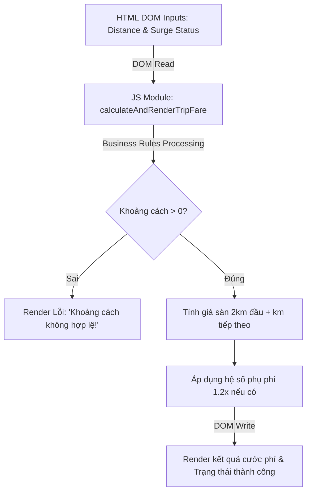

### 1. Mục tiêu bài tập
- **Thao tác truy xuất DOM API**: Sử dụng thành thạo các phương thức `document.getElementById()`, `document.querySelector()` để lấy dữ liệu từ các phần tử HTML.
- **Thay đổi nội dung & kiểu dáng DOM**: Biết cách sử dụng `textContent`, `innerHTML` và thuộc tính `style` để cập nhật giao diện người dùng dựa trên kết quả tính toán.
- **Áp dụng logic nghiệp vụ thực tế**: Cài đặt thuật toán tính cước phí dịch vụ đặt xe công nghệ (GrabRide) với khoảng cách lũy tiến và hệ số phụ phí.
- **Kiểm thử I/O trực tiếp trên DOM**: Đảm bảo mã nguồn đọc đúng input từ các phần tử DOM và ghi đúng output vào các phần tử DOM mục tiêu theo yêu cầu test case mà không cần phụ thuộc vào sự kiện người dùng (Event Listeners).

---


### 2. Bối cảnh & Mô tả bài toán
Trong hệ thống đặt xe công nghệ **GrabRide**, sau khi khách hàng nhập điểm đi và điểm đến, hệ thống cần hiển thị thông tin tóm tắt chuyến đi (`TripFare`) cho khách hàng và tài xế kiểm tra trước khi tiến hành đặt xe.

Trang web đã có sẵn khung giao diện HTML chứa các thông tin khoảng cách di chuyển và trạng thái thời tiết/giờ cao điểm. Nhiệm vụ của bạn là viết script JavaScript thực hiện việc đọc dữ liệu từ giao diện, tính toán tổng cước phí chuyến đi theo quy tắc nghiệp vụ của GrabRide, sau đó cập nhật thông tin cước phí và trạng thái chuyến đi lên màn hình HTML.



---


### 3. Quy tắc nghiệp vụ (Business Rules)


#### a. Quy tắc tính cước phí chuyến đi (`TripFare`)
1. **Giá sàn (2 km đầu tiên)**: Cố định **12.000 VNĐ** (áp dụng cho mọi khoảng cách `0 < distance <= 2`).
2. **Giá lũy tiến (từ km thứ 3 trở đi)**:
   - Giá mỗi km tiếp theo: **4.500 VNĐ / km**.
   - Công thức base fare cho `distance > 2`: 
     $$\text{BaseFare} = 12000 + (\text{distance} - 2) \times 4500$$
3. **Phụ phí thời tiết xấu / Giờ cao điểm (`isSurge`)**:
   - Nếu `isSurge` là `true` (hoặc attribute `data-surge="true"`): Nhân hệ số **1.2x** trên tổng `BaseFare`.
   - Công thức tổng cước phí: 
     $$\text{TotalFare} = \text{Math.round}(\text{BaseFare} \times 1.2)$$ (làm tròn đến hàng đơn vị).
   - Nếu `isSurge` là `false`: $\text{TotalFare} = \text{BaseFare}$.


#### b. Quy tắc kiểm tra dữ liệu đầu vào (Input Validation)
- Nếu giá trị khoảng cách $\le 0$ hoặc không phải là số hợp lệ (`isNaN`):
  - Số tiền hiển thị: `0 VNĐ`
  - Trạng thái chuyến đi hiển thị: `Khoảng cách không hợp lệ!`
  - Màu chữ của phần tử trạng thái chuyến đi: Đổi sang màu đỏ (`#dc3545` hoặc `red`).
- Nếu khoảng cách hợp lệ ($> 0$):
  - Số tiền hiển thị: Định dạng theo chuẩn Việt Nam Đồng (ví dụ: `16.500 VNĐ` hoặc `12.000 VNĐ`).
  - Trạng thái chuyến đi hiển thị: `Chuyến đi hợp lệ`
  - Màu chữ của phần tử trạng thái chuyến đi: Đổi sang màu xanh (`#28a745` hoặc `green`).

---


### 4. Yêu cầu kỹ thuật & Triển khai


#### a. Cấu trúc HTML đầu vào (Mẫu reference trong `index.html`)
Mã nguồn HTML cung cấp sẵn các thẻ sau (học viên **không sửa đổi ID** của các thẻ này):

```html
<div id="booking-card">
  <h2>Thông tin chuyến đi GrabRide</h2>
  <!-- Khoảng cách di chuyển tính bằng km -->
  <span id="distance-val" data-distance="3.5">3.5</span> km

  <!-- Trạng thái phụ phí giờ cao điểm / thời tiết -->
  <span id="surge-val" data-surge="true">Có (Phụ phí 1.2x)</span>

  <!-- Các khu vực hiển thị kết quả -->
  <div id="fare-amount">0 VNĐ</div>
  <div id="trip-status">Đang chờ xử lý...</div>
</div>
```


#### b. Yêu cầu mã nguồn JavaScript (`js/app.js`)
Viết hàm `calculateAndRenderTripFare()` và tự động thực thi hàm này khi script được tải. Hàm cần thực hiện chính xác các bước:

1. **Đọc dữ liệu từ DOM**:
   - Lấy giá trị khoảng cách từ thuộc tính `data-distance` hoặc nội dung text của thẻ `#distance-val`. Ép kiểu về số thực (`parseFloat`).
   - Lấy trạng thái phụ phí từ thuộc tính `data-surge` của thẻ `#surge-val` (giá trị chuỗi `"true"` chuyển thành boolean `true`, ngược lại là `false`).
2. **Tính toán**: Áp dụng đúng Business Rules nêu trên.
3. **Cập nhật DOM**:
   - Ghi kết quả cước phí vào thẻ `#fare-amount` sử dụng `textContent` (Định dạng có phân tách hàng nghìn + đuôi `VNĐ`, ví dụ `18.750 VNĐ`).
   - Ghi thông báo vào thẻ `#trip-status` và chỉnh đổi màu sắc qua `style.color`.


#### c. Phạm vi cấm (Forbidden Scope)
- **KHÔNG** sử dụng Event Listeners (`addEventListener`, `onclick`, `onchange`, ...).
- **KHÔNG** sử dụng thẻ `<form>` hoặc sự kiện submit (`onsubmit`).
- **KHÔNG** sử dụng `fetch()`, `axios`, hoặc API bất đồng bộ.
- **KHÔNG** sử dụng `localStorage` hoặc `sessionStorage`.

---


### 5. Quy chuẩn nộp bài

- **Cấu trúc thư mục dự án**:
```text
grabride-dom-fare/
├── index.html
└── js/
    └── app.js
```

- **Quy định đặt tên**:
  - Hàm xử lý chính trong `app.js` phải đặt tên chính xác là: `calculateAndRenderTripFare()`.
  - Tên file JavaScript: `js/app.js`.
  - Không nộp các file nén `.zip`, `.rar` thừa ngoài cấu trúc thư mục quy định.