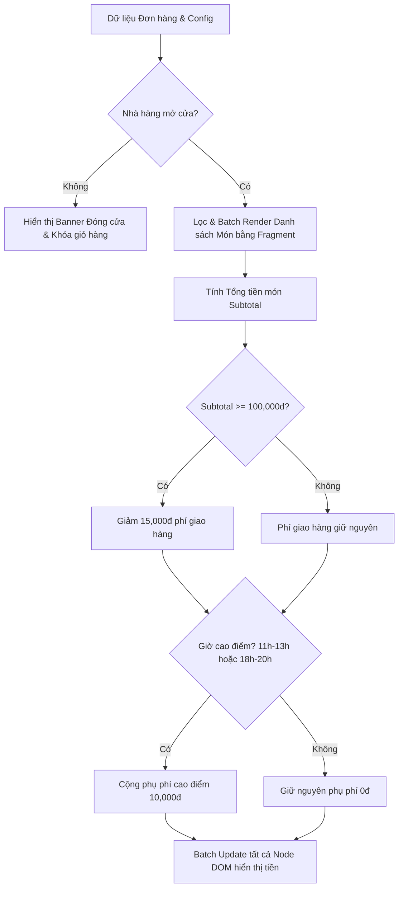

### 1. Mục tiêu bài tập
- **Tối ưu hóa thao tác DOM API (DOM Performance Optimization):** Khắc phục lỗi Layout Thrashing (Reflow/Repaint liên tục) bằng cách hạn chế truy vấn DOM trùng lặp và loại bỏ việc ghi trực tiếp `innerHTML` trong vòng lặp bằng giải pháp `DocumentFragment` hoặc nối chuỗi template trong bộ nhớ.
- **Tái cấu trúc mã nguồn (Code Refactoring & Clean Code):** Tách biệt hoàn toàn phần logic tính toán nghiệp vụ (Pure Business Logic) và phần cập nhật giao diện (DOM Rendering/Mutation).
- **Bộ nhớ đệm phần tử DOM (DOM Caching):** Thực thi chiến lược lưu trữ bộ nhớ đệm cho các Node/Element được truy vấn nhiều lần nhằm giảm chi phí duyệt cây DOM.
- **Áp dụng nghiệp vụ CRM - ShopeeFood:** Xử lý chính xác các điều kiện chiết khấu phí giao hàng, phụ phí giờ cao điểm, trạng thái đóng/mở cửa của nhà hàng và số lượng tồn kho của món ăn.


### 2. Bối cảnh & Mô tả bài toán
Bạn vừa tiếp nhận lại một đoạn mã nguồn cũ trong hệ thống xử lý chi tiết đơn hàng trực tuyến của **ShopeeFood (SHOPEE_FOOD)**. Đoạn mã cũ của lập trình viên tiền nhiệm đang gặp vấn đề nghiêm trọng về hiệu năng: mỗi khi rendering lại danh sách món ăn và tính toán lại hóa đơn, đoạn mã thực hiện truy vấn DOM (`document.getElementById`, `document.querySelector`) hàng chục lần bên trong vòng lặp, đồng thời gán `innerHTML +=` ở từng bước lặp khiến trình duyệt phải tính toán lại bố cục (Reflow) liên tục, gây ra hiện tượng giật lag giao diện trên thiết bị di động.

Nhiệm vụ của bạn là **tái cấu trúc (refactor)** và **tối ưu hóa (optimize)** lại toàn bộ đoạn mã JS xử lý DOM nói trên, đáp ứng đầy đủ quy tắc nghiệp vụ ShopeeFood và chuẩn hóa kiến trúc mã nguồn.


#### Sơ đồ luồng xử lý dữ liệu đơn hàng (ShopeeFood Order Flow):


---


### 3. Quy tắc nghiệp vụ (Business Rules)

1. **Kiểm tra trạng thái Nhà hàng (Store Status Rule):**
   - Nếu `isStoreOpen === false`:
     - Cập nhật banner thông báo `#store-status-banner` có text: `"Rất tiếc, nhà hàng hiện đã đóng cửa. Vui lòng quay lại sau!"` và thêm class CSS `status-closed`.
     - Ẩn toàn bộ khu vực tóm tắt thanh toán `#checkout-summary` (gán class `hidden` hoặc style `display: none`).
     - Dừng toàn bộ tiến trình tính toán đơn hàng.

2. **Xử lý Món ăn và Tồn kho (Food Item & Stock Rule):**
   - Nếu một món ăn có `stock === 0`:
     - Thêm nhãn `<span class="badge-out-of-stock">Hết hàng</span>` vào giao diện của món đó.
     - Thêm class `item-disabled` vào thẻ chứa của món.
     - **Không** tính tiền món này vào tổng chi phí giỏ hàng.

3. **Tính toán Tổng tiền món (Subtotal Calculation):**
   - $\text{Subtotal} = \sum (\text{Đơn giá món còn hàng} \times \text{Số lượng đặt})$.

4. **Tính Phí giao hàng & Chiết khấu (Delivery & Discount Rules):**
   - **Phí giao hàng gốc (`baseShipFee`):** Mặc định theo cấu hình hệ thống (ví dụ: $20.000\text{đ}$).
   - **Ưu đãi giảm phí ship:** Nếu $\text{Subtotal} \ge 100.000\text{đ}$, giảm $15.000\text{đ}$ vào phí giao hàng. Phí giao hàng sau giảm không được nhỏ hơn $0\text{đ}$.
     - $\text{Phí ship sau giảm} = \max(0, \text{baseShipFee} - 15000)$.
   - **Phụ phí giờ cao điểm (Peak Hour Surcharge):**
     - Khung giờ cao điểm: Từ $11\text{h}$ đến $13\text{h}$ HOẶC từ $18\text{h}$ đến $20\text{h}$ (`orderHour` từ $11 \le h \le 13$ hoặc $18 \le h \le 20$).
     - Phụ phí giờ cao điểm: Cộng thêm $10.000\text{đ}$ vào cước giao hàng.
   - **Tổng phí giao hàng (`finalShipFee`):**
     - $\text{finalShipFee} = \text{Phí ship sau giảm} + \text{Phụ phí giờ cao điểm}$.

5. **Tổng thanh toán (Grand Total):**
   - $\text{Grand Total} = \text{Subtotal} + \text{finalShipFee}$.

---


### 4. Yêu cầu kỹ thuật & Triển khai


#### 4.1. Cấu trúc DOM mẫu (HTML)
Yêu cầu mã mã nguồn chạy chính xác trên cấu trúc cây DOM HTML như sau:

```html
<div id="shopeefood-app">
  <!-- Banner trạng thái quán -->
  <div id="store-status-banner" class="banner"></div>

  <!-- Danh sách món ăn -->
  <div class="cart-section">
    <h2>Danh sách món ăn</h2>
    <ul id="cart-list" class="food-list"></ul>
  </div>

  <!-- Khu vực tóm tắt thanh toán -->
  <div id="checkout-summary" class="summary-section">
    <div class="summary-row">
      <span>Tạm tính tiền món:</span>
      <span id="subtotal-val">0đ</span>
    </div>
    <div class="summary-row">
      <span>Phí giao hàng:</span>
      <span id="shipping-val">0đ</span>
    </div>
    <div class="summary-row" id="peak-surcharge-row">
      <span>Phụ phí giờ cao điểm:</span>
      <span id="peak-val">0đ</span>
    </div>
    <div class="summary-row total-row">
      <strong>Tổng thanh toán:</strong>
      <strong id="grand-total-val">0đ</strong>
    </div>
  </div>
</div>
```


#### 4.2. Cấu trúc dữ liệu đầu vào (Input Mock Data)
```javascript
const sampleStoreConfig = {
  isStoreOpen: true,
  orderHour: 12, // 12h trưa (Giờ cao điểm)
  baseShipFee: 20000
};

const sampleCartItems = [
  { id: "F01", name: "Cơm Tấm Sườn Bì Chả", price: 45000, quantity: 2, stock: 10 },
  { id: "F02", name: "Trà Sữa Oolong Lài", price: 30000, quantity: 1, stock: 5 },
  { id: "F03", name: "Bánh Mì Option Đặc Biệt", price: 35000, quantity: 1, stock: 0 } // Hết hàng
];
```


#### 4.3. Quy định Tối ưu hóa & Tái cấu trúc (Bắt buộc)
1. **DOM Selector Caching:** Tạo một object chứa trước tất cả các tham chiếu DOM (`DOM_ELEMENTS`) ở phạm vi module/đầu script. Tuyệt đối không gọi lại `document.getElementById` hay `document.querySelector` bên trong bất kỳ hàm vòng lặp nào.
2. **Loại bỏ InnerHTML Loop Anti-pattern:** Khi render danh sách món ăn `#cart-list`, phải dựng toàn bộ cây phần tử bằng `DocumentFragment` hoặc tích lũy chuỗi HTML mẫu rồi gán `innerHTML` **đúng 1 lần duy nhất**.
3. **Phân tách Logic nghiệp vụ (Pure Functions):**
   - `calculateOrderMetrics(cartItems, storeConfig)`: Hàm nhận vào mảng món ăn và config, trả về object chứa kết quả tính toán (`subtotal`, `discountedShip`, `peakSurcharge`, `finalShipFee`, `grandTotal`, `validItemsCount`). Hàm này **không thao tác với DOM**.
   - `formatCurrency(amount)`: Định dạng số nguyên thành chuỗi chuẩn tiền tệ Việt Nam (Ví dụ: `120000` -> `"120.000đ"`).
4. **Hàm Render và Update DOM:**
   - `renderCartItems(items)`: Nhận danh sách items, render DOM hiệu năng cao. Sử dụng `textContent` cho các phần tử chứa text thuần túy để tối ưu và an toàn.
   - `updateCheckoutView(metrics, isStoreOpen)`: Cập nhật các thẻ span hiển thị số tiền và ẩn/hiển thị banner.


#### 4.4. Phạm vi CẤM (Forbidden Scope)
- **KHÔNG** sử dụng bất kỳ Event Listener nào (`addEventListener`, `onclick`, `onchange`,...).
- **KHÔNG** sử dụng Form Submission, `Fetch API`, `Axios`, `XMLHttpRequest`.
- **KHÔNG** sử dụng `localStorage` hay `sessionStorage`.
- Mã nguồn chỉ tập trung tối ưu hóa thao tác DOM, truy xuất và thay đổi nội dung theo chuẩn kiến thức Session 17.

---


### 5. Quy chuẩn nộp bài
- **Cấu trúc thư mục:**
  ```text
  student_id_session17_hw5/
  ├── index.html
  ├── css/
  │   └── style.css
  └── js/
      └── app.js
  ```
- **Quy định đặt tên:**
  - Tên thư mục gốc: `[MãSinhViên]_Session17_HW5` (Ví dụ: `B8899_Session17_HW5`).
  - Đảm bảo file `app.js` được liên kết đúng chuẩn ở cuối thẻ `<body>` trong `index.html`.