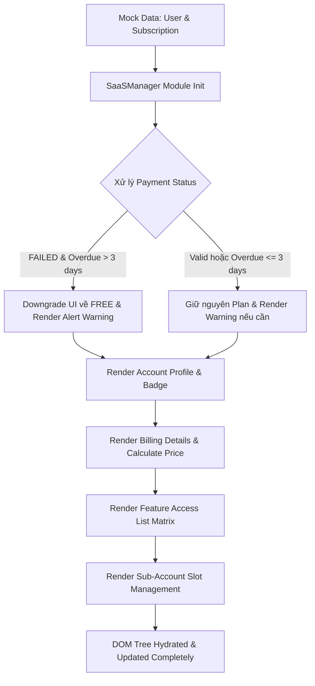

### 1. Mục tiêu bài tập
- **Thiết kế và đóng gói Mini Module**: Xây dựng module JavaScript `SaaSManager` quản lý giao diện bảng điều khiển gói đăng ký (Subscription Dashboard) cho nền tảng EdTech theo nguyên lý lập trình hướng đối tượng hoặc module pattern.
- **Thao tác DOM API chuyên sâu**: Thành thạo việc sử dụng các truy xuất DOM (`getElementById`, `querySelector`, `querySelectorAll`), thay đổi thuộc tính (`setAttribute`, `dataset`), cập nhật nội dung (`textContent`, `innerHTML`), và thao tác dynamic styling/classes (`classList.add`, `remove`, `toggle`).
- **Xử lý Logic Nghiệp vụ Phức tạp**: Thực thi logic tính toán chiết khấu, phân quyền tính năng theo hạng gói (Tiering), quản lý hạn ngạch tài khoản con (Sub-accounts quota), và tự động chuyển đổi trạng thái giao diện theo chu kỳ gia hạn (Grace Period logic).

---


### 2. Bối cảnh & Mô tả bài toán
Bạn là Chuyên viên Phát triển Phần mềm Front-End tại một công ty EdTech sở hữu nền tảng học tập trực tuyến dạng SaaS (Software-as-a-Service). Hệ thống cung cấp các gói dịch vụ tài khoản trả phí hàng tháng/hàng năm cho học viên và doanh nghiệp.

Nhiệm vụ của bạn là thiết kế **Mini Module Render Giao diện Bảng điều khiển Gói dịch vụ (SaaS Subscription Management Dashboard UI Engine)**. Module này nhận dữ liệu đầu vào là đối tượng tài khoản người dùng (`UserAccount`), gói đăng ký (`SubscriptionPlan`), tình trạng thanh toán (`BillingCycle` & `PaymentStatus`), sau đó trực tiếp thao tác lên DOM Tree để cập nhật toàn bộ giao diện bảng điều khiển một cách chính xác, linh hoạt và trực quan mà **không sử dụng bất kỳ Event Listener nào**.


#### Sơ đồ Luồng Xử lý Dữ liệu và DOM Manipulation Engine:


---


### 3. Quy tắc nghiệp vụ (Business Rules)


#### A. Quy định Hạng Gói (Subscription Tier Rules)
Hệ thống gồm 4 hạng gói dịch vụ với các thiết lập mặc định:
1. **`FREE` (Bản Miễn phí)**:
   - Giá gốc: `0 VNĐ`
   - Số thiết bị phát tối đa: 1 thiết bị.
   - Hạn ngạch tài khoản con: 0 tài khoản.
   - Quyền truy cập: Chỉ được xem 3 bài học dùng thử (Trial Content).
2. **`INDIVIDUAL` (Gói Cá nhân)**:
   - Giá gốc: `199,000 VNĐ / tháng`
   - Số thiết bị phát tối đa: 1 thiết bị tại một thời điểm.
   - Hạn ngạch tài khoản con: 0 tài khoản.
   - Quyền truy cập: Toàn bộ khóa học, chất lượng Full HD.
3. **`FAMILY` (Gói Gia đình)**:
   - Giá gốc: `399,000 VNĐ / tháng`
   - Số thiết bị phát tối đa: 5 thiết bị.
   - Hạn ngạch tài khoản con: Tối đa 5 tài khoản con (Sub-accounts).
   - Quyền truy cập: Toàn bộ khóa học, chất lượng 4K, Tải bài học offline.
4. **`ENTERPRISE` (Gói Doanh nghiệp)**:
   - Giá gốc: `999,000 VNĐ / tháng`
   - Số thiết bị phát tối đa: Không giới hạn.
   - Hạn ngạch tài khoản con: Không giới hạn (Dynamic input).
   - Quyền truy cập: Tất cả đặc quyền + Cố vấn 1-1 + Trình quản lý riêng.


#### B. Quy định Chu kỳ Thanh toán (Billing Cycle & Pricing)
- **`MONTHLY` (Hàng tháng)**: Tổng tiền = `Giá gốc * 1`.
- **`ANNUAL` (Hàng năm)**: Tổng tiền = `Giá gốc * 12 * 0.8` (Áp dụng chiết khấu giảm 20% tổng chi phí năm). Giá hiển thị hàng tháng trung bình = `(Tổng tiền sau giảm) / 12`.
- Định dạng tiền tệ: Phải chuyển đổi số thành chuẩn hiển thị Việt Nam Đồng (Ví dụ: `199.000 VNĐ`).


#### C. Quy định Xử lý Nợ phí & Ân hạn Thanh toán (Grace Period Rule)
- Trường hợp `paymentStatus === "FAILED"`:
  - Nếu `daysOverdue <= 3`: Giữ nguyên hạng gói hiện tại, chèn vào DOM banner cảnh báo màu vàng: `"Cảnh báo: Thanh toán thất bại. Vui lòng cập nhật phương thức thanh toán trong vòng [3 - daysOverdue] ngày nữa."`
  - Nếu `daysOverdue > 3`: **Tự động kích hoạt logic Hạ cấp (Downgrade)**. Giao diện gói hiển thị phải bị ép buộc chuyển sang hạng `FREE`, đồng thời hiển thị banner thông báo nguy cấp màu đỏ: `"Tài khoản đã bị tự động hạ cấp xuống bản Miễn phí do quá hạn thanh toán [daysOverdue] ngày."`
- Trường hợp `paymentStatus === "PAID"`: Ẩn/Xóa toàn bộ banner cảnh báo thanh toán.


#### D. Quy định Hạn ngạch Tài khoản con (Sub-Accounts Quota)
- Nếu hạng gói hiện tại là `FREE` hoặc `INDIVIDUAL`: Khối UI quản lý tài khoản con phải hiển thị trạng thái Vô hiệu hóa (`disabled`) kèm dòng thông báo: `"Gói dịch vụ hiện tại không hỗ trợ thêm tài khoản con."`
- Nếu hạng gói là `FAMILY`:
  - Hiển thị danh sách các tài khoản con đã đăng ký.
  - Nếu danh sách gửi vào vượt quá 5 tài khoản (ví dụ 6 tài khoản), các tài khoản từ vị trí thứ 6 trở đi phải bị gắn class CSS `.exceeded-limit` và gắn nhãn trạng thái: `"(Vượt hạn ngạch - Đã khóa)"`.

---


### 4. Yêu cầu kỹ thuật & Triển khai


#### A. Cấu trúc DOM Template mẫu (HTML đính kèm)
Học viên tạo file `index.html` với cấu trúc khung thẻ để module JavaScript truy xuất:

```html
<!DOCTYPE html>
<html lang="vi">
<head>
  <meta charset="UTF-8">
  <title>SaaS Subscription Management Dashboard</title>
  <link rel="stylesheet" href="style.css">
</head>
<body>
  <div id="app-container">
    <!-- Payment Warning Banner Node -->
    <div id="payment-alert-box" class="alert-hidden"></div>

    <!-- User & Plan Summary Card -->
    <div id="user-info-card" class="card">
      
      <h2 id="user-display-name"></h2>
      <p id="user-email"></p>
      <span id="plan-badge" class="badge"></span>
    </div>

    <!-- Billing Summary Section -->
    <div id="billing-summary" class="card">
      <h3>Thông tin thanh toán</h3>
      <p>Chu kỳ: <strong id="billing-cycle-text"></strong></p>
      <p>Chi phí: <strong id="billing-price-text"></strong></p>
      <p id="annual-discount-note" class="hidden">Đã áp dụng giảm giá 20% cho gói năm!</p>
    </div>

    <!-- Feature Access Matrix -->
    <div id="feature-matrix-card" class="card">
      <h3>Đặc quyền gói dịch vụ</h3>
      <ul id="feature-matrix-list"></ul>
    </div>

    <!-- Sub-Accounts Management Section -->
    <div id="sub-account-card" class="card">
      <h3>Quản lý tài khoản con (<span id="sub-account-count">0/0</span>)</h3>
      <div id="sub-account-notice"></div>
      <ul id="sub-account-list"></ul>
    </div>
  </div>
  <script src="main.js"></script>
</body>
</html>
```


#### B. Yêu cầu Thiết kế JavaScript Module (`main.js`)
Viết code dưới dạng một Object Module hoặc Class `SaaSManager` chứa các phương thức xử lý DOM riêng biệt:

1. `SaaSManager.init(userData)`: Hàm khởi tạo chính, tiếp nhận dữ liệu tài khoản và điều phối luồng render.
2. `SaaSManager.handleGracePeriod(paymentInfo, currentPlan)`: Kiểm tra điều kiện nợ phí. Trả về thông tin gói đăng ký thực tế sau khi tính toán (chuyển thành `FREE` nếu nợ quá 3 ngày) và cập nhật `#payment-alert-box`.
3. `SaaSManager.renderUserProfile(user, effectivePlan)`: Truy xuất và cập nhật thông tin người dùng, đổi class CSS cho `#plan-badge` tương ứng với gói (`badge-free`, `badge-individual`, `badge-family`, `badge-enterprise`).
4. `SaaSManager.renderBilling(effectivePlan, cycleInfo)`: Tính toán số tiền theo chu kỳ, format VND và ghi nội dung vào `#billing-cycle-text`, `#billing-price-text`. Hiển thị/ẩn `#annual-discount-note`.
5. `SaaSManager.renderFeatureMatrix(effectivePlan)`: Duyệt qua danh sách đặc quyền của hệ thống, sử dụng `innerHTML` hoặc `createElement` để hiển thị danh sách dạng `<li>`, thêm biểu tượng `` (cho phép) hoặc `` (bị khóa) và áp dụng class `.feature-locked` / `.feature-unlocked`.
6. `SaaSManager.renderSubAccounts(effectivePlan, subAccounts)`: Kiểm tra hạn ngạch, hiển thị thông báo nếu bị vô hiệu hóa, hoặc tạo các thẻ `<li>` hiển thị danh sách tài khoản con, đánh dấu các tài khoản vượt hạn ngạch theo Business Rules.


#### C. Phạm vi Nghiêm cấm (Forbidden Scope)
-  **KHÔNG** sử dụng `addEventListener`, `onclick`, `onchange` hoặc bất kỳ cơ chế xử lý sự kiện nào (Dành cho Session 19).
-  **KHÔNG** sử dụng `fetch()`, `axios`, hoặc `XMLHttpRequest` để gọi API.
-  **KHÔNG** sử dụng `localStorage` / `sessionStorage`.
- Module vận hành 100% bằng cách gọi hàm thực thi dữ liệu giả định (`Mock Data`) được khai báo ở đầu file `main.js`.

---


### 5. Quy chuẩn nộp bài
1. **Cấu trúc thư mục**:
   ```text
   bai6-saas-subscription-dom/
   ├── index.html
   ├── style.css
   ├── main.js
   └── README.md
   ```
2. **Quy định đặt tên**:
   - Class CSS sử dụng theo chuẩn Kebab-case (Ví dụ: `badge-family`, `feature-locked`, `alert-warning`).
   - Hàm và biến JavaScript sử dụng chuẩn Camel-case (Ví dụ: `renderFeatureMatrix`, `effectivePlan`).
3. **File README.md**: Ghi rõ hướng dẫn mở file `index.html` và mô tả các kịch bản test mock data (Case 1: Gói Family hợp lệ, Case 2: Gói Family bị quá hạn thanh toán 4 ngày -> downgrade, Case 3: Gói Individual dùng gói năm).