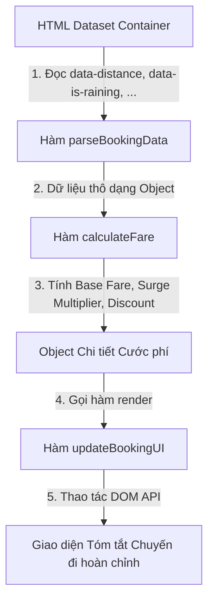

### 1. Mục tiêu bài tập
Sau khi hoàn thành bài tập này, học viên sẽ có khả năng:
- **Truy xuất phần tử DOM nâng cao**: Sử dụng linh hoạt `document.getElementById`, `querySelector`, và `querySelectorAll` để truy cập các thẻ HTML trong hệ thống quản lý đặt xe.
- **Trích xuất dữ liệu từ thuộc tính (Data Attributes)**: Sử dụng thuộc tính `dataset` và `getAttribute` để lấy các tham số nghiệp vụ được nhúng sẵn trên giao diện.
- **Cập nhật nội dung & thuộc tính động**: Thao tác thay đổi nội dung văn bản (`textContent`), cấu trúc HTML nội bộ (`innerHTML`), và thay đổi trạng thái hiển thị thông qua `classList` (`add`, `remove`, `toggle`) cũng như thuộc tính `style`.
- **Tổ chức mã nguồn theo mô-đun**: Tách biệt logic tính toán cước phí di chuyển và logic thao tác DOM API thành các hàm xử lý chuyên biệt mà không phụ thuộc vào sự kiện người dùng (Event Listeners).

---


### 2. Bối cảnh & Mô tả bài toán
Bạn đang đảm nhận vị trí Lập trình viên Frontend cho dịch vụ gọi xe công nghệ **GrabRide**. Hệ thống đang phát triển màn hình **Tóm tắt Chuyến đi (Trip Booking Summary)** trên nền tảng Web Dashboard. 

Khi một chuyến đi mới được khởi tạo từ hệ thống backend, thông tin thô của chuyến đi (khoảng cách, điều kiện thời tiết, giờ cao điểm, mã giảm giá) sẽ được render sẵn dưới dạng các thuộc tính dữ liệu (`data-*`) trên thẻ HTML. Nhiệm vụ của bạn là viết script tự động đọc các dữ liệu này, thực hiện tính toán chi tiết cước phí theo quy tắc nghiệp vụ của GrabRide, sau đó cập nhật trực tiếp toàn bộ kết quả lên giao diện cho hành khách và tài xế quan sát.



---


### 3. Quy tắc nghiệp vụ (Business Rules)


#### A. Quy tắc tính Cước phí nền (Base Fare)
- **2 km đầu tiên**: Tính giá cố định **12.000 VNĐ**.
- **Từ km thứ 3 trở đi**: Tính **4.500 VNĐ/km** cho phần khoảng cách vượt quá 2 km (tính chính xác theo số km lẻ, ví dụ: 4.5 km thì phần vượt là 2.5 km).
- **Ràng buộc đầu vào**: Nếu khoảng cách $\le 0$ hoặc không hợp lệ (không phải là số), Cước phí nền bằng $0$ VNĐ và hệ thống sẽ hiển thị trạng thái lỗi cước phí.


#### B. Quy tắc tính Phụ phí hệ số (Surge Multiplier)
- **Thời tiết xấu (Trời mưa)** (`data-is-raining="true"`): Áp dụng hệ số nhân **1.2x**.
- **Giờ cao điểm** (`data-is-peak="true"`): Áp dụng hệ số nhân **1.2x**.
- **Kết hợp phụ phí**: Nếu chuyến đi vừa gặp trời mưa **VÀ** vừa thuộc giờ cao điểm, hệ số nhân tổng cộng sẽ là: $1.2 \times 1.2 = 1.44\text{x}$.
- **Công thức Cước phí trước giảm giá (Subtotal)**:
  $$\text{Subtotal} = \text{Math.round}(\text{Base Fare} \times \text{Total Multiplier})$$


#### C. Quy tắc tính Mã giảm giá (Promo Code)
- `GRAB20`: Giảm **20%** trên tổng tiền Subtotal (Mức giảm tối đa không vượt quá **20.000 VNĐ**).
- `TIETKIEM`: Giảm thẳng **15.000 VNĐ** vào tổng tiền.
- **Mã không hợp lệ hoặc không có mã**: Giảm **0 VNĐ**.
- **Công thức Cước phí thanh toán cuối cùng (Total Fare)**:
  $$\text{Total Fare} = \max(0, \text{Subtotal} - \text{Discount})$$

---


### 4. Yêu cầu kỹ thuật & Triển khai


#### 4.1. Cấu trúc HTML mẫu (`index.html`)
Học viên tạo file HTML với cấu trúc phần tử như sau:

```html
<!DOCTYPE html>
<html lang="vi">
<head>
  <meta charset="UTF-8">
  <title>GrabRide Booking Summary</title>
  <link rel="stylesheet" href="style.css">
</head>
<body>
  <div class="container">
    <h2>Hệ Thống Đặt Xe GrabRide</h2>

    <!-- Thẻ chứa dữ liệu chuyến đi thô -->
    <div id="booking-card" 
         class="booking-card"
         data-trip-id="GRB-8892"
         data-distance="6.5"
         data-is-raining="true"
         data-is-peak="false"
         data-promo-code="GRAB20">
      
      <div class="card-header">
        <h3>Mã chuyến đi: <span id="display-trip-id">--</span></h3>
        <span id="trip-status-badge" class="badge">Đang xử lý</span>
      </div>

      <div class="card-body">
        <p>Quãng đường: <strong id="display-distance">0</strong> km</p>
        
        <!-- Khu vực hiển thị Badge phụ phí -->
        <div id="surge-container" class="surge-container">
          <span id="rain-badge" class="surge-tag hidden">️ Trời mưa (+20%)</span>
          <span id="peak-badge" class="surge-tag hidden">⏰ Giờ cao điểm (+20%)</span>
        </div>

        <hr>

        <div class="fare-breakdown">
          <p>Cước nền: <span id="fare-base">0 VNĐ</span></p>
          <p>Phụ phí nhân: <span id="fare-multiplier">1.0x</span></p>
          <p>Tạm tính (Subtotal): <span id="fare-subtotal">0 VNĐ</span></p>
          <p>Giảm giá (<span id="display-promo-code">N/A</span>): <span id="fare-discount">-0 VNĐ</span></p>
          <h4 class="total-price">Tổng thanh toán: <span id="fare-total">0 VNĐ</span></h4>
        </div>
      </div>
    </div>
  </div>

  <script src="script.js"></script>
</body>
</html>
```


#### 4.2. Yêu cầu Lập trình JavaScript (`script.js`)

Học viên **KHÔNG** sử dụng Event Listener (`addEventListener`, `onclick`), `fetch API`, hay `localStorage`. Mã nguồn cần thực thi trực tiếp việc truy xuất và cập nhật DOM khi trang được tải.

Viết các hàm theo đúng danh tả sau:

1. **Hàm `formatCurrency(amount)`**:
   - Nhận vào một số nguyên. Trả về chuỗi định dạng tiền tệ Việt Nam (Ví dụ: `25000` $\rightarrow$ `"25.000 VNĐ"`).

2. **Hàm `parseBookingData(cardId)`**:
   - Truy xuất phần tử thẻ `#booking-card` thông qua `document.getElementById`.
   - Lấy toàn bộ thông tin từ `dataset` của phần tử này.
   - Chuyển đổi dữ liệu về đúng kiểu dữ liệu (distance: `number`, isRaining: `boolean`, isPeak: `boolean`, promoCode: `string`).
   - Trả về 1 JavaScript Object chứa các thuộc tính trên.

3. **Hàm `calculateTripFare(bookingData)`**:
   - Nhận vào Object dữ liệu chuyến đi.
   - Tính toán theo đúng Quy tắc nghiệp vụ (Mục 3).
   - Trả về 1 Object chứa: `{ baseFare, multiplier, subtotal, discount, totalFare, isValid }`.

4. **Hàm `updateBookingUI(bookingData, fareDetails)`**:
   - **Cập nhật text thông thường**: 
     - Gán Mã chuyến đi vào `#display-trip-id`.
     - Gán Khoảng cách vào `#display-distance`.
     - Gán Mã giảm giá vào `#display-promo-code`.
   - **Cập nhật bảng giá (Fare Breakdown)**:
     - Gán giá trị cước vào các phần tử `#fare-base`, `#fare-multiplier`, `#fare-subtotal`, `#fare-discount`, `#fare-total` đã được định dạng currency.
   - **Cập nhật Badge phụ phí (Surge Badges)**:
     - Nếu `isRaining === true`: Xóa class `hidden` khỏi `#rain-badge`, thêm class `active`.
     - Nếu `isPeak === true`: Xóa class `hidden` khỏi `#peak-badge`, thêm class `active`.
     - Cập nhật khung chứa `#surge-container` nếu không có phụ phí nào.
   - **Cập nhật Trạng thái chuyến đi (`#trip-status-badge`)**:
     - Nếu `isValid === true`: Đổi textContent thành `"Đã xác nhận cước"`, thêm class `.badge-success`.
     - Nếu `isValid === false`: Đổi textContent thành `"Dữ liệu không hợp lệ"`, thêm class `.badge-danger`.

5. **Lệnh thực thi chính (Main Execution)**:
   - Gọi trực tiếp hàm khởi chạy để ứng dụng đọc DOM, tính toán và hiển thị ngay khi script load.

---


### 5. Quy chuẩn nộp bài
- Cấu trúc thư mục dự án:
  ```text
  GRAB_RIDE_DOM_SYSTEM/
  ├── index.html
  ├── style.css
  └── script.js
  ```
- File `script.js` phải được comment rõ ràng từng khối chức năng, đặt tên biến/hàm theo chuẩn camelCase (`calculateTripFare`, `updateBookingUI`).