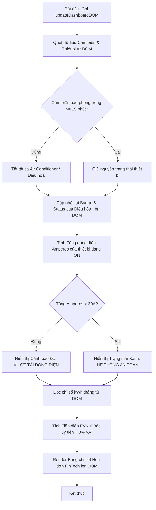

# BÀI TẬP VỀ NHÀ #9: XÂY DỰNG HỆ THỐNG GIÁM SÁT TIÊU THỤ NĂNG LƯỢNG & TỰ ĐỘNG HÓA NHÀ THÔNG MINH (SMART HOME IOT & ENERGY BILLING)

---


### 1. Mục tiêu bài tập
Sau khi hoàn thành bài tập này, học viên có khả năng:
- **Thao tác thành thạo DOM API nâng cao**: Đọc và chỉnh sửa nội dung (`textContent`, `innerHTML`), thuộc tính HTML (`setAttribute`, `getAttribute`, `dataset`), thay đổi dynamic class và style thông qua `classList` và `style`.
- **Truy xuất và Duyệt DOM Tree**: Sử dụng thành thạo `document.getElementById()`, `document.querySelector()`, `document.querySelectorAll()` để bóc tách dữ liệu từ giao diện.
- **Xây dựng Logic Nghiệp vụ FinTech & IoT**: Triển khai thuật toán tính tiền điện sinh hoạt 6 bậc lũy tiến của EVN kết hợp thuế VAT, cùng logic tự động hóa thiết bị nhà thông minh (Smart Home Automation).
- **Cập nhật Giao diện Động (Dynamic UI)**: Thay đổi toàn bộ trạng thái giao diện Dashboard thời gian thực mà **KHÔNG** sử dụng Event Listener hay Form Submit (chỉ chạy thông qua hàm khởi tạo chính).

---


### 2. Bối cảnh & Mô tả bài toán
Bạn là một **Senior Software Engineer** tại **Rikkei Education**, được phân công phát triển mô-đun lõi cho hệ thống quản lý căn hộ thông minh **Rikkei SmartHome**. Hệ thống này vừa quản lý trạng thái các thiết bị điện trong nhà (Điều hòa, Tủ lạnh, Bếp từ, Đèn...), vừa giám sát tải điện tức thời (Amperes), đồng thời đóng vai trò là một trợ lý tài chính **FinTech** giúp hộ gia đình tính toán chi tiết tiền điện EVN dự kiến cuối tháng.

Do chưa đến phần xử lý sự kiện (Event Handling), nhiệm vụ của bạn là viết script JavaScript đóng vai trò **"Dashboard Engine"**. Script này khi được gọi sẽ quét dữ liệu hiện tại từ DOM tree, thực thi các kịch bản tự động hóa, kiểm tra tải an toàn dòng điện, tính toán chi phí điện năng lũy tiến, và cập nhật trực tiếp toàn bộ kết quả lên màn hình Dashboard HTML.


#### Sơ đồ luồng xử lý của Dashboard Engine:


---


### 3. Quy tắc nghiệp vụ (Business Rules)


#### A. Thực thể nghiệp vụ cốt lõi
1. **SmartDevice**: Mỗi thiết bị biểu diễn qua thẻ HTML có thuộc tính `data-id`, `data-category`, `data-watt`, `data-ampere`, `data-status` (`ON` hoặc `OFF`).
2. **EnergySensor**: Cảm biến hiện diện có thuộc tính `data-occupancy` (`true`/`false`) và `data-idle-minutes` (số phút không có người).
3. **AutomationRule**: Kịch bản tự động hóa tối ưu năng lượng.
4. **PowerUsageReport**: Hóa đơn chi tiết phân bổ tiêu thụ điện theo 6 bậc giá EVN.


#### B. Quy tắc Tự động hóa IoT (Automation Rule)
- **Điều kiện**: Nếu cảm biến hiện diện (`#occupancy-sensor`) có `data-occupancy="false"` VÀ `data-idle-minutes >= 15`:
- **Hành động**: 
  - Tất cả thiết bị có loại `data-category="air-conditioner"` (hoặc tên có chứa chữ "Điều hòa") đang ở trạng thái `ON` phải bị tự động chuyển thành `OFF`.
  - Cập nhật thuộc tính `data-status="OFF"` trên DOM.
  - Cập nhật thuộc tính `data-ampere="0"` và `data-watt="0"` cho các thiết bị bị tắt.
  - Cập nhật lại giao diện của thiết bị đó trên DOM: Thẻ hiển thị trạng thái chuyển thành class `badge-off` với text `"ĐÃ TẮT (TỰ ĐỘNG)"`.


#### C. Quy tắc Kiểm tra An toàn Tải điện (Power Overload Rule)
- Tính **Tổng dòng điện hiện tại ($I_{total}$)** bằng tổng `data-ampere` của tất cả các thiết bị đang có trạng thái `ON` (sau khi đã chạy kịch bản tự động hóa).
- **Đánh giá ngưỡng an toàn**:
  - **Nếu $I_{total} > 30.0$ Amperes**:
    - Thẻ hiển thị cảnh báo `#power-alert` phải được gán class `alert-danger` (xóa class `alert-success`).
    - Nội dung text `#power-alert-msg`: `"CẢNH BÁO NGUY HIỂM: Tổng dòng điện hiện tại là X.X A vượt quá giới hạn an toàn 30A! Cần ngắt ngắt bớt thiết bị."` (với X.X làm tròn 1 chữ số thập phân).
  - **Nếu $I_{total} \le 30.0$ Amperes**:
    - Thẻ `#power-alert` phải được gán class `alert-success` (xóa class `alert-danger`).
    - Nội dung text `#power-alert-msg`: `"HỆ THỐNG AN TOÀN: Tổng dòng điện tiêu thụ hiện tại là X.X A (Giới hạn: 30.0 A)."`


#### D. Quy tắc Tính Tiền Điện Sinh Hoạt EVN Lũy Tiến (FinTech Billing)
Đọc tổng số điện tiêu thụ dự kiến trong tháng (đơn vị: kWh) từ thẻ `#monthly-kwh-input` (lấy từ thuộc tính `data-kwh` hoặc nội dung text).
Áp dụng **Biểu giá bán lẻ điện sinh hoạt 6 bậc** hiện hành của EVN:

| Bậc | Khoảng tiêu thụ (kWh) | Đơn giá (VNĐ / kWh) |
| :--- | :--- | :--- |
| **Bậc 1** | Cho kWh từ 0 – 50 | 1,893 |
| **Bậc 2** | Cho kWh từ 51 – 100 | 1,956 |
| **Bậc 3** | Cho kWh từ 101 – 200 | 2,271 |
| **Bậc 4** | Cho kWh từ 201 – 300 | 2,860 |
| **Bậc 5** | Cho kWh từ 301 – 400 | 3,197 |
| **Bậc 6** | Cho kWh từ 401 trở lên | 3,302 |

- **Công thức tài chính**:
  1. $\text{Tiền điện trước thuế} = \sum (\text{Số kWh từng bậc} \times \text{Đơn giá bậc đó})$
  2. $\text{Thuế VAT (8\%)} = \text{Tiền điện trước thuế} \times 0.08$
  3. $\text{Tổng tiền thanh toán} = \text{Math.round}(\text{Tiền điện trước thuế} + \text{Thuế VAT})$
- **Định dạng tiền tệ**: Tất cả các giá trị tiền hiển thị trên giao diện bắt buộc phải được định dạng theo chuẩn tiền tệ Việt Nam (Ví dụ: `1.234.567 VNĐ` sử dụng `Intl.NumberFormat('vi-VN')`).

---


### 4. Yêu cầu kỹ thuật & Triển khai


#### A. Cấu trúc HTML bắt buộc (Học viên copy cấu trúc này vào `index.html`)

```html
<!DOCTYPE html>
<html lang="vi">
<head>
    <meta charset="UTF-8">
    <title>Rikkei SmartHome & Energy Dashboard</title>
    <link rel="stylesheet" href="style.css">
</head>
<body>
    <div id="app">
        <h1>BẢNG ĐIỀU KHIỂN NĂNG LƯỢNG NGUYÊN CĂN HOẠCH</h1>

        <!-- Cảm biến hiện diện -->
        <section id="occupancy-sensor" data-occupancy="false" data-idle-minutes="20">
            <h3>Trạng Thái Cảm Biến Phòng Khách</h3>
            <p>Hiện diện: <span id="sensor-status-text">Không có người</span></p>
            <p>Thời gian trống: <span id="sensor-idle-text">20 phút</span></p>
        </section>

        <!-- Thẻ cảnh báo vượt tải -->
        <div id="power-alert" class="alert">
            <span id="power-alert-msg">Đang kiểm tra tải...</span>
        </div>

        <!-- Danh sách thiết bị -->
        <section id="device-list-container">
            <h2>Danh Sách Thiết Bị Điện</h2>
            <div class="device-card" data-id="DEV01" data-category="air-conditioner" data-watt="1500" data-ampere="6.8" data-status="ON">
                <span class="device-name">Điều hòa Phòng Khách</span> - 
                <span class="device-status badge-on">BẬT</span> - 
                <span class="device-power">1500 W (6.8 A)</span>
            </div>
            <div class="device-card" data-id="DEV02" data-category="air-conditioner" data-watt="1200" data-ampere="5.5" data-status="ON">
                <span class="device-name">Điều hòa Phòng Ngủ 1</span> - 
                <span class="device-status badge-on">BẬT</span> - 
                <span class="device-power">1200 W (5.5 A)</span>
            </div>
            <div class="device-card" data-id="DEV03" data-category="kitchen" data-watt="3500" data-ampere="16.0" data-status="ON">
                <span class="device-name">Bếp Từ Đôi</span> - 
                <span class="device-status badge-on">BẬT</span> - 
                <span class="device-power">3500 W (16.0 A)</span>
            </div>
            <div class="device-card" data-id="DEV04" data-category="appliance" data-watt="150" data-ampere="0.7" data-status="ON">
                <span class="device-name">Tủ Lạnh Side-by-Side</span> - 
                <span class="device-status badge-on">BẬT</span> - 
                <span class="device-power">150 W (0.7 A)</span>
            </div>
            <div class="device-card" data-id="DEV05" data-category="kitchen" data-watt="2000" data-ampere="9.1" data-status="ON">
                <span class="device-name">Lò Vi Sóng</span> - 
                <span class="device-status badge-on">BẬT</span> - 
                <span class="device-power">2000 W (9.1 A)</span>
            </div>
        </section>

        <!-- Thống kê & Hóa đơn FinTech -->
        <section id="billing-section">
            <h2>Dự Báo Hóa Đơn Điện EVN Hàng Tháng</h2>
            <div id="monthly-kwh-input" data-kwh="350">Tổng số điện tiêu thụ dự kiến: <strong>350 kWh</strong></div>
            <div id="billing-error" class="error-msg" style="display: none;"></div>
            
            <div id="billing-details-container">
                <!-- Bảng tính tiền chi tiết sẽ được JS render vào đây -->
            </div>
        </section>
    </div>
    <script src="main.js"></script>
</body>
</html>
```


#### B. Yêu cầu triển khai File `main.js`

Học viên phải viết JavaScript thuần (Vanilla JS) để thực hiện đầy đủ các hàm sau:

1. **Hàm `processSmartHomeAutomation()`**:
   - Truy xuất thông tin từ `#occupancy-sensor` bằng `getAttribute` hoặc `dataset`.
   - Kiểm tra điều kiện tự động tắt Điều hòa.
   - Nếu đủ điều kiện: Tìm tất cả thẻ `.device-card[data-category="air-conditioner"]`, cập nhật `data-status="OFF"`, `data-watt="0"`, `data-ampere="0"`.
   - Cập nhật trực tiếp thẻ con `.device-status` thành text `"ĐÃ TẮT (TỰ ĐỘNG)"` và thay đổi class từ `badge-on` sang `badge-off`. Cập nhật thẻ `.device-power` thành `"0 W (0.0 A)"`.

2. **Hàm `calculateTotalAmperes()`**:
   - Duyệt qua tất cả `.device-card` trên DOM.
   - Đọc giá trị `data-status` và `data-ampere`.
   - Cộng tổng Amperes của các thiết bị có `data-status="ON"`.
   - Trả về số thực (float).

3. **Hàm `calculateEVNBill(kwh)`**:
   - Nhận vào số kWh (kiểm tra hợp lệ: nếu không phải là số `isNaN` hoặc `kwh < 0` thì trả về `null`).
   - Mảng cấu hình 6 bậc EVN:
     - Bậc 1: `limit: 50`, `rate: 1893`
     - Bậc 2: `limit: 50`, `rate: 1956`
     - Bậc 3: `limit: 100`, `rate: 2271`
     - Bậc 4: `limit: 100`, `rate: 2860`
     - Bậc 5: `limit: 100`, `rate: 3197`
     - Bậc 6: `limit: Infinity`, `rate: 3302`
   - Tính toán chi tiết số kWh tiêu thụ và tiền tương ứng cho từng bậc.
   - Trả về Object dạng:
     ```javascript
     {
        kwh: 350,
        tierDetails: [
          { tier: 1, kwh: 50, rate: 1893, amount: 94650 },
          { tier: 2, kwh: 50, rate: 1956, amount: 97800 },
          { tier: 3, kwh: 100, rate: 2271, amount: 227100 },
          { tier: 4, kwh: 100, rate: 2860, amount: 286000 },
          { tier: 5, kwh: 50, rate: 3197, amount: 159850 },
          { tier: 6, kwh: 0, rate: 3302, amount: 0 }
        ],
        subtotal: 865400,
        vatAmount: 69232,
        totalAmount: 934632
     }
     ```

4. **Hàm `renderEVNBillTable(billData)`**:
   - Sử dụng `innerHTML` hoặc `createElement` để hiển thị một bảng HTML (`<table>`) nằm bên trong `#billing-details-container`.
   - Bảng gồm các cột: `Bậc giá`, `Số kWh`, `Đơn giá (VNĐ)`, `Thành tiền (VNĐ)`.
   - Dưới bảng có hiển thị tổng hợp:
     - **Tổng tiền điện trước thuế**
     - **Thuế VAT (8%)**
     - **TỔNG CỘNG THỜI HẠN THANH TOÁN (Đã gồm VAT)** (Hiển thị nổi bật).

5. **Hàm `updateDashboardDOM()`**:
   - Hàm khởi chạy chính (Main Function).
   - Gọi `processSmartHomeAutomation()`.
   - Gọi `calculateTotalAmperes()`, kiểm tra điều kiện vượt tải 30A và cập nhật giao diện `#power-alert` và `#power-alert-msg`.
   - Đọc chỉ số kWh từ `#monthly-kwh-input`. Nếu dữ liệu lỗi, hiển thị `#billing-error`. Nếu hợp lệ, gọi `calculateEVNBill()` và `renderEVNBillTable()`.
   - Cuối cùng, thực thi gọi hàm `updateDashboardDOM()` ở dòng cuối file `main.js`.


#### C. GIỚI HẠN & ĐIỀU KIỆN NGHIÊM CẶT (FORBIDDEN SCOPE)
- **TUYỆT ĐỐI KHÔNG** sử dụng `addEventListener()`, `onclick`, `onsubmit` hoặc bất kỳ cơ chế xử lý sự kiện nào (chưa học đến Session 19).
- **TUYỆT ĐỐI KHÔNG** sử dụng `Fetch API`, `XMLHttpRequest`, `LocalStorage` / `SessionStorage`.
- Mã nguồn JavaScript phải tuân thủ nghiêm ngặt chuẩn ES6+ (`const`, `let`, Arrow Functions, Template Literals).

---


### 5. Quy chuẩn nộp bài


#### Cấu trúc thư mục dự án:
```text
student-id_homework-09/
├── index.html
├── style.css
└── main.js
```


#### Quy định nộp bài:
1. Nén toàn bộ thư mục bài làm thành file `.zip` theo cú pháp: `HO_TEN_MSSV_HW9.zip` (Ví dụ: `NGUYEN_VAN_A_BH00123_HW9.zip`).
2. Mã nguồn phải có đầy đủ comment giải thích logic bằng tiếng Việt có dấu.
3. Kiểm tra mã trên các trình duyệt hiện đại (Chrome/Edge/Firefox) đảm bảo không phát sinh lỗi tại tab Console.

---