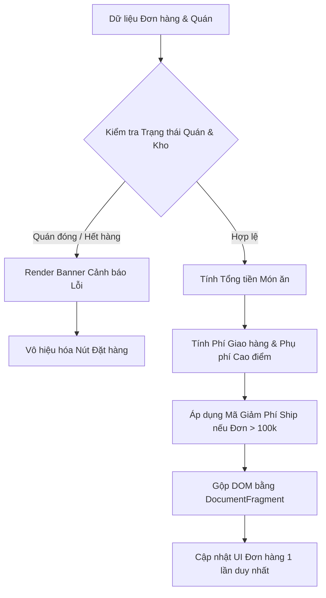

### 1. Mục tiêu bài tập
- **Phân tích Code Smells & Vấn đề Hiệu năng DOM**: Nhận diện các điểm nghẽn hiệu năng (Layout Thrashing, Reflow/Repaint dư thừa) và mã nguồn bị trộn lẫn logic (coupling) trong thao tác DOM API.
- **Tái cấu trúc (Refactoring)**: Tách biệt hoàn toàn giữa **Business Logic** (tính toán đơn hàng, phí ship, phụ phí) và **DOM Rendering Logic** (hiển thị UI, thay đổi class, textContent, thuộc tính).
- **Tối ưu hóa thao tác DOM**: Áp dụng các kỹ thuật DOM Caching, `DocumentFragment`, `textContent` thay cho `innerHTML` dư thừa để tối ưu tốc độ phản hồi giao diện.
- **Xử lý trạng thái & Biên nghiệp vụ**: Cập nhật trạng thái hiển thị của hệ thống theo các quy tắc khắt khe của ứng dụng giao đồ ăn thực tế.

---


### 2. Bối cảnh & Mô tả bài toán
Bạn là Senior Software Engineer tại dự án phát triển hệ thống **ShopeeFood (SHOPEE_FOOD)**. Hệ thống đang gặp sự cố về hiệu năng tại màn hình **Tổng quan Đơn hàng (Order Summary)**: mỗi khi dữ liệu đơn hàng cập nhật, giao diện bị giật lag (UI flickering) do mã nguồn cũ của lập trình viên Junior liên tục đọc/ghi DOM lặp đi lặp lại trong vòng lặp và truy xuất các phần tử DOM chưa qua tối ưu.

Nhiệm vụ của bạn là **Phân tích mã nguồn cũ, Tái cấu trúc và Tối ưu hóa** module tính toán & hiển thị đơn hàng ShopeeFood bằng JavaScript thuần (Vanilla JS), tuân thủ các quy chuẩn lập trình sạch và tối ưu hiệu năng render.


#### Sơ đồ luồng xử lý dữ liệu và Render DOM:


---


### 3. Quy tắc nghiệp vụ (Business Rules)

1. **Kiểm tra Điều kiện Đặt hàng**:
   - Nếu `isStoreOpen === false` (Quán đóng cửa) **HOẶC** tồn tại ít nhất 1 món có `stockQuantity <= 0` hoặc `isAvailable === false`:
     - Không tiến hành tính toán đơn hàng.
     - Hiển thị khối cảnh báo lỗi `#status-banner` với class `banner-error` và nội dung: `"Rất tiếc, quán hiện tạm ngừng nhận đơn hoặc có món đã hết hàng!"`.
     - Cập nhật nút đặt hàng `#checkout-btn`: thêm class `disabled`, set thuộc tính `aria-disabled="true"`, nội dung chữ thành `"TẠM NGỪNG NHẬN ĐƠN"`.

2. **Tính toán Phí Giao hàng (Delivery Fee)**:
   - **Phí giao hàng cơ bản**: `20.000 VNĐ`.
   - **Phụ phí khung giờ cao điểm**: Nếu thời gian đặt hàng rơi vào khung giờ cao điểm (từ `11:00` đến `13:00` HOẶC từ `18:00` đến `20:00`), cộng thêm `10.000 VNĐ` phụ phí giao hàng.
   - **Giảm giá phí giao hàng (Shipping Voucher)**: Nếu tổng giá trị các món ăn (chưa tính ship) **lớn hơn 100.000 VNĐ**, giảm `15.000 VNĐ` vào phí giao hàng. (Lưu ý: Phí giao hàng sau giảm không được nhỏ hơn `0 VNĐ`).

3. **Tính Tổng tiền Đơn hàng cuối cùng (Final Total)**:
   $$\text{Tổng thanh toán} = \text{Tổng tiền các món} + \text{Phí giao hàng sau giảm giá}$$

4. **Định dạng hiển thị tiền tệ**:
   - Toàn bộ giá tiền trên UI phải được định dạng theo chuẩn Việt Nam (ví dụ: `150.000 đ` hoặc sử dụng `Intl.NumberFormat('vi-VN')`).

---


### 4. Yêu cầu kỹ thuật & Triển khai


#### 4.1. Mã nguồn cũ cần Tái cấu trúc (Legacy Code Smells)
Dưới đây là mã nguồn kém tối ưu hiện tại bạn cần phân tích và làm mới hoàn toàn:

```javascript
// === LEGACY CODE (CẦN TÁI CẤU TRÚC & TỐI ƯU) ===
function processOrderBad(orderData) {
    // Code Smell 1: Truy xuất DOM liên tục trong vòng lặp & lặp lại querySelector
    for (var i = 0; i < orderData.items.length; i++) {
        document.getElementById('cart-list').innerHTML += 
            '<div class="item">' + orderData.items[i].name + ' - ' + orderData.items[i].price + '</div>';
        
        // Code Smell 2: Trộn lẫn logic nghiệp vụ tính tiền ngay trong vòng lặp render
        var currentTotal = parseInt(document.getElementById('total-price').innerText || 0);
        document.getElementById('total-price').innerText = currentTotal + (orderData.items[i].price * orderData.items[i].quantity);
    }

    // Code Smell 3: Đọc/ghi thuộc tính style và class gây Layout Thrashing
    if (orderData.isStoreOpen == false) {
        document.getElementById('status-banner').style.display = 'block';
        document.getElementById('status-banner').style.backgroundColor = 'red';
        document.getElementById('checkout-btn').setAttribute('disabled', 'true');
    }
}
```


#### 4.2. Yêu cầu Tái cấu trúc & Triển khai mới
Bạn hãy tạo file `app.js` và triển khai theo kiến trúc mô-đun hóa:

1. **Tách biệt Pure Functions (Business Logic)**:
   - `calculateSubtotal(items)`: Trả về tổng tiền gốc các món ăn.
   - `calculateShippingFee(subtotal, orderHour)`: Trả về số tiền phí giao hàng thực tế sau khi tính phụ phí giờ cao điểm và giảm giá theo đơn > 100k.
   - `validateOrder(storeStatus, items)`: Trả về object `{ isValid: boolean, message: string }`.

2. **Tối ưu hóa UI Rendering Functions (DOM API)**:
   - **DOM Caching**: Lưu trữ các DOM Node cần thiết (`#cart-list`, `#subtotal-val`, `#ship-fee-val`, `#total-val`, `#status-banner`, `#checkout-btn`) vào một object cache duy nhất ở đầu script.
   - **Sử dụng `DocumentFragment`**: Gộp toàn bộ danh sách thẻ món ăn (`.food-item`) tạo ra bằng `document.createElement` trước khi chèn vào `#cart-list` **đúng 1 lần duy nhất** (`appendChild`).
   - **Dùng `textContent` thay cho `innerHTML`** đối với việc chèn văn bản an toàn để tránh nguy cơ XSS và tăng hiệu năng parse HTML.
   - **Thao tác Class**: Dùng `classList.add()` / `classList.remove()` thay vì can thiệp trực tiếp thuộc tính `style`.

3. **Cấu trúc dữ liệu đầu vào (Ví dụ Test Data)**:
```javascript
const sampleOrder = {
    storeName: "Cơm Tấm Sườn Bì Chả - Nguyễn Trãi",
    isStoreOpen: true,
    orderHour: 12, // 12h00 -> Khung giờ cao điểm 11h-13h
    items: [
        { id: "F01", name: "Cơm tấm sườn nướng", price: 45000, quantity: 2, isAvailable: true, stockQuantity: 10 },
        { id: "F02", name: "Chả trứng hấp", price: 15000, quantity: 1, isAvailable: true, stockQuantity: 5 },
        { id: "F03", name: "Trà tắc khổng lồ", price: 20000, quantity: 1, isAvailable: true, stockQuantity: 20 }
    ]
};
```

*Lưu ý: Tuyệt đối KHÔNG sử dụng `addEventListener`, sự kiện submit form, `fetch` hay `localStorage` theo đúng phạm vi kiến thức đã học.*

---


### 5. Quy chuẩn nộp bài
- **Cấu trúc thư mục dự án**:
  ```text
  shopeefood-order-refactor/
  ├── index.html          # File chứa khung HTML danh sách giỏ hàng
  ├── style.css           # File chứa các class CSS định kiểu (banner-error, disabled, v.v.)
  └── js/
      └── app.js          # File JS đã tái cấu trúc và tối ưu hoàn chỉnh
  ```
- **Quy định đặt tên**: Thư mục nộp bài nén định dạng `.zip` với tên `HoVaTen_MSSV_HW10.zip`.