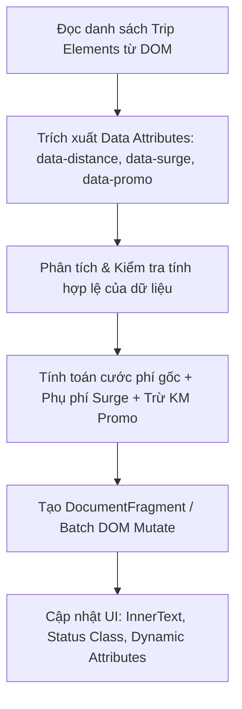

### 1. Mục tiêu bài tập
- **Phân tích và phát hiện điểm yếu (Code Smell/Performance Issue)** trong đoạn mã legacy tương tác với DOM API đang gặp tình trạng lặp truy vấn (DOM thrashing) và vi phạm nguyên lý DRY (Don't Repeat Yourself).
- **Tái cấu trúc (Refactor)** toàn bộ logic truy xuất và cập nhật thuộc tính/nội dung HTML của thẻ danh sách chuyến xe (RideBooking) nhằm tối ưu hiệu năng render.
- **Thực thi logic nghiệp vụ CRM**: Đọc dữ liệu từ thuộc tính tùy biến `data-*` (Dataset), tính toán chính xác giá cước di chuyển, hệ số nhân giờ cao điểm/trời mưa, mã giảm giá và hiển thị lại kết quả lên giao diện HTML mà không làm thay đổi trực tiếp DOM quá nhiều lần.

---


### 2. Bối cảnh & Mô tả bài toán
Hệ thống **GrabRide Operations CRM** hiển thị danh sách các chuyến xe đang chờ quyết toán cước phí cho tài xế và khách hàng. Phiên bản hiện tại của ứng dụng đang gặp sự cố hiệu năng nghiêm trọng: trang web bị giật/lag khi danh sách chuyến đi tăng lên. 

Nguyên nhân được xác định là do đội ngũ cũ viết mã nguồn JS theo kiểu "mì ăn liền" (spaghetti code): truy vấn trực tiếp từng thẻ HTML bằng `document.getElementById()` trong từng câu lệnh rải rác, thao tác trực tiếp trên `innerHTML` liên tục gây ra hiện tượng **Reflow & Repaint** (tái tính toán bố cục trang web). 

Nhiệm vụ của bạn với tư cách là **Senior Frontend Engineer** là phân tích mã nguồn cũ, tái cấu trúc lại toàn bộ module quản lý hiển thị chuyến xe bằng DOM API thuần (Vanilla JS), áp dụng chuẩn tối ưu batching DOM updates và xử lý chính xác logic tính cước.



---


### 3. Quy tắc nghiệp vụ (Business Rules)


#### a. Quy tắc tính cước di chuyển (`TripFare` Calculation):
1. **Giá cước cơ bản (Base Fare)**:
   - **2.0 km đầu tiên**: Giá cố định là **12.000 VNĐ** (áp dụng cho mọi khoảng cách $\le 2.0$ km).
   - **Từ km thứ 3 trở đi** (khoảng cách $> 2.0$ km): Tính **4.500 VNĐ/km** cho phần khoảng cách vượt quá 2 km.
   - *Công thức cước gốc*: 
     $$\text{BaseFare} = 12000 + (\text{Distance} - 2) \times 4500 \quad (\text{nếu Distance} > 2)$$
     $$\text{BaseFare} = 12000 \quad (\text{nếu Distance} \le 2)$$

2. **Hệ số phụ phí Surge Multiplier (`data-surge`)**:
   - Nếu `data-surge="true"` (giờ cao điểm hoặc thời tiết xấu): Cước gốc được nhân với **hệ số 1.2x** ($\text{Subtotal} = \text{BaseFare} \times 1.2$).
   - Nếu `data-surge="false"`: Hệ số là 1.0x ($\text{Subtotal} = \text{BaseFare}$).

3. **Mã khuyến mãi Promo Discount (`data-promo`)**:
   - Mã `"GRABNEW"`: Giảm **20%** trên tổng tiền `Subtotal`, **tối đa 20.000 VNĐ**.
   - Mã `"VIPRIDE"`: Giảm **10%** trên tổng tiền `Subtotal`, **tối đa 50.000 VNĐ**.
   - Các mã khác hoặc không có mã (`""`): Giảm **0 VNĐ**.

4. **Tổng cước thanh toán cuối cùng (Final Fare)**:
   - $\text{FinalFare} = \text{Subtotal} - \text{DiscountAmount}$
   - Kết quả làm tròn đến hàng đơn vị (`Math.round`) và không được nhỏ hơn **0 VNĐ**.


#### b. Định dạng hiển thị CRM:
- Tất cả số tiền hiển thị trên DOM phải được định dạng theo chuẩn Việt Nam Đồng (ví dụ: `25.500 VNĐ` sử dụng `Intl.NumberFormat('vi-VN')` hoặc hàm tự viết).
- Nếu chuyến đi có Surge (`data-surge="true"`), thêm class CSS `surge-active` vào thẻ card chuyến đi và thay đổi thuộc tính `title="Chuyến xe giờ cao điểm (+20%)"`.
- Nếu chuyến đi không hợp lệ (ví dụ: `distance < 0` hoặc dữ liệu sai): Hiển thị trạng thái lỗi `Lỗi dữ liệu` bằng class CSS `card-error` và tổng tiền `-- VNĐ`.

---


### 4. Yêu cầu kỹ thuật & Triển khai


#### a. Hiện trạng mã nguồn Legacy cần phân tích & tái cấu trúc:
*(Sinh viên phân tích đoạn mã thiếu tối ưu dưới đây để viết lại toàn bộ)*

```javascript
// === LEGACY CODE (CẦN PHÂN TÍCH VÀ XÓA BỎ / TÁI CẤU TRÚC) ===
function updateTrip1() {
  var d1 = document.getElementById("trip-1").getAttribute("data-distance");
  var fare = 12000 + (parseFloat(d1) - 2) * 4500;
  document.getElementById("trip-1").getElementsByClassName("fare-val")[0].innerHTML = fare + " VNĐ";
}
function updateTrip2() {
  var d2 = document.getElementById("trip-2").getAttribute("data-distance");
  var fare = 12000 + (parseFloat(d2) - 2) * 4500;
  document.getElementById("trip-2").getElementsByClassName("fare-val")[0].innerHTML = fare + " VNĐ";
}
// Code bị lặp lại, không xử lý Surge, không xử lý Promo, lặp lại DOM query!
```


#### b. Yêu cầu Tái cấu trúc (Refactoring Specifications):
Sinh viên phải viết mã JavaScript trong file `js/app.js` đáp ứng các yêu cầu kiến trúc sau:

1. **Hàm 1: `parseTripData(cardElement)`**
   - Đọc dữ liệu từ thuộc tính `dataset` của `cardElement` (`data-distance`, `data-surge`, `data-promo`, `data-booking-id`).
   - Kiểm tra dữ liệu đầu vào. Trả về một đối tượng Javascript đại diện cho `RideBooking`.

2. **Hàm 2: `calculateFare(bookingData)`**
   - Áp dụng đầy đủ quy tắc nghiệp vụ ở Mục 3 để tính toán ra đối tượng kết quả: `{ baseFare, surgeFare, discountAmount, finalFare, isValid }`.

3. **Hàm 3: `renderTripCard(cardElement, fareResult)`**
   - Thay đổi nội dung hiển thị và thuộc tính của DOM Element.
   - Cập nhật số tiền vào thẻ chứa class `.fare-val` bằng `textContent` (Không dùng `innerHTML` để phòng chống XSS).
   - Thêm/Xóa các class CSS (`surge-active`, `card-error`) thông qua `element.classList`.
   - Cập nhật thuộc tính `data-final-fare` lên chính element đó.

4. **Hàm 4: `optimizeDashboardRendering()` (Hàm khởi chạy chính)**
   - Sử dụng `document.querySelectorAll()` để gom tất cả các thẻ `.trip-card` trong 1 lần truy vấn duy nhất.
   - Duyệt qua NodeList và thực hiện batch processing để cập nhật giao diện mà không gây lặp truy vấn DOM.

*Lưu ý quan trọng*: Không sử dụng Event Listener (`addEventListener`), không sử dụng `fetch`, không sử dụng `localStorage` hay `submit form`. Script sẽ tự động chạy hàm `optimizeDashboardRendering()` ngay khi file JS được nạp.

---


### 5. Quy chuẩn nộp bài


#### Cấu trúc thư mục dự án:
```text
problem-11-crm-grabride/
├── index.html
├── css/
│   └── style.css
└── js/
    └── app.js
```


#### Cấu trúc HTML mẫu (`index.html`):
```html
<!DOCTYPE html>
<html lang="vi">
<head>
  <meta charset="UTF-8">
  <title>GrabRide CRM - Trip Fare Dashboard</title>
  <link rel="stylesheet" href="css/style.css">
</head>
<body>
  <div id="app">
    <h1>CRM Quản Lý Chuyến Đi GrabRide</h1>
    <div id="booking-list">
      <!-- Trip 1: Thường, có KM -->
      <div class="trip-card" id="trip-101" data-booking-id="BK101" data-distance="5.5" data-surge="false" data-promo="GRABNEW">
        <span class="trip-id">BK101</span>
        <span class="distance-val">5.5 km</span>
        <span class="fare-val">Đang tính...</span>
      </div>

      <!-- Trip 2: Surge (Trời mưa/Giờ cao điểm) -->
      <div class="trip-card" id="trip-102" data-booking-id="BK102" data-distance="1.5" data-surge="true" data-promo="">
        <span class="trip-id">BK102</span>
        <span class="distance-val">1.5 km</span>
        <span class="fare-val">Đang tính...</span>
      </div>

      <!-- Trip 3: Dữ liệu lỗi để test biên -->
      <div class="trip-card" id="trip-103" data-booking-id="BK103" data-distance="-3" data-surge="false" data-promo="VIPRIDE">
        <span class="trip-id">BK103</span>
        <span class="distance-val">-3 km</span>
        <span class="fare-val">Đang tính...</span>
      </div>
    </div>
  </div>
  <script src="js/app.js"></script>
</body>
</html>
```