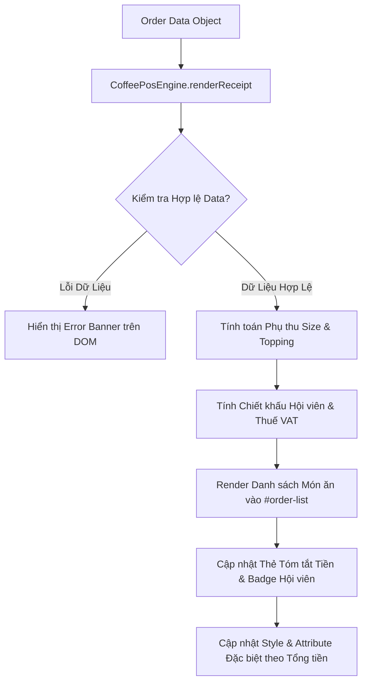

### 1. Mục tiêu bài tập
- **Tư duy thiết kế Module**: Đóng gói thành công một Mini Module JavaScript (`CoffeePosEngine`) chịu trách nhiệm tính toán và hiển thị hóa đơn bán hàng cho màn hình hiển thị khách hàng (Customer Display).
- **Thao tác DOM API thuần (Chuyên sâu)**: Sử dụng thuần thục các phương thức truy xuất DOM (`document.getElementById`, `querySelector`, `querySelectorAll`) và thay đổi nội dung/thuộc tính (`textContent`, `innerHTML`, `setAttribute`, `classList`, `style`).
- **Nghiệp vụ FinTech POS**: Áp dụng đúng quy tắc tính tiền thực tế của chuỗi cửa hàng bán lẻ (phụ thu kích cỡ, topping, chiết khấu hạng hội viên, thuế VAT) và đồng bộ trực tiếp kết quả lên giao diện HTML.
- **Tuân thủ giới hạn kỹ thuật**: Xây dựng luồng thực thi dữ liệu dạng Data-Driven (đổ dữ liệu render giao diện) mà không dùng đến Event Listeners hay Form Submit.

---


### 2. Bối cảnh & Mô tả bài toán
Tại các chuỗi cà phê lớn như Highlands Coffee, hệ thống máy tính tiền POS luôn có một màn hình phụ hướng về phía khách hàng (Customer Display). Khi nhân viên thu ngân chọn món trên màn hình chính, hệ thống sẽ gửi một đối tượng dữ liệu đơn hàng (Order Object) đến màn hình phụ. 

Nhiệm vụ của bạn là xây dựng Module JavaScript để nhận dữ liệu đơn hàng này, thực hiện tính toán tài chính (tính tiền từng món, phụ thu, giảm giá hội viên, thuế VAT) và cập nhật toàn bộ thông tin lên giao diện DOM của màn hình phụ một cách chính xác, đẹp mắt và minh bạch.



---


### 3. Quy tắc nghiệp vụ (Business Rules)


#### a. Phụ thu Kích cỡ (Size Upgrade Fee)
Giá niêm yết ban đầu của sản phẩm (`basePrice`) tương ứng với **Size S**.
- **Size S**: Phụ thu `0 VNĐ`
- **Size M**: Phụ thu `6.000 VNĐ`
- **Size L**: Phụ thu `10.000 VNĐ`


#### b. Phụ thu Topping
- Mỗi món ăn có thể có danh sách topping đi kèm (`toppings`).
- Đồng giá mỗi topping: `8.000 VNĐ / topping`.


#### c. Công thức Tính toán Tài chính
1. **Giá tiền 1 món** = `basePrice` + `Phụ thu Size` + (`Số lượng Topping` × `8.000`)
2. **Tổng tiền tạm tính (Subtotal)** = Tổng giá tiền của tất cả các món trong hóa đơn.
3. **Chiết khấu Hội viên (Membership Discount)**:
   - Hạng `STANDARD`: Giảm `0%` Subtotal.
   - Hạng `SILVER`: Giảm `5%` Subtotal.
   - Hạng `GOLD`: Giảm `10%` Subtotal.
4. **Thuế Giá trị Gia tăng (VAT)**:
   - `VAT = 8%` tính trên tổng tiền sau khi đã trừ Chiết khấu Hội viên.
   - **TỔNG THÀNH TIỀN (Final Total)** = (Subtotal - Discount) + VAT.


#### d. Quy chuẩn Định dạng & Hiển thị DOM
- Tất cả số tiền hiển thị trên DOM phải được định dạng theo tiền tệ Việt Nam (VD: `45.000 VNĐ` hoặc `45.000 ₫`).
- Thẻ Badge hiển thị hạng hội viên phải được gán CSS Class động:
  - `STANDARD` $\rightarrow$ gán class `badge-standard`
  - `SILVER` $\rightarrow$ gán class `badge-silver`
  - `GOLD` $\rightarrow$ gán class `badge-gold`
- **Quy tắc VIP Order**: Nếu `Final Total` > `200.000 VNĐ`, tự động thêm thuộc tính `data-vip-order="true"` vào thẻ `#receipt-card` và thay đổi màu nền của phần tử `#final-total-box` thành màu vàng nhạt (`#fffbe6`).

---


### 4. Yêu cầu kỹ thuật & Triển khai


#### a. Cấu trúc HTML mẫu (`index.html`)
Sinh viên tạo file `index.html` với cấu trúc khung thẻ chuẩn sau (không sửa đổi các `id` có sẵn):

```html
<!DOCTYPE html>
<html lang="vi">
<head>
  <meta charset="UTF-8">
  <title>Highlands POS - Customer Display</title>
  <link rel="stylesheet" href="style.css">
</head>
<body>
  <div id="app">
    <div id="error-banner" class="hidden"></div>

    <div id="receipt-card" class="receipt-container">
      <header class="receipt-header">
        <h2>HIGHLANDS COFFEE</h2>
        <p>Mã hóa đơn: <span id="receipt-id">---</span></p>
        <p>Khách hàng: <strong id="customer-name">---</strong> <span id="membership-badge" class="badge">---</span></p>
      </header>

      <table class="receipt-table">
        <thead>
          <tr>
            <th>STT</th>
            <th>Tên món</th>
            <th>Size</th>
            <th>Topping</th>
            <th>Thành tiền</th>
          </tr>
        </thead>
        <tbody id="order-list">
          <!-- Danh sách món sẽ được render động bằng JS -->
        </tbody>
      </table>

      <footer class="receipt-summary">
        <div class="summary-line">
          <span>Tạm tính:</span>
          <span id="subtotal-amount">0 VNĐ</span>
        </div>
        <div class="summary-line text-discount">
          <span>Giảm giá hội viên:</span>
          <span id="discount-amount">0 VNĐ</span>
        </div>
        <div class="summary-line">
          <span>Thuế VAT (8%):</span>
          <span id="vat-amount">0 VNĐ</span>
        </div>
        <hr>
        <div id="final-total-box" class="summary-line total-line">
          <span>TỔNG THÀNH TIỀN:</span>
          <strong id="final-total">0 VNĐ</strong>
        </div>
      </footer>
    </div>
  </div>

  <script src="app.js"></script>
</body>
</html>
```


#### b. Triển khai JS Module (`app.js`)
Yêu cầu định nghĩa một đối tượng `CoffeePosEngine` chứa các phương thức xử lý DOM:

```javascript
const CoffeePosEngine = {
  // Cấu hình giá tiền nghiệp vụ
  SIZE_FEES: { S: 0, M: 6000, L: 10000 },
  TOPPING_PRICE: 8000,
  DISCOUNT_RATES: { STANDARD: 0, SILVER: 0.05, GOLD: 0.10 },
  VAT_RATE: 0.08,

  // Hàm bổ trợ định dạng tiền tệ VND
  formatCurrency(amount) {
    // ... Triển khai hàm định dạng tiền tệ ...
  },

  // Phương thức chính: Nhận dữ liệu đơn hàng và render toàn bộ DOM
  renderReceipt(orderData) {
    // 1. Kiểm tra ngoại lệ dữ liệu đầu vào (Edge Cases)
    // 2. Tính toán các thông số tiền tệ
    // 3. Truy xuất & cập nhật thông tin Header (Receipt ID, Customer Name, Membership Badge)
    // 4. Render danh sách các món ăn vào #order-list (Tạo thẻ <tr>, <td>)
    // 5. Cập nhật các thẻ tóm tắt chi phí (#subtotal-amount, #discount-amount, #vat-amount, #final-total)
    // 6. Xử lý logic VIP Order (gán attribute và đổi style)
  }
};

// DỮ LIỆU MẪU ĐỂ TEST HỆ THỐNG:
const sampleOrder = {
  receiptId: "HD-20231024-8888",
  customerName: "Nguyễn Thị Minh Anh",
  membershipTier: "GOLD", // STANDARD | SILVER | GOLD
  items: [
    { name: "Trà Đào Cam Sả", basePrice: 45000, size: "L", toppings: ["Thạch Đào", "Hạt Chia"] },
    { name: "Phin Sữa Đá", basePrice: 29000, size: "M", toppings: [] },
    { name: "Freeze Trà Xanh", basePrice: 55000, size: "L", toppings: ["Kem Cheese", "Thạch Thủy Tinh"] }
  ]
};

// Kích hoạt render dữ liệu lên DOM (Không sử dụng Event Listener)
CoffeePosEngine.renderReceipt(sampleOrder);
```


#### c. Xử lý Ngoại lệ & Dữ liệu Biên (Edge Cases)
1. **Đơn hàng trống hoặc không hợp lệ**:
   - Nếu `orderData` là `null`, `undefined` hoặc mảng `items` rỗng:
   - Ẩn thẻ `#receipt-card` (set `style.display = 'none'`).
   - Hiển thị thẻ `#error-banner` (xóa class `hidden`), gán nội dung `textContent = "RẤT SIẾC: Dữ liệu đơn hàng rỗng hoặc không hợp lệ!"`.
2. **Dữ liệu món ăn bị lỗi**:
   - Nếu một món có `basePrice` < 0 hoặc `size` không thuộc các giá trị ("S", "M", "L"):
   - Gán giá tiền món đó = 0.
   - Thêm nhãn `(Dữ liệu lỗi)` ngay sau tên món khi render lên HTML (Ví dụ: `Trà Đào Cam Sả (Dữ liệu lỗi)`).

---


### 5. Quy chuẩn nộp bài
- **Cấu trúc thư mục**:
  ```text
  student_id_homework_14/
  ├── index.html
  ├── style.css
  └── app.js
  ```
- **Quy định đặt tên file**: Đúng tên `index.html`, `style.css`, `app.js`.
- **Yêu cầu Mã nguồn**: Code phải sạch sẽ, thụt lề chuẩn (2 spaces), có comment giải thích các đoạn xử lý DOM phức tạp. **Tuyệt đối KHÔNG dùng `addEventListener`, `onclick`, `fetch`, `localStorage`**.