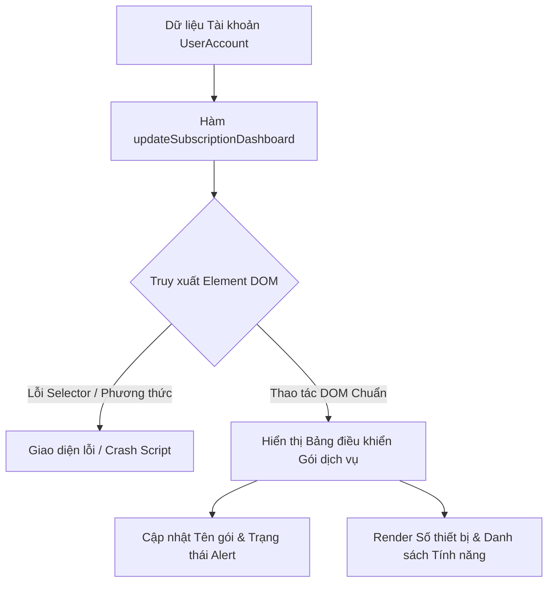

# Bài tập 1: E-Commerce (Mức độ 1: Cơ bản - Debug lỗi)

### 1. Mục tiêu bài tập
- **Truy xuất Element chuẩn xác**: Phân biệt và ứng dụng đúng các phương thức `document.getElementById()`, `document.querySelector()`, và `document.querySelectorAll()`.
- **Thay đổi nội dung DOM**: Phân biệt và sử dụng đúng giữa `textContent`, `innerText`, và `innerHTML` trong các ngữ cảnh render dữ liệu văn bản hoặc cấu trúc HTML.
- **Thao tác Class và Attribute**: Sử dụng đúng `classList` (`add`, `remove`, `toggle`) và `setAttribute()` để cập nhật trạng thái UI động theo logic nghiệp vụ.
- **Kỹ năng Debug**: Phát hiện, phân tích nguyên nhân và sửa chữa các lỗi phổ biến liên quan đến cú pháp và tư duy DOM API cơ bản.

---


### 2. Bối cảnh & Mô tả bài toán
Bạn vừa gia nhập đội ngũ Frontend Engineering tại **Streamify** — nền tảng cung cấp dịch vụ xem phim và nghe nhạc trực tuyến theo gói đăng ký (SaaS). 

Hệ thống vừa phát hành tính năng hiển thị **Bảng điều khiển Gói dịch vụ (Subscription Dashboard)** nhằm cảnh báo người dùng về trạng thái tài khoản (ví dụ: gia hạn thất bại, giới hạn thiết bị phát). Tuy nhiên, lập trình viên Junior đã viết đoạn mã DOM API cập nhật giao diện bị lỗi khiến trang web hiển thị sai cấu trúc HTML, không gán được nội dung và gây ra lỗi script trên trình duyệt.

Nhiệm vụ của bạn là **kiểm tra, phát hiện 5 lỗi sai (bugs)** trong đoạn mã được giao và tiến hành sửa lại mã nguồn sao cho giao diện hiển thị chính xác theo yêu cầu nghiệp vụ.



---


### 3. Quy tắc nghiệp vụ (Business Rules)

1. **Hiển thị Tên Gói dịch vụ**: Cập nhật tiêu đề gói đăng ký theo thông tin của người dùng.
2. **Cảnh báo Trạng thái Gia hạn (Billing Status)**:
   - Nếu tài khoản gặp lỗi thanh toán (`isOverdue = true`), hiển thị thẻ cảnh báo nguy hiểm bằng giao diện Badge HTML: `<span class="badge badge-danger">Gia hạn thất bại - Tạm khóa trong 3 ngày</span>`.
   - Nếu tài khoản hoạt động bình thường (`isOverdue = false`), hiển thị Badge thành công: `<span class="badge badge-success">Đã thanh toán - Hoạt động</span>`.
3. **Giới hạn Thiết bị & Tài khoản Con**:
   - Gói Cá nhân (Individual): Tối đa 1 thiết bị phát đồng thời, 0 tài khoản con.
   - Gói Gia đình (Family): Tối đa 5 thiết bị phát đồng thời, tối đa 5 tài khoản con.
4. **Hiển thị Danh sách Tính năng (Feature Access)**:
   - Chuyển đổi mảng các tính năng (`features`) thành danh sách thẻ danh sách `<ul>` chứa các thẻ `<li>`.

---


### 4. Yêu cầu kỹ thuật & Triển khai


#### 4.1. Mã nguồn bị lỗi (Cần Debug)
Dưới đây là file HTML và đoạn script bị lỗi do Lập trình viên Junior tạo ra:

**File `index.html`:**
```html
<!DOCTYPE html>
<html lang="vi">
<head>
    <meta charset="UTF-8">
    <title>Streamify - Quản lý Gói dịch vụ</title>
    <style>
        .badge { padding: 4px 8px; border-radius: 4px; font-weight: bold; }
        .badge-danger { background-color: #ff4d4f; color: white; }
        .badge-success { background-color: #52c41a; color: white; }
        .feature-item { color: #1890ff; margin-bottom: 4px; }
    </style>
</head>
<body>
    <div id="subscription-card">
        <h2 id="plan-title" class="title-text">Gói hiện tại: </h2>
        <div id="status-container"></div>
        <p id="device-limit">Số thiết bị tối đa: </p>
        <p id="family-limit">Tài khoản con tối đa: </p>
        <div id="feature-box"></div>
    </div>

    <script src="app.js"></script>
</body>
</html>
```

**File `app.js` (Chứa lỗi cần debug):**
```javascript
// Dữ liệu mô phỏng từ Hệ thống Quản lý Gói Đăng ký (SaaS Subscription)
const currentSubscription = {
    planName: "Gói Gia đình (Family Premium)",
    isOverdue: true,
    maxDevices: 5,
    familyMembersAllowed: 5,
    features: [
        "Phát nội dung 4K Ultra HD",
        "Tải xuống nghe/xem ngoại tuyến",
        "Không quảng cáo cắt ngang",
        "Chia sẻ tối đa 5 thành viên"
    ]
};

function updateSubscriptionDashboard() {
    // LỖI 1: getElementsByClassName trả về HTMLCollection nhưng truy cập trực tiếp như 1 element đơn lẻ
    // và sử dụng thuộc tính .value cho thẻ <h2>
    const planTitleElem = document.getElementsByClassName("title-text");
    planTitleElem.value = "Gói hiện tại: " + currentSubscription.planName;

    // LỖI 2: Dùng querySelector sai cú pháp CSS Selector (Thiếu dấu # cho ID)
    const statusContainer = document.querySelector("status-container");
    
    // LỖI 3: Dùng textContent để chèn chuỗi chứa thẻ HTML làm cho các thẻ <span> bị hiển thị dưới dạng chữ thô (raw text)
    if (currentSubscription.isOverdue) {
        statusContainer.textContent = `<span class="badge badge-danger">Gia hạn thất bại - Tạm khóa trong 3 ngày</span>`;
    } else {
        statusContainer.textContent = `<span class="badge badge-success">Đã thanh toán - Hoạt động</span>`;
    }

    // LỖI 4: Truy xuất đúng ID nhưng sử dụng sai thuộc tính cập nhật văn bản cho thẻ <p>
    const deviceLimitElem = document.getElementById("device-limit");
    deviceLimitElem.value = `Số thiết bị tối đa: ${currentSubscription.maxDevices} thiết bị`;

    // LỖI 5: Dùng textContent gán cấu trúc chuỗi HTML <ul><li> làm mất thẻ HTML và hiện toàn bộ dưới dạng text
    const featureBoxElem = document.getElementById("feature-box");
    let featureListHTML = "<ul>";
    for (let i = 0; i < currentSubscription.features.length; i++) {
        featureListHTML += `<li class="feature-item">${currentSubscription.features[i]}</li>`;
    }
    featureListHTML += "</ul>";
    
    featureBoxElem.textContent = featureListHTML;
}

// Gọi hàm thực thi khi trang web tải
updateSubscriptionDashboard();
```


#### 4.2. Danh sách nhiệm vụ Debug cần thực hiện:
1. **Sửa Lỗi 1**: Sửa lại phương thức truy xuất `planTitleElem` bằng `document.getElementById("plan-title")` hoặc `document.querySelector("#plan-title")` và cập nhật lại nội dung bằng `textContent` (không dùng `.value`).
2. **Sửa Lỗi 2**: Sửa lại cú pháp `document.querySelector("#status-container")` (thêm dấu `#` cho ID selector).
3. **Sửa Lỗi 3**: Thay thế `textContent` bằng `innerHTML` tại `statusContainer` để trình duyệt render đúng các thẻ HTML badge (`<span>`).
4. **Sửa Lỗi 4**: Thay thế `.value` bằng `.textContent` hoặc `.innerText` khi gán thông tin số thiết bị tối đa cho `deviceLimitElem`.
5. **Sửa Lỗi 5**: Đổi `featureBoxElem.textContent` thành `featureBoxElem.innerHTML` để tạo danh sách danh mục tính năng dạng thẻ danh sách HTML (`<ul>` và `<li>`).
6. **Bổ sung logic thiếu**: Cập nhật thông tin cho thẻ `#family-limit` với nội dung dạng: `Tài khoản con tối đa: 5 tài khoản`.

---


### 5. Quy chuẩn nộp bài
- **Cấu trúc thư mục**:
  ```text
  baitap-dom-debug/
  ├── index.html
  └── app.js
  ```
- **Quy định mã nguồn**:
  - Mã nguồn JavaScript được viết rõ ràng, có comment giải thích cụ thể nguyên nhân gây lỗi và phương án đã sửa tại từng vị trí lỗi.
  - Tuyệt đối **KHÔNG** sử dụng Event Listener (`addEventListener`), `fetch`, hoặc `localStorage` (Chưa thuộc phạm vi bài học).

### Tiêu chuẩn Đánh giá & Thang điểm (100đ)

| Tiêu chí | Điểm tối đa | Mô tả chi tiết |
| :--- | :--- | :--- |
| **Cấu trúc & Debug Code** | 20đ | - Tìm đủ và giải thích đúng nguyên nhân gây ra 5 lỗi trong code ban đầu.<br>- Mã nguồn sạch đẹp, tuân thủ chuẩn đặt tên biến CamelCase. |
| **Truy xuất DOM API chuẩn xác** | 25đ | - Sử dụng đúng `document.getElementById()` hoặc `document.querySelector()` đúng cú pháp selector (`#` cho ID, `.` cho Class).<br>- Phân biệt rõ đối tượng đơn lẻ và HTMLCollection/NodeList. |
| **Thao tác Thay đổi Nội dung DOM** | 25đ | - Dùng đúng `textContent` cho văn bản thuần (Text node).<br>- Dùng đúng `innerHTML` khi cần chèn chuỗi HTML có chứa các thẻ element (`<span>`, `<ul>`, `<li>`).<br>- Không dùng thuộc tính `.value` cho các thẻ không phải Form Input (`<h2>`, `<p>`). |
| **Xử lý Logic Nghiệp vụ SaaS** | 20đ | - Cập nhật chính xác các thông tin: Tên gói, Trạng thái quá hạn, Giới hạn thiết bị, Giới hạn tài khoản con.<br>- Render danh sách tính năng dạng danh sách HTML đầy đủ. |
| **Xử lý Biên & Mã an toàn** | 10đ | - Đảm bảo script thực thi không bắn lỗi Uncaught TypeError trên Console trình duyệt.<br>- Kiểm tra trường hợp dữ liệu danh sách `features` bị rỗng. |