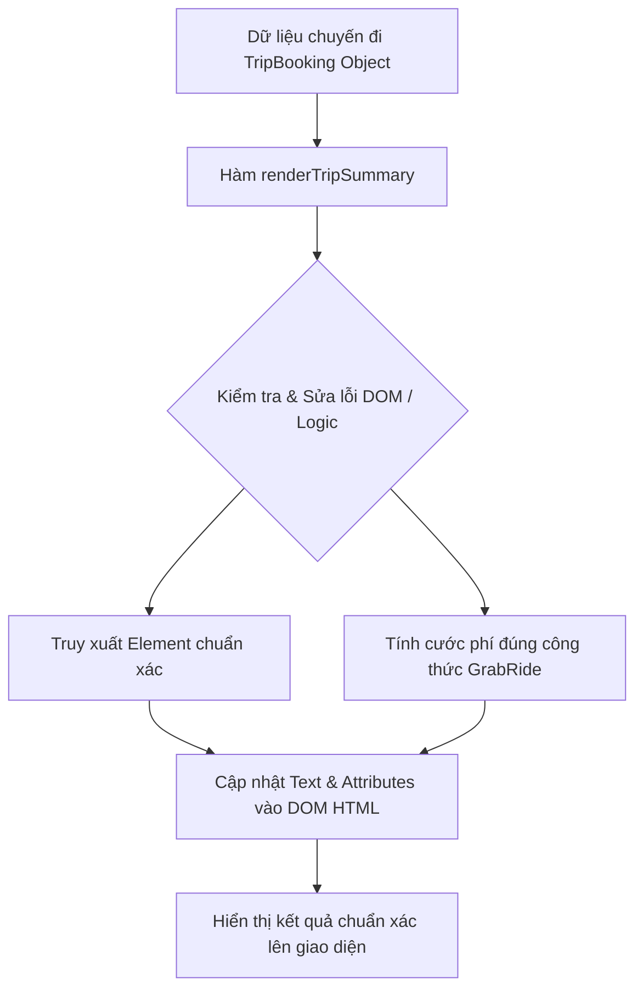

# Bài tập 1: GRAB_RIDE (Mức độ 1: Cơ bản - Debug lỗi)

### 1. Mục tiêu bài tập
- **Kỹ năng DOM API**: Phát hiện và sửa các lỗi sai phổ biến khi truy xuất phần tử DOM (`document.getElementById`) và thao tác thay đổi nội dung, thuộc tính của HTML element (`innerText`, `textContent`, `src`, `style`).
- **Nghiệp vụ ứng dụng**: Hiểu và triển khai lại đúng công thức tính toán cước phí di chuyển (`TripFare`) của hệ thống **GrabRide** dựa trên quãng đường và phụ phí giờ cao điểm/thời tiết.
- **Tư duy Debugging**: Phát hiện nguyên nhân khiến script bị dừng đột ngột (runtime error) hoặc tính toán sai kết quả đầu ra (logical error).

---


### 2. Bối cảnh & Mô tả bài toán
Tại ứng dụng gọi xe công nghệ **GrabRide**, bộ phận kỹ thuật vừa bàn giao một mô-đun hiển thị thông tin tóm tắt chuyến đi (`TripFare`) lên bảng điều khiển của tài xế. Tuy nhiên, lập trình viên Junior đảm nhận nhiệm vụ này đã viết đoạn mã chứa nhiều lỗi khiến giao diện Web không cập nhật được tên tài xế, ảnh đại diện bị hỏng, và tổng tiền cước phí bị tính toán sai nghiêm trọng.

Nhiệm vụ của bạn là tiếp nhận mã nguồn hiện tại, thực hiện **Debug (Tìm và sửa lỗi)** để giao diện hiển thị đúng toàn bộ thông tin chuyến đi theo đúng quy tắc nghiệp vụ của GrabRide.


#### Sơ đồ luồng xử lý dữ liệu (Data Flow Diagram)


---


### 3. Quy tắc nghiệp vụ (Business Rules)


#### Công thức tính tổng cước phí GrabRide:
1. **Giá cước cơ bản (Base Fare)**:
   - Quãng đường $\le 2\text{ km}$: Tính giá cố định **12.000 VNĐ** (giá mở cửa).
   - Quãng đường $> 2\text{ km}$: Tính **12.000 VNĐ** cho 2 km đầu + **4.500 VNĐ/km** cho mỗi km tiếp theo (từ km thứ 3).
   - *Công thức tổng quát khi $Quãng\_đường > 2$:* `BaseFare = 12000 + (distanceKm - 2) * 4500`

2. **Hệ số nhân phụ phí (Surge Multiplier)**:
   - Nếu `isSurge === true` (Trời mưa hoặc giờ cao điểm): 
     $$\text{Tổng tiền} = \text{Giá cước cơ bản} \times 1.2$$
   - Nếu `isSurge === false`:
     $$\text{Tổng tiền} = \text{Giá cước cơ bản}$$

3. **Quy chuẩn hiển thị lên Giao diện**:
   - Tên tài xế: Thêm tiền tố `"Tài xế: "` phía trước tên.
   - Hình ảnh avatar: Cập nhật đúng đường dẫn ảnh `src`.
   - Tổng tiền: Làm tròn số nguyên (nếu có số thập phân) và kèm đơn vị `" VNĐ"` (Ví dụ: `30.600 VNĐ`).
   - Nếu `isSurge === true`, thẻ hiển thị phụ phí phải cập nhật nội dung `"Đang áp dụng (x1.2)"` và đổi màu chữ thành màu đỏ (`#dc3545`).

---


### 4. Yêu cầu kỹ thuật & Triển khai


#### 4.1. Mã nguồn hiện tại bị lỗi (Starter Code)

**Mã HTML (`index.html`):**
```html
<!DOCTYPE html>
<html lang="vi">
<head>
    <meta charset="UTF-8">
    <title>GrabRide - Summary Trip</title>
    <style>
        .card { border: 1px solid #ccc; padding: 16px; width: 320px; border-radius: 8px; font-family: Arial; }
        .avatar { width: 80px; height: 80px; border-radius: 50%; }
        .surge-active { color: #dc3545; font-weight: bold; }
        .surge-normal { color: #28a745; }
    </style>
</head>
<body>
    <div class="card">
        
        <h3 id="driver-name">Chưa có dữ liệu</h3>
        <p>Quãng đường: <span id="distance-display">0</span> km</p>
        <p>Phụ phí cao điểm: <span id="surge-status" class="surge-normal">Không</span></p>
        <hr>
        <h4>Tổng cước phí: <span id="total-fare">0 VNĐ</span></h4>
    </div>

    <script src="script.js"></script>
</body>
</html>
```

**Mã JavaScript bị lỗi (`script.js`):**
```javascript
// Dữ liệu chuyến đi thực tế từ hệ thống GrabRide
const currentTrip = {
    driverName: "Nguyễn Văn Tin Cậy",
    avatarUrl: "https://picsum.photos/100",
    distanceKm: 6,
    isSurge: true
};

function renderTripSummary(trip) {
    //  LỖI 1: Nhầm lẫn cú pháp getElementById (chứa dấu #)
    const driverNameEl = document.getElementById("#driver-name");
    driverNameEl.innerText = "Tài xế: " + trip.driverName;

    //  LỖI 2: Cập nhật thuộc tính src của thẻ  sai cú pháp
    const avatarEl = document.getElementById("driver-avatar");
    avatarEl.src(trip.avatarUrl);

    //  LỖI 3: Tính toán sai nghiệp vụ (chưa trừ 2km đầu cố định)
    let baseFare = 0;
    if (trip.distanceKm <= 2) {
        baseFare = 12000;
    } else {
        baseFare = trip.distanceKm * 4500; // Sai logic ở đây!
    }

    let finalFare = baseFare;
    if (trip.isSurge) {
        finalFare = baseFare * 1.2;
    }

    //  LỖI 4: Dùng thuộc tính .value cho thẻ <span> thay vì innerText/textContent
    const totalFareEl = document.getElementById("total-fare");
    totalFareEl.value = finalFare + " VNĐ";

    //  LỖI 5: Truy xuất sai ID thẻ khoảng cách và thiếu xử lý thay đổi CSS class cho Surge Status
    const distanceEl = document.getElementById("distance");
    distanceEl.textContent = trip.distanceKm;
}

// Gọi hàm thực thi
renderTripSummary(currentTrip);
```


#### 4.2. Yêu cầu thực hiện
1. **Tạo báo cáo Debug (file `debug-report.txt` hoặc ghi chú comment trong JS)**:
   - Liệt kê chính xác **5 lỗi** có trong đoạn mã trên.
   - Giải thích nguyên nhân vì sao đoạn mã bị lỗi (Runtime Error / Logic Error).
2. **Sửa lại đoạn mã `script.js`**:
   - Sửa toàn bộ lỗi DOM Selection và Attribute assignment.
   - Viết lại chính xác công thức tính `baseFare` và `finalFare`.
   - Cập nhật đúng các thẻ HTML: `#driver-name`, `#driver-avatar`, `#distance-display`, `#surge-status`, `#total-fare`.
   - Khi `isSurge === true`, thẻ `#surge-status` phải có nội dung `"Đang áp dụng (x1.2)"` và thay đổi `className` thành `"surge-active"`.

---


### 5. Quy chuẩn nộp bài
- Cấu trúc thư mục dự án:
  ```text
  grab-ride-debug/
  ├── index.html
  ├── script.js
  └── debug-report.txt (Hoặc giải thích trực tiếp trong comment của file script.js)
  ```
- Định dạng mã nguồn: Tuân thủ quy chuẩn JS Clean Code, thụt lề 4 khoảng trắng, đặt tên biến rõ ràng theo chuẩn CamelCase.
- Không sử dụng các kiến thức chưa học: Event Listeners (`addEventListener`), Form Event (`onsubmit`), `fetch`, `localStorage`.

### Tiêu chuẩn Đánh giá & Thang điểm (100đ)

| Tiêu chí | Điểm tối đa | Mô tả chi tiết |
| :--- | :--- | :--- |
| **Cấu trúc & Báo cáo Debug** | **20đ** | - Chỉ ra đầy đủ và giải thích đúng nguyên nhân của 5 lỗi trong starter code (10đ).<br>- Thụt lề chuẩn, đặt tên biến rõ ràng, code sạch sẽ (10đ). |
| **Xử lý Logic đúng nghiệp vụ** | **40đ** | - Tính đúng `baseFare` cho trường hợp $\le 2\text{ km}$ (12.000 VNĐ) và $> 2\text{ km}$ (12.000 + (km - 2) * 4500) (20đ).<br>- Tính đúng phụ phí `isSurge` (x1.2) và làm tròn kết quả chuẩn xác (20đ). |
| **Thao tác DOM API chính xác** | **20đ** | - Truy xuất đúng ID các phần tử (không thừa `#`, đúng tên `distance-display`) (10đ).<br>- Cập nhật nội dung text (`textContent`/`innerText`) và thuộc tính (`src`, `className`) đúng cú pháp JavaScript DOM (10đ). |
| **Xử lý Giao diện & Biên** | **20đ** | - Cập nhật đúng trạng thái và class hiển thị của Surge badge (`surge-active` / `surge-normal`) (10đ).<br>- Định dạng chuẩn chuỗi tổng tiền (vd: `30.600 VNĐ` hoặc `30600 VNĐ`) trên thẻ `<span>` (10đ). |