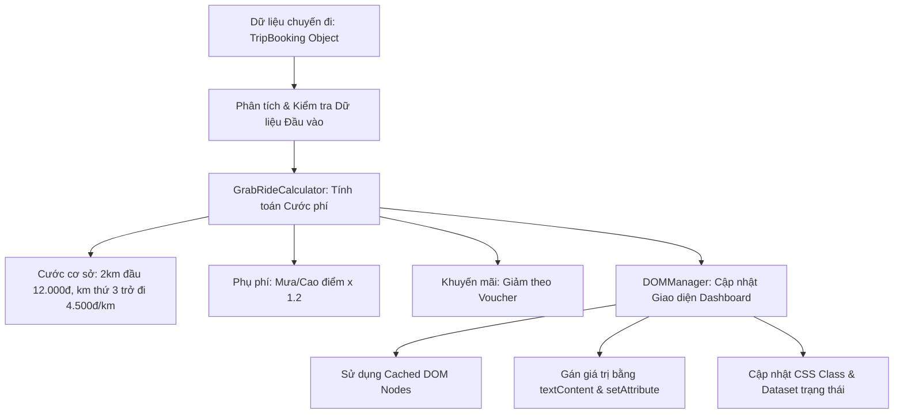

# Bài tập 10: GRAB_RIDE (Mức độ 4: Phân tích & Tối ưu - Tái cấu trúc)

### 1. Mục tiêu bài tập
- **Phân tích & Phát hiện Bottleneck**: Dựa trên đoạn mã legacy (mẫu code cũ), xác định các điểm nghẽn hiệu năng khi tương tác với DOM API (truy xuất DOM lặp lại, lạm dụng `innerHTML`, thiếu phân tách dữ liệu và giao diện).
- **Tái cấu trúc mã nguồn (Refactoring)**: Chuẩn hóa logic nghiệp vụ tính toán cước phí GrabRide thành các hàm đơn nhiệm (Single Responsibility Principle) và phân tách bạch minh giữa Logic nghiệp vụ (Business Logic) và Logic cập nhật giao diện (DOM Manipulation).
- **Tối ưu hóa thao tác DOM**: Áp dụng kỹ thuật Cache DOM Node, thay thế `innerHTML` bằng `textContent` và điều chỉnh thuộc tính thông qua `setAttribute` / `dataset` / `classList` để giảm thiểu Reflow và Repaint trên trình duyệt.
- **Xử lý dữ liệu & Ngoại lệ**: Kiểm soát tính đúng đắn của dữ liệu đầu vào (khoảng cách, mã giảm giá, trạng thái thời tiết) và phản ánh chính xác trạng thái trên UI.

---


### 2. Bối cảnh & Mô tả bài toán
Hệ thống **GrabRide Dashboard** tại Rikkei Education đang vận hành một module hiển thị thông tin hóa đơn chuyến đi cho hành khách và tài xế. Đoạn mã hiện tại của hệ thống được viết từ lâu, gặp các vấn đề lớn:
1. Mỗi lần cập nhật hóa đơn lại dùng `document.querySelector()` để tìm kiếm lại toàn bộ các thẻ HTML nằm trong vòng lặp hoặc hàm hiển thị.
2. Sử dụng `innerHTML` dạng chuỗi nối thô để thay đổi nội dung, tiềm ẩn nguy cơ XSS và gây giật lag do kích hoạt trình duyệt vẽ lại (Reflow/Repaint) không cần thiết.
3. Logic tính cước bị viết cứng (hardcoded), rải rác ở nhiều nơi dẫn đến việc tính sai tiền khi áp dụng mã giảm giá hoặc phụ phí thời tiết.

Bạn được giao nhiệm vụ **Phân tích code cũ**, **Chỉ ra lỗi & tối ưu**, sau đó **Viết lại toàn bộ module hiển thị hóa đơn chuyến đi (Trip Summary Module)** bằng kỹ thuật DOM thuần tối ưu nhất.


#### Luồng xử lý dữ liệu và cập nhật DOM:


---


### 3. Quy tắc nghiệp vụ (Business Rules)


#### A. Quy tắc tính cước di chuyển (`TripFare`)
1. **Giá cước cơ bản (Base Fare)**:
   - $2\text{ km}$ đầu tiên: Giá cố định **$12.000\text{ VNĐ}$**. (Nếu khoảng cách $\le 2\text{ km}$, tổng cước cơ sở luôn là $12.000\text{ VNĐ}$).
   - Từ km thứ $3$ trở đi: Tính thêm **$4.500\text{ VNĐ/km}$** cho phần khoảng cách vượt quá $2\text{ km}$.
   - *Công thức tính cước cơ sở khi $d > 2$:*
     $$\text{BaseFare} = 12000 + (d - 2) \times 4500$$
2. **Hệ số phụ phí (Surcharge Multiplier)**:
   - Nếu điều kiện thời tiết là Trời mưa (`isRaining = true`) **HOẶC** Thời gian là Giờ cao điểm (`isPeakHour = true`): Nhân hệ số **$1.2$** vào tổng cước cơ bản.
   - Nếu cả hai điều kiện cùng sai: Hệ số là **$1.0$**.
   - *Cước sau phụ phí:* $\text{FareAfterSurcharge} = \text{BaseFare} \times \text{Multiplier}$ (Làm tròn số nguyên bằng `Math.round()`).
3. **Mã giảm giá (Voucher Discount)**:
   - Mã `"GRAB20"`: Giảm $20\%$ trên `FareAfterSurcharge` (Tối đa giảm $20.000\text{ VNĐ}$).
   - Mã `"GRAB50"`: Giảm $50\%$ trên `FareAfterSurcharge` (Tối đa giảm $35.000\text{ VNĐ}$).
   - Mã trống hoặc không hợp lệ: Giảm $0\text{ VNĐ}$.
4. **Cước phí thanh toán cuối cùng (Final Fare)**:
   $$\text{FinalFare} = \max(0, \text{FareAfterSurcharge} - \text{DiscountAmount})$$


#### B. Định dạng hiển thị dữ liệu trên DOM
- Số tiền phải được định dạng theo chuẩn VNĐ có dấu phân cách hàng nghìn và đuôi `VNĐ` (Ví dụ: `25.500 VNĐ`).
- Trạng thái chuyến đi: Nếu có phụ phí ($1.2\text{x}$), gắn class `has-surcharge` vào thẻ bao wrapper và cập nhật `data-surge="active"`. Ngược lại, xóa class `has-surcharge` và đặt `data-surge="inactive"`.

---


### 4. Yêu cầu kỹ thuật & Triển khai


#### A. Mã nguồn Legacy cần phân tích & tái cấu trúc
Dưới đây là đoạn mã cũ đang chạy kém hiệu quả trong hệ thống. Hãy đọc kỹ để thực hiện yêu cầu phân tích:

```html
<!-- HTML CŨ HỆ THỐNG -->
<div id="booking-card" class="card">
  <h2 id="trip-id">Chuyến đi #---</h2>
  <p>Hành khách: <span id="passenger-name">---</span></p>
  <p>Tài xế: <span id="driver-name">---</span></p>
  <p>Quãng đường: <span id="distance">0 km</span></p>
  <p>Tổng tiền: <span id="total-price">0 VNĐ</span></p>
  <div id="status-badge" class="badge">Trạng thái</div>
</div>
```

```javascript
// JAVASCRIPT CŨ KÉM HIỆU QUẢ (LEGACY CODE)
function updateBooking(id, pName, dName, dist, rain, peak, voucher) {
  // LỖI 1: Lặp lại truy xuất DOM mỗi khi hàm chạy
  document.getElementById("trip-id").innerHTML = "<b>Chuyến đi #" + id + "</b>";
  document.getElementById("passenger-name").innerText = pName;
  document.getElementById("driver-name").innerText = dName;
  
  // LỖI 2: Tính toán sai nghiệp vụ (coi mọi km đều giá 4500)
  var price = dist * 4500; 
  if (rain == true || peak == true) {
    price = price * 1.2;
  }
  
  // LỖI 3: Lạm dụng innerHTML và nối chuỗi nguy hiểm
  document.getElementById("distance").innerHTML = dist + " km";
  document.getElementById("total-price").innerHTML = "<font color='red'>" + price + " VNĐ</font>";
}
```


#### B. Yêu cầu chi tiết công việc

##### Task 1: Báo cáo Phân tích (Ghi chú dưới dạng Comment đầu file JS)
Liệt kê tối thiểu **4 điểm yếu / code smells** của đoạn mã Legacy trên về mặt: Hiệu năng DOM, Bảo mật, và Tính đúng đắn của Nghiệp vụ.

##### Task 2: Tái cấu trúc Logic Nghiệp vụ (Business Calculator Module)
Xây dựng một đối tượng hoặc các hàm nguyên tử để xử lý tính toán riêng biệt:
- `calculateBaseFare(distanceKm)`: Trả về cước cơ bản theo khoảng cách. Nếu `distanceKm <= 0` hoặc không phải kiểu `number`, trả về `0`.
- `calculateSurcharge(baseFare, isPeakHour, isRaining)`: Trả về cước sau khi áp dụng phụ phí.
- `calculateDiscount(fareAfterSurcharge, voucherCode)`: Trả về số tiền được giảm.
- `calculateTripFare(tripData)`: Hàm tổng hợp nhận vào đối tượng `tripData` và trả về một Object chứa đầy đủ các chỉ số: `{ baseFare, fareAfterSurcharge, discountAmount, finalFare }`.

##### Task 3: Tối ưu hóa Thao tác DOM (DOM Manager Module)
Tạo đối tượng `GrabRideDOMManager` đóng gói việc tương tác với giao diện:
1. **DOM Caching**: Truy xuất tất cả các phần tử DOM duy nhất 1 lần khi khởi tạo và lưu vào một object `elements`.
2. **Hàm cập nhật an toàn (`renderTripDetail`)**:
   - Sử dụng `textContent` thay cho `innerHTML` để tránh lỗi XSS và tăng tốc độ gán dữ liệu.
   - Thay đổi thuộc tính CSS class: Thêm class `surcharge-applied` vào phần tử tổng `#booking-card` nếu có phụ phí, xóa đi nếu không có.
   - Thao tác với dataset: Gán `data-trip-id`, `data-status` lên phần tử `#booking-card`.
   - Xử lý trường hợp dữ liệu khoảng cách không hợp lệ (ví dụ: `distanceKm < 0` hoặc `isNaN`): Hiển thị thông báo lỗi trên DOM tại phần tử `#total-price` với nội dung `"Dữ liệu không hợp lệ"` và gắn class `error-text`.

##### Task 4: Hàm thực thi chính (Main Orchestrator)
Viết hàm `processTripBooking(tripData)` để kết nối Module tính toán và Module DOM. Thực thi kiểm thử với dữ liệu mẫu được cung cấp bên dưới (Không dùng `addEventListener` hay `onload`).

```javascript
// Dữ liệu kiểm thử mẫu
const sampleTrip = {
  tripId: "GRAB-8899",
  passengerName: "Nguyễn Văn A",
  driverName: "Trần Văn B (GrabBike)",
  distanceKm: 5.5,
  isRaining: true,
  isPeakHour: false,
  voucherCode: "GRAB20"
};
```

---


### 5. Quy chuẩn nộp bài
- **Cấu trúc thư mục dự án**:
  ```text
  student-submission/
  ├── index.html          # File chứa cấu trúc HTML chuẩn Dashboard
  ├── css/
  │   └── style.css       # File chứa các class CSS (surcharge-applied, error-text, v.v.)
  └── js/
      └── main.js         # File chứa bài làm JS (Phân tích, Calculator & DOM Manager)
  ```
- **Quy định file Javascript (`main.js`)**:
  - Không sử dụng biến toàn cục tự do (nằm ngoài object/class điều khiển).
  - Nghiêm cấm sử dụng các tính năng bị cấm: `addEventListener`, `fetch`, `localStorage`, `form submit`.
  - Toàn bộ code phải chạy tự động khi gọi hàm khởi tạo `processTripBooking(sampleTrip)` ở cuối file.

### Tiêu chuẩn Đánh giá & Thang điểm (100đ)

| Tiêu chí | Điểm tối đa | Mô tả chi tiết |
| :--- | :--- | :--- |
| **Phân tích & Nhận diện Code Smell** | 15đ | - Trích xuất đúng 4 điểm yếu chính của đoạn mã Legacy (Hiệu năng DOM query, Reflow do `innerHTML`, tính toán sai nghiệp vụ km, thiếu validation). |
| **Cấu trúc & Phong cách mã nguồn** | 15đ | - Áp dụng mô hình thiết kế rõ ràng (Object Literal / Class / Module Pattern).<br>- Đặt tên hàm/biến chuẩn Clean Code (camelCase), comment giải thích logic đầy đủ. |
| **Xử lý Logic Nghiệp vụ (GrabRide Rules)** | 35đ | - Tính chính xác cước 2km đầu ($12.000\text{đ}$) và km thứ 3 trở đi ($4.500\text{đ/km}$).<br>- Áp dụng chính xác phụ phí $1.2\text{x}$ khi mưa/giờ cao điểm.<br>- Tính chính xác giảm giá cho mã `"GRAB20"` và `"GRAB50"` đúng trần max discount.<br>- Trả về kết quả tính toán chính xác với dữ liệu mẫu. |
| **Tối ưu DOM API & An toàn** | 20đ | - Thực hiện Cache DOM Node thành công (không gọi lại `querySelector`/`getElementById` trong hàm render).<br>- Tuyệt đối sử dụng `textContent` thay cho `innerHTML` khi hiển thị chuỗi văn bản.<br>- Sử dụng thành thạo `classList.add/remove/toggle` và `dataset`. |
| **Xử lý Biên & Ngoại lệ (Edge Cases)** | 15đ | - Kiểm soát tốt dữ liệu đầu vào bị âm, `NaN`, hoặc `null/undefined`.<br>- Hiển thị trạng thái lỗi trực quan lên UI khi dữ liệu không hợp lệ.<br>- Không làm sập chương trình khi thiếu tham số mã giảm giá. |