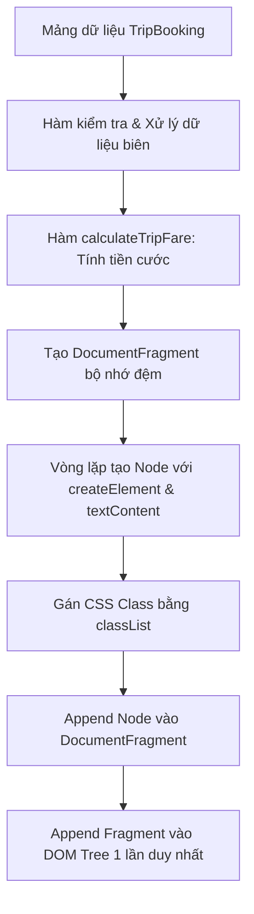

# Bài tập 11: CRM (Mức độ 4: Phân tích & Tối ưu - Tái cấu trúc)

### 1. Mục tiêu bài tập
- **Phân tích và phát hiện điểm nghẽn hiệu năng (Performance Bottlenecks)** trong mã nguồn JavaScript thao tác DOM legacy: nhận diện hiện tượng *Layout Thrashing*, truy xuất DOM lặp đi lặp lại trong vòng lặp và nguy cơ bảo mật *XSS* khi dùng `innerHTML`.
- **Tái cấu trúc mã nguồn (Refactoring)** theo tiêu chuẩn Clean Code: tách biệt rõ ràng giữa logic nghiệp vụ (Business Logic) tính toán tiền cước và logic cập nhật giao diện (UI Presentation).
- **Tối ưu hóa thao tác DOM API**: áp dụng `DocumentFragment` để gom nhóm thao tác cập nhật (batch DOM update), sử dụng `textContent` thay cho `innerHTML`, và quản lý lớp giao diện bằng `classList`.
- **Thực thi chính xác quy tắc nghiệp vụ**: tính toán cước phí dịch vụ đặt xe công nghệ (GrabRide) có áp dụng hệ số phụ phí giờ cao điểm/thời tiết và xử lý linh hoạt các trạng thái chuyến đi.

---


### 2. Bối cảnh & Mô tả bài toán
Hệ thống CRM Quản lý Chuyến đi của GrabRide (**GRAB_RIDE**) đang vận hành một trang Báo cáo Tổng quan Chuyến đi (Trip Dashboard) dành cho bộ phận Quản lý Vận hành. Trang này hiển thị danh sách các chuyến đi trong ngày của tài xế kèm số tiền cước thực tế.

Tuy nhiên, đoạn mã JS hiển thị dữ liệu hiện tại (được viết từ giai đoạn thử nghiệm) đang gặp phải các vấn đề nghiêm trọng:
1. Giao diện bị giật lag rõ rệt khi danh sách chuyến đi tăng lên do truy xuất DOM liên tục bên trong vòng lặp và sử dụng `innerHTML +=` trực tiếp vào bảng.
2. Logic tính tiền cước bị viết gộp chung vào code hiển thị HTML, dẫn đến sai lệch cước phí khi áp dụng phụ phí giờ cao điểm (`isSurge`).
3. Mã nguồn viết theo dạng spaghetti, gán trực tiếp Inline Style (`element.style...`) thay vì quản lý theo CSS Class.

**Sơ đồ luồng xử lý tối ưu (Target Refactored Architecture):**



Bộ phận Kỹ thuật yêu cầu bạn **Phân tích code legacy**, chỉ ra các điểm yếu và **Viết lại (Refactor) toàn bộ logic tương tác DOM** bằng thuần JS DOM API (Chưa dùng Event Listener hay Fetch API).

---


### 3. Quy tắc nghiệp vụ (Business Rules)


#### A. Công thức tính Cước phí chuyến đi (`TripFare`)
1. **Khoảng cách cố định ban đầu:**
   - $2\text{ km}$ đầu tiên: Giá cố định **12.000 VNĐ**.
2. **Khoảng cách phát sinh thêm:**
   - Từ km thứ $3$ trở đi: Tính **4.500 VNĐ / km** (phần lẻ km vẫn tính theo tỉ lệ chính xác).
   - *Công thức cước gốc ($BaseFare$):*
     $$\text{Nếu } Distance \le 2: BaseFare = 12.000\text{ VNĐ}$$
     $$\text{Nếu } Distance > 2: BaseFare = 12.000 + (Distance - 2) \times 4.500\text{ VNĐ}$$
3. **Phụ phí thời tiết / Giờ cao điểm (`isSurge`):**
   - Nếu `isSurge === true`: $TotalFare = Math.round(BaseFare \times 1.2)$
   - Nếu `isSurge === false`: $TotalFare = BaseFare$
4. **Định dạng tiền tệ:** Số tiền hiển thị trên DOM phải được định dạng theo chuẩn Việt Nam có phân cách hàng nghìn (ví dụ: `25.500 VNĐ` hoặc `12.000 VNĐ`).


#### B. Trạng thái chuyến đi & Giao diện Badge (`TripStatus`)
Mỗi trạng thái chuyến đi cần gán class CSS tương ứng vào thẻ chứa trạng thái:
- `COMPLETED` (Hoàn thành): Gán class `badge badge-success`, văn bản hiển thị: `"Hoàn thành"`.
- `IN_PROGRESS` (Đang di chuyển): Gán class `badge badge-warning`, văn bản hiển thị: `"Đang di chuyển"`.
- `CANCELLED` (Đã hủy): Gán class `badge badge-danger`, văn bản hiển thị: `"Đã hủy"`.


#### C. Quy tắc Kiểm soát Biên & Lỗi Dữ liệu (Edge Cases)
- Nếu `distanceKm` $\le 0$ hoặc không phải là số hợp lệ (`isNaN`): Hiển thị cước phí là `"0 VNĐ"` và ghi chú lỗi `[Dữ liệu km sai]` vào cột khoảng cách.
- Nếu `passengerName` bị rỗng/null/undefined: Hiển thị mặc định là `"Khách ẩn danh"`.

---


### 4. Yêu cầu kỹ thuật & Triển khai


#### A. Đoạn mã Legacy cần Phân tích (Cung cấp sẵn trong bài)
Hãy phân tích các lỗi về **Hiệu năng**, **Bảo mật** và **Clean Code** trong đoạn mã legacy dưới đây trước khi tiến hành tối ưu:

```javascript
// --- MA NGUON LEGACY CAN PHAN TICH VA TAI CAU TRUC ---
function renderTripsLegacy(trips) {
    // LOI: Dung innerHTML xoa sach va cong chuoi lien tuc trong vong lap
    document.getElementById("trip-table-body").innerHTML = "";
    
    for (var i = 0; i < trips.length; i++) {
        var t = trips[i];
        // LOI: Tinh toan cuoc phi viet sai va viet gop chung vao UI logic
        var fare = 12000;
        if (t.distance > 2) {
            fare += (t.distance - 2) * 4500;
        }
        if (t.surge) {
            fare = fare * 1.2; // LOI: Chieu lam tron chua chinh xac
        }

        // LOI: Truy xuat DOM lien tuc trong vong lap, thao tac innerHTML gay Re-render/Layout Thrashing
        var statusColor = t.status == "COMPLETED" ? "green" : (t.status == "CANCELLED" ? "red" : "orange");
        
        document.getElementById("trip-table-body").innerHTML += 
            "<tr>" +
                "<td>" + t.id + "</td>" +
                "<td>" + t.passenger + "</td>" +
                "<td>" + t.distance + " km</td>" +
                "<td><span style='color:" + statusColor + "'>" + t.status + "</span></td>" +
                "<td>" + fare + " VND</td>" +
            "</tr>";
    }
}
```


#### B. Yêu cầu Tái cấu trúc & Triển khai mới
Bạn cần tạo file `app.js` mới để giải quyết toàn bộ điểm yếu trên theo các tiêu chí:

1. **Tách biệt Logic Nghiệp vụ (Business Logic):**
   - Viết hàm riêng `calculateTripFare(distanceKm, isSurge)` trả về số tiền cước dạng `Number` (đã làm tròn bằng `Math.round`).
   - Viết hàm hỗ trợ `formatCurrencyVND(amount)` để đổi số thành chuỗi hiển thị dạng `25.500 VNĐ`.

2. **Tối ưu hóa Thao tác DOM API (UI Logic):**
   - Không được sử dụng `innerHTML` để nối chuỗi HTML trong vòng lặp.
   - Cache element bảng (`document.querySelector('#trip-table-body')`) bên ngoài vòng lặp.
   - Sử dụng `document.createDocumentFragment()` để gom toàn bộ các dòng `<tr>` trước khi chèn 1 lần duy nhất vào DOM Tree.
   - Tạo các element con (`tr`, `td`, `span`) bằng `document.createElement()`.
   - Gán nội dung an toàn bằng `textContent`.
   - Gán CSS Class thông qua `element.classList.add(...)`.

3. **Dữ liệu kiểm thử mẫu (Mock Data):**
   Khai báo mảng dữ liệu mẫu để chạy thử nghiệm hàm render chính:

```javascript
const mockRideBookings = [
    { id: "RIDE-001", passengerName: "Nguyễn Văn An", distanceKm: 1.5, isSurge: false, status: "COMPLETED" },
    { id: "RIDE-002", passengerName: "Trần Thị Bích", distanceKm: 5.0, isSurge: true, status: "COMPLETED" },
    { id: "RIDE-003", passengerName: "", distanceKm: 8.2, isSurge: false, status: "IN_PROGRESS" },
    { id: "RIDE-004", passengerName: "Lê Hoàng Cường", distanceKm: -1, isSurge: false, status: "CANCELLED" },
    { id: "RIDE-005", passengerName: "Phạm Minh Đạt", distanceKm: 3.0, isSurge: true, status: "COMPLETED" }
];
```

---


### 5. Quy chuẩn nộp bài


#### Cấu trúc thư mục dự án:
```text
bai-tap-11-grabride/
├── index.html
├── styles.css
└── app.js
```


#### Yêu cầu file HTML cơ bản (`index.html`):
```html
<!DOCTYPE html>
<html lang="vi">
<head>
    <meta charset="UTF-8">
    <title>GrabRide CRM - Trip Dashboard</title>
    <link rel="stylesheet" href="styles.css">
</head>
<body>
    <div class="container">
        <h1>Hệ Thống CRM GrabRide - Báo Cáo Chuyến Đi</h1>
        <table class="data-table">
            <thead>
                <tr>
                    <th>Mã chuyến</th>
                    <th>Hành khách</th>
                    <th>Khoảng cách</th>
                    <th>Trạng thái</th>
                    <th>Tổng cước phí</th>
                </tr>
            </thead>
            <tbody id="trip-table-body">
                <!-- Dữ liệu sẽ được render bằng DOM API -->
            </tbody>
        </table>
    </div>
    <script src="app.js"></script>
</body>
</html>
```


#### Yêu cầu file CSS (`styles.css`):
Định nghĩa sẵn các class để `classList` trong JS truy xuất:
```css
.badge { padding: 4px 8px; border-radius: 4px; font-weight: bold; font-size: 0.85em; }
.badge-success { background-color: #d4edda; color: #155724; }
.badge-warning { background-color: #fff3cd; color: #856404; }
.badge-danger { background-color: #f8d7da; color: #721c24; }
.text-error { color: #dc3545; font-style: italic; }
```

### Tiêu chuẩn Đánh giá & Thang điểm (100đ)

| Tiêu chí | Điểm tối đa | Mô tả chi tiết |
| :--- | :--- | :--- |
| **Phân tích & Tái cấu trúc (Clean Code)** | **20đ** | - Tách biệt rõ ràng hàm `calculateTripFare`, `formatCurrencyVND` và `renderTripTable`.<br>- Đặt tên biến/hàm theo chuẩn CamelCase, có comment giải thích rõ ràng các bước xử lý. |
| **Xử lý Logic Nghiệp vụ Cước phí** | **40đ** | - Tính đúng giá $2\text{ km}$ đầu ($12.000\text{ VNĐ}$) và các km tiếp theo ($4.500\text{ VNĐ/km}$).<br>- Nhân đúng hệ số $1.2x$ khi `isSurge === true` và làm tròn số (`Math.round`).<br>- Định dạng chuẩn tiền tệ VNĐ (ví dụ `30.600 VNĐ`). |
| **Xử lý Biên & Dữ liệu Ngoại lệ** | **20đ** | - Bắt lỗi `distanceKm <= 0` hoặc không phải số: Không sập chương trình, hiển thị cước `$0\text{ VNĐ}$` và cảnh báo giao diện.<br>- Xử lý tên hành khách rỗng/null thành `"Khách ẩn danh"`. |
| **Tối ưu Hiệu năng DOM API** | **20đ** | - Tuyệt đối **không** dùng `innerHTML` trong vòng lặp.<br>- Sử dụng `DocumentFragment` để gom thao tác DOM và chỉ append vào tbody 1 lần duy nhất.<br>- Dùng `createElement`, `textContent`, và `classList.add` đúng tiêu chuẩn bảo mật & hiệu năng. |