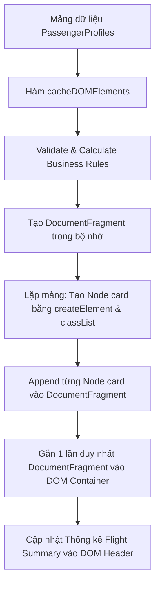

# Bài tập 12: EdTech (Mức độ 4: Phân tích & Tối ưu - Tái cấu trúc)

### 1. Mục tiêu bài tập
Sau khi hoàn thành bài tập này, học viên sẽ có khả năng:
- **Phân tích & Phát hiện điểm yếu hiệu năng (Code Smell Analysis)**: Nhận biết hiện tượng DOM Reflow, Repaint và thao tác DOM lặp đi lặp lại không hiệu quả trong mã nguồn cũ.
- **Tối ưu hóa thao tác DOM**: Áp dụng kỹ thuật `DocumentFragment` và **DOM Caching** để giảm số lần truy xuất và vẽ lại cây DOM (DOM Tree rendering).
- **Tái cấu trúc mã nguồn (Refactoring)**: Tách biệt hoàn toàn giữa logic xử lý nghiệp vụ (Business Logic) và logic thao tác với giao diện DOM (DOM Manipulation Logic) theo chuẩn thiết kế nguyên tử (Atomic Functions).
- **Sử dụng DOM API chuẩn**: Làm chủ các phương thức truy xuất và sửa đổi nội dung nguyên bản (`querySelector`, `createElement`, `textContent`, `appendChild`, `classList`, `setAttribute`) mà **không sử dụng** thư viện ngoài hay Event Listeners.

---


### 2. Bối cảnh & Mô tả bài toán
Bạn là một Kỹ sư phần mềm Frontend tại hãng hàng không **Vietjet / Vietnam Airlines**. Hệ thống màn hình hiển thị danh sách làm thủ tục (Check-in Monitor) tại quầy vé sân bay hiện đang chạy một đoạn mã nguồn cũ (Legacy Code) do lập trình viên trước đây bàn giao.

Mã nguồn này đang gặp sự cố nghiêm trọng: Khi số lượng hành khách làm thủ tục tăng lên (từ 50 đến vài trăm khách cùng lúc), màn hình bị hiện tượng giật/lag (DOM Reflow/Repaint liên tục), giao diện cập nhật chậm và code bị lặp lại rất nhiều lần, vô cùng khó bảo trì.

Nhiệm vụ của bạn là **phân tích lỗi**, **chỉ ra các điểm yếu** trong đoạn mã cũ và **tái cấu trúc (refactor)** lại toàn bộ ứng dụng hiển thị danh sách hành khách check-in và tính phí hành lý cước.


#### Sơ đồ luồng xử lý tối ưu (Refactored Flow):


---


### 3. Mã nguồn cũ cần Tái cấu trúc (Legacy Code)
Dưới đây là đoạn mã nguồn tệ hại (Bad Practice) đang chạy trên hệ thống:

```javascript
// === MÃ NGUỒN CŨ (BAD PRACTICE - CẦN PHÂN TÍCH VÀ TÁI CẤU TRÚC) ===
function renderCheckinList(data) {
    // BUG 1 & 2: Query DOM và gán innerHTML trực tiếp trong vòng lặp
    for (var i = 0; i < data.length; i++) {
        document.getElementById("passenger-list").innerHTML += 
            '<div class="card" style="border: 1px solid #ccc; margin: 10px; padding: 10px;">' +
            '<h3>' + data[i].name + ' - PNR: ' + data[i].pnr + '</h3>' +
            '<p>Hạng vé: ' + data[i].ticketClass + '</p>' +
            '<p>Hành lý: ' + data[i].baggage + ' kg</p>' +
            '</div>';
        
        // BUG 3: Logic tính toán bị lặp và gán inline styling trực tiếp bằng JS
        var fee = 0;
        if (data[i].ticketClass == 'Eco') {
            fee = data[i].baggage * 50000;
        } else if (data[i].ticketClass == 'Deluxe') {
            if (data[i].baggage > 20) fee = (data[i].baggage - 20) * 50000;
        } else if (data[i].ticketClass == 'Business') {
            if (data[i].baggage > 30) fee = (data[i].baggage - 30) * 50000;
        }
        
        // BUG 4: Query lại DOM liên tục trong vòng lặp để sửa style
        if (fee > 0) {
            document.querySelectorAll('.card')[i].style.backgroundColor = '#ffe6e6';
            document.querySelectorAll('.card')[i].innerHTML += '<p style="color:red">Phí cước: ' + fee + ' VNĐ</p>';
        } else {
            document.querySelectorAll('.card')[i].style.backgroundColor = '#e6ffe6';
        }
    }
    
    // BUG 5: Lặp lại một vòng lặp khác chỉ để tính tổng tiền
    var totalFee = 0;
    var vipCount = 0;
    for (var j = 0; j < data.length; j++) {
        var f = 0;
        if (data[j].ticketClass == 'Eco') f = data[j].baggage * 50000;
        else if (data[j].ticketClass == 'Deluxe' && data[j].baggage > 20) f = (data[j].baggage - 20) * 50000;
        else if (data[j].ticketClass == 'Business' && data[j].baggage > 30) f = (data[j].baggage - 30) * 50000;
        
        totalFee += f;
        if (data[j].ticketClass == 'Business') vipCount++;
    }
    
    document.querySelector("#summary-total").innerHTML = "Tổng tiền phạt: " + totalFee + " VNĐ";
    document.querySelector("#summary-vip").innerHTML = "Số khách Business: " + vipCount;
}
```

---


### 4. Quy tắc nghiệp vụ (Business Rules)


#### A. Tính phí hành lý ký gửi quá cước (`calculateBaggageFee`):
- Tất cả hành khách mặc định được miễn phí **7 kg hành lý xách tay** (không tính vào cước ký gửi).
- Mức hành lý **ký gửi miễn phí** áp dụng theo từng hạng vé:
  - `Eco`: **0 kg** miễn phí (Mọi kg hành lý ký gửi đều bị tính phí cước).
  - `Deluxe`: **20 kg** miễn phí.
  - `Business`: **30 kg** miễn phí.
- Số kg quá cước: `overweightKg = Math.max(0, actualBaggageKg - freeAllowance)`.
- Phí quá cước tính theo đơn giá: **50.000 VNĐ / 1 kg quá cước**.


#### B. Quy định hiển thị Badge & Style (Dùng class CSS, không dùng Inline Style):
- Hạng vé `Business`: Thêm CSS class `badge-business`, hiển thị thẻ nhãn `[VIP - Business]`.
- Hạng vé `Deluxe`: Thêm CSS class `badge-deluxe`, hiển thị thẻ nhãn `[Deluxe]`.
- Hạng vé `Eco`: Thêm CSS class `badge-eco`, hiển thị thẻ nhãn `[Eco Standard]`.
- Hành khách có quá cước (`overweightKg > 0`): Card phải chứa class `status-overweight`.
- Hành khách không quá cước (`overweightKg == 0`): Card phải chứa class `status-ok`.

---


### 5. Yêu cầu kỹ thuật & Triển khai


#### Nhiệm vụ 1: Viết Báo cáo Phân tích & Đánh giá (File `ANALYSIS.md` hoặc Comment ở đầu file `app.js`)
Liệt kê và giải thích ngắn gọn ít nhất **4 điểm yếu** trong mã nguồn cũ liên quan đến:
1. Hiệu năng DOM (Reflow & Repaint).
2. DOM Query lặp dư thừa.
3. Trộn lẫn Logic nghiệp vụ và Logic giao diện (Tổ chức code kém).
4. Sử dụng Inline Style trực tiếp bằng JavaScript thay vì Class CSS.


#### Nhiệm vụ 2: Tái cấu trúc mã nguồn (Refactoring Code JS)
Viết lại hệ thống bằng JavaScript thuần (ES6+) tuân thủ các hàm bắt buộc sau:

1. `cacheDOMElements()`:
   - Truy xuất và lưu trữ tất cả các DOM Element cố định (`#passenger-list`, `#summary-total`, `#summary-vip`, `#summary-count`, `#empty-state`) vào một object cache duy nhất để tái sử dụng.

2. `calculateBaggageFee(ticketClass, baggageWeight)`:
   - Hàm thuần túy (Pure Function) tính toán và trả về một Object chứa: `{ freeAllowance, overweightKg, excessFee }`.

3. `validatePassenger(passenger)`:
   - Kiểm tra định dạng dữ liệu đầu vào:
     - `pnr`: Phải đúng 6 ký tự chữ hoa hoặc số (Ví dụ: `VJ1234`, `VN8899`). Nếu sai -> Coi là không hợp lệ.
     - `baggage`: Nếu âm (`< 0`) hoặc không phải là số -> Tự động chuyển về `0`.

4. `createPassengerCardNode(passenger)`:
   - Sử dụng `document.createElement()`, `textContent`, `classList.add()` để tạo ra một phần tử Node HTML hoàn chỉnh đại diện cho 1 thẻ hành khách (Tuyệt đối không dùng nối chuỗi `innerHTML`).

5. `renderPassengerList(passengerList)`:
   - Khởi tạo một `document.createDocumentFragment()`.
   - Lặp qua danh sách khách hàng, gọi `createPassengerCardNode()` và append vào Fragment.
   - Thao tác gán Fragment vào DOM đúng **1 lần duy nhất** (`container.appendChild(fragment)`).

6. `updateFlightSummary(passengerList)`:
   - Cập nhật các chỉ số tổng quan lên giao diện: Tổng số hành khách, Tổng doanh thu cước hành lý, Tổng số lượng khách Business.


#### Constraint Ràng buộc Kỹ thuật (BẮT BUỘC):
- **CẤM SỬ DỤNG**: `addEventListener`, `onclick`/`onsubmit`, `fetch()`, `localStorage`, `jQuery`, hoặc bất kỳ thư viện bên thứ 3 nào.
- Chỉ thực thi chương trình khi khởi chạy trực tiếp các hàm đã tái cấu trúc với dữ liệu mẫu cho trước.

---


### 6. Cấu trúc dữ liệu mẫu & Giao diện mẫu


#### Bộ dữ liệu Test Mẫu:
```javascript
const samplePassengers = [
    { name: "Nguyễn Văn An", pnr: "VJ1024", ticketClass: "Business", baggage: 35 },
    { name: "Trần Thị Bích", pnr: "VN8821", ticketClass: "Eco", baggage: 12 },
    { name: "Lê Hoàng Nam", pnr: "VJ99", ticketClass: "Deluxe", baggage: 18 }, // PNR sai định dạng
    { name: "Phạm Minh Cường", pnr: "VN5544", ticketClass: "Deluxe", baggage: 25 },
    { name: "Đặng Thu Thảo", pnr: "VJ7711", ticketClass: "Eco", baggage: -5 }  // Hành lý âm
];
```

---


### 7. Quy chuẩn nộp bài
- **Cấu trúc thư mục**:
  ```text
  student_id_session17/
  ├── index.html
  ├── style.css
  ├── app.js
  └── ANALYSIS.md (Hoặc đoạn comment phân tích đặt ở đầu file app.js)
  ```
- **Quy định đặt tên**: Viết code sạch, tên biến/hàm bằng tiếng Anh theo chuẩn `camelCase`.

### Tiêu chuẩn Đánh giá & Thang điểm (100đ)

| Tiêu chí | Điểm tối đa | Mô tả chi tiết |
| :--- | :--- | :--- |
| **1. Phân tích điểm yếu (Code Review & Analysis)** | **20đ** | - Phát hiện và giải thích chính xác 4 điểm yếu về hiệu năng DOM Reflow/Repaint, lặp Query DOM, inline style và spaghetti code.<br>- Nêu rõ lý do tại sao mã cũ gây chậm hệ thống. |
| **2. Tối ưu hóa hiệu năng DOM (DOM Optimization)** | **25đ** | - Sử dụng `DocumentFragment` để thực hiện thao tác batch update DOM 1 lần duy nhất.<br>- Triển khai hàm `cacheDOMElements()` truy xuất DOM tối ưu, không gọi `querySelector` trong vòng lặp.<br>- Sử dụng `createElement` và `textContent` thay cho `innerHTML`. |
| **3. Xử lý Logic Nghiệp vụ (Business Rules)** | **25đ** | - Tính toán chính xác định mức miễn phí và phí phạt cước 50.000 VNĐ/kg cho cả 3 hạng vé (Eco, Deluxe, Business).<br>- Phân loại đúng CSS class và Badge nhãn theo từng hạng vé.<br>- Thống kê chính xác: Tổng số khách, Tổng doanh thu cước, Số khách Business. |
| **4. Xử lý Biên & Dữ liệu Ngoại lệ (Edge Cases)** | **15đ** | - Xử lý đúng khi danh sách mảng rỗng (`[]` hoặc `null`): Hiển thị Empty State trên DOM.<br>- Kiểm tra PNR đúng 6 ký tự alphanumeric, gắn class `.card-invalid` cho PNR lỗi.<br>- Chuẩn hóa khối lượng hành lý âm (`< 0`) hoặc không phải số về `0`. |
| **5. Cấu trúc mã nguồn & Phong cách (Code Style)** | **15đ** | - Tách biệt rõ ràng Pure Functions (tính toán) và DOM Manipulation Functions.<br>- Không vi phạm danh mục Forbidden Scope (Không dùng Event listeners, Form submit, Fetch, LocalStorage).<br>- Code có comment giải thích rõ ràng bằng Tiếng Việt có dấu, đặt tên hàm/biến chuẩn `camelCase`. |