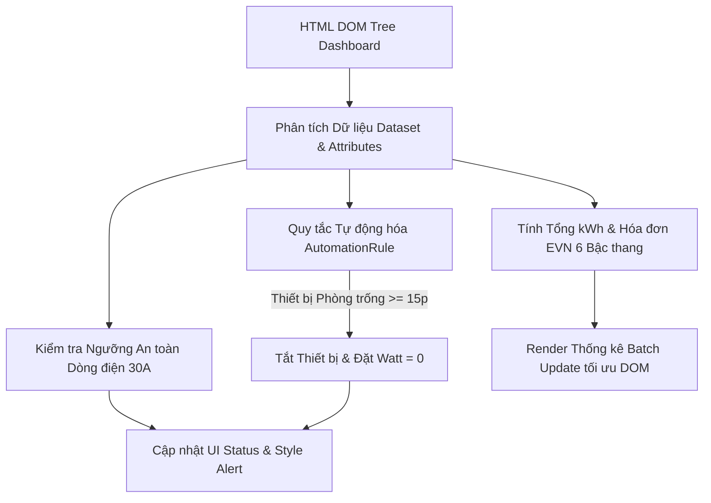

# Bài tập 12: EdTech (Mức độ 4: Phân tích & Tối ưu - Tái cấu trúc)

### 1. Mục tiêu bài tập
- **Phân tích & Tối ưu hóa DOM:** Nhận diện các lỗi anti-pattern gây sụt giảm hiệu năng giao diện như lặp lại truy vấn DOM (`DOM Query inside loops`), thao tác ghi trực tiếp liên tục (`innerHTML reflow/repaint waterfall`).
- **Tái cấu trúc mã nguồn (Refactoring):** Chuyển đổi mã nguồn spagetti/unoptimized sang mô hình lập trình hướng đối tượng hoặc module sạch (`SmartHomeManager`), đảm bảo nguyên tắc Single Responsibility Principle (SRP).
- **Thao tác dữ liệu DOM chuẩn xác:** Đọc và thao tác chính xác các thuộc tính dữ liệu tùy chỉnh (`data-*` attributes) để phục vụ tính toán logic nghiệp vụ.
- **Áp dụng Logic Nghiệp vụ Thực tế:** Cài đặt thuật toán tự động hóa IoT, cảnh báo quá tải dòng điện (Ampere) và tính toán hóa đơn điện sinh hoạt bậc thang chuẩn EVN kèm thuế VAT.

---


### 2. Bối cảnh & Mô tả bài toán
Bạn được giao nhiệm vụ nâng cấp hệ thống **Dashboard Giám sát & Điều khiển Nhà thông minh (Smart Home IoT)** cho tập đoàn công nghệ. Hệ thống quản lý danh sách thiết bị điện trong các phòng, đo lường dòng điện tải tức thời và tổng năng lượng tiêu thụ theo tháng.

Mã nguồn phiên bản 1.0 (Legacy Code) đang gặp các sự cố nghiêm trọng:
1. Mỗi lần cập nhật trạng thái, đoạn mã chạy vòng lặp và gọi `document.getElementById()` / `document.querySelector()` hàng chục lần.
2. Việc thay đổi trạng thái thiết bị thực hiện bằng cách ghép chuỗi `innerHTML += ...` liên tục trong vòng lặp làm mất trạng thái DOM và kích hoạt Layout Reflow nhiều lần.
3. Thuật toán tính tiền điện EVN bị tính sai công thức (tính phẳng thay vì tính lũy tiến bậc thang).

**Sơ đồ luồng xử lý dữ liệu hệ thống:**



---


### 3. Quy tắc nghiệp vụ (Business Rules)


#### Rule 1: Cảnh báo Vượt Công suất & Dòng điện (Overload Protection)
- **Công thức:** Dòng điện tổng $I_{tổng} (A) = \frac{\sum P_{đang\_bật} (W)}{220 (V)}$
- **Điều kiện:** Nếu $I_{tổng} > 30.0\text{ A}$ (tương đương tổng công suất đang bật $> 6600\text{ W}$):
  - Gán class `.warning-overload` cho phần tử `#system-alert`.
  - Cập nhật text tại `#system-alert-text`: `"CẢNH BÁO: DÒNG ĐIỆN VƯỢT NGƯỠNG AN TOÀN (xx.x A / 30A)"`.
- **Ngược lại (An toàn):**
  - Xóa class `.warning-overload` (nếu có), thêm class `.system-safe`.
  - Cập nhật text tại `#system-alert-text`: `"HỆ THỐNG AN TOÀN (xx.x A / 30A)"`.


#### Rule 2: Tự động hóa theo Kịch bản (Automation Rule)
Duyệt qua tất cả phần tử thiết bị `.device-card`:
- **Điều kiện tắt:** Nêu `data-occupancy === "vacant"` (phòng trống) AND `data-idle-time >= 15` (không có thao tác quá 15 phút) AND `data-status === "active"`.
- **Hành động xử lý DOM:**
  1. Cập nhật `data-status="inactive"`.
  2. Cập nhật `data-power-watt="0"`.
  3. Thêm class `.device-auto-off` vào card thiết bị.
  4. Thay đổi nội dung text phần tử hiển thị công suất `.power-value` thành `"0 W"`.
  5. Thay đổi nội dung text phần tử hiển thị trạng thái `.status-badge` thành `"Tự động tắt (Vắng người)"` và đổi class badge thành `.badge-secondary`.


#### Rule 3: Tính Điện năng tiêu thụ & Tiền điện EVN (6 Bậc thang)
- **Công thức tính hóa đơn EVN lũy tiến** áp dụng trên tổng điện năng tiêu thụ ($kWh$) tháng ghi nhận tại `data-monthly-kwh` của các thiết bị:

| Bậc | Khoảng áp dụng (kWh) | Đơn giá (VNĐ/kWh) |
| :--- | :--- | :--- |
| **Bậc 1** | Cho kWh từ 0 - 50 | 1,893 |
| **Bậc 2** | Cho kWh từ 51 - 100 | 1,956 |
| **Bậc 3** | Cho kWh từ 101 - 200 | 2,271 |
| **Bậc 4** | Cho kWh từ 201 - 300 | 2,860 |
| **Bậc 5** | Cho kWh từ 301 - 400 | 3,197 |
| **Bậc 6** | Cho kWh từ 401 trở lên | 3,302 |

- **Thuế VAT:** $8\%$ áp dụng trên Tổng tiền trước thuế.
- **Tổng tiền thanh toán cuối cùng:** $\text{Math.round}(\text{Tiền trước thuế} \times 1.08)$.
- Định dạng hiển thị tiền điện: Sử dụng `Intl.NumberFormat('vi-VN')` kèm đơn vị `"VNĐ"` (Ví dụ: `1,250,500 VNĐ`).

---


### 4. Yêu cầu kỹ thuật & Triển khai


#### 4.1. Giao diện HTML Ban đầu (Mẫu testcase đầu vào)
Sử dụng đoạn mã HTML mẫu dưới đây làm giao diện kiểm thử (không sửa cấu trúc HTML gốc):

```html
<div id="smart-home-dashboard">
  <!-- System Alert Header -->
  <div id="system-alert" class="alert-box">
    <span id="system-alert-text">Đang kiểm tra hệ thống...</span>
  </div>

  <!-- Device List Container -->
  <div id="device-list" class="device-grid">
    <div class="device-card" data-device-id="DEV-01" data-status="active" data-power-watt="2200" data-occupancy="vacant" data-idle-time="20" data-monthly-kwh="150">
      <h4 class="device-name">Điều hòa Phòng khách</h4>
      <span class="status-badge badge-success">Đang hoạt động</span>
      <p class="power-info">Công suất: <span class="power-value">2200 W</span></p>
    </div>

    <div class="device-card" data-device-id="DEV-02" data-status="active" data-power-watt="4500" data-occupancy="occupied" data-idle-time="0" data-monthly-kwh="220">
      <h4 class="device-name">Bếp từ Đôi</h4>
      <span class="status-badge badge-success">Đang hoạt động</span>
      <p class="power-info">Công suất: <span class="power-value">4500 W</span></p>
    </div>

    <div class="device-card" data-device-id="DEV-03" data-status="active" data-power-watt="1500" data-occupancy="vacant" data-idle-time="45" data-monthly-kwh="80">
      <h4 class="device-name">Bình nóng lạnh Tầng 2</h4>
      <span class="status-badge badge-success">Đang hoạt động</span>
      <p class="power-info">Công suất: <span class="power-value">1500 W</span></p>
    </div>

    <div class="device-card" data-device-id="DEV-04" data-status="inactive" data-power-watt="0" data-occupancy="vacant" data-idle-time="100" data-monthly-kwh="15">
      <h4 class="device-name">Đèn Chùm Sảnh</h4>
      <span class="status-badge badge-secondary">Đã tắt</span>
      <p class="power-info">Công suất: <span class="power-value">0 W</span></p>
    </div>
  </div>

  <!-- Power Usage Report Metrics -->
  <div id="power-report" class="report-panel">
    <p>Tổng tiêu thụ tháng: <strong id="total-kwh">0 kWh</strong></p>
    <p>Số thiết bị đang bật: <strong id="active-device-count">0</strong></p>
    <p>Dòng điện tổng hiện tại: <strong id="total-amperage">0 A</strong></p>
    <p>Dự tính tiền điện (Đã gồm 8% VAT): <strong id="total-cost">0 VNĐ</strong></p>
  </div>
</div>
```


#### 4.2. Mã nguồn Tái cấu trúc (Yêu cầu JavaScript)
Học viên tạo file `app.js` và triển khai theo mô hình đối tượng `SmartHomeManager`:

```javascript
/**
 * SmartHomeManager - Module quản lý và tối ưu hóa hệ thống IoT Smart Home
 */
const SmartHomeManager = {
  // Cache DOM Elements (Tuyệt đối không truy vấn DOM trùng lặp trong hàm xử lý)
  elements: {},

  /**
   * Khởi tạo module và cache các selector chính
   */
  init() {
    this.cacheDOM();
    this.processSmartHomeSystem();
  },

  /**
   * Lưu các tham chiếu DOM Node cố định
   */
  cacheDOM() {
    // TODO: Truy vấn và lưu tất cả phần tử DOM cố định vào this.elements
  },

  /**
   * Đọc và parse dữ liệu từ DOM Tree thành mảng Object JavaScript
   * @returns {Array<Object>} Danh sách thiết bị
   */
  parseDevicesFromDOM() {
    // TODO: Đọc data-attributes từ .device-card và ép kiểu số an toàn
  },

  /**
   * Thuật toán tính tiền điện EVN bậc thang (6 bậc)
   * @param {number} totalKwh - Tổng kWh tiêu thụ
   * @returns {number} Tổng tiền bao gồm 8% VAT (làm tròn số nguyên)
   */
  calculateEVNBilling(totalKwh) {
    // TODO: Cài đặt công thức tính lũy tiến 6 bậc EVN + VAT 8%
  },

  /**
   * Thực thi logic kiểm tra kịch bản tự động, tính toán công suất và cập nhật DOM
   */
  processSmartHomeSystem() {
    // TODO: 1. Áp dụng Rule Automation Tự động tắt thiết bị phòng trống
    // TODO: 2. Tính toán tổng Watt, Amperage, tổng kWh tháng
    // TODO: 3. Kiểm tra Rule Cảnh báo dòng điện > 30A
    // TODO: 4. Cập nhật toàn bộ giao diện trong 1 lần Batch Update
  }
};

// Đẩy ứng dụng vào luồng chạy
SmartHomeManager.init();
```


#### 4.3. Ràng buộc Phạm vi & Cấm đoán (Forbidden Scope)
-  **KHÔNG** sử dụng Event Listeners (`addEventListener`, `onclick`, ...).
-  **KHÔNG** sử dụng `form submit`, `Fetch API`, `XMLHttpRequest`, `LocalStorage`.
-  **KHÔNG** ghi lại đè toàn bộ `innerHTML` của `#device-list` để tránh hủy hoại các node đang tồn tại. Ghi/sửa trực tiếp thuộc tính Node hoặc thao tác class/dataset chuẩn xác.
-  Ép kiểu an toàn bằng `parseFloat()`, `parseInt()`, `isNaN()` để phòng tránh dữ liệu attribute hỏng.

---


### 5. Quy chuẩn nộp bài
1. Thư mục dự án nộp bài bao gồm:
   ```text
   student_submission/
   ├── index.html
   └── app.js
   ```
2. Mã nguồn JS phải có đầy đủ comment JSDoc mô tả tham số và giá trị trả về của các hàm.
3. Không để lại các câu lệnh `console.log` thừa sau khi hoàn thành bài tập.

### Tiêu chuẩn Đánh giá & Thang điểm (100đ)

| Tiêu chí | Điểm tối đa | Mô tả chi tiết |
| :--- | :--- | :--- |
| **Cấu trúc Code & Refactoring (Phân tích & Tối ưu)** | **20đ** | - Tổ chức mã nguồn theo đối tượng `SmartHomeManager` đúng chuẩn.<br>- Cache toàn bộ DOM selector trong `cacheDOM()`, không gọi `querySelector`/`getElementById` lặp lại trong vòng lặp.<br>- Sử dụng JSDoc và đặt tên biến theo chuẩn Clean Code. |
| **Xử lý Logic Nghiệp vụ IoT & Automation** | **40đ** | - **Rule 1 (10đ):** Cảnh báo đúng ngưỡng dòng điện 30A ($I = P / 220$), toggle class UI cảnh báo an toàn/vượt ngưỡng chuẩn xác.<br>- **Rule 2 (15đ):** Tự động lọc các thiết bị phòng trống (`vacant`) có `idle-time >= 15`, đổi `data-status="inactive"`, gán `power-watt="0"`, thêm class `.device-auto-off` và cập nhật text UI tương ứng.<br>- **Rule 3 (15đ):** Tính chính xác tiền điện EVN 6 bậc thang kèm 8% VAT, định dạng `Intl.NumberFormat` chuẩn `vi-VN`. |
| **Xử lý Biên & Dữ liệu Lỗi (Edge Cases)** | **20đ** | - Ép kiểu dữ liệu an toàn (`parseInt`, `parseFloat`), phòng ngừa `isNaN` khi thuộc tính DOM thiếu hoặc chứa ký tự lạ.<br>- Xử lý đúng trường hợp tổng kWh = 0 hoặc tổng dòng điện bằng 0.<br>- Không bị lỗi vỡ giao diện khi danh sách thiết bị rỗng. |
| **Tối ưu Hiệu năng DOM (Batch Update)** | **20đ** | - Không lạm dụng `innerHTML += ...` gây ra Reflow/Repaint liên tục.<br>- Cập nhật nội dung trực tiếp qua `.textContent` hoặc `.innerText` cho từng element nhỏ.<br>- Tốc độ xử lý tức thì, tối thiểu hóa độ phức tạp thuật toán $O(N)$. |