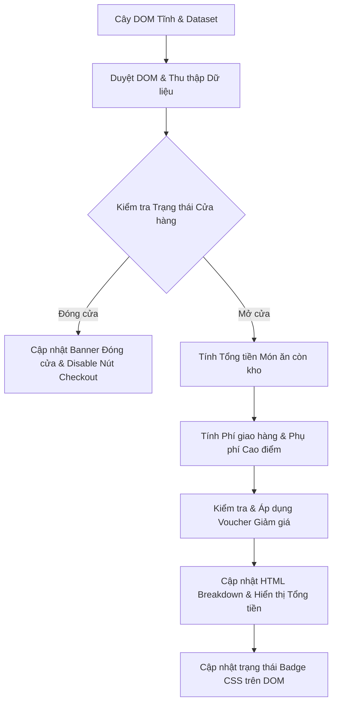

# Bài tập 13: E-Commerce (Mức độ 5: Sáng tạo - Thiết kế Mini Module)

### 1. Mục tiêu bài tập
Sau khi hoàn thành bài tập này, học viên sẽ có khả năng:
- **Truy xuất và duyệt DOM Tree nâng cao**: Sử dụng thành thạo các phương thức `querySelector`, `querySelectorAll`, `getElementsByClassName`, cùng các thuộc tính duyệt cây DOM (`parentElement`, `children`, `firstElementChild`,...) để bóc tách dữ liệu từ cấu trúc HTML phức tạp.
- **Đọc và thao tác Dữ liệu Dataset (`data-*`)**: Trích xuất dữ liệu nghiệp vụ ẩn trong thuộc tính HTML (ví dụ: `data-price`, `data-stock`, `data-distance`) để xử lý logic.
- **Cập nhật Nội dung & Thuộc tính DOM linh hoạt**: Áp dụng thành thạo `textContent`, `innerHTML`, `setAttribute`, `removeAttribute`, và API `classList` (`add`, `remove`, `toggle`, `contains`) để cập nhật giao diện ứng dụng theo trạng thái nghiệp vụ.
- **Xây dựng Mini Module Độc lập (Pure JS DOM Engine)**: Thiết kế tư duy lập trình dạng module (Object pattern hoặc Functional pattern) thực hiện tính toán và render dữ liệu tự động mà không phụ thuộc vào bắt sự kiện người dùng (Event Listeners).

---


### 2. Bối cảnh & Mô tả bài toán
Bạn là một Senior Frontend Engineer tại dự án **ShopeeFood**. Đội ngũ UI/UX vừa bàn giao giao diện mẫu cho trang Checkout (Xác nhận đơn hàng). Tuy nhiên, trang này hiện tại chỉ chứa HTML tĩnh chứa các `data-* attributes` biểu diễn thông tin món ăn, trạng thái quán, khoảng cách giao hàng và khung giờ đặt hàng.

Nhiệm vụ của bạn là xây dựng một **Engine Tính toán & Render Đơn hàng (ShopeeFood Order Engine)** bằng JavaScript thuần. Engine này có trách nhiệm tự động quét toàn bộ thông tin từ cây DOM, xử lý các quy tắc nghiệp vụ phức tạp của ShopeeFood, sau đó cập nhật trực tiếp kết quả (tổng tiền, phí ship, phụ phí cao điểm, giảm giá, trạng thái nút đặt hàng) lên giao diện người dùng.


#### Sơ đồ luồng xử lý của Engine (DOM-to-DOM Data Flow):



---


### 3. Quy tắc nghiệp vụ (Business Rules)

Engine cần áp dụng chính xác các quy tắc nghiệp vụ sau:

1. **Kiểm tra trạng thái Cửa hàng (`#restaurant-info`)**:
   - Nếu `data-is-open="false"`:
     - Hiển thị banner `#store-status-banner` nội dung: `"Cửa hàng hiện đã đóng cửa. Quý khách vui lòng quay lại sau!"`.
     - Thêm class `banner-danger` vào `#store-status-banner`.
     - Vô hiệu hóa nút `#checkout-btn` bằng cách thêm thuộc tính `disabled="true"` và class `btn-disabled`.
     - Gán toàn bộ số tiền thanh toán (Tổng món, Phí ship, Phụ phí, Giảm giá, Tổng cộng) về `0 đ`.

2. **Xử lý Món ăn (`.food-item`) & Tồn kho**:
   - Duyệt qua tất cả món ăn trong danh sách đại diện bởi class `.food-item`.
   - Nếu món ăn có `data-stock="0"`:
     - Thêm class `item-out-of-stock` vào phần tử món ăn đó.
     - Thay đổi nội dung của phần tử con `.stock-status` thành `HTML`: `<span class="badge badge-danger">Hết hàng</span>`.
     - Món ăn này **KHÔNG** được tính vào Tổng tiền món (`subtotal`).
   - Ngược lại (`data-stock > 0`):
     - Thành tiền món = `data-price` * `data-quantity`.
     - `subtotal` = Tổng thành tiền của tất cả các món còn hàng.

3. **Tính Phí giao hàng (`DeliveryFee`) & Phụ phí Cao điểm**:
   - Lấy khoảng cách `data-distance` (km) từ `#restaurant-info`:
     - 3km đầu tiên: Phí cố định **15.000 đ**.
     - Từ km thứ 4 trở đi: Mỗi km tiếp theo (hoặc một phần km làm tròn lên `Math.ceil`) tính thêm **5.000 đ/km**.
       *(Ví dụ: 4.2 km -> làm tròn thành 5 km. Phí = 15.000 + (5 - 3) * 5.000 = 25.000 đ).*
   - **Chính sách Miễn/Giảm phí ship**:
     - Nếu `subtotal` >= **100.000 đ**: Được giảm **15.000 đ** phí giao hàng (Phí ship tối thiểu sau giảm không được nhỏ hơn `0 đ`).
     - Thêm class `free-ship-applied` vào `#shipping-fee-val` và thêm một badge HTML `<span class="badge-freeship">Đã áp dụng Freeship</span>` vào kế bên.
   - **Phụ phí Khung giờ Cao điểm**:
     - Lấy khung giờ đặt món `data-order-hour` (số nguyên từ 0-23) từ `#restaurant-info`.
     - Nếu giờ đặt rơi vào khung giờ cao điểm (từ **11h - 13h** hoặc từ **18h - 20h**): Tính thêm phụ phí **10.000 đ**. Hiển thị phụ phí này tại `#surcharge-val`.

4. **Áp dụng Voucher Giảm giá (`Voucher`)**:
   - Lấy thông tin voucher từ thẻ `#voucher-info` (chứa `data-code`, `data-min-order`, `data-discount`).
   - Nếu `subtotal` >= `data-min-order`:
     - Số tiền giảm giá (`discountAmount`) = `data-discount`. (Số tiền giảm không vượt quá `subtotal`).
     - Cập nhật text `#voucher-message` thành `"Mã [CODE] đã được áp dụng thành công!"`.
     - Thêm class `text-success` vào `#voucher-message`.
   - Ngược lại (Không đủ điều kiện):
     - `discountAmount` = 0 đ.
     - Cập nhật text `#voucher-message` thành `"Đơn hàng chưa đủ điều kiện tối thiểu ([Giá trị minOrder] đ) để áp dụng mã"`.
     - Thêm class `text-muted` vào `#voucher-message`.

5. **Tổng tiền Thanh toán cuối cùng (`Total Payment`)**:
   - `Final Total = subtotal + actualShippingFee + surcharge - discountAmount`.
   - Tất cả định dạng tiền tệ hiển thị trên DOM phải theo chuẩn Việt Nam Đồng (VD: `125.000 đ`).

---


### 4. Yêu cầu kỹ thuật & Triển khai


#### Structure HTML Mẫu (Dùng làm đầu vào để test script):
Học viên tạo file `index.html` với cấu trúc chuẩn sau để chạy bài làm:

```html
<!DOCTYPE html>
<html lang="vi">
<head>
  <meta charset="UTF-8">
  <title>ShopeeFood Order Summary Engine</title>
  <style>
    .out-of-stock { opacity: 0.5; background-color: #f8d7da; }
    .btn-disabled { background-color: #ccc; cursor: not-allowed; }
    .banner-danger { color: red; font-weight: bold; padding: 10px; border: 1px solid red; }
    .free-ship-applied { text-decoration: line-through; color: #888; }
    .badge-freeship { background: green; color: white; padding: 2px 6px; font-size: 12px; margin-left: 5px; }
    .text-success { color: green; }
    .text-muted { color: gray; }
  </style>
</head>
<body>
  <!-- Thẻ thông tin Nhà hàng -->
  <div id="restaurant-info" data-is-open="true" data-order-hour="12" data-distance="4.2">
    <h2>Cơm Tấm Sài Gòn - Choắt Quán</h2>
    <div id="store-status-banner"></div>
  </div>

  <!-- Danh sách món ăn trong giỏ -->
  <div id="cart-list">
    <div class="food-item" data-id="101" data-price="45000" data-quantity="2" data-stock="15">
      <span class="item-name">Cơm tấm sườn bì chả</span>
      <span class="stock-status"></span>
    </div>
    <div class="food-item" data-id="102" data-price="15000" data-quantity="1" data-stock="0">
      <span class="item-name">Canh khổ qua dồn thịt</span>
      <span class="stock-status"></span>
    </div>
    <div class="food-item" data-id="103" data-price="10000" data-quantity="2" data-stock="50">
      <span class="item-name">Trà đá đường</span>
      <span class="stock-status"></span>
    </div>
  </div>

  <!-- Thông tin Mã giảm giá -->
  <div id="voucher-info" data-code="SHOPEE15K" data-min-order="80000" data-discount="15000">
    <p id="voucher-message"></p>
  </div>

  <!-- Bảng tổng kết đơn hàng (Summary) -->
  <div id="checkout-summary">
    <div id="order-breakdown"></div>
    <p>Tạm tính: <span id="subtotal-val">0 đ</span></p>
    <p>Phí giao hàng: <span id="shipping-fee-val">0 đ</span> <span id="shipping-fee-discounted"></span></p>
    <p>Phụ phí cao điểm: <span id="surcharge-val">0 đ</span></p>
    <p>Giảm giá Voucher: <span id="discount-val">0 đ</span></p>
    <h3>TỔNG THANH TOÁN: <span id="total-val">0 đ</span></h3>
    <button id="checkout-btn">ĐẶT HÀNG NGAY</button>
  </div>

  <script src="./main.js"></script>
</body>
</html>
```


#### Yêu cầu Code JavaScript (`main.js`):
Học viên phải tổ chức code dưới dạng Module/Object có tên `ShopeeFoodEngine` chứa các hàm xử lý chuyên biệt:

1. **`ShopeeFoodEngine.init()`**: Hàm khởi chạy chính. Thực hiện gọi lần lượt các bước bên dưới theo đúng thứ tự logic.
2. **`ShopeeFoodEngine.parseDOMData()`**:
   - Truy xuất các element: `#restaurant-info`, `.food-item`, `#voucher-info`.
   - Ép kiểu các dữ liệu từ `dataset` sang kiểu `Number` hoặc `Boolean` hợp lệ.
3. **`ShopeeFoodEngine.validateItemsAndCalculateSubtotal(items)`**:
   - Lặp qua danh sách món ăn thu thập được.
   - Thao tác DOM: Thêm class `.out-of-stock`, cập nhật `.stock-status`.
   - Tính toán và trả về tổng tiền tạm tính `subtotal`.
4. **`ShopeeFoodEngine.calculateShippingAndSurcharge(distance, orderHour, subtotal)`**:
   - Tính toán phí ship gốc, phụ phí cao điểm, và tiền ship thực tế sau khi áp dụng giảm giá phí ship (nếu có). Trả về object chứa các chỉ số này.
5. **`ShopeeFoodEngine.applyVoucher(voucherData, subtotal)`**:
   - Kiểm tra tính hợp lệ của mã giảm giá. Cập nhật DOM `#voucher-message`. Trả về số tiền giảm.
6. **`ShopeeFoodEngine.renderUI(calcResults)`**:
   - Tạo danh sách tóm tắt hóa đơn chèn vào `#order-breakdown` bằng `innerHTML`.
   - Cập nhật tất cả các thẻ `textContent` hiển thị giá tiền.
   - Xử lý bật/tắt CSS class (`free-ship-applied`, `badge-freeship`, `btn-disabled`) và thuộc tính `disabled` cho nút bấm `#checkout-btn`.


#### Scope Constraints (Ràng buộc nghiêm ngặt):
- **TỰ ĐỘNG CHẠY ENGINE**: Gọi `ShopeeFoodEngine.init()` ngay ở cuối file `main.js`.
- **TUYỆT ĐỐI KHÔNG DÙNG**:
  - Không dùng `addEventListener`, `onclick`, `onsubmit` hoặc bất kỳ Event Listener nào.
  - Không dùng `fetch`, `XMLHttpRequest`, `Promises`, `async/await`.
  - Không dùng `localStorage` / `sessionStorage`.

---


### 5. Quy chuẩn nộp bài
- **Cấu trúc thư mục**:
  ```text
  student_id_ho_va_ten_homework13/
  ├── index.html
  └── main.js
  ```
- **Quy định đặt tên**: Thư mục nộp bài viết liền không dấu (Ví dụ: `b20dccn001_nguyen_van_a_homework13`).
- **Comment Code**: Mọi hàm và các khối xử lý DOM phức tạp đều phải có comment giải thích rõ mục đích và các DOM Node đang truy xuất.

### Tiêu chuẩn Đánh giá & Thang điểm (100đ)

| Tiêu chí | Điểm tối đa | Mô tả chi tiết |
| :--- | :--- | :--- |
| **Cấu trúc & Mô đun hóa Mã nguồn** | **20đ** | - Tổ chức mã nguồn chuẩn dạng Module/Object `ShopeeFoodEngine`.<br>- Phân chia hàm rõ ràng, nguyên tắc Single Responsibility (Mỗi hàm thực hiện đúng 1 việc).<br>- Đặt tên biến/hàm theo chuẩn camelCase, comment đầy đủ, đúng ngữ nghĩa tiếng Anh hoặc tiếng Việt technical. |
| **Thao tác DOM API & Dataset** | **20đ** | - Truy xuất chính xác các element bằng `querySelector`, `querySelectorAll`, `getElementById`.<br>- Đọc và ép kiểu dữ liệu từ `dataset` (`data-*`) chính xác.<br>- Sử dụng thành thạo `textContent`, `innerHTML`, `setAttribute`, `removeAttribute`, và API `classList` (`add`, `remove`, `contains`). |
| **Xử lý Logic Nghiệp vụ ShopeeFood** | **40đ** | - **Trạng thái Cửa hàng (10đ)**: Xử lý đúng khi đóng cửa (hiển thị banner, disable nút đặt hàng, đưa tổng tiền về 0).<br>- **Tồn kho Món ăn (10đ)**: Đánh dấu món hết hàng trên DOM, loại bỏ món 0-stock khỏi tổng tiền.<br>- **Phí Ship & Cao điểm (10đ)**: Tính đúng phí ship theo km (làm tròn lên), phụ phí khung giờ (11-13h, 18-20h), và miễn phí ship cho đơn trên 100k.<br>- **Voucher & Tổng thanh toán (10đ)**: Áp dụng voucher đúng điều kiện tối thiểu, tính tổng tiền cuối chính xác. |
| **Xử lý Biên & Ngoại lệ DOM** | **10đ** | - Xử lý an toàn khi DOM Element không tồn tại (null check trước khi truy cập).<br>- Xử lý khi danh sách món ăn rỗng hoặc tất cả các món đều hết hàng.<br>- Phí giao hàng sau khi giảm không bị âm (min = 0). |
| **Định dạng & Hiển thị UI** | **10đ** | - Định dạng tiền tệ VND chuẩn (VD: `100.000 đ`).<br>- Dynamic render danh sách tóm tắt hóa đơn chi tiết vào `#order-breakdown`.<br>- Giao diện thay đổi trực quan, đúng CSS class theo từng trạng thái nghiệp vụ. |