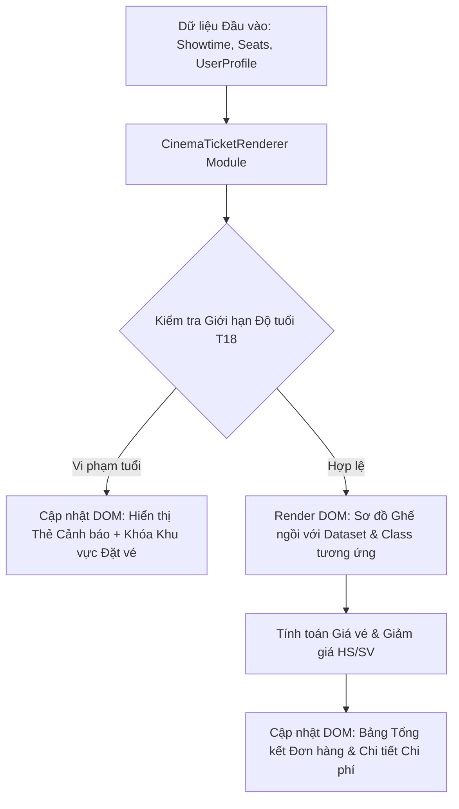

# Bài tập 15: EdTech (Mức độ 5: Sáng tạo - Thiết kế Mini Module)

### 1. Mục tiêu bài tập
- **Khả năng thiết kế Module:** Xây dựng mini-module JavaScript (`CinemaTicketRenderer`) theo kiến trúc hướng đối tượng hoặc module pattern để quản lý toàn bộ luồng render và truy xuất DOM của hệ thống bán vé rạp phim.
- **Thao tác DOM nâng cao (Không dùng Event):** Thành thạo truy xuất danh sách element (`querySelectorAll`, `getElementsByClassName`), thay đổi nội dung HTML (`innerHTML`, `textContent`), điều chỉnh thuộc tính nâng cao (`dataset`, `classList`, `setAttribute`, `style`).
- **Xử lý logic nghiệp vụ EdTech / Enterprise:** Áp dụng công thức tính giá vé nâng cao, xử lý phân loại ghế (Thường, VIP), chính sách ưu đãi Học sinh/Sinh viên và ràng buộc kiểm soát độ tuổi khán giả xem phim T18 ngay trên DOM.

---


### 2. Bối cảnh & Mô tả bài toán
Bạn là Senior Frontend Developer tại hệ thống rạp chiếu phim **CGV/Lotte Cinema**. Bộ phận nghiệp vụ đang yêu cầu xây dựng một Mini Module hiển thị giao diện đặt vé trực quan cho các suất chiếu rạp. Module này có nhiệm vụ nhận dữ liệu đầu vào (thông tin phim, danh sách ghế, thông tin khán giả) và tiến hành truy xuất, thao tác, cập nhật trực tiếp lên cây DOM của trang web.

Do phiên bản hiện tại tập trung vào core rendering logic (chưa đến giai đoạn bắt sự kiện người dùng), hệ thống yêu cầu module phải hoạt động thông qua việc gọi các phương thức programmatic render, cập nhật trạng thái DOM chính xác theo từng tập dữ liệu thử nghiệm.



---


### 3. Quy tắc nghiệp vụ (Business Rules)

1. **Phân loại Ghế & Giá cơ bản:**
   - Ghế Thường (`STANDARD`): Giá niêm yết suất chiếu (`basePrice`).
   - Ghế VIP (`VIP`): Giá niêm yết suất chiếu + `15.000 VNĐ` phụ thu.
   - Ghế Đôi (`COUPLE`): Giá niêm yết x 2 + `30.000 VNĐ` phụ thu.

2. **Chính sách Ưu đãi Khán giả (Audience Category):**
   - Nếu `audienceCategory === "STUDENT"` và suất chiếu rơi vào ngày thường (`isWeekday === true`): Giảm giá `20%` trên **tổng giá ghế gốc** (không tính phụ thu ghế đôi/VIP nếu có, hoặc tính 20% tổng giá vé tùy theo công thức áp dụng: *Áp dụng 20% giảm trên tổng tiền ghế trước VAT*).

3. **Ràng buộc Độ tuổi (Age Restrictions Guard):**
   - Nếu mác phim là `"T18"` và tuổi khán giả (`userAge`) `< 18`:
     - Thêm class `restricted-mode` vào container chính (`#booking-app`).
     - Hiển thị khối cảnh báo lỗi `#age-warning-banner` với nội dung: `"CẢNH BÁO: Phim gắn mác T18 - Khán giả không đủ 18 tuổi không thể đặt vé!"`.
     - Disable toàn bộ danh sách ghế trên giao diện bằng thuộc tính `aria-disabled="true"` và class `seat-disabled`.

4. **Định dạng Tiền tệ & Dataset:**
   - Tất cả giá tiền hiển thị ra DOM phải được định dạng chuẩn Việt Nam Đồng (ví dụ: `115.000 VNĐ`).
   - Mỗi element ghế ngồi được sinh ra phải lưu giữ thông tin qua `data-*` attribute: `data-seat-id`, `data-seat-type`, `data-price`.

---


### 4. Yêu cầu kỹ thuật & Triển khai


#### 4.1. Phạm vi Công nghệ & Ràng buộc Kỹ thuật
- **ĐƯỢC PHÉP:** Thuần HTML5, CSS3, JavaScript ES6+ (Manipulating DOM via `querySelector`, `querySelectorAll`, `getElementById`, `innerHTML`, `textContent`, `classList`, `dataset`, `setAttribute`).
- **NGHÊM CẤM:** Không dùng `addEventListener`, không dùng event attributes (`onclick`, `onchange`), không dùng `fetch`/`axios`, không dùng `localStorage`/`sessionStorage`, không dùng thư viện ngoài (jQuery, React, v.v.).


#### 4.2. Cấu trúc HTML ban đầu (`index.html`)
Khung HTML mẫu để sinh viên nhúng script thao tác DOM:
```html
<!DOCTYPE html>
<html lang="vi">
<head>
    <meta charset="UTF-8">
    <title>CGV Cinema Ticket System</title>
    <link rel="stylesheet" href="styles.css">
</head>
<body>
    <div id="booking-app">
        <!-- Khối hiển thị cảnh báo tuổi -->
        <div id="age-warning-banner" class="hidden"></div>

        <!-- Thông tin Phim & Suất chiếu -->
        <header id="movie-header">
            <h1 id="movie-title">--</h1>
            <p id="movie-meta">--</p>
        </header>

        <!-- Sơ đồ ghế ngồi -->
        <main id="cinema-hall">
            <div id="screen">MÀN HÌNH CHIẾU</div>
            <div id="seat-matrix"></div>
        </main>

        <!-- Khối thống kê giá tiền & Vé chọn -->
        <footer id="order-summary-card">
            <h3>Chi tiết Đặt vé</h3>
            <p>Danh sách ghế: <span id="selected-seats-list">Chưa chọn</span></p>
            <p>Tổng tiền gốc: <span id="original-price">0 VNĐ</span></p>
            <p>Ưu đãi HSSV: <span id="discount-amount">0 VNĐ</span></p>
            <p class="total">Tổng thanh toán: <span id="final-price">0 VNĐ</span></p>
        </footer>
    </div>
    
    <script src="js/cinema-renderer.js"></script>
    <script src="js/app.js"></script>
</body>
</html>
```


#### 4.3. Thiết kế Mini Module `CinemaTicketRenderer` (`js/cinema-renderer.js`)
Sinh viên tạo một Module hoặc Class có các phương thức công khai sau:

1. `init(configSelectors)`: Khởi tạo và lưu lại các tham chiếu DOM element cần thiết (DOM Caching).
2. `renderMovieHeader(showtimeData)`:
   - Nhận vào object chứa: `{ title, ageRating, duration, isWeekday, basePrice }`.
   - Cập nhật textContent và innerHTML cho `#movie-title` và `#movie-meta`. Ví dụ `#movie-meta`: `120 phút | Ngày thường | Mác phim: T18`.
3. `renderSeatMatrix(rowsData)`:
   - Nhận vào mảng dữ liệu danh sách ghế (ví dụ: `[{ id: "A1", type: "STANDARD", status: "BOOKED" }, ...]`).
   - Xóa trắng `#seat-matrix` và dùng loop để tạo/cập nhật HTML các ô ghế.
   - Gắn class tương ứng: `.seat`, `.seat-vip`, `.seat-couple`, `.seat-booked`.
   - Gắn thuộc tính dataset: `data-seat-id`, `data-seat-type`, `data-price`.
4. `renderOrderSummary(selectedSeatIds, audienceCategory, showtimeData)`:
   - Truy xuất thông tin các ghế đang được chọn (`selectedSeatIds`).
   - Tính toán tổng giá gốc, tiền giảm giá (nếu là STUDENT vào `isWeekday`), và tổng thanh toán cuối cùng.
   - Cập nhật thông số lên các span: `#selected-seats-list`, `#original-price`, `#discount-amount`, `#final-price`.
5. `applyAgeGuard(userAge, ageRating)`:
   - Kiểm tra điều kiện tuổi. Nếu vi phạm, thao tác DOM hiển thị banner cảnh báo và khóa giao diện như mô tả ở phần Quy tắc nghiệp vụ.

---


### 5. Quy chuẩn nộp bài

- **Cấu trúc thư mục dự án:**
  ```text
  student-id_homework15/
  ├── index.html
  ├── styles.css
  └── js/
      ├── cinema-renderer.js
      └── app.js
  ```
- **Quy định file script:**
  - `cinema-renderer.js`: Định nghĩa Module / Class `CinemaTicketRenderer`.
  - `app.js`: Chứa dữ liệu giả lập (Mock Data) và các lời gọi hàm thực thi kiểm thử module.
- **Nộp bài:** Nén thư mục thành file `.zip` đặt tên dạng `NV0123_NguyenVanA_HW15.zip`.

### Tiêu chuẩn Đánh giá & Thang điểm (100đ)

| Tiêu chí | Điểm tối đa | Mô tả chi tiết |
| :--- | :--- | :--- |
| **Cấu trúc & Architecture Module** | 20đ | - Thiết kế Module/Class rõ ràng, encapsulated tốt.<br>- Sử dụng DOM Caching (truy xuất DOM 1 lần trong `init`, lưu biến references).<br>- Không vi phạm scope cấm (Không dùng Event Listeners, Fetch API, LocalStorage). |
| **Xử lý Logic Nghiệp vụ & Giá vé** | 40đ | - Tính chính xác giá ghế VIP (+15k), Ghế Đôi (x2 + 30k).<br>- Tính chuẩn 20% giảm giá cho HS/SV trong ngày thường.<br>- Định dạng tiền tệ VND chuẩn xác (ví dụ: `150.000 VNĐ`). |
| **Thao tác DOM & Kiểm soát T18** | 20đ | - Render đúng cấu trúc sơ đồ ghế kèm theo `dataset` (`data-seat-id`, `data-seat-type`, `data-price`).<br>- Xử lý kiểm soát tuổi T18 đúng yêu cầu (thêm class `restricted-mode`, cập nhật banner cảnh báo, đặt thuộc tính `aria-disabled`). |
| **Xử lý Biên & Mã nguồn Clean Code** | 20đ | - Đọc/ghi thuộc tính DOM an toàn, xử lý danh sách ghế trống hoặc ID không tồn tại.<br>- Đặt tên biến/hàm chuẩn CamelCase, mã nguồn viết bằng tiếng Anh/Việt sạch đẹp, comment giải thích logic đầy đủ. |