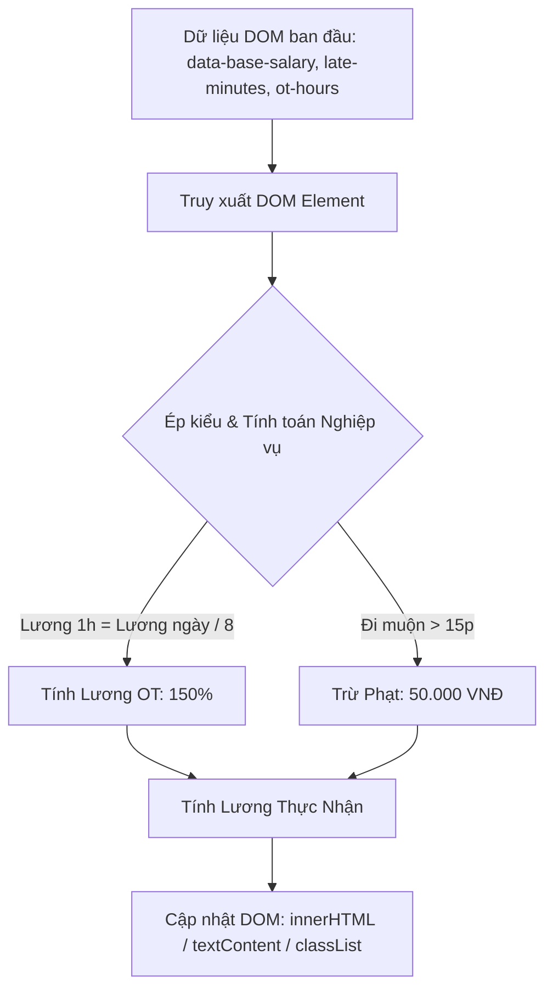

# Bài tập 3: FinTech (Mức độ 1: Cơ bản - Debug lỗi)

### 1. Mục tiêu bài tập
- **Phát hiện và sửa lỗi DOM Selection:** Phân biệt chính xác giữa `getElementById`, `querySelector`, và `getElementsByClassName` (hiểu rõ sự khác biệt giữa phần tử đơn lẻ và `HTMLCollection`).
- **Thao tác đọc/ghi thuộc tính và nội dung DOM:** Phân biệt và sử dụng đúng các thuộc tính `textContent`, `innerHTML`, `getAttribute` thay vì sử dụng sai thuộc tính `.value` trên các thẻ non-input (`div`, `span`).
- **Xử lý ép kiểu dữ liệu tài chính:** Chuyển đổi dữ liệu chuỗi (`string`) thu thập từ DOM sang kiểu số (`number`) để thực hiện các phép toán tính lương, tiền phạt và định dạng tiền tệ Việt Nam (`VNĐ`).
- **Thao tác Class và Style linh hoạt:** Sử dụng `classList` để thay đổi trạng thái hiển thị của phần tử DOM theo quy tắc nghiệp vụ chấm công.

---


### 2. Bối cảnh & Mô tả bài toán
Bạn là một Kỹ sư Phần mềm tại công ty FinTech chuyên phát triển hệ thống **HRM (Human Resource Management)**. Bạn được giao nhiệm vụ khắc phục lỗi trên giao diện **"Phiếu Chấm Công & Tính Lương Ngày"** của nhân viên thuộc hệ thống `HR_ATTENDANCE`.

Hiện tại, trang web hiển thị bảng chấm công của nhân viên đang gặp lỗi nghiêm trọng do lập trình viên cũ truy xuất và thao tác DOM sai cách:
- Tiền phạt đi muộn không cập nhật được.
- Tổng lương thực nhận hiển thị ra chữ `undefined` hoặc lỗi chuỗi.
- Thẻ cảnh báo vi phạm đi muộn bị hiển thị nguyên văn đoạn mã HTML dạng thô (`<strong class="...">...</strong>`) ra màn hình thay vì render giao diện.



Nhiệm vụ của bạn là kiểm tra mã nguồn `index.html` và `app.js`, **tìm ra 4 lỗi sai về DOM**, giải thích nguyên nhân và viết lại mã JavaScript chính xác.

---


### 3. Quy tắc nghiệp vụ (Business Rules)
1. **Lương cơ bản theo giờ:** 
   $$\text{Lương 1 giờ tiêu chuẩn} = \frac{\text{Lương cơ bản ngày}}{8}$$
2. **Quy tắc phạt đi muộn (Late Penalty):**
   - Số phút đi muộn (`lateMinutes`) lấy từ phần tử `.late-minutes`.
   - Nếu `lateMinutes > 15`: Tiền phạt = `50,000 VNĐ`. Đồng thời phần tử `#penalty-status` phải hiển thị thẻ cảnh báo HTML `<strong class="alert-tag">CẢNH BÁO: ĐI MUỘN TRỪ 50.000 VNĐ</strong>` và thêm class CSS `text-danger` vào `#penalty-status`.
   - Nếu `lateMinutes <= 15`: Tiền phạt = `0 VNĐ`, hiển thị text: `"Đúng giờ / Vi phạm trong phạm vi cho phép"`.
3. **Quy tắc tính lương OT ngày thường (Overtime Pay):**
   - Giờ làm ngoài giờ (`otHours`) lấy từ `#ot-hours`.
   $$\text{Lương OT} = \text{otHours} \times (\text{Lương 1 giờ tiêu chuẩn} \times 1.5)$$
4. **Tính Lương Thực Nhận (Net Salary):**
   $$\text{Lương Thực Nhận} = \text{Lương cơ bản ngày} + \text{Lương OT} - \text{Tiền phạt}$$
5. **Quy chuẩn hiển thị:** Tất cả số tiền hiển thị lên giao diện (Lương OT, Lương thực nhận) phải được định dạng theo chuẩn tiền tệ Việt Nam (Ví dụ: `525,000 VNĐ` hoặc sử dụng `toLocaleString('vi-VN')`).

---


### 4. Yêu cầu kỹ thuật & Triển khai


#### Mã nguồn ban đầu (Cần Debug)

**File `index.html`:**
```html
<!DOCTYPE html>
<html lang="vi">
<head>
    <meta charset="UTF-8">
    <title>Phiếu Chấm Công & Tính Lương - HR_ATTENDANCE</title>
    <link rel="stylesheet" href="style.css">
</head>
<body>
    <div class="payroll-card">
        <h2>PHIẾU TÍNH LƯƠNG NGÀY</h2>
        <div id="emp-info" data-base-salary="400000">
            Nhân viên: <strong>Nguyễn Văn A (NV-8821)</strong>
        </div>
        
        <div class="attendance-detail">
            <p>Số phút đi muộn: <span class="late-minutes">20</span> phút</p>
            <p>Số giờ làm OT: <span id="ot-hours">2</span> giờ</p>
        </div>

        <div class="salary-summary">
            <p>Trạng thái phạt: <span id="penalty-status">Chưa cập nhật</span></p>
            <p>Tiền lương OT: <span id="ot-salary">0 VNĐ</span></p>
            <p class="total">LƯƠNG THỰC NHẬN: <span id="net-salary">0 VNĐ</span></p>
        </div>
    </div>

    <script src="app.js"></script>
</body>
</html>
```

**File `app.js` (Mã nguồn chứa lỗi):**
```javascript
// =========================================================
// MÃ NGUỒN ĐANG BỊ LỖI - HỌC VIÊN CẦN DEBUG VÀ SỬA LẠI
// =========================================================

// LỖI 1: Truy xuất số phút đi muộn
var lateMinutesEl = document.getElementsByClassName('late-minutes');
var lateMinutes = lateMinutesEl.textContent; 

// LỖI 2: Đọc thuộc tính lương cơ bản và giờ OT
var baseSalaryAttr = document.getElementById('emp-info').getAttribute('data-base-salary');
var otHoursText = document.getElementById('ot-hours').textContent;

// Tính toán nghiệp vụ
var baseSalary = baseSalaryAttr; // Chưa ép kiểu số
var otHours = otHoursText;       // Chưa ép kiểu số

var hourlyWage = baseSalary / 8;
var otSalary = otHours * hourlyWage * 1.5;

var penalty = 0;
var penaltyStatusEl = document.getElementById('penalty-status');

// LỖI 3: Hiển thị thẻ HTML cảnh báo phạt
if (lateMinutes > 15) {
    penalty = 50000;
    penaltyStatusEl.textContent = '<strong class="alert-tag">CẢNH BÁO: ĐI MUỘN TRỪ 50.000 VNĐ</strong>';
    penaltyStatusEl.classList.add('text-danger');
} else {
    penaltyStatusEl.textContent = 'Đúng giờ / Vi phạm trong phạm vi cho phép';
}

var netSalary = baseSalary + otSalary - penalty;

// LỖI 4: Gán kết quả vào phần tử hiển thị tổng lương
var otSalaryEl = document.getElementById('ot-salary');
var netSalaryEl = document.getElementById('net-salary');

otSalaryEl.textContent = otSalary.toLocaleString('vi-VN') + ' VNĐ';
netSalaryEl.value = netSalary.toLocaleString('vi-VN') + ' VNĐ';
```

---


#### Yêu cầu chi tiết của bài tập:

1. **Báo cáo Lỗi (Debug Report):**
   - Viết phần ghi chú (Comment) ở đầu file `app.js` chỉ rõ **4 vị trí dòng mã bị lỗi**, giải thích **nguyên nhân kỹ thuật** vì sao lỗi xảy ra.
2. **Khắc phục Lỗi (Code Fix):**
   - Sửa Lỗi 1: Truy xuất đúng phần tử từ `getElementsByClassName` hoặc đổi sang dùng `querySelector`.
   - Sửa Lỗi 2: Thực hiện ép kiểu dữ liệu từ `String` sang `Number` (sử dụng `Number()` hoặc `parseInt()`) trước khi thực hiện các phép toán.
   - Sửa Lỗi 3: Sử dụng thuộc tính thích hợp (`innerHTML`) để render thẻ HTML cảnh báo thay vì `textContent`.
   - Sửa Lỗi 4: Thay thế `.value` bằng thuộc tính DOM đúng để cập nhật nội dung hiển thị cho thẻ `<span>` (`#net-salary`).
3. **Kết quả đầu ra mong đợi trên giao diện:**
   - Số phút đi muộn đọc được: `20`.
   - Lương cơ bản ngày: `400,000 VNĐ` $\rightarrow$ Lương 1 giờ: `50,000 VNĐ`.
   - Lương OT (2 giờ): $2 \times 50,000 \times 1.5 = 150,000\text{ VNĐ}$.
   - Phạt đi muộn (20 phút > 15 phút): `50,000 VNĐ`.
   - Lương thực nhận: $400,000 + 150,000 - 50,000 = 500,000\text{ VNĐ}$.
   - Trạng thái phạt hiển thị dòng chữ in đậm đỏ: **CẢNH BÁO: ĐI MUỘN TRỪ 50.000 VNĐ**.

---


### 5. Quy chuẩn nộp bài
- Cấu trúc thư mục dự án:
  ```text
  student_id_session17_hw1/
  ├── index.html
  ├── style.css
  └── app.js
  ```
- File `app.js` phải chứa phần giải thích lỗi chi tiết trong khối comment `/* ... */` và phần mã nguồn đã được sửa hoàn chỉnh.
- **Ràng buộc:** Không sử dụng Event Listeners (`addEventListener`), không sử dụng Form Submit, Fetch API hay LocalStorage. Tất cả các thao tác DOM phải chạy trực tiếp ngay khi nạp xong script.

### Tiêu chuẩn Đánh giá & Thang điểm (100đ)

| Tiêu chí | Điểm tối đa | Mô tả chi tiết |
| :--- | :--- | :--- |
| **Cấu trúc & Báo cáo Debug** | 20đ | - Thư mục bài nộp đúng chuẩn quy định.<br>- Viết comment mô tả chính xác 4 lỗi kỹ thuật trong đoạn mã ban đầu, nêu rõ nguyên nhân gây ra lỗi. |
| **Xử lý Logic & Sửa Lỗi DOM** | 40đ | - Sửa đúng lỗi lấy phần tử từ `getElementsByClassName` hoặc dùng `querySelector` hợp lý (10đ).<br>- Ép kiểu dữ liệu `Number` chính xác trước khi tính toán tài chính (10đ).<br>- Phân biệt và dùng đúng `innerHTML` thay cho `textContent` khi chèn đoạn mã chứa thẻ HTML (10đ).<br>- Đổi thuộc tính `.value` thành `.textContent` hoặc `.innerText` cho thẻ `span` (10đ). |
| **Tính toán Nghiệp vụ FinTech** | 20đ | - Tính chính xác Lương 1 giờ tiêu chuẩn, Lương OT (150%) và Tiền phạt đi muộn theo đúng quy tắc nghiệp vụ (10đ).<br>- Định dạng số tiền chính xác theo chuẩn tiền tệ Việt Nam (`VNĐ`) (10đ). |
| **Thao tác Style & Hiệu năng** | 20đ | - Thao tác thêm class CSS (`classList.add('text-danger')`) hoạt động đúng (10đ).<br>- Mã nguồn sạch đẹp, biến đặt tên theo chuẩn camelCase, không có đoạn code thừa hoặc câu lệnh thừa gây ảnh hưởng hiệu năng DOM (10đ). |