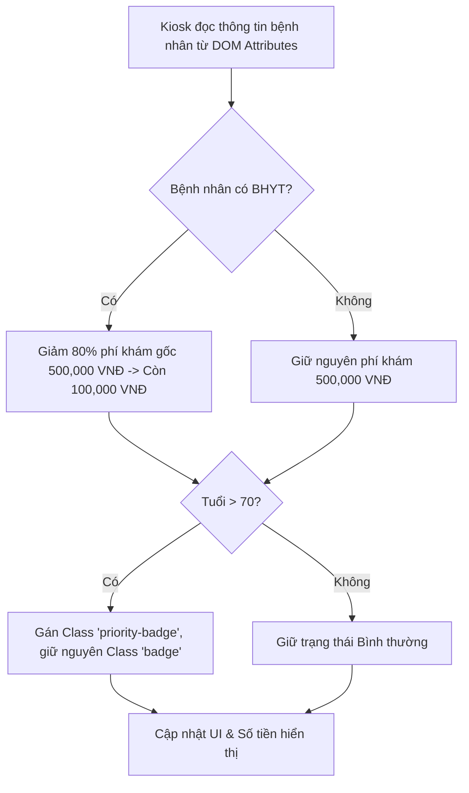

# Bài tập 3: FinTech (Mức độ 1: Cơ bản - Debug lỗi)

### 1. Mục tiêu bài tập
- **Xác định và khắc phục lỗi DOM Tree**: Nhận biết lỗi truy xuất phần tử DOM khi thẻ `<script>` được thực thi trước khi cây DOM hoàn tất khởi tạo (`null` / `undefined`).
- **Sử dụng đúng phương thức truy xuất DOM API**: Phân biệt và sửa lỗi khi thao tác với danh sách phần tử (`HTMLCollection` từ `getElementsByClassName`) so với phần tử đơn lẻ (`getElementById`).
- **Đọc và thay đổi thuộc tính/nội dung phần tử**: Sửa lỗi truy cập thuộc tính dữ liệu tùy biến (`data-*` attributes) và thay đổi nội dung text/CSS class của phần tử mà không phá vỡ giao diện sẵn có.
- **Thực thi đúng quy tắc tính toán tài chính (FinTech/HealthTech)**: Cập nhật chính xác số tiền thanh toán thực tế sau khi áp dụng chính sách giảm trừ Bảo hiểm Y tế (BHYT) cho bệnh nhân.

---


### 2. Bối cảnh & Mô tả bài toán
Tập đoàn Y tế FinTech **Rikkei MedTech** đang triển khai hệ thống Kiosk tự động cấp số và tính phí khám bệnh (`CLINIC_APPOINTMENT`). Khi bệnh nhân quét mã BHYT hoặc căn cước công dân tại Kiosk, hệ thống sẽ đọc các thông tin được lưu trong thuộc tính dữ liệu (`data-*`) của thẻ hiển thị, tự động tính toán tổng chi phí khám ban đầu, cấp số thứ tự và gắn nhãn ưu tiên cho bệnh nhân cao tuổi.

Tuy nhiên, lập trình viên thử việc vừa bàn giao một đoạn mã mã nguồn (HTML & JS) bị lỗi. Khi mở trang web, màn hình hoàn toàn không hiển thị được chi phí thanh toán, bị vỡ giao diện nhãn ưu tiên và báo lỗi trên Developer Console. 

Nhiệm vụ của bạn là **tìm lỗi (debug), giải thích nguyên nhân và sửa lại mã nguồn** để hệ thống vận hành đúng nghiệp vụ.



---


### 3. Quy tắc nghiệp vụ (Business Rules)
1. **Phí khám gốc (Base Fee)**: Được khai báo trong thuộc tính `data-base-fee` (mặc định 500,000 VNĐ).
2. **Khấu trừ BHYT**: 
   - Nếu thuộc tính `data-has-insurance="true"`, bệnh nhân được giảm **80%** phí khám ban đầu (chỉ thanh toán 20%).
   - Phí thanh toán = `baseFee * 0.2`.
   - Nếu `data-has-insurance="false"`, phí thanh toán = `baseFee`.
3. **Phân loại ưu tiên**: 
   - Nếu độ tuổi (`data-age`) **từ 70 tuổi trở lên** (`>= 70`), bệnh nhân được xếp vào luồng ưu tiên.
   - Thêm class CSS `priority-badge` vào phần tử nhãn trạng thái (không được xóa hoặc làm mất class `badge` ban đầu).
   - Đổi nội dung nhãn thành: `"Ưu tiên (Người cao tuổi)"`.
4. **Định dạng tiền tệ hiển thị**: Chuỗi hiển thị tổng tiền phải có đơn vị `"VNĐ"` phía sau (Ví dụ: `"100,000 VNĐ"` hoặc `"100000 VNĐ"`).

---


### 4. Yêu cầu kỹ thuật & Triển khai


#### 4.1. Mã nguồn hiện tại chứa lỗi (Đầu vào)

**File `index.html`**:
```html
<!DOCTYPE html>
<html lang="vi">
<head>
    <meta charset="UTF-8">
    <title>Hệ Thống Đặt Lịch & Thanh Toán Phí Khám</title>
    <!-- VỊ TRÍ NHÚNG SCRIPT CÓ LỖI -->
    <script src="main.js"></script>
    <style>
        .card { border: 1px solid #ccc; padding: 20px; width: 350px; font-family: Arial; }
        .badge { padding: 4px 8px; border-radius: 4px; background-color: #e0e0e0; font-size: 12px; }
        .priority-badge { background-color: #ff9800; color: white; font-weight: bold; }
    </style>
</head>
<body>
    <div id="appointment-card" class="card" data-age="75" data-has-insurance="true" data-base-fee="500000">
        <h2>Phiếu Đăng Ký Khám Bệnh</h2>
        <p>Bệnh nhân: <span class="patient-name">Nguyễn Văn An</span></p>
        <p>Số thứ tự: <span id="queue-number">---</span></p>
        <p>Đối tượng: <span id="priority-status" class="badge">Bình thường</span></p>
        <p>Chi phí gốc: <span id="base-fee">500,000 VNĐ</span></p>
        <p>Thực thu: <strong id="total-fee">0 VNĐ</strong></p>
    </div>
</body>
</html>
```

**File `main.js`**:
```javascript
// BUG 1 & BUG 2: Truy xuất DOM khi chưa tải xong HTML và sai kiểu dữ liệu Trả về
let patientNameElem = document.getElementsByClassName("patient-name");
patientNameElem.textContent = "Bệnh nhân: NGUYỄN VĂN AN (ĐÃ XÁC THỰC)";

// BUG 3: Đọc thuộc tính từ thẻ DIV bị sai phương thức
let cardElem = document.getElementById("appointment-card");
let age = cardElem.value; 

// BUG 4: Lấy dữ liệu thuộc tính custom và tính toán tiền tệ
let hasInsurance = cardElem.getAttribute("data-has-insurance") == true; 
let baseFee = cardElem.getAttribute("data-base-fee");

let finalFee = baseFee;
if (hasInsurance) {
    finalFee = baseFee * 0.2;
}

let totalFeeElem = document.getElementById("total-fee");
totalFeeElem.innerText = finalFee; 

// BUG 5: Thay đổi ClassName làm đứt gãy style giao diện gốc
let statusElem = document.getElementById("priority-status");
if (age >= 70) {
    statusElem.setAttribute("class", "priority-badge"); 
    statusElem.textContent = "Ưu tiên (Người cao tuổi)";
}
```

---


#### 4.2. Yêu cầu xử lý (Nhiệm vụ của học viên)

Học viên phải tạo 1 file `DEBUG_REPORT.md` (hoặc comment trực tiếp trong code) để giải thích **5 LỖI** trong mã nguồn trên và nộp lại bộ mã nguồn HTML/JS đã được sửa lỗi hoàn chỉnh:

1. **Lỗi 1 (Script Execution Order)**: Giải thích tại sao `document.getElementById` hoặc `getElementsByClassName` bị trả về `null` / không thể gán thuộc tính khi script đặt tại `<head>`. Sửa lại thẻ `<script>` bằng từ khóa phù hợp (không dùng Event Listener như `window.onload`).
2. **Lỗi 2 (HTMLCollection handling)**: Giải thích tại sao `patientNameElem.textContent` không hoạt động. Sửa lại cách truy xuất phần tử đầu tiên trong danh sách hoặc dùng phương thức selector phù hợp.
3. **Lỗi 3 & 4 (DOM Attributes & Type Conversion)**: 
   - Giải thích tại sao `cardElem.value` trả về `undefined`. Sửa thành cách lấy đúng bằng `.dataset` hoặc `getAttribute()`.
   - Chuyển đổi kiểu dữ liệu ép kiểu số (`parseInt`/`Number`) và so sánh chuỗi đúng cách cho `hasInsurance` (`"true"` thay vì `true`).
4. **Lỗi 5 (Class Manipulation)**: Giải thích tại sao dùng `setAttribute("class", "priority-badge")` lại làm mất viền/padding của nhãn (`.badge`). Sửa thành phương thức `classList.add()`.
5. **Cập nhật UI**: Cập nhật Số thứ tự (`#queue-number`) thành `"Q-008"` và Định dạng tổng tiền thu thực tế kèm chuỗi `" VNĐ"`.

---


### 5. Quy chuẩn nộp bài
- Cấu trúc thư mục nộp bài:
  ```text
  student_id_homework_03/
  ├── index.html
  ├── main.js
  └── DEBUG_REPORT.md (Mô tả chi tiết 5 lỗi & giải pháp)
  ```
- **Lưu ý nghiêm ngặt**: Không sử dụng `addEventListener`, `onload`, `submit`, `fetch`, hay `localStorage`. Chỉ thao tác thuần túy với DOM API cơ bản (truy xuất, đọc attribute, sửa textContent/innerText/classList) ngay khi script thực thi với từ khóa `defer`.

### Tiêu chuẩn Đánh giá & Thang điểm (100đ)

| Tiêu chí | Điểm tối đa | Mô tả chi tiết |
| :--- | :--- | :--- |
| **Phát hiện & Giải thích Lỗi (Debug Report)** | 20đ | Giải thích đúng nguyên nhân gây lỗi của cả 5 vị trí: Thứ tự load Script, HTMLCollection vs Element, `.value` trên Div, ép kiểu Attribute dữ liệu, ghi đè Class Attribute. |
| **Sửa lỗi Nhúng Script & Truy xuất DOM** | 20đ | Sử dụng đúng thuộc tính `defer` trên thẻ `<script>`. Truy xuất chính xác Element bằng `querySelector` hoặc truy cập đúng chỉ số `[0]` của `HTMLCollection`. |
| **Tính toán Nghiệp vụ BHYT & Chuyển đổi Dữ liệu** | 30đ | Ép kiểu dữ liệu `dataset` từ chuỗi sang số/boolean đúng chuẩn. Tính chính xác 80% giảm trừ BHYT (500,000 VNĐ -> 100,000 VNĐ). Cập nhật chuỗi kết quả có đơn vị "VNĐ". |
| **Thao tác Class & Cập nhật DOM Content** | 20đ | Dùng `classList.add("priority-badge")` giữ nguyên class `.badge`. Cập nhật đúng textContent cho nhãn ưu tiên và số thứ tự (`Q-008`). |
| **Cấu trúc Mã nguồn & Phong cách (Clean Code)** | 10đ | Code sạch vẽ đúng thụt lề, tên biến rõ nghĩa theo chuẩn camelCase, comment đầy đủ các bước xử lý. |