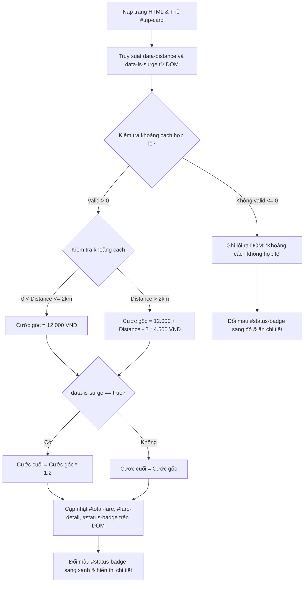

# Bài tập 4: GRAB_RIDE (Mức độ 2: Cơ bản - Kiểm thử I/O)

### 1. Mục tiêu bài tập
Sau khi hoàn thành bài tập này, học viên có thể:
- Truy xuất các phần tử DOM bằng các phương thức chuẩn (`document.getElementById`, `document.querySelector`, `document.querySelectorAll`).
- Trích xuất dữ liệu từ DOM thông qua `textContent`, `value`, và thuộc tính tùy biến `dataset` (`data-*`).
- Thực hiện tính toán logic nghiệp vụ cước phí chuyến đi trong hệ thống **GrabRide** dựa trên thông tin trích xuất.
- Thay đổi nội dung (`textContent`, `innerHTML`) và định dạng giao diện (`style`, `classList`) của DOM để hiển thị kết quả cho người dùng mà **không sử dụng Event Listener** (thực thi mã trực tiếp theo luồng nạp trang).

---


### 2. Bối cảnh & Mô tả bài toán
Trong hệ thống đặt xe công nghệ **GrabRide**, khi khách hàng hoàn tất việc nhập điểm đi và điểm đến, giao diện ứng dụng cần lập tức hiển thị thẻ tóm tắt chuyến đi (Ride Booking Card) chứa các thông tin như: Khoảng cách di chuyển, phụ phí thời tiết/giờ cao điểm, và tổng tiền cước phí dự kiến.

Bạn được giao nhiệm vụ viết một đoạn mã JavaScript chạy ở tầng Frontend để đọc các thông số cấu hình từ thuộc tính thẻ HTML (`data-*`), tiến hành tính toán cước phí chuyến đi theo đúng quy tắc nghiệp vụ của GrabRide, sau đó cập nhật trực tiếp kết quả hiển thị lên giao diện hiển thị thông tin cho hành khách.


#### Sơ đồ xử lý luồng dữ liệu (Data Flow Diagram)


---


### 3. Quy tắc nghiệp vụ (Business Rules)


#### A. Công thức tính cước phí (TripFare Calculation)
1. **Kiểm tra hợp lệ:** Khoảng cách di chuyển ($d$) phải là một số thực lớn hơn $0$.
   - Nếu $d \le 0$ hoặc không phải số (NaN): Coi là dữ liệu không hợp lệ.
2. **Cước phí cơ bản (Base Fare):**
   - $d \le 2\text{ km}$: Cước phí cố định = $12.000\text{ VNĐ}$.
   - $d > 2\text{ km}$: Cước phí = $12.000 + (d - 2) \times 4.500\text{ VNĐ}$.
3. **Phụ phí Giờ cao điểm / Thời tiết xấu (Surge Pricing):**
   - Nếu thẻ `#trip-card` có thuộc tính `data-is-surge="true"`, tổng cước phí sẽ nhân với hệ số $1.2$ ($+20\%$).
   - Kết quả cuối cùng làm tròn tròn thành số nguyên (`Math.round`).


#### B. Quy tắc cập nhật Giao diện (DOM Manipulation)
- **Nếu dữ liệu hợp lệ:**
  - Thẻ `#total-fare`: Hiển thị tổng tiền dạng chuỗi định dạng Việt Nam Đồng (Ví dụ: `"25.500 VNĐ"` hoặc sử dụng `.toLocaleString('vi-VN') + ' VNĐ'`).
  - Thẻ `#fare-detail`: Hiển thị chi tiết (Ví dụ: `"Cước cơ bản + Phụ phí 1.2x"` nếu có surge, hoặc `"Cước tiêu chuẩn"` nếu không có surge).
  - Thẻ `#status-badge`: Đổi nội dung thành `"Sẵn sàng đặt xe"`, gán class CSS `bg-success` (xóa class `bg-danger` nếu có) và chỉnh thuộc tính `style.color = "green"`.
- **Nếu dữ liệu KHÔNG hợp lệ:**
  - Thẻ `#total-fare`: Hiển thị `"0 VNĐ"`.
  - Thẻ `#fare-detail`: Hiển thị `"Dữ liệu khoảng cách không hợp lệ!"`.
  - Thẻ `#status-badge`: Đổi nội dung thành `"Lỗi dữ liệu"`, gán class CSS `bg-danger` (xóa class `bg-success` nếu có) và chỉnh thuộc tính `style.color = "red"`.

---


### 4. Yêu cầu kỹ thuật & Triển khai


#### Structure HTML ban đầu (Tham chiếu cho kiểm thử):
```html
<!DOCTYPE html>
<html lang="vi">
<head>
    <meta charset="UTF-8">
    <title>GrabRide - Tính Cước Chuyến Đi</title>
</head>
<body>
    <!-- Thẻ chứa dữ liệu đầu vào thông qua dataset -->
    <div id="trip-card" data-distance="5.5" data-is-surge="true">
        <h2>Thông Tin Chuyến Đi</h2>
        <p>Trạng thái: <span id="status-badge">Đang xử lý...</span></p>
        <p>Chi tiết: <span id="fare-detail">---</span></p>
        <p>Tổng tiền: <strong id="total-fare">0 VNĐ</strong></p>
    </div>

    <script src="script.js"></script>
</body>
</html>
```


#### Yêu cầu mã nguồn JavaScript (`script.js`):
1. **Truy xuất dữ liệu:**
   - Dùng `document.getElementById('trip-card')` để lấy thẻ chứa dữ liệu.
   - Trích xuất `distance` từ `dataset.distance` (ép kiểu về `parseFloat`).
   - Trích xuất `isSurge` từ `dataset.isSurge` (chú ý: `dataset` trả về string `"true"`/`"false"`).
2. **Hàm xử lý nghiệp vụ:**
   - Xây dựng hàm `calculateGrabFare(distance, isSurge)` trả về tổng số tiền cước dạng số.
3. **Thực thi và cập nhật DOM:**
   - Đọc dữ liệu $\rightarrow$ Gọi hàm tính toán $\rightarrow$ Cập nhật các element `#total-fare`, `#fare-detail`, `#status-badge`.


#### Bảng Kiểm Thử I/O (Test Cases for DOM Output):

| STT | Input DOM Attributes (`data-distance`, `data-is-surge`) | Output DOM `#total-fare` | Output DOM `#fare-detail` | Output DOM `#status-badge` (Text & Style) |
| :--- | :--- | :--- | :--- | :--- |
| **TC-01** | `data-distance="1.5"`, `data-is-surge="false"` | `12.000 VNĐ` | `Cước tiêu chuẩn` | `Sẵn sàng đặt xe` (color: green) |
| **TC-02** | `data-distance="5.0"`, `data-is-surge="false"` | `25.500 VNĐ` | `Cước tiêu chuẩn` | `Sẵn sàng đặt xe` (color: green) |
| **TC-03** | `data-distance="5.0"`, `data-is-surge="true"` | `30.600 VNĐ` | `Cước cơ bản + Phụ phí 1.2x` | `Sẵn sàng đặt xe` (color: green) |
| **TC-04** | `data-distance="-2"`, `data-is-surge="false"` | `0 VNĐ` | `Dữ liệu khoảng cách không hợp lệ!` | `Lỗi dữ liệu` (color: red) |
| **TC-05** | `data-distance="abc"`, `data-is-surge="true"` | `0 VNĐ` | `Dữ liệu khoảng cách không hợp lệ!` | `Lỗi dữ liệu` (color: red) |

---


### 5. Quy chuẩn nộp bài
- Cấu trúc thư mục dự án:
  ```text
  student-id_hw4/
  ├── index.html
  └── script.js
  ```
- Quy định đặt tên file: `index.html` và `script.js` đặt cùng cấp thư mục gốc.
- **Nghiêm cấm:** Không dùng `addEventListener`, không dùng `onclick` inline, không dùng jQuery, không dùng LocalStorage hoặc Fetch API.

### Tiêu chuẩn Đánh giá & Thang điểm (100đ)

| Tiêu chí | Điểm tối đa | Mô tả chi tiết |
| :--- | :--- | :--- |
| **Cấu trúc & Phong cách mã nguồn** | **20đ** | - Sử dụng đúng cú pháp DOM API (`getElementById`, `querySelector`).<br>- Đặt tên biến/hàm theo chuẩn `camelCase` (ví dụ: `calculateGrabFare`, `tripCard`).<br>- Định dạng code rõ ràng, có comment giải thích các bước thực hiện. |
| **Xử lý Logic đúng nghiệp vụ** | **40đ** | - Tính chuẩn cước phí 2 km đầu (12.000 VNĐ) và các km tiếp theo (4.500 VNĐ/km) (20đ).<br>- Áp dụng chính xác hệ số 1.2x khi `data-is-surge="true"` (10đ).<br>- Làm tròn số tiền chính xác và định dạng chuỗi VNĐ đúng quy định (10đ). |
| **Xử lý Biên & Ngoại lệ (I/O Validation)** | **20đ** | - Bắt lỗi thành công trường hợp `distance <= 0`, `NaN`, hoặc chuỗi không hợp lệ (10đ).<br>- Cập nhật đúng thông điệp lỗi và thay đổi style/class tương ứng trên DOM khi gặp dữ liệu lỗi (10đ). |
| **Tác động & Cập nhật DOM** | **20đ** | - Đọc dữ liệu đúng từ `dataset` của DOM (5đ).<br>- Cập nhật chính xác `textContent` / `innerHTML` cho thẻ `#total-fare` và `#fare-detail` (10đ).<br>- Thay đổi `style.color` hoặc `classList` đúng mô tả cho thẻ `#status-badge` (5đ). |