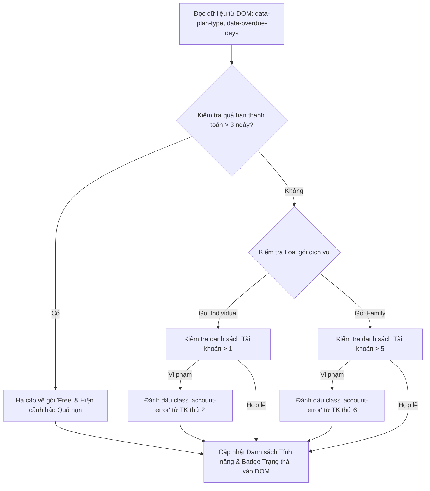

# Bài tập 5: CRM (Mức độ 2: Cơ bản - Kiểm thử I/O)

### 1. Mục tiêu bài tập
- **Truy xuất Element**: Sử dụng thành thạo các phương thức `document.getElementById()`, `document.querySelector()`, và `document.querySelectorAll()` để định vị phần tử HTML.
- **Thay đổi nội dung**: Sử dụng `textContent`, `innerText`, `innerHTML` để cập nhật dữ liệu động lên giao diện.
- **Thao tác thuộc tính & Class**: Sử dụng `setAttribute()`, `getAttribute()`, `classList` (`add`, `remove`, `toggle`), và thuộc tính `style` để thay đổi trạng thái hiển thị của thẻ DOM theo quy tắc nghiệp vụ.
- **Tư duy Kiểm thử I/O DOM**: Đọc dữ liệu đầu vào trực tiếp từ các thuộc tính dữ liệu (`data-* attributes`) của DOM, xử lý tính toán và xuất kết quả chính xác ra các phần tử DOM đích.

---


### 2. Bối cảnh & Mô tả bài toán
Bạn đang phát triển trang quản trị tài khoản (Subscription Management Dashboard) cho một nền tảng xem phim trực tuyến doanh nghiệp (SaaS Domain - Netflix/Spotify Model). Hệ thống cần tự động quét và kiểm tra thông tin gói dịch vụ của người dùng từ cấu trúc DOM HTML có sẵn, xử lý các logic hạ cấp gói khi quá hạn thanh toán, và cảnh báo vi phạm số lượng tài khoản/thiết bị sử dụng.


#### Sơ đồ luồng xử lý DOM (DOM Execution Flow)


---


### 3. Quy tắc nghiệp vụ (Business Rules)

Trang web có sẵn cấu trúc DOM với thẻ cha `#subscription-card` chứa các attribute dữ liệu:
- `data-plan-type`: Loại gói hiện tại (`"individual"`, `"family"`, hoặc `"free"`).
- `data-overdue-days`: Số ngày trễ hạn thanh toán (kiểu số, ví dụ: `0`, `2`, `4`).

Bằng việc truy xuất DOM và kiểm tra các thuộc tính trên, bạn cần áp dụng các quy tắc sau:

1. **Quy tắc 1: Hạ cấp do Quá hạn thanh toán (Payment Overdue)**
   - Nếu `data-overdue-days > 3`:
     - Tự động đổi nội dung tên gói (`#plan-name`) thành: `"Gói Miễn Phí (Free)"`.
     - Đổi nội dung thẻ badge trạng thái (`#status-badge`) thành: `"Đã hạ cấp (Overdue)"`.
     - Thêm lớp CSS `badge-danger` vào `#status-badge` (và xóa lớp `badge-success` nếu có).
     - Hiển thị phần tử `#warning-box` (bằng cách xóa thuộc tính `hidden` hoặc đổi style `display = "block"`), đồng thời cập nhật nội dung văn bản cho `#warning-message`: `"Tài khoản đã bị tự động hạ cấp về gói Miễn phí do trễ hạn thanh toán trên 3 ngày."`.
     - Coi như loại gói hiện tại bị chuyển thành `"free"`.

2. **Quy tắc 2: Giới hạn Tài khoản/Thiết bị theo Gói (Account Limit Verification)**
   - Đếm số lượng phần tử `li.account-item` nằm trong `#account-list`.
   - **Gói Individual**: Tối đa 1 tài khoản. Nếu số lượng > 1, tất cả phần tử `li.account-item` từ vị trí thứ 2 trở đi (chỉ số index >= 1) phải được thêm class `account-error`.
   - **Gói Family**: Tối đa 5 tài khoản. Nếu số lượng > 5, tất cả phần tử `li.account-item` từ vị trí thứ 6 trở đi (chỉ số index >= 5) phải được thêm class `account-error`.
   - **Gói Free**: Tối đa 1 tài khoản. Nếu số lượng > 1, áp dụng tương tự Gói Individual.

3. **Quy tắc 3: Cập nhật Danh sách Tính năng Dịch vụ (Feature Access Rendering)**
   Cập nhật cấu trúc HTML bên trong phần tử `#feature-list` (`innerHTML`) dựa vào loại gói sau cùng:
   - **Gói Free**:
     ```html
     <li>Phát nội dung chất lượng SD (480p)</li>
     <li>Tối đa 1 thiết bị phát tại một thời điểm</li>
     <li>Có chứa quảng cáo</li>
     ```
   - **Gói Individual**:
     ```html
     <li>Phát nội dung chất lượng Full HD (1080p)</li>
     <li>Tối đa 1 thiết bị phát tại một thời điểm</li>
     <li>Tải xuống 1 thiết bị ngoại tuyến</li>
     ```
   - **Gói Family**:
     ```html
     <li>Phát nội dung chất lượng Ultra HD (4K + HDR)</li>
     <li>Tối đa 5 thiết bị đồng thời</li>
     <li>Tải xuống không giới hạn trên các thiết bị</li>
     ```

---


### 4. Yêu cầu kỹ thuật & Triển khai


#### Cấu trúc HTML mẫu (`index.html`)
```html
<!DOCTYPE html>
<html lang="vi">
<head>
    <meta charset="UTF-8">
    <title>CRM SaaS Subscription Management</title>
    <style>
        .badge-success { background-color: #28a745; color: white; padding: 4px 8px; border-radius: 4px; }
        .badge-danger { background-color: #dc3545; color: white; padding: 4px 8px; border-radius: 4px; }
        .account-error { color: red; text-decoration: line-through; background-color: #ffe6e6; }
        .hidden { display: none; }
    </style>
</head>
<body>
    <div id="subscription-card" data-plan-type="family" data-overdue-days="4">
        <h2>Gói dịch vụ: <span id="plan-name">Gói Gia Đình</span></h2>
        <p>Trạng thái: <span id="status-badge" class="badge-success">Đang hoạt động</span></p>

        <div id="warning-box" class="hidden">
            <p id="warning-message"></p>
        </div>

        <h3>Danh sách tài khoản sử dụng (<span id="account-count">0</span>):</h3>
        <ul id="account-list">
            <li class="account-item">user1@gmail.com (Chủ tài khoản)</li>
            <li class="account-item">user2@gmail.com</li>
            <li class="account-item">user3@gmail.com</li>
            <li class="account-item">user4@gmail.com</li>
            <li class="account-item">user5@gmail.com</li>
            <li class="account-item">user6@gmail.com</li>
            <li class="account-item">user7@gmail.com</li>
        </ul>

        <h3>Quyền lợi gói dịch vụ:</h3>
        <ul id="feature-list">
            <!-- JS sẽ render vào đây -->
        </ul>
    </div>

    <script src="app.js"></script>
</body>
</html>
```


#### Yêu cầu Triển khai Code JavaScript (`app.js`)
Viết một hàm duy nhất có tên `renderSubscriptionDashboard()` và tự động gọi hàm này ngay khi script chạy. Hàm thực hiện các bước sau:

1. **Bước 1: Query DOM Elements**
   - Lấy `subscriptionCard` thông qua `document.getElementById('subscription-card')`.
   - Đọc thuộc tính `data-plan-type` và `data-overdue-days` bằng `getAttribute()` hoặc `dataset`.
   - Chuyển `data-overdue-days` về kiểu dữ liệu số (`Number` hoặc `parseInt`).

2. **Bước 2: Xử lý Hạ cấp (Overdue logic)**
   - Đọc biến trễ hạn, kiểm tra nếu `> 3` thì cập nhật tên gói, đổi class trạng thái badge, hiển thị `#warning-box` và cập nhật thông điệp cảnh báo.

3. **Bước 3: Kiểm tra giới hạn số lượng tài khoản**
   - Sử dụng `querySelectorAll('.account-item')` để lấy NodeList các phần tử tài khoản.
   - Cập nhật số lượng tổng cộng vào `#account-count` bằng `textContent`.
   - Duyệt qua NodeList bằng vòng lặp (`for` hoặc `forEach`), so sánh chỉ số index với hạn mức (Limit) của gói hiện tại để gắn thêm class `account-error` vào các phần tử bị vi phạm bằng `classList.add('account-error')`.

4. **Bước 4: Cập nhật danh sách quyền lợi (Feature List)**
   - Dựa trên gói sau khi đã tính toán logic hạ cấp, tạo chuỗi HTML tương ứng và gán cho `featureList.innerHTML`.

> **LƯU Ý NGHIÊM CẤM:** 
> - KHÔNG sử dụng `addEventListener`, KHÔNG dùng các sự kiện click/submit.
> - KHÔNG sử dụng `fetch()`, `axios`, `localStorage`.
> - Code JS chạy trực tiếp để kiểm thử kết quả trên cây DOM theo chuẩn Kiểm thử I/O.

---


### 5. Quy chuẩn nộp bài
- Cấu trúc thư mục dự án:
  ```text
  crm-subscription-dom/
  ├── index.html
  └── app.js
  ```
- Định dạng tập tin code mã nguồn: UTF-8 standard.
- Đặt tên biến và hàm theo chuẩn camelCase trong JavaScript (`renderSubscriptionDashboard`, `subscriptionCard`, `overdueDays`, v.v.).

### Tiêu chuẩn Đánh giá & Thang điểm (100đ)

| Tiêu chí | Điểm tối đa | Mô tả chi tiết |
| :--- | :--- | :--- |
| **Cấu trúc & Phong cách mã nguồn** | **20đ** | - Đặt tên biến/hàm đúng chuẩn camelCase, có ý nghĩa nghiệp vụ CRM (`planType`, `overdueDays`, `accountItems`).<br>- Thụt lề chuẩn (2 hoặc 4 spaces), mã nguồn sạch sẻ, có comment giải thích từng bước xử lý DOM.<br>- Không thừa code rác hoặc console.log dư thừa. |
| **Xử lý Logic đúng nghiệp vụ** | **40đ** | - Truy xuất chính xác thông tin từ `data-* attributes` (10đ).<br>- Xử lý đúng logic hạ cấp gói xuống "Free" khi trễ hạn > 3 ngày, hiển thị thông báo warning chính xác (15đ).<br>- Render chính xác HTML tính năng (`#feature-list`) dựa trên loại gói sau cùng (15đ). |
| **Xử lý Biên & Ngoại lệ** | **20đ** | - Đánh dấu đúng các phần tử tài khoản dư thừa bằng `classList.add('account-error')` theo từng loại gói (`family`: >5, `individual`/`free`: >1) (15đ).<br>- Cập nhật chính xác tổng số tài khoản lên `#account-count` (5đ). |
| **Tối ưu hiệu năng & DOM Manipulation** | **20đ** | - Chọn đúng phương thức truy xuất DOM (`getElementById` cho ID đơn lẻ, `querySelectorAll` cho danh sách phần tử) (10đ).<br>- Thao tác với class thông qua `classList` thay vì nối chuỗi `className` thủ công; hiển thị/ẩn element bằng thuộc tính `hidden` hoặc `classList` hợp lý (10đ). |