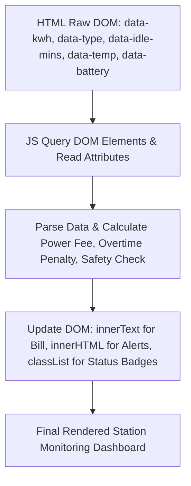

# Bài tập 6: EdTech (Mức độ 2: Cơ bản - Kiểm thử I/O)

### 1. Mục tiêu bài tập
- **Truy xuất DOM Element:** Sử dụng thành thạo các phương thức `document.getElementById()`, `document.querySelector()`, và `document.querySelectorAll()` để tương tác với cây DOM.
- **Trích xuất dữ liệu:** Biết cách đọc dữ liệu từ thuộc tính HTML (`getAttribute`, `dataset`) và nội dung văn bản (`innerText`, `textContent`).
- **Xử lý tính toán & Cập nhật DOM:** Thực thi logic nghiệp vụ tính toán chi phí, sau đó cập nhật thông tin hiển thị và thay đổi định dạng giao diện (`innerHTML`, `innerText`, `classList`, `setAttribute`) mà **không sử dụng Event Listener**.
- **Tư duy kiểm thử I/O:** Hiểu rõ đầu vào (Input từ DOM) và đầu ra (Output cập nhật ngược lại DOM) theo chuẩn kiểm thử tự động.

---


### 2. Bối cảnh & Mô tả bài toán
Hệ thống **VinFast EV Charging Station Management** đang nâng cấp màn hình giám sát thời gian thực tại trạm sạc. Mỗi cổng sạc (ChargingPort) kết nối với một phiên sạc (VehicleSession). Do lỗi từ hệ thống nhúng, giao diện hiện tại chỉ hiển thị mã HTML chứa dữ liệu thô (raw data) lưu giữ dưới dạng `data-* attributes`.

Nhiệm vụ của bạn là viết script JavaScript thực thi ngay khi tải trang để:
1. Đọc thông số kỹ thuật và chỉ số điện năng từ DOM.
2. Áp dụng quy tắc nghiệp vụ để tính phí sạc, phí quá giờ và kiểm tra trạng thái an toàn nhiệt độ/mức pin.
3. Cập nhật kết quả chi tiết lên bảng hiển thị hóa đơn (ChargingInvoice) và thẻ trạng thái trạm sạc.



---


### 3. Quy tắc nghiệp vụ (Business Rules)

1. **Đơn giá sạc điện năng (`ChargingInvoice`):**
   - Sạc thường (`STANDARD`): **3.850 VNĐ / kWh**.
   - Sạc siêu nhanh (`SUPER_FAST`): **4.500 VNĐ / kWh**.
   - *Công thức:* `Tiền sạc = kWh * Đơn giá`

2. **Phí phạt quá giờ (`Overtime Penalty`):**
   - Xe sạc đầy nhưng vẫn chiếm vị trí tại cổng sạc:
     - Thời gian chờ (idle time) $\le 30$ phút: **0 VNĐ** (Miễn phí 30 phút đầu).
     - Thời gian chờ $> 30$ phút: Phạt **1.000 VNĐ / phút** cho số phút vượt quá 30 phút.
   - *Công thức:* `Phí phạt = (Số phút đỗ - 30) * 1000` (Nếu `Số phút đỗ > 30`).

3. **Tổng hóa đơn (`Total Amount`):**
   - `Tổng thanh toán = Tiền sạc + Phí phạt quá giờ`.
   - Tất cả giá trị tiền tệ hiển thị trên giao diện phải được định dạng theo chuẩn Việt Nam (Ví dụ: `154.000 VNĐ`).

4. **Quy tắc an toàn & Trạng thái ngắt sạc (`Safety & Status Check`):**
   - Tự động chuyển trạng thái cổng sạc sang **"ĐÃ NGẮT SẠC (TỰ ĐỘNG)"** nếu xảy ra 1 trong 2 trường hợp:
     - Mức pin (`batteryLevel`) $\ge 100\%$.
     - Nhiệt độ cổng sạc (`temperature`) $> 70^\circ\text{C}$.
   - Ngược lại: Trạng thái là **"ĐANG SẠC"**.
   - **Định dạng màu sắc (CSS Class):**
     - Trạng thái "ĐÃ NGẮT SẠC (TỰ ĐỘNG)": Gán class `status-danger` cho phần tử thẻ trạng thái và hiển thị đoạn cảnh báo màu đỏ (`#safety-alert`).
     - Trạng thái "ĐANG SẠC": Gán class `status-success` cho phần tử thẻ trạng thái và ẩn/xóa đoạn cảnh báo.

---


### 4. Yêu cầu kỹ thuật & Triển khai


#### 4.1. Mã HTML ban đầu (`index.html`)
Giữ nguyên cấu trúc HTML bên dưới, không thay đổi thẻ HTML:

```html
<!DOCTYPE html>
<html lang="vi">
<head>
    <meta charset="UTF-8">
    <title>VinFast EV Charging Station</title>
    <link rel="stylesheet" href="style.css">
</head>
<body>
    <div class="container">
        <h1>TRẠM SẠC XE ĐIỆN VINFAST - CỔNG #04</h1>
        
        <!-- Element chứa dữ liệu thô đầu vào -->
        <div id="session-data" 
             data-kwh="40.5" 
             data-charging-type="SUPER_FAST" 
             data-idle-minutes="45" 
             data-battery="100" 
             data-temp="74.5">
        </div>

        <!-- Dashboard hiển thị kết quả -->
        <div class="dashboard shadow">
            <div class="card">
                <h3>Trạng Thái Cổng Sạc</h3>
                <div id="charging-status" class="badge">Đang khởi tạo...</div>
                <div id="safety-alert" class="alert-box"></div>
            </div>

            <div class="card">
                <h3>Chi Tiết Hóa Đơn (ChargingInvoice)</h3>
                <p>Loại sạc: <span id="display-type">---</span></p>
                <p>Điện năng tiêu thụ: <span id="display-kwh">---</span> kWh</p>
                <p>Tiền sạc: <span id="power-cost">---</span></p>
                <p>Thời gian chiếm chỗ: <span id="display-idle">---</span> phút</p>
                <p>Phí phạt quá giờ: <span id="overtime-fee">---</span></p>
                <hr>
                <h4>TỔNG CHÍNH THỨC: <span id="total-bill">---</span></h4>
            </div>
        </div>
    </div>
    <script src="script.js"></script>
</body>
</html>
```


#### 4.2. Yêu cầu mã JavaScript (`script.js`)
- Viết mã xử lý tự động chạy ngay khi file `script.js` được nạp.
- Thực hiện trích xuất toàn bộ `data-*` từ `#session-data`.
- Chuyển đổi kiểu dữ liệu (String sang Number) và kiểm soát các trường hợp dữ liệu bị khuyết/lỗi (ví dụ: `NaN`, âm). Nếu dữ liệu lỗi, mặc định gán giá trị an toàn là `0`.
- Đổi loại sạc `SUPER_FAST` thành chuỗi hiển thị `"Sạc siêu nhanh (4.500đ/kWh)"`, `STANDARD` thành `"Sạc thường (3.850đ/kWh)"`.
- Cập nhật đúng các thẻ target `#display-type`, `#display-kwh`, `#power-cost`, `#display-idle`, `#overtime-fee`, `#total-bill`, `#charging-status`, `#safety-alert`.
- **RÀNG BUỘC PHẠM VI:** 
  - **TUYỆT ĐỐI KHÔNG** dùng `addEventListener`, `onclick`, `onsubmit`.
  - **TUYỆT ĐỐI KHÔNG** dùng `fetch`, `axios`, `localStorage`, `sessionStorage`.
  - Chỉ sử dụng thuần túy DOM API nâng cao của Session 17 (`querySelector`, `getElementById`, `innerText`, `innerHTML`, `setAttribute`, `classList`).

---


### 5. Quy chuẩn nộp bài
- **Cấu trúc thư mục:**
  ```text
  ex06_ev_charging/
  ├── index.html
  ├── style.css
  └── script.js
  ```
- **Quy định đặt tên:**
  - File JS xử lý chính: `script.js`.
  - Các biến lưu trữ DOM Element phải dùng tiền tố `el` hoặc danh từ gợi nhớ (VD: `sessionDataEl`, `totalBillEl`).
  - Đóng gói logic vào các hàm thuần túy (pure functions) để hỗ trợ kiểm thử I/O (VD: `calculatePowerCost(kwh, type)`, `calculateOvertimeFee(minutes)`).

### Tiêu chuẩn Đánh giá & Thang điểm (100đ)

| Tiêu chí | Điểm tối đa | Mô tả chi tiết |
| :--- | :--- | :--- |
| **Cấu trúc & Phong cách mã nguồn** | **20đ** | - Đặt tên biến/hàm theo chuẩn camelCase, thể hiện rõ ngữ nghĩa domain VinFast EV Charging.<br>- Tách bạch rõ ràng giữa bước: Read Input -> Process Logic -> Write Output (DOM UI).<br>- Có comment giải thích các bước tính toán theo Business Rules. |
| **Xử lý Logic đúng nghiệp vụ** | **40đ** | - Đọc chính xác 5 tham số đầu vào từ `data-*` attributes (`data-kwh`, `data-charging-type`, `data-idle-minutes`, `data-battery`, `data-temp`).<br>- Tính chuẩn đơn giá Sạc thường / Sạc siêu nhanh.<br>- Tính chính xác phí phạt đỗ xe quá 30 phút.<br>- Tính đúng tổng hóa đơn và hiển thị định dạng chuẩn tiền tệ VNĐ (`toLocaleString('vi-VN')`). |
| **Xử lý Biên & Ngoại lệ** | **20đ** | - Xử lý trường hợp `idle-minutes` $\le 30$ (Phí phạt bằng 0 VNĐ).<br>- Chuyển đổi dữ liệu từ String sang Number an toàn (dùng `parseFloat`, `parseInt` kết hợp `isNaN` check).<br>- Xử lý trường hợp nhiệt độ vượt ngưỡng ($> 70^\circ\text{C}$) hoặc pin đầy ($\ge 100\%$) để kích hoạt chế độ tự động ngắt sạc. |
| **Thao tác DOM API & Chuẩn I/O** | **20đ** | - Thao tác DOM chuẩn xác bằng `getElementById` / `querySelector`.<br>- Thay đổi style/cảnh báo bằng `classList.add()` / `classList.remove()` hoặc `innerHTML`.<br>- Không vi phạm phạm vi cấm (Không dùng Event Listeners, Fetch API, LocalStorage). |