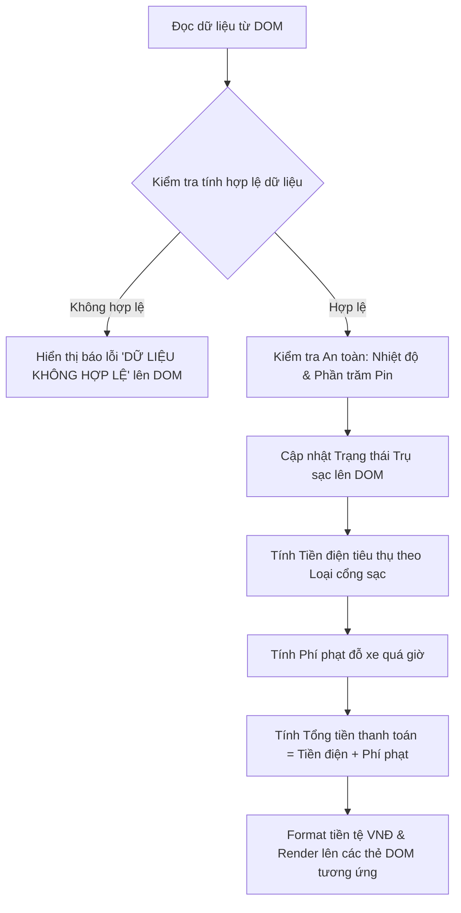

# Bài tập 6: EdTech (Mức độ 2: Cơ bản - Kiểm thử I/O)

### 1. Mục tiêu bài tập
- **Truy xuất DOM Element**: Thành thạo việc sử dụng các phương thức như `document.getElementById()`, `document.querySelector()` để lấy dữ liệu từ các phần tử HTML trên giao diện hệ thống.
- **Biến đổi & Thay đổi Nội dung DOM**: Làm chủ việc cập nhật dữ liệu hiển thị bằng `textContent`, `innerText`, `innerHTML`, cũng như thao tác với lớp CSS (`classList.add`, `classList.remove`, `classList.setAttribute`).
- **Xử lý Logic & Đọc hiểu Nghiệp vụ**: Áp dụng quy tắc tính phí dịch vụ sạc xe điện, phí phạt đỗ xe quá giờ và kiểm soát an toàn cổng sạc để tự động tính toán và cập nhật giao diện hóa đơn.
- **Kiểm thử I/O cơ bản**: Đảm bảo chương trình đọc chính xác dữ liệu đầu vào (Input) từ DOM, xử lý và xuất kết quả (Output) chuẩn xác lên các phần tử DOM tương ứng mà không cần tương tác sự kiện nâng cao.

---


### 2. Bối cảnh & Mô tả bài toán
Hệ thống Quản lý Trạm sạc Xe điện VinFast (**EV_CHARGING_STATION**) cần một module cập nhật nhanh trạng thái phiên sạc và tính toán hóa đơn thanh toán cho khách hàng ngay sau khi phiên sạc hoàn tất hoặc bị ngắt tự động.

Nhiệm vụ của bạn là viết một tệp JavaScript đóng vai trò xử lý tự động khi màn hình giao diện báo cáo phiên sạc (`VehicleSession`) được tải. Mã nguồn sẽ đọc các thông số vận hành của trụ sạc từ giao diện HTML (loại cổng sạc, điện năng tiêu thụ, thời gian đỗ quá giờ, nhiệt độ cổng sạc, phần trăm pin), tính toán chi tiết tiền điện và tiền phạt, kiểm tra điều kiện an toàn, sau đó cập nhật thông tin tương ứng lên các thẻ hiển thị hóa đơn (`ChargingInvoice`).



---


### 3. Quy tắc nghiệp vụ (Business Rules)


#### A. Đơn giá điện sạc (Base Charging Rate):
- **Cổng sạc thường (`REGULAR`)**: `3.850 VNĐ/kWh`
- **Cổng sạc siêu nhanh (`SUPER`)**: `4.500 VNĐ/kWh`


#### B. Phí phạt đỗ xe quá giờ (Overstay Penalty Fee):
- Xe điện được miễn phí đỗ trong **30 phút đầu tiên** kể từ khi sạc đầy (hoặc phiên sạc kết thúc).
- Từ phút thứ **31** trở đi, tính phí phạt: `1.000 VNĐ/phút` cho số phút vượt quá 30.
- *Công thức*: `Phí phạt = max(0, thời_gian_đỗ - 30) * 1000`.


#### C. Trạng thái ngắt sạc an toàn (Safety Auto-Cutoff):
- **Cảnh báo quá nhiệt khẩn cấp**: Nếu nhiệt độ cổng sạc (`port-temp`) **> 70°C**:
  - Trạng thái phiên sạc hiển thị: `"NGẮT SẠC KHẨN CẤP (QUÁ NHIỆT)"`
  - Thêm class CSS `status-danger` cho phần tử hiển thị trạng thái.
- **Tự động ngắt khi đầy pin**: Nếu nhiệt độ `<= 70°C` và phần trăm pin (`battery-level`) **>= 100%**:
  - Trạng thái phiên sạc hiển thị: `"ĐÃ TỰ ĐỘNG NGẮT (ĐẦY PIN)"`
  - Thêm class CSS `status-success` cho phần tử hiển thị trạng thái.
- **Trạng thái bình thường khác**:
  - Trạng thái phiên sạc hiển thị: `"ĐANG SẠC"`
  - Thêm class CSS `status-charging` cho phần tử hiển thị trạng thái.


#### D. Quy chuẩn định dạng & Xử lý ngoại lệ:
- **Định dạng tiền tệ**: Tất cả các giá trị tiền mặt xuất ra DOM phải ở dạng chuỗi có phân cách hàng nghìn và kèm đơn vị `VNĐ` (Ví dụ: `175.175 VNĐ`, `15.000 VNĐ`, `0 VNĐ`). Bạn có thể dùng `Intl.NumberFormat('vi-VN')` hoặc thuật toán định dạng thủ công chuẩn xác.
- **Xử lý dữ liệu không hợp lệ**:
  - Dữ liệu `kwh-consumed`, `overstay-minutes`, `battery-level`, `port-temp` bị thiếu, không phải số (`isNaN`), hoặc có giá trị âm (`< 0`).
  - Loại cổng sạc không thuộc `REGULAR` hoặc `SUPER`.
  - Khi gặp lỗi dữ liệu: Cập nhật thẻ tổng tiền (`#total-amount`) thành chuỗi `"DỮ LIỆU KHÔNG HỢP LỆ"`, xóa các class trạng thái cũ và thêm class `text-error`.

---


### 4. Yêu cầu kỹ thuật & Triển khai


#### A. Cấu trúc DOM mẫu (HTML cho sẵn):
```html
<div id="charging-app">
  <!-- Dữ liệu đầu vào (Input Elements) -->
  <div class="session-info">
    <span id="port-type">SUPER</span>
    <span id="kwh-consumed">45.5</span>
    <span id="overstay-minutes">45</span>
    <span id="battery-level">100</span>
    <span id="port-temp">72</span>
  </div>

  <!-- Dữ liệu đầu ra (Output Elements) -->
  <div class="invoice-card">
    <div id="charging-status" class="status-badge"></div>
    <div class="bill-details">
      <p>Tiền điện: <span id="electricity-fee">--</span></p>
      <p>Phí quá giờ: <span id="penalty-fee">--</span></p>
      <h3>Tổng thanh toán: <span id="total-amount">--</span></h3>
    </div>
  </div>
</div>
```


#### B. Các bước triển khai trong file JavaScript (`main.js`):
1. **Truy xuất dữ liệu từ DOM**:
   - Sử dụng `document.getElementById()` để lấy giá trị văn bản từ các id: `port-type`, `kwh-consumed`, `overstay-minutes`, `battery-level`, `port-temp`.
   - Ép kiểu dữ liệu chuỗi (`string`) sang kiểu số (`number`) thích hợp cho các trường cần tính toán.

2. **Xử lý Kiểm tra Dữ liệu & Tính toán Logic**:
   - Tiến hành validation theo các điều kiện nghiệp vụ ở Mục 3.
   - Tính toán `electricityFee`, `penaltyFee` và `totalAmount`.

3. **Cập nhật Giao diện (Output DOM)**:
   - Cập nhật phần tử `#charging-status`: thay đổi text content và class CSS tương ứng.
   - Cập nhật phần tử `#electricity-fee`: hiển thị số tiền điện đã định dạng.
   - Cập nhật phần tử `#penalty-fee`: hiển thị số tiền phạt đã định dạng.
   - Cập nhật phần tử `#total-amount`: hiển thị tổng số tiền thanh toán đã định dạng.


#### C. Ràng buộc Phạm vi Kỹ thuật (Forbidden Scope):
-  **KHÔNG** sử dụng Event Listeners (`addEventListener`, `onclick`, `onchange`...).
-  **KHÔNG** sử dụng `fetch()`, `axios`, hoặc gọi API bên ngoài.
-  **KHÔNG** sử dụng `localStorage`, `sessionStorage`, hay Cookie.
-  **KHÔNG** sử dụng các form submit event. Mã nguồn JS sẽ được thực thi trực tiếp khi file được load.

---


### 5. Quy chuẩn nộp bài
- **Cấu trúc thư mục dự án**:
  ```text
  EV_Charging_DOM/
  ├── index.html
  ├── style.css
  └── main.js
  ```
- **Quy định đặt tên**:
  - File HTML giữ nguyên cấu trúc các thẻ và ID được cung cấp ở mục 4.A.
  - Mã lệnh xử lý DOM chính nằm hoàn toàn trong file `main.js`.
  - Cần comment giải thích rõ các bước: Truy xuất DOM -> Validate & Kiểm tra an toàn -> Tính toán nghiệp vụ -> Cập nhật DOM.

### Tiêu chuẩn Đánh giá & Thang điểm (100đ)

| Tiêu chí | Điểm tối đa | Mô tả chi tiết |
| :--- | :--- | :--- |
| **Cấu trúc & Phong cách mã nguồn** | **20đ** | - Đặt tên biến rõ nghĩa theo danh từ tiếng Anh (VD: `portType`, `kwhConsumed`, `totalAmount`).<br>- Thụt lề chuẩn 2 hoặc 4 spaces, mã nguồn sạch sẽ.<br>- Có comment giải thích chi tiết logic nghiệp vụ và từng bước thao tác DOM. |
| **Xử lý Logic đúng nghiệp vụ** | **40đ** | - **10đ**: Truy xuất đúng toàn bộ phần tử DOM đầu vào và đầu ra.<br>- **10đ**: Kiểm tra chính xác trạng thái ngắt sạc an toàn (Quá nhiệt > 70°C và Đầy pin >= 100%) và cập nhật đúng class/text.<br>- **10đ**: Tính đúng Tiền điện theo đơn giá `REGULAR` (3.850) và `SUPER` (4.500).<br>- **10đ**: Tính đúng Phí phạt đỗ xe quá 30 phút (1.000 VNĐ/phút vượt quá). |
| **Xử lý Biên & Ngoại lệ** | **20đ** | - Ép kiểu số an toàn, kiểm soát trường hợp `isNaN`, số âm (`< 0`), hoặc loại cổng sạc không hợp lệ.<br>- Hiển thị đúng thông báo lỗi `"DỮ LIỆU KHÔNG HỢP LỆ"` tại thẻ `#total-amount` và gắn class `text-error` khi dữ liệu đầu vào vi phạm quy tắc. |
| **Tối ưu hiệu năng & Thao tác DOM** | **20đ** | - Sử dụng đúng các thuộc tính/phương thức DOM cơ bản (`innerText`/`textContent`, `classList.add`, `classList.remove`).<br>- Không truy xuất trùng lặp cùng 1 DOM element nhiều lần (nên lưu vào biến hằng số `const`).<br>- Tuân thủ tuyệt đối quy định không dùng Event Listener, Fetch, hay LocalStorage. |