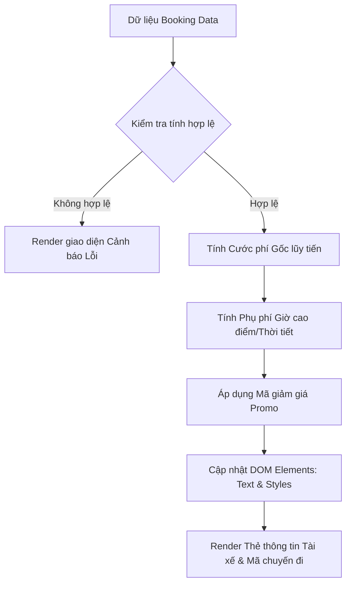

# Bài tập 7: GRAB_RIDE (Mức độ 3: Nâng cao - Xây dựng tính năng mới)

### 1. Mục tiêu bài tập
Sau khi hoàn tất bài tập này, học viên sẽ có khả năng:
- **Truy xuất và thao tác DOM API nâng cao**: Sử dụng linh hoạt `document.getElementById`, `querySelector`, `querySelectorAll` để truy vấn và cập nhật các phần tử HTML trong giao diện thực tế.
- **Biến đổi giao diện động (Dynamic Rendering)**: Cập nhật văn bản (`textContent`, `innerText`), cấu trúc khung HTML (`innerHTML`), thay đổi thuộc tính (`setAttribute`, `dataset`) và lớp giao diện (`classList.add`, `classList.remove`, `classList.toggle`).
- **Triển khai tư duy Logic nghiệp vụ Doanh nghiệp**: Chuyển đổi mô hình dữ liệu chuyến đi GrabRide thành thông tin hiển thị trên hóa đơn chi tiết, áp dụng công thức tính giá lũy tiến và hệ số phụ phí thực tế.
- **Xử lý trạng thái và ngoại lệ giao diện**: Đảm bảo ứng dụng hiển thị các thông số cảnh báo lỗi đúng chuẩn UI/UX khi dữ liệu đầu vào không hợp lệ.

---


### 2. Bối cảnh & Mô tả bài toán
Trong hệ thống ứng dụng đặt xe công nghệ **GrabRide**, sau khi hệ thống tìm được tài xế phù hợp, ứng dụng cần render nhanh chóng bảng tính cước phí chi tiết (Fare Receipt Summary Card) và thông tin tài xế lên màn hình ứng dụng di động/web của khách hàng. 

Nhiệm vụ của bạn là xây dựng module JavaScript xử lý logic tính toán và tương tác DOM để **cập nhật toàn bộ thông tin chuyến đi từ một đối tượng dữ liệu (Data Object) vào khung HTML giao diện có sẵn**, đồng thời xử lý các visual badges (nhãn cảnh báo phụ phí, ưu đãi) tương ứng với từng trạng thái chuyến đi.



---


### 3. Quy tắc nghiệp vụ (Business Rules)


#### A. Quy tắc tính cước phí chuyến đi (Trip Fare Rules)
1. **Giá cước khoảng cách (Distance Fare)**:
   - $2\text{ km}$ đầu tiên: Giá cố định $12.000\text{ VNĐ}$.
   - Từ km thứ $3$ trở đi (khoảng cách $> 2\text{ km}$): Tính $4.500\text{ VNĐ/km}$ cho phần dư ra.
   - *Công thức*: 
     - Nếu $\text{Distance} \le 2$: $\text{Fare}_{\text{dist}} = 12.000$
     - Nếu $\text{Distance} > 2$: $\text{Fare}_{\text{dist}} = 12.000 + (\text{Distance} - 2) \times 4.500$
2. **Hệ số Phụ phí (Surge Multiplier)**:
   - Thời tiết mưa (`isRaining = true`) **HOẶC** Giờ cao điểm (`isPeakHour = true`): Nhân hệ số $1.2$ ($+20\%$) vào giá cước khoảng cách $\text{Fare}_{\text{dist}}$.
   - Nếu xảy ra **CẢ HAI** (Vừa mưa VỪA giờ cao điểm): Nhân hệ số $1.3$ ($+30\%$) vào $\text{Fare}_{\text{dist}}$.
3. **Phí nền tảng (Platform Fee)**: Cố định $2.000\text{ VNĐ/chuyến}$.
4. **Mã giảm giá (Promo Code Rules)**:
   - `GRABNEW`: Giảm $20\%$ trên Tổng cước phí (trước khi cộng phí nền tảng), mức giảm tối đa không quá $15.000\text{ VNĐ}$.
   - `TIETKIEM`: Giảm thẳng $10.000\text{ VNĐ}$ vào tổng tiền (Chỉ áp dụng nếu tổng cước phí trước giảm giá $\ge 30.000\text{ VNĐ}$).
   - Các mã khác hoặc không nhập: Giảm $0\text{ VNĐ}$.
5. **Thành tiền cuối cùng (Final Fare)**:
   $$\text{Final Fare} = \text{Fare}_{\text{dist\_surge}} + \text{Phí nền tảng} - \text{Mã giảm giá}$$
   *(Lưu ý: Thành tiền tối thiểu không được nhỏ hơn $0\text{ VNĐ}$, kết quả làm tròn nguyên).*


#### B. Quy tắc cập nhật DOM & Giao diện (DOM Rendering Rules)
1. **Định dạng tiền tệ**: Tất cả các ô hiển thị tiền phải được định dạng theo chuẩn VNĐ (Ví dụ: `34.500 VNĐ`).
2. **Thẻ trạng thái Phụ phí (Surge Badge)**:
   - Nếu có phụ phí (Mưa hoặc Giờ cao điểm), thêm class `badge-surge` vào phần tử badge phụ phí và hiển thị nội dung phù hợp (ví dụ: `Phụ phí 1.2x (Giờ cao điểm)`).
   - Nếu không có phụ phí, ẩn badge này bằng cách thêm class `d-none`.
3. **Thuộc tính Dataset**: Cập nhật thuộc tính `data-trip-id` và `data-total-fare` cho khung thẻ tổng tiền `#trip-card`.
4. **Trạng thái Tài xế**: Render danh sách thông tin tài xế gồm: Tên, Biển số xe, Tên xe và Đánh giá (Số sao) bằng `innerHTML`.

---


### 4. Yêu cầu kỹ thuật & Triển khai


#### A. Cấu trúc File HTML ban đầu (`index.html`)
Học viên tạo file `index.html` với cấu trúc khung tĩnh cơ bản như sau:

```html
<!DOCTYPE html>
<html lang="vi">
<head>
    <meta charset="UTF-8">
    <title>GrabRide - Chi tiết chuyến đi</title>
    <link rel="stylesheet" href="style.css">
</head>
<body>
    <div id="app">
        <!-- Khung thông báo lỗi (mặc định ẩn) -->
        <div id="error-message" class="alert alert-danger d-none"></div>

        <!-- Khung thông tin chuyến đi -->
        <div id="trip-card" class="card" data-trip-id="" data-total-fare="0">
            <h2 id="trip-header">HÓA ĐƠN CHUYẾN ĐỊA</h2>
            
            <!-- Badge thông báo phụ phí -->
            <span id="surge-badge" class="badge"></span>

            <div class="trip-details">
                <p>Mã chuyến đi: <strong id="trip-id">---</strong></p>
                <p>Khoảng cách: <span id="trip-distance">0 km</span></p>
                <p>Giá cước gốc: <span id="base-fare">0 VNĐ</span></p>
                <p>Phụ phí thời tiết/giờ cao điểm: <span id="surge-fare">0 VNĐ</span></p>
                <p>Phí nền tảng: <span id="platform-fare">0 VNĐ</span></p>
                <p>Giảm giá khuyến mãi: <span id="discount-fare">0 VNĐ</span></p>
                <hr>
                <h3>Tổng thanh toán: <span id="total-fare" class="text-primary">0 VNĐ</span></h3>
            </div>

            <!-- Khung thông tin tài xế -->
            <div id="driver-info-box" class="driver-card">
                <!-- Nội dung tài xế sẽ được render bằng JS -->
            </div>
        </div>
    </div>
    <script src="script.js"></script>
</body>
</html>
```


#### B. Yêu cầu xử lý trong JS (`script.js`)

1. **Khai báo dữ liệu đầu vào (Mock Data)**:
```javascript
const bookingData = {
    tripId: "GRB-8932-VN",
    distanceKm: 5.5,
    isRaining: true,
    isPeakHour: false,
    promoCode: "GRABNEW",
    driver: {
        name: "Nguyễn Văn Tài",
        licensePlate: "29-E1 567.89",
        vehicleModel: "Honda Wave Alpha (Đen)",
        rating: 4.9
    }
};
```

2. **Xây dựng các hàm xử lý DOM chính**:
   - `formatCurrency(amount)`: Hàm bổ trợ nhận vào số nguyên, trả về chuỗi đã định dạng (VD: `45000` -> `"45.000 VNĐ"`).
   - `calculateFare(booking)`: Hàm nhận đối tượng `booking`, tính toán toàn bộ các con số chi tiết và trả về 1 object chứa kết quả.
   - `renderGrabRideFare(booking)`: Hàm chính thực thi toàn bộ việc thao tác DOM API:
     - Kiểm tra dữ liệu: Nếu `distanceKm <= 0` hoặc không hợp lệ, ẩn `#trip-card`, hiện `#error-message` với nội dung `"Thông tin chuyến đi không hợp lệ!"` bằng `textContent` và gỡ bỏ class `d-none`.
     - Nếu hợp lệ: Cập nhật thông tin mã chuyến đi, khoảng cách, các khoản tiền vào đúng các phần tử DOM thông qua `id`.
     - Cập nhật thuộc tính `data-trip-id` và `data-total-fare` cho `#trip-card` bằng `setAttribute` hoặc `dataset`.
     - Render khung tài xế bằng `innerHTML` chèn thẻ `div` hiển thị đầy đủ tên, biển số, tên xe, rating.
     - Thay đổi màu sắc của phần tử `#total-fare` bằng cách gắn thêm class `text-success` (hoặc trực tiếp đổi style nếu có phụ phí).

3. **Ràng buộc phạm vi áp dụng (Forbidden Scope)**:
   - **TẬP TRUNG TƯƠNG TÁC DOM TRỰC TIẾP**: Thực thi hàm `renderGrabRideFare(bookingData)` ngay khi chạy script.
   - **TUYỆT ĐỐI KHÔNG** sử dụng `addEventListener` hay thuộc tính sự kiện `onclick` (Sẽ học ở Session 19).
   - **TUYỆT ĐỐI KHÔNG** sử dụng `fetch`, `async/await`, hay `localStorage`.

---


### 5. Quy chuẩn nộp bài
- **Cấu trúc thư mục**:
  ```text
  WEB_HW_SESSION17_[HO_TEN_HOC_VIEN]/
  ├── index.html
  ├── style.css
  └── script.js
  ```
- **Quy định mã nguồn**:
  - Mã HTML/JS phải sạch sẽ, thụt lề đúng chuẩn chuẩn 2 spaces hoặc 4 spaces.
  - Tên biến trong JavaScript đặt theo chuẩn `camelCase`, phản ánh đúng ngữ cảnh nghiệp vụ GrabRide.
  - Sử dụng comment giải thích rõ ràng các bước truy xuất DOM và xử lý tính toán.

### Tiêu chuẩn Đánh giá & Thang điểm (100đ)

| Tiêu chí | Điểm tối đa | Mô tả chi tiết |
| :--- | :--- | :--- |
| **Cấu trúc & Truy xuất DOM API** | **20 điểm** | - Sử dụng đúng các phương thức `document.getElementById`, `querySelector`, `querySelectorAll`.<br>- Cập nhật chính xác `dataset`, `setAttribute`, `classList` (thêm/xóa lớp `d-none`, `badge-surge`).<br>- Thụt lề chuẩn, comment giải thích code rõ ràng. |
| **Logic Nghiệp vụ & Công thức Cước phí** | **40 điểm** | - Tính đúng cước khoảng cách lũy tiến ($2\text{ km}$ đầu $12.000\text{đ}$, từ $\text{km}$ 3 tính $4.500\text{đ/km}$).<br>- Tính chính xác hệ số phụ phí khi mưa/giờ cao điểm ($1.2\text{x}$ hoặc $1.3\text{x}$).<br>- Tính chính xác giảm giá theo mã `GRABNEW` (tối đa $15.000\text{đ}$) hoặc `TIETKIEM` ($\ge 30.000\text{đ}$).<br>- Định dạng chuẩn tiền tệ VNĐ trên giao diện. |
| **Render Giao diện & Đổ Dữ liệu Động** | **20 điểm** | - Đổ đầy đủ thông tin chuyến đi vào các thẻ HTML tương ứng.<br>- Sử dụng `innerHTML` để render dynamic HTML cho thông tin tài xế đúng thiết kế.<br>- Cập nhật đúng các thuộc tính `data-*` trên container node. |
| **Xử lý Ngoại lệ & Kiểm soát Phạm vi** | **20 điểm** | - Hiển thị đúng thông báo lỗi trên DOM khi `distanceKm` không hợp lệ ($< 0.1\text{ km}$ hoặc sai kiểu dữ liệu).<br>- Không vi phạm vùng cấm: Không sử dụng `addEventListener`, không `fetch`, không `localStorage`. |