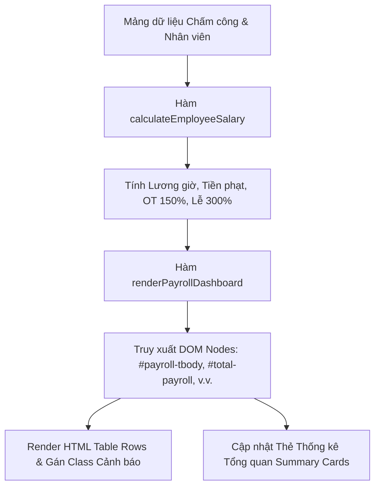

# Bài tập 7: E-Commerce (Mức độ 3: Nâng cao - Xây dựng tính năng mới)

### 1. Mục tiêu bài tập
- **Thao tác DOM nâng cao**: Sử dụng thành thạo các phương thức truy xuất DOM Tree (`document.getElementById`, `document.querySelector`, `document.querySelectorAll`) để định vị chính xác các phần tử trên trang Web.
- **Biến đổi nội dung & Thuộc tính**: Làm chủ kỹ thuật cập nhật nội dung tĩnh (`textContent`), cấu trúc HTML động (`innerHTML`), gắn thuộc tính dữ liệu (`setAttribute`, `data-*`), và thao tác dynamic styling (`classList.add`, `classList.remove`, `style`).
- **Xử lý logic nghiệp vụ Enterprise (HRM)**: Hiện thực hóa công thức tính toán lương thực nhận, phạt vi phạm đi muộn, tính hệ số OT/ngày lễ cho nhân sự và hiển thị báo cáo tổng quan trực tiếp lên giao diện người dùng mà không reload trang.


### 2. Bối cảnh & Mô tả bài toán
Hệ thống Phần mềm Quản lý Chấm công & Tính lương Nhân viên (`HR_ATTENDANCE`) của tập đoàn Rikkei Corp đang triển khai phân hệ dashboard tổng hợp lương tháng cho bộ phận Nhân sự (HR).

Bộ phận HR cần một module JavaScript nhận dữ liệu mảng đối tượng bảng chấm công nhân viên (`Employee`, `ShiftLog`, `Timesheet`), thực hiện tính toán chi tiết tiền phạt đi muộn, lương OT, lương ngày lễ, và hiển thị bảng lương tổng hợp cùng các thẻ thống kê tổng quan (Summary Cards) lên giao diện Web.




### 3. Quy tắc nghiệp vụ (Business Rules)
Cho danh sách nhân viên và bảng chấm công chi tiết. Bạn cần áp dụng các quy tắc sau:

1. **Lương giờ cơ bản (`baseHourlyWage`)**: 
   $$\text{baseHourlyWage} = \frac{\text{Lương cơ bản tháng (baseSalary)}}{160\text{ giờ}}$$
2. **Quy tắc Phạt Đi muộn (`penaltyFee`)**:
   - Nhân viên bị tính phạt nếu số phút đi muộn (`lateMinutes`) **lớn hơn 15 phút** trong ca làm việc.
   - Mức phạt: **50.000 VNĐ / lần vi phạm**. (Nếu `lateMinutes <= 15`, tiền phạt = 0 VNĐ).
3. **Quy tắc Lương Làm ngoài giờ (OT - Overtime)**:
   - Giờ OT ngày thường (`otHours`): Tính **150%** lương giờ cơ bản.
   - Giờ làm ngày Lễ/Tết (`holidayHours`): Tính **300%** lương giờ cơ bản.
4. **Lương Thực Nhận (`netSalary`)**:
   $$\text{netSalary} = (\text{soGioChinhQuy} \times \text{baseHourlyWage}) + (\text{otHours} \times \text{baseHourlyWage} \times 1.5) + (\text{holidayHours} \times \text{baseHourlyWage} \times 3.0) - \text{tongTienPhat}$$
5. **Quy tắc Hiển thị Dynamic UI & DOM Styling**:
   - **Định dạng tiền tệ**: Tất cả các giá trị tiền hiển thị ra giao diện phải được định dạng theo chuẩn Việt Nam (ví dụ: `15.000.000 VNĐ`).
   - **Class cảnh báo vi phạm**: Nếu nhân viên có `tongTienPhat > 0`, thêm class `row-warning` vào phần tử `<tr>` và hiển thị badge vi phạm màu đỏ (`<span class="badge badge-danger">Phạt đi muộn</span>`).
   - **Class khen thưởng OT**: Nếu `otHours >= 15`, thêm class `row-highlight` vào phần tử `<tr>` và hiển thị badge màu xanh (`<span class="badge badge-success">Cố gắng OT</span>`).
   - **Thuộc tính dữ liệu (`data-*`)**: Gán thuộc tính `data-salary-level="HIGH"` cho dòng nhân viên có `netSalary >= 20.000.000 VNĐ`, ngược lại gán `data-salary-level="STANDARD"`.


### 4. Yêu cầu kỹ thuật & Triển khai


#### 4.1. Chuẩn bị file HTML (`index.html`)
Tạo cấu trúc DOM ban đầu với các phần tử có ID/Class cố định để phục vụ thao tác DOM:

```html
<!DOCTYPE html>
<html lang="vi">
<head>
    <meta charset="UTF-8">
    <title>HRM - Bảng Lương & Chấm Công</title>
    <link rel="stylesheet" href="style.css">
</head>
<body>
    <div class="container">
        <h1>BẢNG TỔNG HỢP LƯƠNG NHÂN VIÊN</h1>
        
        <!-- Summary Cards -->
        <div class="summary-board">
            <div class="card">
                <h3>Tổng Quỹ Lương</h3>
                <p id="total-payroll-val">0 VNĐ</p>
            </div>
            <div class="card">
                <h3>Tổng Tiền Phạt Thu Về</h3>
                <p id="total-penalty-val">0 VNĐ</p>
            </div>
            <div class="card">
                <h3>Nhân Viên Lương Cao Nhất</h3>
                <p id="top-performer-val">N/A</p>
            </div>
        </div>

        <!-- Payroll Table -->
        <table class="payroll-table">
            <thead>
                <tr>
                    <th>Mã NV</th>
                    <th>Họ và Tên</th>
                    <th>Chức vụ</th>
                    <th>Giờ chính quy</th>
                    <th>Giờ OT (150%)</th>
                    <th>Giờ Lễ (300%)</th>
                    <th>Phút muộn</th>
                    <th>Tiền phạt</th>
                    <th>Lương thực nhận</th>
                    <th>Trạng thái</th>
                </tr>
            </thead>
            <tbody id="payroll-tbody">
                <!-- Dữ liệu JS sẽ inject vào đây -->
            </tbody>
        </table>
    </div>
    <script src="script.js"></script>
</body>
</html>
```


#### 4.2. Triển khai logic trong JavaScript (`script.js`)

1. **Dữ liệu đầu vào mẫu**:
```javascript
const employeesData = [
    {
        id: "EMP001",
        fullName: "Nguyễn Văn An",
        position: "Senior Developer",
        baseSalary: 24000000, // 24 triệu -> 150.000 VNĐ/giờ
        regularHours: 160,
        otHours: 20,
        holidayHours: 8,
        lateMinutes: 45 // Vi phạm phạt (> 15p)
    },
    {
        id: "EMP002",
        fullName: "Trần Thị Bích",
        position: "HR Specialist",
        baseSalary: 16000000, // 16 triệu -> 100.000 VNĐ/giờ
        regularHours: 152,
        otHours: 5,
        holidayHours: 0,
        lateMinutes: 10 // Không bị phạt
    },
    {
        id: "EMP003",
        fullName: "Lê Hoàng Cường",
        position: "DevOps Engineer",
        baseSalary: 32000000, // 32 triệu -> 200.000 VNĐ/giờ
        regularHours: 160,
        otHours: 18,
        holidayHours: 16,
        lateMinutes: 20 // Vi phạm phạt (> 15p)
    }
];
```

2. **Yêu cầu hàm nghiệp vụ**:
   - `calculateEmployeeSalary(employee)`: Trả về object chứa các thông tin lương chi tiết (`baseHourlyWage`, `penaltyFee`, `otSalary`, `holidaySalary`, `netSalary`).
   - `formatCurrency(amount)`: Hàm hỗ trợ chuyển đổi số thành chuỗi định dạng tiền tệ Việt Nam (VD: `15000000` -> `"15.000.000 VNĐ"`).
   - `renderPayrollDashboard(dataList)`: 
     - Sử dụng `document.querySelector('#payroll-tbody')` để lấy bảng.
     - Sử dụng `document.getElementById` để lấy các phần tử của thẻ Thống kê.
     - Duyệt danh sách dữ liệu, xây dựng chuỗi HTML các dòng `<tr>` với đầy đủ thuộc tính `class`, `data-salary-level`, badge trạng thái và gán vào `innerHTML`.
     - Tính tổng quỹ lương, tổng tiền phạt, tìm ra nhân viên có lương cao nhất và cập nhật `textContent` cho 3 thẻ Summary Card.

> **CẤM SỬ DỤNG (FORBIDDEN SCOPE)**:
> - Không dùng `addEventListener` hay các thuộc tính sự kiện (`onclick`, `onchange`).
> - Không dùng `<form>` submit.
> - Không dùng `fetch` / `axios` / `localStorage`.
> - Thực thi hàm rendering trực tiếp ở cuối file JS khi tải trang.


### 5. Quy chuẩn nộp bài
- **Cấu trúc thư mục**:
  ```text
  JS_HW_Session17_HoTen_MaSV/
  ├── index.html
  ├── style.css
  └── script.js
  ```
- **Quy định mã nguồn**:
  - Mã nguồn JavaScript phải tuân thủ chuẩn ES6 (sử dụng `const`/`let`, arrow functions, template literals).
  - Tên biến và hàm rõ nghĩa theo chuẩn `camelCase`.
  - Có comment giải thích logic tại các đoạn xử lý DOM và công thức nghiệp vụ.

### Tiêu chuẩn Đánh giá & Thang điểm (100đ)

| Tiêu chí | Điểm tối đa | Mô tả chi tiết |
| :--- | :--- | :--- |
| **Cấu trúc & Phong cách mã nguồn** | **20đ** | - Đặt tên biến/hàm theo chuẩn `camelCase`, đúng ngữ nghĩa nghiệp vụ HRM.<br>- Code định dạng sạch sẽ, thụt lề chuẩn xác, có comment giải thích các khối xử lý DOM.<br>- Sử dụng ES6 (Template Literals, Arrow Functions, Destructuring). |
| **Xử lý Logic đúng nghiệp vụ** | **40đ** | - Tính chính xác lương giờ cơ bản, tiền phạt đi muộn (chỉ phạt khi `lateMinutes > 15`).<br>- Tính chuẩn hệ số OT 150% và ngày lễ 300%.<br>- Tính đúng tổng lương thực nhận `netSalary` theo từng nhân viên.<br>- Tính chính xác các chỉ số tổng quan: Tổng quỹ lương, Tổng tiền phạt, Nhân viên lương cao nhất. |
| **Thao tác DOM & Dynamic Styling** | **20đ** | - Truy xuất chính xác các phần tử bằng `getElementById`, `querySelector`.<br>- Thay đổi nội dung thẻ bằng `textContent` và `innerHTML` hợp lý.<br>- Dynamic Styling đúng điều kiện: Thêm class `row-warning`, `row-highlight`, thuộc tính `data-salary-level` và render đúng badge trạng thái. |
| **Xử lý Biên & Ràng buộc Kỹ thuật** | **20đ** | - Định dạng tiền tệ chính xác (`x.xxx.xxx VNĐ`).<br>- Kiểm soát trường hợp mảng dữ liệu rỗng (không bị lỗi runtime JS).<br>- Tuân thủ 100% ràng buộc: Không dùng `addEventListener`, `fetch`, `localStorage`, `form submit`. |