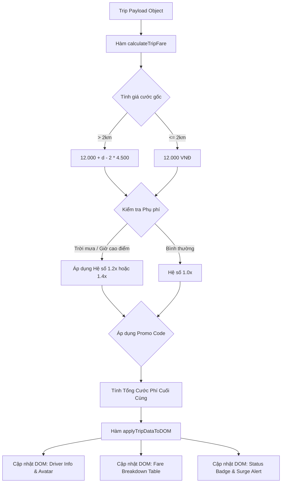

# Bài tập 8: GRAB_RIDE (Mức độ 3: Nâng cao - Xây dựng tính năng mới)

### 1. Mục tiêu bài tập
Sau khi hoàn thành bài tập này, học viên có khả năng:
- **Thành thạo các phương thức truy xuất DOM**: Sử dụng linh hoạt `document.getElementById()`, `document.querySelector()`, `document.querySelectorAll()` và thuộc tính điều hướng cây DOM (`parentElement`, `children`).
- **Thao tác dữ liệu và nội dung HTML**: Sử dụng `textContent`, `innerHTML` để hiển thị linh hoạt các thông tin cước phí, thông tin tài xế và trạng thái chuyến đi.
- **Thay đổi thuộc tính và kiểu dáng Element**: Sử dụng `setAttribute`, `dataset`, `classList` (`add`, `remove`, `toggle`) và style inline để cập nhật trạng thái UI động theo logic nghiệp vụ đặt xe.
- **Tách biệt Logic nghiệp vụ và DOM Manipulation**: Thiết kế mã nguồn JS theo kiến trúc hàm (Functional), chia tách rõ ràng giữa phần tính toán công thức cước phí GrabRide và phần cập nhật giao diện.

---


### 2. Bối cảnh & Mô tả bài toán
Bạn là một Kỹ sư Phát triển Phần mềm Front-end tại Grab Việt Nam, thuộc nhóm phát triển giao diện Web Dashboard theo dõi chuyến đi (GrabRide Live Tracking). Hệ thống vừa nhận được một gói dữ liệu (Trip Data Payload) gửi từ máy chủ thông tin chuyến đi real-time.

Nhiệm vụ của bạn là viết script xử lý tính toán cước phí chính xác theo quy chuẩn nghiệp vụ của GrabRide, sau đó thực hiện truy xuất và thay đổi nội dung trên giao diện web HTML có sẵn để hiển thị bảng tính cước, thông tin tài xế, phương tiện và các cảnh báo phụ phí (giờ cao điểm / thời tiết xấu).


#### Sơ đồ luồng xử lý dữ liệu và cập nhật DOM:



---


### 3. Quy tắc nghiệp vụ (Business Rules)


#### A. Quy tắc tính cước phí di chuyển (`TripFare`)
1. **Giá cước cơ bản (Base Fare)**:
   - $2\text{ km}$ đầu tiên: Giá cố định **12.000 VNĐ**.
   - Từ km thứ $3$ trở đi ($d > 2$): Giá cước gốc = $12.000 + (d - 2) \times 4.500$ VNĐ.
   - *Ví dụ*: Chuyến đi $5.5\text{ km} \rightarrow 12.000 + (5.5 - 2) \times 4.500 = 12.000 + 15.750 = 27.750\text{ VNĐ}$.

2. **Hệ số phụ phí nhu cầu cao (Surge Multiplier)**:
   - Nếu điều kiện **Trời mưa (`isRain = true`)** HOẶC **Giờ cao điểm (`isPeakHour = true`)**: Nhân hệ số **$1.2\text{x}$** vào cước cơ bản.
   - Nếu ĐỒNG THỜI **Trời mưa AND Giờ cao điểm**: Nhân hệ số **$1.4\text{x}$** vào cước cơ bản.
   - Ngược lại (thời tiết tốt và giờ bình thường): Hệ số **$1.0\text{x}$**.

3. **Mã giảm giá (Promo Code Rules)**:
   - Mã `"GRABDIWUI"`: Giảm $20\%$ trên cước phí đã tính phụ phí (Số tiền giảm tối đa không vượt quá **15.000 VNĐ**).
   - Mã `"CHAOXINCHAO"`: Giảm thẳng **10.000 VNĐ** vào cước phí.
   - Các mã khác hoặc không nhập: Số tiền giảm bằng **$0\text{ VNĐ}$**.

4. **Tổng tiền thanh toán cuối cùng (Total Amount)**:
   $$\text{Total} = \max(0, (\text{Base Fare} \times \text{Surge Multiplier}) - \text{Discount Amount})$$
   - Số tiền phải được làm tròn tròn số nguyên và định dạng hiển thị kèm đơn vị `"VNĐ"` (Ví dụ: `33.300 VNĐ`).

---


### 4. Yêu cầu kỹ thuật & Triển khai


#### A. Cấu trúc HTML mẫu (Cung cấp sẵn để học viên nhúng Script)
Học viên tạo file `index.html` với cấu trúc khung sau:

```html
<!DOCTYPE html>
<html lang="vi">
<head>
  <meta charset="UTF-8">
  <title>GrabRide Trip Dashboard</title>
  <link rel="stylesheet" href="style.css">
</head>
<body>
  <div id="app-container" class="container">
    <!-- Header Trạng Thái Chuyến Đi -->
    <header class="header">
      <h2>Trạng Thái Chuyến Đi: <span id="booking-status" class="badge">ĐANG TÌM</span></h2>
      <div id="surge-alert" class="alert-box d-none">
        ️ Phụ phí nhu cầu cao đang được áp dụng do thời tiết/giờ cao điểm!
      </div>
    </header>

    <!-- Thẻ Thông Tin Tài Xế -->
    <section class="card driver-card">
      
      <div class="driver-info">
        <h3 id="driver-name">Đang điều phối...</h3>
        <p>Biển số: <strong id="driver-plate">---</strong></p>
        <p>Đánh giá: <span id="driver-rating">--</span> ⭐</p>
        <p>Thời gian dự kiến đến: <span id="estimated-time">--</span> phút</p>
      </div>
    </section>

    <!-- Bảng Chi Tiết Cước Phí -->
    <section class="card fare-card">
      <h3>Chi Tiết Cước Phí</h3>
      <table class="fare-table">
        <tbody>
          <tr>
            <td>Khoảng cách:</td>
            <td id="fare-distance" class="text-right">0 km</td>
          </tr>
          <tr>
            <td>Cước cơ bản:</td>
            <td id="fare-base" class="text-right">0 VNĐ</td>
          </tr>
          <tr>
            <td>Hệ số phụ phí:</td>
            <td id="fare-surge" class="text-right">1.0x</td>
          </tr>
          <tr>
            <td>Mã giảm giá (<span id="promo-code-name">KHÔNG CÓ</span>):</td>
            <td id="fare-discount" class="text-right">-0 VNĐ</td>
          </tr>
          <tr class="total-row">
            <td>TỔNG THANH TOÁN:</td>
            <td id="fare-total" class="text-right highlight">0 VNĐ</td>
          </tr>
        </tbody>
      </table>
    </section>
  </div>
  <script src="main.js"></script>
</body>
</html>
```


#### B. Yêu cầu chi tiết với mã JavaScript (`main.js`)

Viết mã JS thực hiện các nhiệm vụ sau (chạy trực tiếp script khi tải trang bằng mock data, **TUYỆT ĐỐI KHÔNG** dùng Event Listener như `addEventListener` hay `onclick`):

1. **Hàm 1: `calculateTripFare(distance, isRain, isPeakHour, promoCode)`**
   - Đầu vào: Số km `distance` (float), trạng thái mưa `isRain` (boolean), cao điểm `isPeakHour` (boolean), mã giảm giá `promoCode` (string).
   - Đầu ra: Trả về 1 Object dạng:
     ```javascript
     {
       distance: 5.5,
       baseFare: 27750,
       surgeMultiplier: 1.2,
       discountAmount: 6660,
       totalFare: 26640
     }
     ```

2. **Hàm 2: `renderDriverCard(driverData)`**
   - Đọc đối tượng `driverData` chứa: `{ name, avatarUrl, plateNumber, rating, etaMinutes, status }`.
   - Truy xuất và cập nhật các thẻ tương ứng:
     - Thẻ `#driver-avatar`: đổi thuộc tính `src` và `alt`.
     - Thẻ `#driver-name`: đổi nội dung văn bản.
     - Thẻ `#driver-plate`: đổi nội dung văn bản.
     - Thẻ `#driver-rating`: đổi nội dung văn bản. Nếu `rating >= 4.8`, đổi màu chữ rating thành xanh lá (`#27ae60`), ngược lại màu cam (`#f39c12`).
     - Thẻ `#estimated-time`: đổi nội dung văn bản.
     - Thẻ `#booking-status`: Cập nhật `textContent` bằng `driverData.status` và thay đổi CSS class tương ứng:
       - Nếu status là `"COMPLETED"`: class `badge badge-success`
       - Nếu status là `"ARRIVING"`: class `badge badge-warning`
       - Nếu status là `"SEARCHING"`: class `badge badge-secondary`

3. **Hàm 3: `renderFareBreakdown(fareResult, promoCodeName)`**
   - Đọc dữ liệu trả về từ `calculateTripFare`.
   - Cập nhật thông tin vào bảng chi tiết cước phí (`#fare-distance`, `#fare-base`, `#fare-surge`, `#promo-code-name`, `#fare-discount`, `#fare-total`).
   - Định dạng tiền tệ dạng chuẩn Việt Nam (ví dụ: `27.750 VNĐ`).

4. **Hàm 4: `toggleSurgeAlert(surgeMultiplier)`**
   - Nếu `surgeMultiplier > 1.0`: Bỏ class `d-none` ở phần tử `#surge-alert` và gán màu nền đỏ nhạt (`#ffe6e6`).
   - Nếu `surgeMultiplier === 1.0`: Thêm class `d-none` vào `#surge-alert`.

5. **Hàm 5: `applyTripDataToDOM(bookingPayload)`**
   - Hàm điều phối chính nhận `bookingPayload` tổng hợp và lần lượt gọi các hàm render ở trên.


#### C. Dữ liệu thử nghiệm (Mock Dataset)
Cuối file `main.js`, khai báo dữ liệu mẫu và thực hiện gọi hàm để chứng minh giao diện được cập nhật đúng:

```javascript
// Mock Payload từ Server Grab
const currentBookingPayload = {
  driver: {
    name: "Nguyễn Văn Tài",
    avatarUrl: "https://i.pravatar.cc/150?img=11",
    plateNumber: "29-G1 888.99",
    rating: 4.9,
    etaMinutes: 4,
    status: "ARRIVING"
  },
  tripConfig: {
    distance: 6.8,
    isRain: true,
    isPeakHour: false,
    promoCode: "GRABDIWUI"
  }
};

// Thực thi cập nhật DOM ngay khi Script nạp xong
applyTripDataToDOM(currentBookingPayload);
```


#### D. Phạm vi Kỹ thuật Nghiêm cấm
- **KHÔNG** sử dụng Event Listeners (`addEventListener`, `attachEvent`, inline `onclick`/`onsubmit`).
- **KHÔNG** sử dụng `fetch()`, `XMLHttpRequest` hay `axios`.
- **KHÔNG** sử dụng `localStorage` / `sessionStorage`.
- Chỉ tập trung vào việc truy xuất DOM node, thao tác innerHTML/textContent, style, setAttribute, dataset và classList.

---


### 5. Quy chuẩn nộp bài
- **Cấu trúc thư mục**:
  ```text
  student-id_hw8/
  ├── index.html
  ├── style.css
  └── main.js
  ```
- **Quy định đặt tên**:
  - Mã sinh viên kèm số thứ tự bài tập (Ví dụ: `BH00123_hw8`).
- **Đóng gói**: Nén thư mục thành file `.zip` hoặc `.rar` trước khi nộp lên hệ thống LMS.

### Tiêu chuẩn Đánh giá & Thang điểm (100đ)

| Tiêu chí | Điểm tối đa | Mô tả chi tiết |
| :--- | :--- | :--- |
| **Cấu trúc & Phong cách mã nguồn** | **20đ** | - Tổ chức mã nguồn sạch sẽ, tách hàm rõ ràng theo đúng yêu cầu.<br>- Đặt tên biến/hàm chuẩn camelCase, theo ngữ cảnh GrabRide (`calculateTripFare`, `renderDriverCard`).<br>- Thụt lề chuẩn 2 spaces, có comment giải thích cho từng đoạn xử lý DOM. |
| **Xử lý Logic đúng nghiệp vụ** | **40đ** | - **Cước cơ bản (15đ)**: Tính đúng $2\text{ km}$ đầu 12k, các km sau 4.5k/km.<br>- **Phụ phí Surge (15đ)**: Đúng hệ số $1.2\text{x}$ (mưa hoặc cao điểm) và $1.4\text{x}$ (cả hai).<br>- **Mã giảm giá (10đ)**: Tính đúng giảm $20\%$ max 15k cho `GRABDIWUI` và giảm 10k cho `CHAOXINCHAO`. |
| **Thao tác DOM API & Xử lý Biên** | **20đ** | - Sử dụng chính xác `getElementById`, `querySelector`, `classList`, `setAttribute`.<br>- Định dạng số tiền chính xác (thêm chấm phân cách hàng nghìn và đuôi `"VNĐ"`).<br>- Kiểm soát biên: Khoảng cách âm hoặc $= 0$, mã giảm giá không hợp lệ không làm crash script. |
| **Tối ưu UI & Ẩn/Hiện trạng thái** | **20đ** | - Hiển thị đúng Badge trạng thái tài xế theo từng màu tương ứng.<br>- Thao tác class `d-none` thành công để bật/tắt `#surge-alert`.<br>- Thay đổi màu sắc đánh giá sao (`#driver-rating`) linh hoạt theo điều kiện điểm số. |