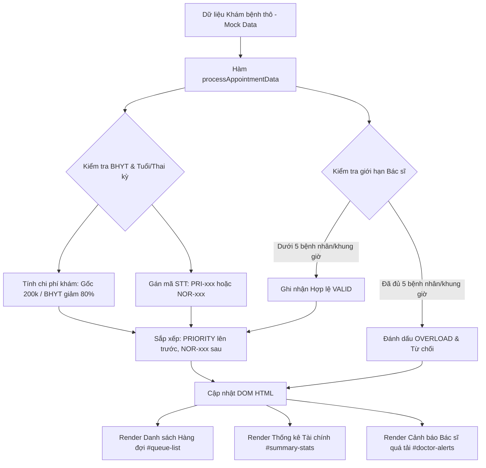

# Bài tập 8: Logistics (Mức độ 3: Nâng cao - Xây dựng tính năng mới)

### 1. Mục tiêu bài tập
- **Thao tác DOM nâng cao**: Sử dụng thành thạo các phương thức truy xuất phần tử DOM (`getElementById`, `querySelector`, `querySelectorAll`) để duyệt và trích xuất dữ liệu.
- **Biến đổi & Tạo mới nội dung DOM**: Thực hiện thay đổi cấu trúc HTML (`innerHTML`, `createElement`, `appendChild`), thay đổi thuộc tính (`setAttribute`, `dataset`) và áp dụng class CSS/style động (`classList.add`, `classList.remove`, `style`).
- **Xử lý Logic nghiệp vụ thực tế**: Lập trình thuật toán phân loại bệnh nhân, tính toán tài chính phòng khám (BHYT), phân bổ hàng đợi (Ưu tiên / Thường) và kiểm soát ngưỡng quá tải hệ thống theo khung giờ của Bác sĩ.

---


### 2. Bối cảnh & Mô tả bài toán
Hệ thống **CLINIC_APPOINTMENT** tại Phòng khám Đa khoa Quốc tế Rikkei Care đang gặp sự cố ở khâu hiển thị bảng điều khiển (Dashboard) tự động. Dữ liệu đặt lịch khám của bệnh nhân đổ về dưới dạng danh sách đối tượng JavaScript, nhưng giao diện hiển thị hiện tại chưa phản ánh đúng thứ tự ưu tiên, chi phí khám sau miễn giảm BHYT và cảnh báo khi bác sĩ bị vượt quá năng lực phục vụ.

Bạn đóng vai trò là Lập trình viên Frontend chịu trách nhiệm viết script JS xử lý dữ liệu và cập nhật trực tiếp lên giao diện DOM (không dùng Event Listener) ngay khi trang web được tải.



---


### 3. Quy tắc nghiệp vụ (Business Rules)

1. **Quy tắc Tính chi phí khám bệnh**:
   - Giá khám ban đầu cố định: `200,000 VNĐ`.
   - Bệnh nhân có BHYT (`hasInsurance: true`): Được miễn giảm 80% tiền khám ban đầu $\rightarrow$ Số tiền phải trả = `40,000 VNĐ`.
   - Bệnh nhân không có BHYT (`hasInsurance: false`): Số tiền phải trả = `200,000 VNĐ`.

2. **Quy tắc Phân loại & Cấp số thứ tự (Queue Number)**:
   - **Số Ưu Tiên (PRIORITY)**: Bệnh nhân đạt một trong hai điều kiện:
     - Tuổi $\ge 70$ (`age >= 70`).
     - Là phụ nữ mang thai (`gender === 'Female'` VÀ `isPregnant === true`).
     - Mã số thứ tự có định dạng: `PRI-001`, `PRI-002`, ...
   - **Số Thường (NORMAL)**: Các trường hợp còn lại.
     - Mã số thứ tự có định dạng: `NOR-001`, `NOR-002`, ...
   - **Thứ tự hiển thị trên danh sách**: Tất cả bệnh nhân thuộc nhóm `PRIORITY` phải được sắp xếp lên đầu danh sách, sau đó mới đến nhóm `NORMAL`. Trong cùng một nhóm, giữ nguyên thứ tự đăng ký ban đầu.

3. **Quy tắc Chặn đăng ký Quá tải (Doctor Capacity Limit)**:
   - Tối đa **5 bệnh nhân** được chấp nhận cho một Bác sĩ trong cùng một Khung giờ (`timeSlot`).
   - Từ bệnh nhân thứ 6 trở đi đăng ký với cùng Bác sĩ trong cùng Khung giờ đó:
     - Trạng thái hẹn: `OVERLOAD` (Quá tải / Bị từ chối).
     - Chi phí tính: `0 VNĐ` (không tính vào tổng doanh thu thực thu).
     - Mã số thứ tự: Gán nhãn `REJECTED`.

---


### 4. Yêu cầu kỹ thuật & Triển khai


#### 4.1. Struct dữ liệu đầu vào (Mock Data)
Khai báo mảng `appointmentsData` trong file `main.js` với cấu trúc mẫu:

```javascript
const appointmentsData = [
  { id: 1, name: "Nguyễn Văn An", age: 75, gender: "Male", isPregnant: false, hasInsurance: true, doctorId: "DOC01", doctorName: "BS. Cường", timeSlot: "08:00 - 09:00" },
  { id: 2, name: "Trần Thị Bình", age: 28, gender: "Female", isPregnant: true, hasInsurance: false, doctorId: "DOC01", doctorName: "BS. Cường", timeSlot: "08:00 - 09:00" },
  { id: 3, name: "Lê Văn Cường", age: 45, gender: "Male", isPregnant: false, hasInsurance: true, doctorId: "DOC01", doctorName: "BS. Cường", timeSlot: "08:00 - 09:00" },
  { id: 4, name: "Phạm Thị Duyên", age: 32, gender: "Female", isPregnant: false, hasInsurance: true, doctorId: "DOC01", doctorName: "BS. Cường", timeSlot: "08:00 - 09:00" },
  { id: 5, name: "Hoàng Văn Em", age: 65, gender: "Male", isPregnant: false, hasInsurance: false, doctorId: "DOC01", doctorName: "BS. Cường", timeSlot: "08:00 - 09:00" },
  { id: 6, name: "Vũ Thị Giang", age: 80, gender: "Female", isPregnant: false, hasInsurance: true, doctorId: "DOC01", doctorName: "BS. Cường", timeSlot: "08:00 - 09:00" }, // Vượt quá 5 BN của BS Cường khung 08:00-09:00
  { id: 7, name: "Đặng Hoàng Nam", age: 22, gender: "Male", isPregnant: false, hasInsurance: false, doctorId: "DOC02", doctorName: "BS. Trang", timeSlot: "09:00 - 10:00" }
];
```


#### 4.2. Yêu cầu Cấu trúc File & DOM HTML (`index.html`)
Tạo giao diện HTML cơ bản có các phần tử chứa thông tin sau:
- Thẻ `<tbody id="queue-table-body"></tbody>`: Chứa danh sách bệnh nhân sau khi render.
- Thẻ `<span id="total-valid-appointments"></span>`: Hiển thị tổng số lượt khám hợp lệ.
- Thẻ `<span id="total-rejected-appointments"></span>`: Hiển thị tổng số lượt bị từ chối do quá tải.
- Thẻ `<span id="total-revenue"></span>`: Hiển thị tổng doanh thu thu được (đã định dạng VNĐ, ví dụ: `320,000 VNĐ`).
- Thẻ `<div id="doctor-alerts-container"></div>`: Chứa các thẻ cảnh báo bác sĩ bị vượt quá giới hạn.


#### 4.3. Yêu cầu Xử lý Logic Javascript (`main.js`)
Viết các hàm chuyên biệt để xử lý và cập nhật DOM:

1. **`processAppointmentData(data)`**:
   - Tính toán chi phí (`cost`).
   - Xác định cấp số `PRIORITY` hay `NORMAL`. Tạo mã `PRI-xxx` hoặc `NOR-xxx`.
   - Kiểm tra giới hạn 5 người / Bác sĩ / Khung giờ. Phân loại `status: "VALID"` hoặc `status: "OVERLOAD"`.
   - Sắp xếp mảng kết quả: Bệnh nhân `VALID` & `PRIORITY` lên trước $\rightarrow$ `VALID` & `NORMAL` $\rightarrow$ Các bệnh nhân `OVERLOAD` nằm ở cuối cùng.

2. **`renderQueueTable(processedData)`**:
   - Xóa trắng bảng cũ (`innerHTML = ''`).
   - Duyệt mảng dữ liệu đã xử lý, tạo các hàng `<tr>` và chèn vào `#queue-table-body`.
   - Thêm các class CSS tương ứng:
     - Dòng bệnh nhân `PRIORITY`: Thêm class `row-priority` (nền vàng nhạt).
     - Dòng bệnh nhân `OVERLOAD`: Thêm class `row-overload` (nền đỏ nhạt, chữ gạch ngang hoặc mờ).
   - Hiển thị Badge (thẻ nhãn) phân loại: `<span class="badge badge-priority">ƯU TIÊN</span>` hoặc `<span class="badge badge-normal">THƯỜNG</span>`.

3. **`renderSummaryStats(processedData)`**:
   - Đếm tổng số ca hợp lệ, tổng số ca bị từ chối.
   - Tính tổng doanh thu của các ca hợp lệ.
   - Cập nhật trực tiếp giá trị vào các thẻ `#total-valid-appointments`, `#total-rejected-appointments`, `#total-revenue` bằng `innerText` hoặc `textContent`.

4. **`renderDoctorAlerts(processedData)`**:
   - Tìm danh sách các Bác sĩ bị quá tải kèm khung giờ tương ứng.
   - Nếu có quá tải, tạo động thẻ `<div class="alert alert-danger">` chứa thông tin: `"CẢNH BÁO: Bác sĩ [Tên] trong khung giờ [Time] đã bị quá tải (Vượt quá 5 bệnh nhân)!"` và chèn vào `#doctor-alerts-container`.

---


### 5. Quy chuẩn nộp bài
- **Cấu trúc thư mục**:
  ```text
  JS_Session17_Homework/
  ├── index.html
  ├── style.css
  └── main.js
  ```
- **Quy tắc mã nguồn**:
  - KHÔNG sử dụng `addEventListener` hay thuộc tính sự kiện dạng inline (`onclick`, `onsubmit`...).
  - Code JS chạy tự động ngay khi script được nhúng và tải ở cuối thẻ `<body>`.
  - Tên biến, tên hàm viết theo chuẩn `camelCase`, rõ nghĩa.
  - Mã nguồn phải có comment giải thích rõ ràng từng bước thao tác DOM và xử lý nghiệp vụ.

### Tiêu chuẩn Đánh giá & Thang điểm (100đ)

| Tiêu chí | Điểm tối đa | Mô tả chi tiết |
| :--- | :--- | :--- |
| **Cấu trúc & Phong cách mã nguồn** | **20đ** | - Cấu trúc HTML hợp lệ, ngữ nghĩa tốt.<br>- Đặt tên hàm/biến rõ ràng theo chuẩn `camelCase`.<br>- Tổ chức thư mục đúng yêu cầu, code sạch sẽ và có comment giải thích logic thao tác DOM. |
| **Xử lý Logic nghiệp vụ** | **40đ** | - Tính đúng 100% chi phí khám ban đầu có/không có BHYT (khám gốc 200k, BHYT giảm 80%).<br>- Phân loại chính xác bệnh nhân Ưu tiên (Tuổi $\ge 70$ hoặc Phụ nữ mang thai) và Thường.<br>- Đánh số thứ tự đúng định dạng `PRI-xxx` và `NOR-xxx`.<br>- Áp dụng đúng thuật toán sắp xếp hiển thị ưu tiên lên trước.<br>- Kiểm soát chính xác ngưỡng 5 bệnh nhân/bác sĩ/khung giờ. |
| **Thao tác DOM API & Giao diện** | **20đ** | - Truy xuất chính xác các phần tử DOM bằng `getElementById` / `querySelector`.<br>- Render bảng hàng đợi động, áp dụng đúng class CSS (`row-priority`, `row-overload`) và hiển thị badge nhãn.<br>- Hiển thị đúng các con số thống kê và tạo động thẻ alert thông báo cảnh báo bác sĩ quá tải.<br>- Không vi phạm vùng kiến thức cấm (Không dùng Event Listener). |
| **Xử lý Biên & Tối ưu performance** | **20đ** | - Báo lỗi/xử lý an toàn khi danh sách đầu vào rỗng.<br>- Tối ưu hóa số lần truy cập và thay đổi DOM (tránh render lặp không cần thiết).<br>- Định dạng tiền tệ đẹp mắt và chính xác (`40,000 VNĐ`). |