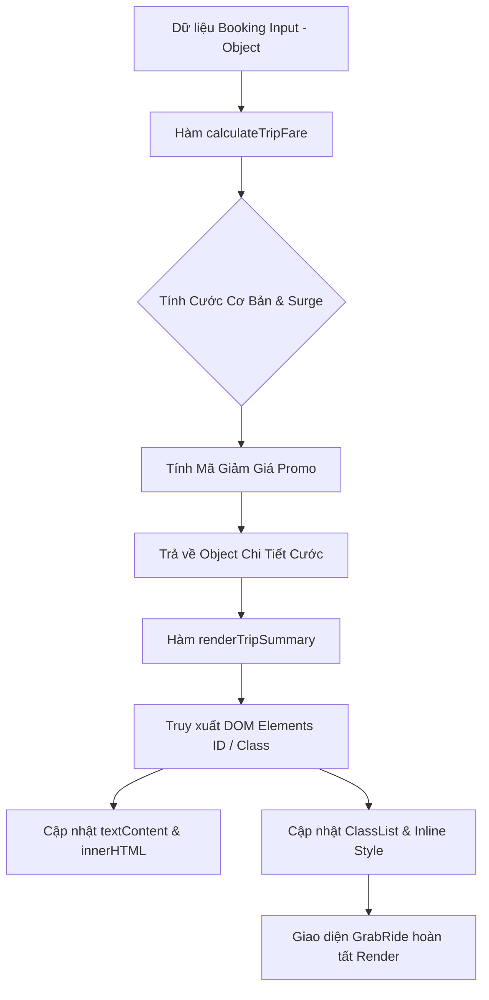

# Bài tập 9: GRAB_RIDE (Mức độ 3: Nâng cao - Xây dựng tính năng mới)

### 1. Mục tiêu bài tập
Sau khi hoàn thành bài tập này, học viên có khả năng:
- **Truy xuất thành thạo các DOM Element** trong cây thư mục HTML bằng các phương thức chuẩn: `document.getElementById`, `document.querySelector`, `document.querySelectorAll`.
- **Thay đổi động nội dung HTML và Text** của các phần tử UI bằng `textContent`, `innerText`, `innerHTML`.
- **Thao tác thuộc tính (Attributes) và CSS Style/Class** của DOM bằng `setAttribute`, `removeAttribute`, `style`, `classList.add`, `classList.remove`, `classList.toggle`.
- **Hiện thực hóa quy tắc nghiệp vụ thực tế** của ứng dụng gọi xe GrabRide (tính cước phí mở cửa, cước lũy tiến, phụ phí giờ cao điểm/thời tiết và mã giảm giá) thông qua việc render dữ liệu trực tiếp lên giao diện người dùng.

---


### 2. Bối cảnh & Mô tả bài toán
Trong hệ thống ứng dụng gọi xe công nghệ **GrabRide**, sau khi khách hàng nhập điểm đi, điểm đến và chọn loại xe, hệ thống sẽ chuyển thông tin sang màn hình **"Tóm tắt chuyến đi & Tính toán cước phí" (Trip Booking Summary)**. 

Trang web giao diện static đã được dựng sẵn khung khung HTML/CSS. Nhiệm vụ của bạn là xây dựng module JavaScript (`app.js`) đóng vai trò xử lý logic nghiệp vụ và tương tác với DOM API: nhận đối tượng dữ liệu chuyến đi (`bookingData`), thực hiện tính toán chi tiết cước phí, kiểm tra điều kiện tài xế và cập nhật toàn bộ thông tin hiển thị lên giao diện hiển thị cho tổng đài viên/khách hàng mà **không làm lại lại trang web**.


#### Sơ đồ luồng xử lý dữ liệu và render DOM (Data-to-DOM Flow)


---


### 3. Quy tắc nghiệp vụ (Business Rules)


#### A. Công thức tính cước phí chuyến đi (Trip Fare Calculation)
1. **Cước phí quãng đường cơ bản ($F_{base}$)**:
   - $0 < \text{Quãng đường } (d) \le 2\text{ km}$: Cước phí cố định = **12.000 VNĐ**.
   - $\text{Quãng đường } (d) > 2\text{ km}$: **12.000 VNĐ** + $(d - 2) \times 4.500\text{ VNĐ}$.
   - *Ví dụ*: Chuyến đi 5 km -> $12.000 + (5 - 2) \times 4.500 = 25.500\text{ VNĐ}$.

2. **Hệ số phụ phí Surge Pricing ($F_{surge}$)**:
   - Nếu `isSurge === true` (thời tiết xấu hoặc giờ cao điểm): Nhân hệ số **1.2x** vào tổng Cước phí cơ bản.
   - $\text{Tiền Surge thêm vào} = F_{base} \times 0.2$.
   - Nếu `isSurge === false`: Tiền Surge = 0 VNĐ.

3. **Mã giảm giá Khuyến mãi ($F_{discount}$)**:
   - Áp dụng trên tổng tiền sau khi đã nhân hệ số Surge ($F_{afterSurge} = F_{base} \times \text{Hệ số}$):
     - Mã `"GRABNEW"`: Giảm **20%** trên $F_{afterSurge}$.
     - Mã `"SAIGONXANH"`: Giảm cố định **10.000 VNĐ** (Nếu tiền giảm lớn hơn $F_{afterSurge}$ thì tiền giảm bằng $F_{afterSurge}$, cước tối thiểu = 0 VNĐ).
     - Bất kỳ mã nào khác hoặc không truyền mã: Giảm **0 VNĐ**.

4. **Tổng cước phí thanh toán cuối cùng ($F_{final}$)**:
   $$\text{Final Fare} = F_{afterSurge} - F_{discount}$$


#### B. Quy tắc hiển thị & Định dạng DOM (DOM Formatting Rules)
1. **Định dạng tiền tệ**: Tất cả số tiền hiển thị trên DOM phải được định dạng theo chuẩn Việt Nam Đồng, phân cách hàng nghìn bằng dấu chấm và có hậu tố `VNĐ` (Ví dụ: `25.500 VNĐ`).
2. **Cảnh báo Surge (Giờ cao điểm / Mưa)**:
   - Nếu `isSurge === true`: Thêm class `surge-active` vào element `#fare-card`, đổi chữ thuộc tính status thành `"Thời tiết xấu / Giờ cao điểm (x1.2)"`, cập nhật style màu chữ đỏ `#d93025`.
   - Nếu `isSurge === false`: Gỡ bỏ class `surge-active`, hiển thị text `"Cước phí bình thường"`, style màu chữ xanh `#1e8e3e`.
3. **Thẻ thông tin Tài xế (Driver Rating Badge)**:
   - Nếu `driver.rating >= 4.8`: Thêm class `vip-driver` vào phần tử `#driver-card`, hiển thị danh hiệu `innerHTML` bao gồm biểu tượng ngôi sao vàng và chữ `"Tài Xế 5 Sao"`.
   - Nếu `driver.rating < 4.8`: Gỡ class `vip-driver`, hiển thị chữ `"Tài Xế Tiêu Chuẩn"`.

---


### 4. Yêu cầu kỹ thuật & Triển khai


#### A. Cấu trúc Khung HTML cho sẵn (`index.html`)
Học viên tạo file `index.html` với cấu trúc ID/Class cố định sau để làm chuẩn truy xuất DOM:

```html
<!DOCTYPE html>
<html lang="vi">
<head>
    <meta charset="UTF-8">
    <title>GrabRide - Tóm Tắt Chuyến Đi</title>
    <link rel="stylesheet" href="style.css">
</head>
<body>
    <div class="booking-container">
        <h2>CHI TIẾT CHUYẾN ĐỊA GRABRIDE</h2>
        
        <!-- Thông tin khách hàng & Chuyến đi -->
        <div id="trip-info" class="card">
            <p>Khách hàng: <strong id="passenger-name">---</strong></p>
            <p>Điểm đi: <span id="pickup-location">---</span></p>
            <p>Điểm đến: <span id="dropoff-location">---</span></p>
            <p>Quãng đường: <span id="distance-display">0</span> km</p>
        </div>

        <!-- Thông tin Tài xế -->
        <div id="driver-card" class="card">
            <p>Tài xế: <strong id="driver-name">---</strong></p>
            <p>Biển số: <span id="driver-plate">---</span></p>
            <p>Đánh giá: <span id="driver-rating">0</span> ⭐</p>
            <div id="driver-badge" class="badge">---</div>
        </div>

        <!-- Bảng tính cước phí -->
        <div id="fare-card" class="card">
            <h3>Chi Tiết Cước Phí</h3>
            <p id="surge-status-text">Đang kiểm tra trạng thái...</p>
            <ul>
                <li>Cước cơ bản: <span id="base-fare-display">0 VNĐ</span></li>
                <li>Phụ phí Surge: <span id="surge-fare-display">0 VNĐ</span></li>
                <li>Khuyến mãi (<span id="promo-code-display">Không có</span>): <span id="discount-display">-0 VNĐ</span></li>
            </ul>
            <hr>
            <h4>Tổng Thanh Toán: <span id="total-fare-display" class="highlight-price">0 VNĐ</span></h4>
        </div>
    </div>

    <script src="app.js"></script>
</body>
</html>
```


#### B. Yêu cầu Lập trình JavaScript (`app.js`)

Học viên phải viết file `app.js` định nghĩa các hàm sau và tự động kích hoạt hàm render với dữ liệu mẫu bên dưới:

1. **`formatCurrency(amount)`**:
   - Nhận vào số nguyên `amount`.
   - Trả về chuỗi định dạng hiển thị (Ví dụ: `25500` -> `"25.500 VNĐ"`).

2. **`calculateTripFare(distance, isSurge, promoCode)`**:
   - Nhận vào 3 tham số: Quãng đường (km), Trạng thái Surge (boolean), Mã giảm giá (string).
   - Kiểm tra dữ liệu đầu vào hợp lệ ($distance > 0$). Nếu $distance \le 0$ hoặc không hợp lệ, trả về object chứa toàn bộ giá trị bằng 0.
   - Trả về đối tượng chứa các thuộc tính toán:
     `{ baseFare, surgeFare, discountFare, totalFare }`.

3. **`renderTripSummary(booking)`**:
   - Nhận vào 1 đối tượng `booking` có cấu trúc đầy đủ.
   - Thực hiện toàn bộ thao tác DOM API:
     - Truy xuất và gán dữ liệu người dùng, điểm đi/đến, quãng đường vào các element `#passenger-name`, `#pickup-location`, `#dropoff-location`, `#distance-display`.
     - Gọi `calculateTripFare` để lấy các thông số giá tiền.
     - Đưa số tiền đã `formatCurrency` lên `#base-fare-display`, `#surge-fare-display`, `#discount-display`, `#total-fare-display`.
     - Thay đổi thông tin hiển thị mã giảm giá tại `#promo-code-display`.
     - Gọi các hàm phụ trợ xử lý UI giao diện Surge và Tài xế.

4. **`updateSurgeUI(isSurge)`**:
   - Truy xuất phần tử `#fare-card` và `#surge-status-text`.
   - Sử dụng `classList.add` / `classList.remove` (hoặc `toggle`) và `style.color` để đổi màu sắc/class theo đúng Quy tắc nghiệp vụ (Mục 3.B).

5. **`updateDriverUI(driver)`**:
   - Truy xuất `#driver-name`, `#driver-plate`, `#driver-rating`, `#driver-card`, `#driver-badge`.
   - Cập nhật text content và rating.
   - Thêm/xóa class `vip-driver` và thay đổi `innerHTML` của `#driver-badge` theo rating.


#### Dữ liệu mẫu (Test Case Data):
Cuối file `app.js`, thực hiện khởi tạo dữ liệu mẫu và gọi hàm `renderTripSummary(mockBooking)` để kiểm thử:

```javascript
const mockBooking = {
    passengerName: "Nguyen Van A",
    pickupLocation: "133 Cầu Giấy, Hà Nội",
    dropoffLocation: "Keangnam Landmark 72, Nam Từ Liêm",
    distanceKm: 6.5,
    isSurge: true,
    promoCode: "GRABNEW",
    driver: {
        name: "Trần Văn Bẩu",
        licensePlate: "29A-888.99",
        rating: 4.9
    }
};

// Kích hoạt render dữ liệu lên DOM
renderTripSummary(mockBooking);
```


#### C. Phạm vi CẤM (Forbidden Scope)
- **KHÔNG sử dụng** Event Listeners (`addEventListener`, `onclick`, `onsubmit`).
- **KHÔNG sử dụng** `Fetch API` hay `LocalStorage`.
- **KHÔNG sử dụng** các thư viện bên ngoài (jQuery, React, Vue,...). Chỉ sử dụng Pure Vanilla JavaScript DOM API.

---


### 5. Quy chuẩn nộp bài
- Cấu trúc thư mục dự án khi nộp bài:
  ```text
  GRAB_RIDE_SESSION17_HOTEN/
  ├── index.html
  ├── style.css
  └── app.js
  ```
- File HTML phải liên kết chính xác với `style.css` và `app.js`.
- Mã nguồn JavaScript phải được comment làm rõ các bước: `// 1. Truy xuất DOM`, `// 2. Tính toán cước`, `// 3. Cập nhật giao diện`.

### Tiêu chuẩn Đánh giá & Thang điểm (100đ)

| Tiêu chí | Điểm tối đa | Mô tả chi tiết |
| :--- | :--- | :--- |
| **Cấu trúc & Phong cách mã nguồn** | **20đ** | - Tổ chức mã nguồn sạch sẻ, chia nhỏ hàm xử lý rõ ràng (`calculateTripFare`, `updateSurgeUI`, `updateDriverUI`, `renderTripSummary`).<br>- Đặt tên biến và hàm chuẩn camelCase, có comment giải thích rõ các bước truy xuất DOM. |
| **Xử lý Logic nghiệp vụ (Business Logic)** | **40đ** | - Tính đúng cước cơ bản (2km đầu 12k, km sau 4.5k/km) (15đ).<br>- Tính chính xác phụ phí Surge x1.2 khi `isSurge = true` (10đ).<br>- Áp dụng đúng công thức giảm giá cho mã `GRABNEW` (-20%) và `SAIGONXANH` (-10k) (15đ). |
| **Thao tác DOM API & Định dạng** | **20đ** | - Sử dụng thành thạo `getElementById` / `querySelector` để đọc và ghi nội dung (8đ).<br>- Sử dụng đúng `textContent` / `innerHTML` cho thẻ text và badge (6đ).<br>- Cập nhật linh hoạt `classList` (`surge-active`, `vip-driver`) và thuộc tính CSS `style` (6đ). |
| **Xử lý Biên & Ngoại lệ (Edge Cases)** | **20đ** | - Xử lý trường hợp quãng đường $d \le 0$ hoặc không phải số hợp lệ (5đ).<br>- Xử lý trường hợp số tiền giảm giá lớn hơn tổng tiền sau surge (không để tổng tiền bị âm) (5đ).<br>- Xử lý mã giảm giá không tồn tại/rỗng (5đ).<br>- Định dạng tiền tệ VNĐ chính xác với dấu phân cách hàng nghìn (5đ). |