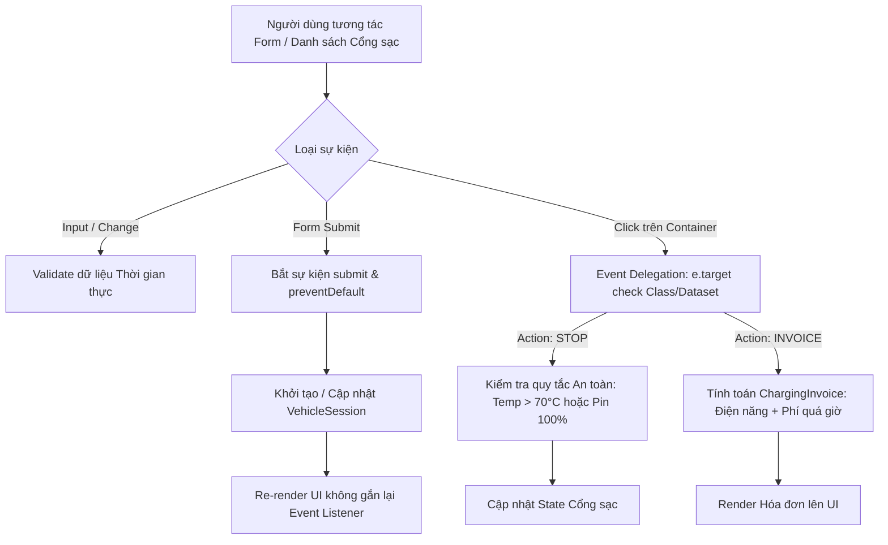

### 1. Mục tiêu bài tập
Sau khi hoàn thành bài tập này, học viên có khả năng:
- **Phân tích và phát hiện điểm nghẽn hiệu năng (Performance Bottleneck)** trong mã nguồn JavaScript xử lý sự kiện giao diện (DOM Event Handling).
- **Áp dụng kỹ thuật Event Delegation (Ủy quyền sự kiện)** để tối ưu hóa việc quản lý danh sách phần tử động, giảm thiểu bộ nhớ tiêu thụ và tránh hiện tượng Rò rỉ bộ nhớ (Memory Leak).
- **Tái cấu trúc (Refactoring)** mã nguồn legacy theo tư duy phân tách trách nhiệm (Separation of Concerns): Tách biệt logic xử lý dữ liệu nghiệp vụ, kiểm tra tính hợp lệ (Validation) và hiển thị giao diện (DOM Rendering).
- **Xử lý sự kiện Form Input chuyên sâu**: Kiểm soát luồng gửi dữ liệu với `preventDefault()`, lắng nghe và phản hồi thời gian thực với sự kiện `input`, `change`, `blur`.
- Làm quen với bài toán thực tế trong **Hệ thống Quản lý Trạm sạc Xe điện VinFast (EV_CHARGING_STATION)**.

---


### 2. Bối cảnh & Mô tả bài toán
Trạm sạc xe điện VinFast đang vận hành hệ thống giám sát phiên sạc và tính toán hóa đơn trực tuyến cho khách hàng. Tuy nhiên, phiên bản thử nghiệm của ứng dụng web đang gặp vấn đề nghiêm trọng về hiệu năng:
1. Mỗi khi danh sách các cổng sạc được cập nhật, hệ thống lại gắn lại hàng loạt sự kiện `click` cho từng nút bấm ("Dừng sạc", "Xem hóa đơn", "Cảnh báo nhiệt độ") bằng vòng lặp `forEach`. Điều này khiến ứng dụng giật lag khi số lượng cổng sạc gia tăng.
2. Mã nguồn cũ (Legacy Code) trộn lẫn logic tính tiền sạc, phí phạt quá giờ và logic thao tác DOM trực tiếp inside event listener, gây khó khăn cho việc bảo trì và nâng cấp.

Là một Senior Software Engineer tại Rikkei Education, bạn được giao nhiệm vụ **Phân tích - Tối ưu - Tái cấu trúc** module điều khiển này.


#### Sơ đồ Luồng Xử lý Sự kiện & Nghiệp vụ (Event Flow & Business Logic)



---


### 3. Quy tắc nghiệp vụ (Business Rules)


#### A. Cấu trúc Thực thể (Entities)
- **ChargingPort**: `{ id: string, name: string, type: 'REGULAR' | 'SUPER_FAST', maxPower: number, status: 'AVAILABLE' | 'CHARGING' | 'STOPPED' }`
- **VehicleSession**: `{ sessionId: string, portId: string, vehiclePlate: string, currentBattery: number, kwhConsumed: number, portTemp: number, durationMinutes: number }`
- **ChargingInvoice**: `{ invoiceId: string, portType: string, energyCost: number, overstayPenalty: number, totalAmount: number, notes: string }`


#### B. Quy tắc Bảng giá & Phạt đỗ xe
1. **Đơn giá sạc năng lượng**:
   - Cổng sạc thường (`REGULAR`): **3.850 VNĐ / kWh**.
   - Cổng sạc siêu nhanh (`SUPER_FAST`): **4.500 VNĐ / kWh**.
2. **Quy tắc Tự động ngắt sạc An toàn (Safety Auto-Cutoff)**:
   - Trạng thái sạc tự động chuyển sang `STOPPED` khi:
     - Dung lượng pin (`currentBattery`) đạt **100%**.
     - HOẶC Nhiệt độ cổng sạc (`portTemp`) **> 70°C** (Cảnh báo quá nhiệt nguy hiểm).
3. **Tính phí đỗ xe quá giờ (Overstay Penalty)**:
   - Khi xe nạp đầy pin (**100%**), khách hàng được miễn phí đỗ xe trong **30 phút đầu tiên** (Thời gian ân hạn - Grace Period).
   - Từ phút thứ **31** trở đi, áp dụng phí phạt đỗ xe chiếm dụng vị trí: **1.000 VNĐ / phút**.
   - *Công thức tính số phút phạt*: `OverstayMinutes = Math.max(0, durationMinutes - 30)` (Chỉ áp dụng khi pin đạt 100%).
   - *Lưu ý*: Nếu phiên sạc dừng do sự cố quá nhiệt (`portTemp > 70°C`) trước khi pin đạt 100%, hệ thống **không tính phí đỗ xe quá giờ**.

---


### 4. Yêu cầu kỹ thuật & Triển khai


#### A. Mã nguồn Legacy cần Phân tích & Tái cấu trúc
Dưới đây là mã nguồn cũ kém tối ưu mà bạn cần phân tích các lỗi và viết lại:

```javascript
// === LEGACY CODE (CẦN TÁI CẤU TRÚC) ===
var ports = [
  { id: "P01", type: "REGULAR", status: "CHARGING" },
  { id: "P02", type: "SUPER_FAST", status: "CHARGING" }
];

function renderLegacy() {
  const container = document.getElementById("port-list");
  container.innerHTML = "";
  
  ports.forEach(port => {
    const card = document.createElement("div");
    card.className = "port-card";
    card.innerHTML = `
      <h3>${port.id} - ${port.type}</h3>
      <button class="btn-stop">Dừng sạc</button>
      <button class="btn-invoice">In Hóa Đơn</button>
    `;
    
    // BAD PRACTICE: Gắn event handler trực tiếp trong vòng lặp rendering
    card.querySelector(".btn-stop").addEventListener("click", function() {
      alert("Đã dừng sạc cổng " + port.id);
      port.status = "STOPPED";
      renderLegacy(); // Rò rỉ memory & Re-render vô hiệu
    });

    card.querySelector(".btn-invoice").addEventListener("click", function() {
      // BAD PRACTICE: Logic tính tiền viết trực tiếp tại DOM event handler
      let price = port.type === "REGULAR" ? 3850 : 4500;
      let total = price * 20; // Hardcode kWh
      alert("Hóa đơn: " + total + " VNĐ");
    });

    container.appendChild(card);
  });
}
```


#### B. Yêu cầu Tái cấu trúc & Triển khai Chi tiết

1. **Phân tích Lỗi trong Mã nguồn cũ**:
   - Viết phần ghi chú (Comment) ở đầu file JS chỉ ra ít nhất **3 điểm nghẽn/lỗi kỹ thuật** của mã nguồn Legacy trên.

2. **Áp dụng Kỹ thuật Event Delegation**:
   - Gắn duy nhất **1 Event Listener** loại `click` vào thẻ cha chứa danh sách cổng sạc (`#charging-station-list`).
   - Sử dụng `event.target.closest()` hoặc `event.target.classList.contains()` kết hợp với `dataset` (`data-port-id`, `data-action`) để xác định hành vi ("STOP_CHARGE", "CALCULATE_INVOICE").

3. **Xử lý Sự kiện Form Input & Validation**:
   - Lắng nghe sự kiện `submit` trên Form đăng ký/cập nhật phiên sạc (`#session-form`). Bắt buộc dùng `e.preventDefault()` để tránh reload trang.
   - Bắt sự kiện `input` hoặc `blur` trên các ô nhập liệu:
     - Số kWh tiêu thụ (`kwhConsumed`): Phải là số dương `> 0`.
     - Nhiệt độ cổng sạc (`portTemp`): Hợp lệ trong khoảng `0` đến `100` (°C).
     - Thời gian đỗ (`durationMinutes`): Phải là số nguyên `>= 0`.
   - Hiển thị thông báo lỗi ngay bên dưới từng trường input (Real-time feedback) mà không cần đợi bấm Submit.

4. **Tách biệt Logic Nghiệp vụ (Modular Functions)**:
   - `calculateChargingInvoice(session, portType)`: Hàm thuần túy (Pure function) nhận vào thông tin phiên sạc và loại cổng, trả về đối tượng `ChargingInvoice`.
   - `checkSafetyCutoff(session)`: Trả về trạng thái cảnh báo và lý do tự động dừng sạc.
   - `renderPortList(ports)`: Chỉ thực hiện nhiệm vụ duy nhất là chuyển đổi dữ liệu thành HTML và render lên DOM (KHÔNG chứa bất kỳ `addEventListener` nào bên trong).

5. **Ràng buộc Phạm vi Kỹ thuật**:
   -  **KHÔNG** sử dụng Fetch API, Async/Await.
   -  **KHÔNG** sử dụng LocalStorage / SessionStorage.
   -  Toàn bộ trạng thái (State) được lưu trữ trong biến/đối tượng JS trên bộ nhớ tạm (In-memory Array/Object).

---


### 5. Quy chuẩn nộp bài

- **Cấu trúc thư mục bài nộp**:
  ```text
  student-id_homework_10/
  ├── index.html          # Giao diện HTML trạm sạc & Form input
  ├── css/
  │   └── style.css       # File định dạng giao diện
  └── js/
      ├── app.js          # Mã nguồn đã được Refactor hoàn chỉnh
      └── legacy_analysis.md # (Hoặc comment chi tiết ở đầu file app.js)
  ```
- **Quy định đặt tên file & Class**:
  - Form ID: `#session-form`
  - Container danh sách cổng: `#charging-station-list`
  - Container hiển thị hóa đơn: `#invoice-display`
  - Nút bấm action sử dụng data attribute: `data-action="stop"`, `data-action="invoice"`, `data-port-id="P01"`