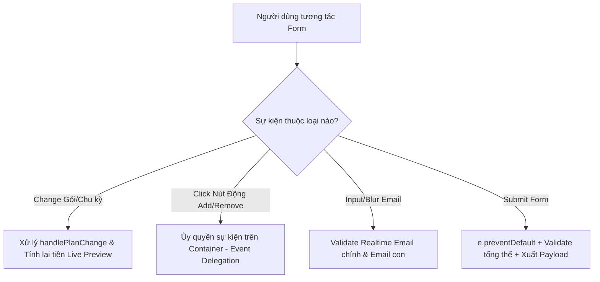

### 1. Mục tiêu bài tập
- **Phân tích & Phát hiện điểm yếu (Code Smell):** Nhận diện lỗi hiệu năng, rò rỉ bộ nhớ (memory leaks) và sự lặp lặp mã nguồn trong việc gán sự kiện (`addEventListener`) trực tiếp trên các phần tử DOM động.
- **Tái cấu trúc mã nguồn (Refactoring):** Áp dụng kỹ thuật **Ủy quyền sự kiện (Event Delegation)** trên DOM tree để quản lý toàn bộ các sự kiện của form một cách tối ưu.
- **Xử lý sự kiện Form & Input chuyên sâu:** Làm chủ các sự kiện `input`, `change`, `blur`, `submit` và phương thức `preventDefault()` để xây dựng luồng tương tác mượt mà, tính toán chi phí thời gian thực (Real-time Live Preview).
- **Hiện thực hóa Quy tắc Nghiệp vụ SaaS:** Quản lý logic gói dịch vụ (Gói Cá nhân vs. Gói Gia đình), kiểm soát số lượng tài khoản con (sub-accounts) và tính toán giảm giá theo chu kỳ thanh toán.

---


### 2. Bối cảnh & Mô tả bài toán
Bạn là một Kỹ sư Phần mềm tại nền tảng học trực tuyến **EduFlix Premium (EdTech/SaaS)**. Hệ thống đang gặp sự cố hiệu năng nghiêm trọng trên trang **Đăng ký / Nâng cấp Gói dịch vụ**. 

Đội ngũ kỹ thuật cũ đã viết một đoạn mã JavaScript xử lý Form nâng cấp gói đăng ký theo phong cách "Spaghetti Code": gán hàng loạt `addEventListener` thủ công cho từng input email, gắn event trực tiếp vào từng nút "Xóa" tài khoản con khi nó được tạo ra. Khi số lượng tài khoản con tăng lên hoặc người dùng chuyển đổi qua lại giữa gói Cá nhân và Gia đình, trang web bị chậm, xuất hiện lỗi logic dữ liệu và không thể bảo trì.

Nhiệm vụ của bạn là **phân tích đoạn mã cũ**, **tái cấu trúc toàn bộ kiến trúc xử lý sự kiện** bằng cách áp dụng **Event Delegation**, tách biệt các hàm xử lý logic nghiệp vụ và tối ưu trải nghiệm nhập liệu form.



---


### 3. Quy tắc nghiệp vụ (Business Rules)


#### A. Cấu hình Gói đăng ký (`SubscriptionPlan`) & Chu kỳ (`BillingCycle`)
1. **Gói Free (Miễn phí):**
   - Giá: `0 VNĐ/tháng`.
   - Giới hạn: Tối đa `1 thiết bị`, `0 tài khoản con`.
2. **Gói Personal (Cá nhân):**
   - Giá chuẩn: `120.000 VNĐ/tháng`.
   - Giới hạn: Tối đa `1 thiết bị phát đồng thời`, `0 tài khoản con`.
3. **Gói Family (Gia đình):**
   - Giá chuẩn: `250.000 VNĐ/tháng`.
   - Giới hạn: Tối đa `5 thiết bị phát đồng thời`, cho phép thêm từ `1 đến 5 tài khoản con` (Sub-accounts).


#### B. Chu kỳ thanh toán & Ưu đãi
- **Monthly (Theo tháng):** Giữ nguyên giá gói chuẩn.
- **Yearly (Theo năm):** Tổng tiền = `(Giá gói chuẩn * 12 tháng) * 0.8` (Giảm ngay **20%** trên tổng hóa đơn 1 năm).


#### C. Ràng buộc Form Input & Tương tác động
1. **Chuyển đổi Gói (`change` event):**
   - Nếu chọn `Family`: Hiển thị khu vực "Danh sách tài khoản con" (Mặc định xuất hiện 1 ô nhập email tài khoản con).
   - Nếu chọn `Personal` hoặc `Free`: Tự động ẩn khu vực tài khoản con và xóa sạch dữ liệu sub-accounts đã nhập trước đó.
2. **Quản lý Tài khoản con (Dynamic Sub-accounts):**
   - Nút **"Thêm tài khoản con"**: Chỉ cho phép thêm ô nhập mới nếu số lượng tài khoản con hiện tại `< 5`. Nếu đã đạt 5, disable nút hoặc thông báo lỗi.
   - Nút **"Xóa"** (cho từng ô input con): Xóa ô input tương ứng. Nếu gói là `Family`, bắt buộc phải duy trì ít nhất `1 tài khoản con` (không cho xóa ô cuối cùng).
3. **Kiểm tra dữ liệu (Validation Rules):**
   - Email tài khoản chính: Bắt buộc, đúng định dạng Email (`user@domain.com`).
   - Email tài khoản con: 
     - Không được để trống.
     - Phải đúng định dạng Email.
     - **Không trùng** với Email tài khoản chính.
     - **Không trùng nhau** giữa các tài khoản con.

---


### 4. Yêu cầu kỹ thuật & Triển khai


#### A. Mã nguồn cũ cần Phân tích & Tái cấu trúc (Legacy Code Smells)
Dưới đây là đoạn mã cũ đang gây lỗi mà bạn cần **loại bỏ và thay thế hoàn toàn**:

```javascript
// BAD PRACTICE: Gán event thủ công, lặp code, Memory Leak
document.getElementById("planSelect").addEventListener("change", function() {
    // Logic tính tiền viết trực tiếp trong event handler...
});

// BAD PRACTICE: Gán sự kiện lặp lại cho từng element động
function attachRemoveEvents() {
    let removeBtns = document.querySelectorAll(".btn-remove-sub");
    removeBtns.forEach(btn => {
        btn.addEventListener("click", function(e) {
            e.target.parentElement.remove(); // Memory leak nếu không xóa listener đúng cách
        });
    });
}
```


#### B. Yêu cầu Tái cấu trúc (Refactored Architecture)
1. **Áp dụng Event Delegation (Bắt buộc):**
   - Chỉ đăng ký **MỘT** listener sự kiện `click` duy nhất trên container chứa danh sách sub-accounts (`#subAccountContainer`) để xử lý cả hành vi "Thêm" và "Xóa" bằng cách đọc `e.target`.
   - Chỉ đăng ký **MỘT** listener sự kiện `input`/`blur` duy nhất trên Form hoặc Container để kiểm tra validation realtime cho tất cả input emails.
2. **Tách biệt hàm Xử lý (Modular Code):**
   - `calculateTotalPrice(plan, billingCycle)`: Hàm thuần túy (pure function) trả về số tiền phải thanh toán.
   - `validateEmail(email)`: Trả về `true`/`false`.
   - `validateFormState()`: Kiểm tra toàn bộ tính hợp lệ của form, cập nhật trạng thái các câu thông báo lỗi (Error messages) trên UI.
   - `renderBillingPreview()`: Cập nhật thông tin tổng tiền và quyền lợi ra màn hình dựa trên dữ liệu realtime.
3. **Xử lý Sự kiện Submit (`submit` event):**
   - Đăng ký sự kiện `submit` trên thẻ `<form id="subscriptionForm">`.
   - Sử dụng `e.preventDefault()` để chặn reload trang.
   - Nếu dữ liệu hợp lệ (valid), đóng gói dữ liệu thành JSON Object (chuẩn bị cho backend) và in ra Console theo cấu trúc bên dưới. Nếu không hợp lệ, focus vào ô input bị lỗi đầu tiên.

```json
{
  "primaryAccount": "nguyenvana@gmail.com",
  "selectedPlan": "Family",
  "billingCycle": "Yearly",
  "subAccounts": ["child1@gmail.com", "child2@gmail.com"],
  "totalPayment": 2400000,
  "discountApplied": "20%"
}
```


#### C. Scope Ràng buộc nghiêm ngặt
-  **KHÔNG** sử dụng Fetch API hoặc Async/Await (Thuộc phạm vi Session 21).
-  **KHÔNG** sử dụng LocalStorage / SessionStorage (Thuộc phạm vi Session 23).
-  Tất cả xử lý hoàn toàn dựa trên DOM Events, Data Manipulation và State trên JS Memory.

---


### 5. Quy chuẩn nộp bài
- Cấu trúc thư mục dự án chuẩn:
  ```text
  saas-subscription-refactor/
  ├── index.html
  ├── css/
  │   └── style.css
  └── js/
      └── app.js
  ```
- File `app.js` phải chứa comment phân tích rõ ràng:
  - Chỉ ra 2 điểm yếu lớn nhất của đoạn mã legacy cũ.
  - Giải thích tại sao **Event Delegation** giúp giải quyết triệt để các điểm yếu đó.