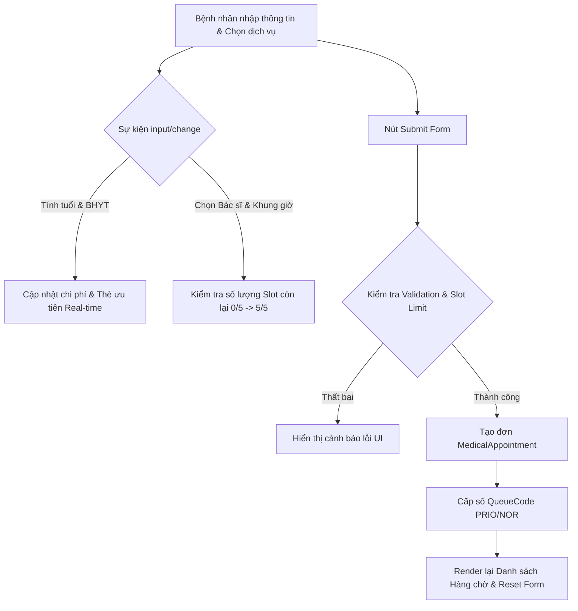

### 1. Mục tiêu bài tập
- **Xử lý sự kiện nâng cao:** Thành thạo đăng ký và điều khiển các sự kiện DOM (`submit`, `input`, `change`, `click`) để xây dựng giao diện tương tác thời gian thực (real-time UI update).
- **Quản lý trạng thái ứng dụng (In-Memory State Management):** Thiết kế mô hình dữ liệu tập trung lưu trữ trạng thái hàng chờ và lịch hẹn trong bộ nhớ tạm thời mà không phụ thuộc vào bộ lưu trữ ngoài.
- **Xử lý logic nghiệp vụ FinTech & Y tế:** Triển khai động cơ tính toán chi phí khám bệnh, áp dụng chính sách giảm trừ Bảo hiểm Y tế (BHYT) và ưu tiên cấp số tự động cho các đối tượng đặc biệt.
- **Ràng buộc & Kiểm lỗi Form Validation:** Kiểm soát chặt chẽ dữ liệu đầu vào, ngăn chặn trùng lặp, xử lý logic giới hạn tải năng lực phục vụ (Slot Capacity) của bác sĩ.

---


### 2. Bối cảnh & Mô tả bài toán
Tập đoàn Y tế FinTech **CareTech Solutions** đang phát triển hệ thống Kiosk tự phục vụ (Self-service Booking Kiosk) đặt tại sảnh các bệnh viện đa khoa. Kiosk này cho phép bệnh nhân tự đăng ký khám, lấy số thứ tự tự động và thanh toán tạm tính chi phí khám bệnh ban đầu.

Bệnh nhân sẽ nhập thông tin cá nhân, chọn bác sĩ chuyên khoa, chọn khung giờ khám và khai báo BHYT. Hệ thống cần tính toán số tiền thực trả ngay trên màn hình và cấp mã số thứ tự (Queue Code) dựa trên quy tắc ưu tiên.



---


### 3. Quy tắc nghiệp vụ (Business Rules)

1. **Công thức tính toán Chi phí khám bệnh (Financial Calculation):**
   - **Đơn giá gốc bác sĩ (`baseFee`):**
     - Khám Tổng Khoát (Nhi/Nội/Ngoại): `200.000 VNĐ`
     - Khám Chuyên Khoa Sâu (Tim mạch/Thần kinh): `500.000 VNĐ`
   - **Chính sách BHYT:** Nếu bệnh nhân tích chọn "Có BHYT" (`isInsurance = true`), bệnh nhân được BHYT chi trả 80% chi phí khám ban đầu. 
     $$\text{Chi phí thực trả} = \text{baseFee} \times (1 - 0.8) = \text{baseFee} \times 0.2$$
   - Nếu không có BHYT (`isInsurance = false`), thanh toán 100% đơn giá gốc.

2. **Quy tắc Phân hạng Ưu tiên (Priority Level):**
   - Tuổi bệnh nhân = $\text{Năm hiện tại} - \text{Năm sinh}$.
   - Đối tượng **ƯU TIÊN (`PRIORITY`)**: Bệnh nhân từ **70 tuổi trở lên** ($\text{Tuổi} \ge 70$) **HOẶC** Nữ giới đang mang thai (`isPregnant = true`).
   - Đối tượng **THƯỜNG (`REGULAR`)**: Các trường hợp còn lại.
   - **Định dạng Mã số thứ tự (`queueCode`):**
     - Ưu tiên: `PRIO-001`, `PRIO-002`, ...
     - Thường: `NOR-001`, `NOR-002`, ...

3. **Ràng buộc Năng lực Phục vụ (Slot Limit Rule):**
   - Mỗi Bác sĩ trong một **Khung giờ (`timeSlot`)** chỉ tiếp nhận tối đa **5 bệnh nhân**.
   - Khung giờ hợp lệ: `"08:00 - 09:00"`, `"09:00 - 10:00"`, `"10:00 - 11:00"`, `"14:00 - 15:00"`.
   - Nếu một khung giờ của bác sĩ đã đủ 5 bệnh nhân:
     - Ngay khi người dùng chọn Khung giờ đó trên UI, hiển thị cảnh báo "Khung giờ đã đầy (5/5)".
     - Vẫn giữ nút Đăng ký ở trạng thái `disabled` hoặc chặn sự kiện `submit` và báo lỗi.

---


### 4. Yêu cầu kỹ thuật & Triển khai


#### 4.1 Mô hình Dữ liệu In-Memory (State Management)
Khai báo các mảng khởi tạo sẵn dữ liệu trong JavaScript:
```javascript
// Danh sách Bác sĩ
const DOCTORS = [
    { id: "DOC01", name: "BS. Nguyễn Văn A", specialty: "General", fee: 200000 },
    { id: "DOC02", name: "BS. Trần Thị B", specialty: "Cardiology", fee: 500000 },
    { id: "DOC03", name: "BS. Lê Hoàng C", specialty: "Neurology", fee: 500000 }
];

// Mảng chứa các cuộc hẹn đã đăng ký thành công
const appointments = [];
```


#### 4.2 Cấu trúc HTML Form (`index.html`)
Tạo một Form đặt lịch bao gồm các trường bắt buộc sau:
- **Họ và tên (`#fullName`):** Text input.
- **Năm sinh (`#birthYear`):** Number input (từ 1900 đến năm hiện tại).
- **Giới tính (`#gender`):** Select (Nam/Nữ).
- **Mang thai (`#isPregnant`):** Checkbox (Ẩn nếu giới tính là Nam, hiện nếu giới tính là Nữ).
- **Có BHYT (`#isInsurance`):** Checkbox.
- **Chọn Bác sĩ (`#doctorId`):** Select (render động từ mảng `DOCTORS`).
- **Chọn Khung giờ (`#timeSlot`):** Select.
- **Khu vực hiển thị Real-time dynamic UI:**
  - `#estimatedFeeDisplay`: Hiển thị số tiền tạm tính định dạng VNĐ (Ví dụ: `100.000 VNĐ`).
  - `#priorityBadgeDisplay`: Hiển thị badge label "ƯU TIÊN" hoặc "THƯỜNG".
  - `#slotStatusDisplay`: Hiển thị trạng thái chỗ trống (Ví dụ: `Còn 3/5 vị trí`).


#### 4.3 Xử lý Sự kiện (Event Handlers implementation)
Viết code trong file `main.js`:
1. **Sự kiện `change` trên `#gender`:**
   - Khi chọn "Nam": Ẩn checkbox Mang thai và đặt `checked = false`.
   - Khi chọn "Nữ": Hiện checkbox Mang thai.
2. **Sự kiện `input` / `change` trên Form (Form Real-time Preview):**
   - Khi thay đổi Năm sinh, BHYT, Bác sĩ, Mang thai:
     - Tự động tính lại chi phí tạm tính và update innerText của `#estimatedFeeDisplay`.
     - Tự động kiểm tra điều kiện ưu tiên và update UI `#priorityBadgeDisplay`.
   - Khi chọn Bác sĩ và Khung giờ:
     - Đếm số lượng cuộc hẹn hiện có trong mảng `appointments` thỏa mãn `doctorId` và `timeSlot`.
     - Hiển thị số slot còn trống lên `#slotStatusDisplay`. Nếu hết slot (count >= 5), đổi màu chữ thành đỏ.
3. **Sự kiện `submit` trên Form (`#bookingForm`):**
   - Gọi `e.preventDefault()`.
   - Validate dữ liệu:
     - Họ tên không được để trống hoặc chỉ chứa khoảng trắng.
     - Năm sinh phải từ 1900 đến 2026.
     - Phải chọn Bác sĩ và Khung giờ.
     - Kiểm tra nếu slot đã đầy (>= 5), báo lỗi bằng `alert` hoặc thẻ hiển thị lỗi UI, dừng xử lý.
   - Nếu hợp lệ:
     - Tạo đối tượng `newAppointment`:
       ```javascript
       {
           id: "APT-" + Date.now(),
           queueCode: "PRIO-001", // hoặc NOR-001 tùy logic
           patientName: "...",
           birthYear: 1950,
           doctorName: "...",
           timeSlot: "...",
           finalFee: 40000,
           isPriority: true
       }
       ```
     - Thêm `newAppointment` vào mảng `appointments`.
     - Gọi hàm `renderQueueTable()` để vẽ lại bảng danh sách số thứ tự khám trên màn hình.
     - Reset form về trạng thái ban đầu.

---


### 5. Quy chuẩn nộp bài
- **Cấu trúc thư mục dự án:**
  ```text
  student_id_session19/
  ├── index.html
  ├── css/
  │   └── style.css
  └── js/
      └── main.js
  ```
- **Quy định đặt tên:** Mã sinh viên + Session19 (Ví dụ: `B01234_Session19`).
- **Mã nguồn:** Code JS thuần (Vanilla JS), trình bày rõ ràng, phân chia hàm (modular functions), có comment giải thích các logic quan trọng.