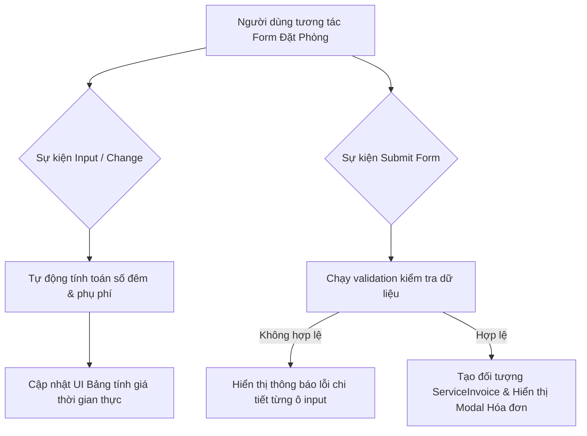

### 1. Mục tiêu bài tập
- **Xử lý sự kiện nâng cao:** Thành thạo sử dụng `addEventListener` cho nhiều loại sự kiện DOM (`input`, `change`, `submit`, `click`) trên các phần tử Form.
- **Quản lý hành vi Form mặc định:** Làm chủ việc sử dụng `event.preventDefault()` để kiểm soát quá trình nộp dữ liệu và ngăn chặn tải lại trang.
- **Tư duy thiết kế Mini Module UI:** Xây dựng cấu trúc code JavaScript theo dạng Module/Class chuyên nghiệp, phân tách rõ ràng giữa **Logic nghiệp vụ (Business Logic)** và **Logic thao tác giao diện (DOM Manipulation)**.
- **Xử lý dữ liệu & Tương tác Thời gian thực (Real-time Feedback):** Tính toán phụ phí, kiểm tra tính hợp lệ dữ liệu (Validation) và cập nhật hóa đơn trực tiếp khi người dùng thao tác mà không cần bấm submit.

---


### 2. Bối cảnh & Mô tả bài toán
Bạn là Lập trình viên Frontend tại một nền tảng du lịch trực tuyến (tương tự Agoda / Traveloka). Bạn được giao nhiệm vụ xây dựng **Mini Module Đặt phòng & Tính phí tự động (Hotel Booking Calculator & Invoice Generator)** tích hợp trực tiếp trên trang chi tiết khách sạn.

Module này cần lắng nghe mọi sự kiện thay đổi của người dùng trên Form (chọn loại phòng, số lượng khách, ngày nhận/trả phòng, dịch vụ đi kèm) để tính toán chi tiết giá tiền real-time, đồng thời kiểm tra tính hợp lệ của dữ liệu trước khi xuất hóa đơn xác nhận đặt phòng.



---


### 3. Quy tắc nghiệp vụ (Business Rules)


#### A. Giá phòng cơ sở (Base Room Price)
- **Standard:** 800,000 VNĐ / đêm
- **Deluxe:** 1,500,000 VNĐ / đêm
- **Suite:** 3,000,000 VNĐ / đêm


#### B. Quy tắc tính số đêm & Phụ thu Check-in sớm
1. **Số đêm lưu trú:** Tính theo chênh lệch ngày giữa `Check-in Date` và `Check-out Date` (tối thiểu 1 đêm).
2. **Phụ thu Check-in sớm:**
   - Giờ nhận phòng tiêu chuẩn: Từ 14:00.
   - Nếu giờ Check-in được chọn **trước 12:00 trưa**: Phụ thu **30% giá của 01 đêm** phòng đã chọn.
   - Từ 12:00 đến trước 14:00: Không phụ thu.


#### C. Quy tắc Người ở & Trẻ em
1. **Người lớn:**
   - Số người lớn mặc định miễn phí/đã bao gồm trong giá phòng: Tối đa 2 người lớn.
   - Từ người lớn thứ 3 trở đi: Phụ thu **200,000 VNĐ / người lớn / đêm**.
2. **Trẻ em:**
   - Trẻ em dưới 6 tuổi: Miễn phí (0 VNĐ).
   - Trẻ em từ 6 đến 11 tuổi: Phụ thu **150,000 VNĐ / trẻ / đêm**.
   - Trẻ em từ 12 tuổi trở lên: Tính giá như 1 người lớn.


#### D. Phụ phí Dịch vụ đi kèm (Optional Services)
- **Buffet Bữa sáng:** 150,000 VNĐ / người / ngày (tính cho tất cả người lớn + trẻ em từ 6 tuổi trở lên).
- **Đưa đón sân bay:** 350,000 VNĐ (tính trọn gói 1 lần).
- **Dịch vụ Spa thư giãn:** 500,000 VNĐ (tính trọn gói 1 lần).


#### E. Ràng buộc & Validation dữ liệu
1. **Ngày nhận/trả:** Ngày Check-out phải **sau** ngày Check-in ít nhất 1 ngày.
2. **Họ và tên khách hàng:** Chuỗi không rỗng, độ dài từ 3 đến 50 ký tự.
3. **Số điện thoại:** Đúng định dạng 10 chữ số (bắt đầu bằng số 0).
4. **Email:** Đúng định dạng email tiêu chuẩn (chứa `@` và `.`).

---


### 4. Yêu cầu kỹ thuật & Triển khai


#### A. Cấu trúc DOM Form yêu cầu
Tạo giao diện HTML/CSS cơ bản chứa các trường dữ liệu:
- Loại phòng (`<select id="roomType">`)
- Ngày nhận phòng (`<input type="date" id="checkInDate">`)
- Giờ nhận phòng (`<input type="time" id="checkInTime">`)
- Ngày trả phòng (`<input type="date" id="checkOutDate">`)
- Số lượng người lớn (`<input type="number" id="adultCount">`)
- Số lượng trẻ em dưới 6 tuổi (`<input type="number" id="childUnder6">`)
- Số lượng trẻ em 6-11 tuổi (`<input type="number" id="child6to11">`)
- Dịch vụ kèm theo (`<input type="checkbox" class="service-checkbox">`)
- Thông tin cá nhân: Họ tên (`#fullName`), SĐT (`#phone`), Email (`#email`)
- Khối hiển thị Tổng tiền thời gian thực (`#liveTotalPreview`)
- Nút bấm Đặt phòng (`<button type="submit">`) và Khối hiển thị Hóa đơn xác nhận (`#invoiceModal`).


#### B. Tổ chức Mã nguồn JavaScript (Module Pattern / Class)
Yêu cầu thiết kế Class `BookingModule` quản lý toàn bộ logic:

```javascript
class BookingModule {
  constructor(formSelector, previewSelector) {
    // Khởi tạo các element DOM và dữ liệu trạng thái
  }

  init() {
    // Đăng ký toàn bộ các event listener
  }

  // Hàm lắng nghe các sự kiện input/change để tính tiền real-time
  attachRealtimeEvents() { ... }

  // Hàm tính toán chi tiết tổng hóa đơn
  calculateTotal() {
    // Trả về object chứa: basePrice, nights, earlyFee, extraAdultFee, childFee, serviceFee, totalAmount
  }

  // Hàm cập nhật UI xem trước thời gian thực
  updateLivePreview() { ... }

  // Hàm validate dữ liệu form khi submit
  validateForm() { ... }

  // Hàm xử lý khi người dùng ấn Submit Form
  handleSubmit(event) { ... }

  // Hàm hiển thị Hóa đơn xác nhận cuối cùng
  renderInvoice(bookingData) { ... }
}
```


#### C. Quy định Kỹ thuật bắt buộc
- **Không** sử dụng Async/Await, Fetch API hay LocalStorage.
- Sử dụng `event.preventDefault()` để xử lý Form submission.
- Phải lắng nghe sự kiện `input` hoặc `change` trên toàn bộ Form để cập nhật ô hiển thị giá ngay lập tức khi người dùng chọn/thay đổi thông tin.
- Lỗi validation phải hiển thị ngay dưới từng trường dữ liệu bằng văn bản màu đỏ (không dùng `alert()`).

---


### 5. Quy chuẩn nộp bài
- **Cấu trúc thư mục dự án:**
  ```text
  hotel-booking-module/
  ├── index.html
  ├── css/
  │   └── style.css
  └── js/
      ├── booking-logic.js
      └── app.js
  ```
- File `booking-logic.js` chứa Class `BookingModule`. File `app.js` thực hiện khởi tạo module khi DOM đã sẵn sàng (`DOMContentLoaded`).