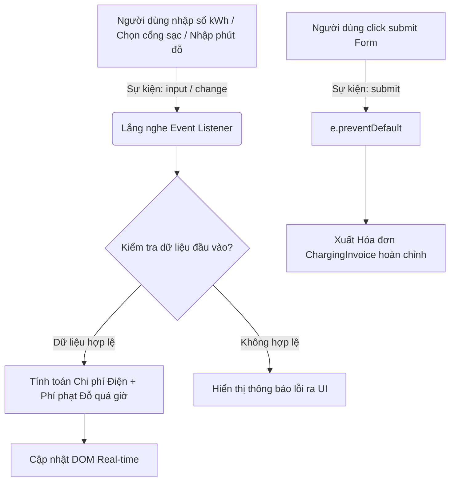

### 1. Mục tiêu bài tập
Sau khi hoàn thành bài tập này, học viên có khả năng:
- **Phát hiện và sửa lỗi (Debug)** các lỗi phổ biến liên quan đến xử lý sự kiện trong JavaScript (`submit`, `input`, `change`).
- **Khắc phục lỗi reload trang**: Sử dụng `event.preventDefault()` đúng cách trong sự kiện submit form.
- **Xử lý sự kiện thời gian thực (Real-time)**: Gán sự kiện `input` và `change` trên các thẻ `<input>` và `<select>` để cập nhật kết quả tính toán chi phí sạc ngay lập tức.
- **Chuyển đổi kiểu dữ liệu & Ép kiểu**: Xử lý triệt để lỗi nối chuỗi ngoài ý muốn khi lấy `value` từ thẻ HTML Input.
- **Ràng buộc nghiệp vụ đầu vào (Validation)**: Kiểm tra hợp lệ dữ liệu sạc điện thoại/xe điện và hiển thị thông báo lỗi thân thiện trên DOM.

---


### 2. Bối cảnh & Mô tả bài toán
Trạm sạc xe điện **VinFast EV Charging** đang vận hành ứng dụng Web giúp tài xế ước tính hóa đơn sạc xe điện (`ChargingInvoice`) dựa trên loại cổng sạc (`ChargingPort`) và thời gian đỗ xe sau khi sạc xong tại trạm (`VehicleSession`).

Lập trình viên Junior trước đó đã xây dựng giao diện tính tiền nhưng mã JavaScript hiện đang gặp nhiều lỗi nghiêm trọng:
1. Mỗi khi nhấn nút "Xác nhận hóa đơn", trang web bị tải lại (reload) và mất sạch dữ liệu.
2. Khi nhập số kWh điện tiêu thụ (`KwhMeter`), kết quả tính toán ra chuỗi ký tự kỳ lạ (`NaN` hoặc nối chuỗi thay vì phép cộng/nhân).
3. Đổi loại cổng sạc hoặc nhập thời gian quá giờ nhưng chi phí không tự động cập nhật real-time.
4. Phí phạt đỗ quá giờ bị tính âm tiền nếu khách hàng rời đi trước 30 phút.

Nhiệm vụ của bạn là **tìm lỗi (Debug), sửa lại đoạn mã hỏng (Buggy Code)** và viết lại chương trình hoạt động chuẩn xác theo sơ đồ luồng sự kiện bên dưới.


#### Sơ đồ luồng sự kiện (Event Flow)


---


### 3. Quy tắc nghiệp vụ (Business Rules)
1. **Đơn giá sạc theo loại cổng (`ChargingPort`)**:
   - Cổng sạc Thường (`STANDARD`): **3.850 VNĐ / kWh**
   - Cổng sạc Siêu nhanh (`FAST`): **4.500 VNĐ / kWh**
2. **Phí phạt đỗ xe quá giờ (Overtime Fee)**:
   - **30 phút đầu tiên** sau khi sạc đầy: Miễn phí.
   - Từ **phút thứ 31 trở đi**: Phạt **1.000 VNĐ / phút**.
   - *Công thức tính phút quá giờ*: $\text{Phút phạt} = \max(0, \text{Tổng phút đỗ} - 30)$.
3. **Công thức hóa đơn (`ChargingInvoice`)**:
   - $\text{Tiền điện} = \text{Số kWh} \times \text{Đơn giá cổng sạc}$
   - $\text{Phí phạt} = \text{Phút phạt} \times 1.000\text{ VNĐ}$
   - $\text{Tổng thanh toán} = \text{Tiền điện} + \text{Phí phạt}$
4. **Quy tắc Kiểm tra dữ liệu (Validation)**:
   - Số kWh sạc phải là số thực $> 0$. Nếu $\le 0$ hoặc để trống $\rightarrow$ Báo lỗi *"Số kWh sạc phải lớn hơn 0"*.
   - Phút đỗ quá giờ phải là số nguyên $\ge 0$. Nếu $< 0$ hoặc để trống $\rightarrow$ Báo lỗi *"Thời gian đỗ xe không được nhỏ hơn 0"*.

---


### 4. Yêu cầu kỹ thuật & Triển khai


#### 4.1. Mã nguồn hiện tại bị lỗi (Buggy Starter Code)
Hãy copy đoạn mã dưới đây và sửa lại cho đúng:

**`index.html`**
```html
<!DOCTYPE html>
<html lang="vi">
<head>
    <meta charset="UTF-8">
    <title>VinFast EV Charging Station - Hóa đơn sạc xe</title>
    <style>
        body { font-family: Arial, sans-serif; margin: 20px; line-height: 1.6; }
        .card { border: 1px solid #ccc; padding: 20px; width: 400px; border-radius: 8px; }
        .form-group { margin-bottom: 15px; }
        label { display: block; font-weight: bold; }
        input, select { width: 100%; padding: 8px; margin-top: 5px; box-sizing: border-box; }
        .error { color: red; font-size: 0.85em; display: none; }
        .result-box { background: #f4f4f4; padding: 10px; margin-top: 15px; border-radius: 4px; }
        button { background: #0056b3; color: white; border: none; padding: 10px 15px; cursor: pointer; width: 100%; font-size: 16px; }
    </style>
</head>
<body>
    <div class="card">
        <h2>Trạm Sạc Xe Điện VinFast</h2>
        <form id="charging-form">
            <div class="form-group">
                <label for="port-type">Loại cổng sạc:</label>
                <select id="port-type">
                    <option value="STANDARD">Sạc thường (3.850 đ/kWh)</option>
                    <option value="FAST">Sạc siêu nhanh (4.500 đ/kWh)</option>
                </select>
            </div>
            
            <div class="form-group">
                <label for="kwh-meter">Điện năng tiêu thụ (kWh):</label>
                <input type="number" id="kwh-meter" placeholder="Nhập số kWh...">
                <span id="kwh-error" class="error"></span>
            </div>

            <div class="form-group">
                <label for="overtime-minutes">Thời gian đỗ thêm (phút):</label>
                <input type="number" id="overtime-minutes" value="0">
                <span id="overtime-error" class="error"></span>
            </div>

            <button type="submit" id="btn-submit">Xác Nhận Hóa Đơn</button>
        </form>

        <div class="result-box">
            <p>Tiền điện: <strong id="electricity-cost">0</strong> VNĐ</p>
            <p>Phí đỗ quá giờ: <strong id="penalty-cost">0</strong> VNĐ</p>
            <h3>Tổng tiền: <strong id="total-cost">0</strong> VNĐ</h3>
        </div>
    </div>

    <script src="script.js"></script>
</body>
</html>
```

**`script.js` (Mã nguồn chứa lỗi cần Debug)**
```javascript
// Ghi chú: Mã nguồn này đang chứa ít nhất 5 lỗi logic và xử lý sự kiện!
var formEl = document.getElementById("charging-form");
var portTypeEl = document.getElementById("port-type");
var kwhMeterEl = document.getElementById("kwh-meter");
var overtimeEl = document.getElementById("overtime-minutes");

// Lỗi 1: Gán sự kiện submit sai cách làm trang web bị reload
formEl.onsubmit = function() {
    calculateInvoice();
}

// Lỗi 2: Không lắng nghe sự kiện input/change để tính toán real-time
kwhMeterEl.addEventListener("change", calculateInvoice()); 

function calculateInvoice() {
    var kwh = kwhMeterEl.value; // Lỗi 3: Chưa ép kiểu dữ liệu
    var minutes = overtimeEl.value;
    var port = portTypeEl.value;

    // Lỗi 4: Phí phạt đỗ quá giờ bị tính âm nếu minutes < 30
    var penaltyMinutes = minutes - 30; 
    var penaltyCost = penaltyMinutes * 1000;

    var pricePerKwh = 0;
    if (port = "STANDARD") { // Lỗi 5: Toán tử gán thay vì so sánh
        pricePerKwh = 3850;
    } else {
        pricePerKwh = 4500;
    }

    var electricityCost = kwh * pricePerKwh;
    var totalCost = electricityCost + penaltyCost;

    // Hiển thị kết quả
    document.getElementById("electricity-cost").innerText = electricityCost;
    document.getElementById("penalty-cost").innerText = penaltyCost;
    document.getElementById("total-cost").innerText = totalCost;
}
```


#### 4.2. Yêu cầu Nhiệm vụ
1. **Debug & Sửa lỗi**:
   - Sửa lỗi ngăn cản form làm reload trang web khi click nút submit (sử dụng `e.preventDefault()`).
   - Sửa lỗi toán tử so sánh chuỗi trong câu lệnh `if`.
   - Chuyển đổi dữ liệu từ `input.value` sang kiểu số (`parseFloat` / `parseInt`).
   - Xử lý lại logic tính `penaltyMinutes`: Nếu `minutes <= 30` thì phí phạt phải là `0`.
   - Lắng nghe đúng các sự kiện `input` (cho ô nhập số kWh, thời gian đỗ) và `change` (cho dropdown chọn cổng sạc) để ứng dụng tự động tính tiền ngay khi người dùng gõ/chọn mà không cần đợi ấn button.
2. **Thêm Validation**:
   - Nếu `kwh <= 0` hoặc rỗng: Hiển thị thẻ `#kwh-error` nội dung *"Số kWh sạc phải lớn hơn 0"*, ẩn kết quả tính toán.
   - Nếu `minutes < 0` hoặc rỗng: Hiển thị thẻ `#overtime-error` nội dung *"Thời gian đỗ xe không được nhỏ hơn 0"*, ẩn kết quả tính toán.
   - Nếu dữ liệu hợp lệ: Phải ẩn các thẻ báo lỗi (`display: none`) và hiển thị kết quả đã được định dạng (Format số có phân tách hàng nghìn như `15.000` hoặc dùng `Number.prototype.toLocaleString('vi-VN')`).

---


### 5. Quy chuẩn nộp bài
- Cấu trúc thư mục nộp bài:
  ```text
  EV_Charging_Calculator/
  ├── index.html
  ├── script.js
  └── debug_report.md
  ```
- File `debug_report.md`: Trình bày ngắn gọn ít nhất **4 lỗi** bạn đã tìm thấy trong file `script.js` ban đầu, giải thích nguyên nhân gây ra lỗi và cách bạn đã khắc phục lỗi đó.