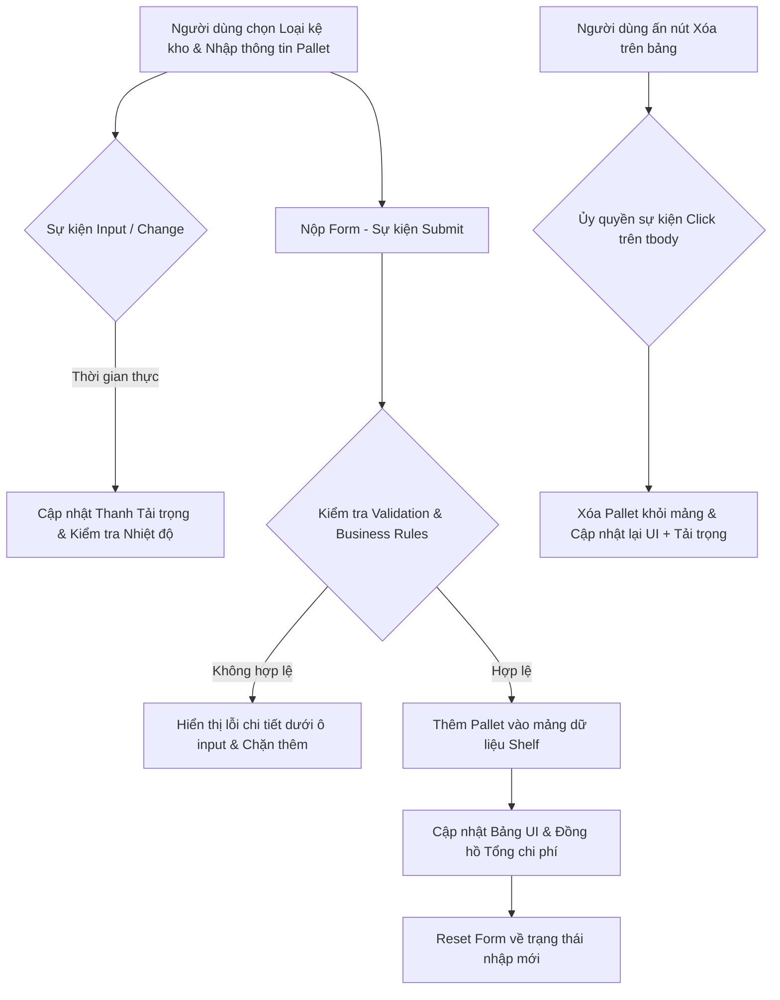

### 1. Mục tiêu bài tập
- **Xử lý sự kiện Form & Input:** Làm chủ các sự kiện DOM gồm `submit`, `input`, `change`, `blur` và áp dụng `e.preventDefault()` để kiểm soát luồng xử lý dữ liệu hoàn toàn ở phía Client-side.
- **Ủy quyền sự kiện (Event Delegation):** Tối ưu hiệu năng khi lắng nghe sự kiện thao tác (xóa/cập nhật) trên danh sách phần tử DOM được tạo động.
- **Phản hồi giao diện thời gian thực (Real-time UI Feedback):** Cập nhật đồng hồ đo tải trọng (Weight Indicator Gauge) và tính toán chi phí lưu kho ngay khi người dùng nhập dữ liệu hoặc thay đổi cấu hình loại kệ.
- **Thực thi Quy tắc Nghiệp vụ (Business Rules Validation):** Ràng buộc logic lưu kho logistics thực tế đối với thiết bị quản lý kho bãi `WAREHOUSE_LOGISTICS`.

---


### 2. Bối cảnh & Mô tả bài toán
Tại trung tâm tiếp nhận hàng hóa của doanh nghiệp Logistics **WAREHOUSE_LOGISTICS**, các nhân viên vận hành kho cần một ứng dụng Web Client-side để kiểm soát việc phân bổ các kiện hàng (**Pallet**) lên từng ô kệ kho (**Warehouse Shelf**). 

Mỗi ô kệ kho có tải trọng tối đa nghiêm ngặt và quy định nhiệt độ môi trường khắt khe tùy theo loại kệ (Kệ Thường hoặc Kệ Kho Lạnh). Việc xếp quá tải trọng hoặc sai nhiệt độ bảo quản sẽ gây hỏng hóc hàng hóa và mất an toàn lao động.

Bạn được giao nhiệm vụ xây dựng màn hình **"Hệ thống Tiếp nhận & Phân bổ Kiện hàng lên Kệ Kho"** cho phép nhập thông tin Pallet, kiểm tra các điều kiện an toàn kho thời gian thực, hiển thị danh sách các Pallet đang lưu trữ và tự động tính toán tổng chi phí lưu kho phát sinh.



---


### 3. Quy tắc nghiệp vụ (Business Rules)

1. **Sức chứa & Tải trọng Kệ kho (`WarehouseShelf`):**
   - Tải trọng tối đa của 1 ô kệ kho cố định là **500 kg**.
   - **Chặn nhập kho:** Nếu `Tổng trọng lượng hiện tại của kệ + Trọng lượng Pallet mới > 500 kg`, hệ thống phải từ chối tiếp nhận và hiển thị thông báo lỗi: *"Tải trọng kệ kho vượt quá giới hạn an toàn (Tối đa 500 kg)"*.

2. **Quy định Nhiệt độ Bảo quản (`Storage Temperature`):**
   - **Kệ Thường (`STANDARD`):** Chỉ chấp nhận các kiện hàng có nhiệt độ bảo quản từ **15°C đến 40°C**.
   - **Kệ Kho Lạnh (`COLD`):** Chỉ chấp nhận các kiện hàng có nhiệt độ bảo quản từ **-18°C đến 5°C**.
   - Khi người dùng thay đổi loại kệ trên Form (sự kiện `change`), khoảng nhiệt độ hợp lệ phải được cập nhật lại và hiển thị dưới dạng văn bản gợi ý cho người dùng.

3. **Mã Pallet (`Pallet Code`):**
   - Định dạng bắt buộc: Phải bắt đầu bằng tiền tố `PL-` theo sau là đúng 4 chữ số (Ví dụ hợp lệ: `PL-1024`, `PL-0089`).
   - Mã Pallet phải là **duy nhất** trên kệ kho hiện tại (không được trùng với các Pallet đã có trong bảng).

4. **Đơn giá & Phụ phí Lưu kho (`Storage Cost`):**
   - Đơn giá lưu kho cơ sở theo ngày (`dailyRate`): Phải là số dương (> 0 VNĐ/kg/ngày).
   - **Công thức tính Phí lưu kho hằng ngày của một Pallet (`dailyCost`):**
     - Dành cho Kệ Thường: $\text{dailyCost} = \text{trọng lượng (kg)} \times \text{đơn giá cơ sở}$
     - Dành cho Kệ Kho Lạnh: $\text{dailyCost} = \text{trọng lượng (kg)} \times \text{đơn giá cơ sở} \times 1.25$ *(Phụ phí 25% duy trì hệ thống làm lạnh)*.

---


### 4. Yêu cầu kỹ thuật & Triển khai


#### A. Cấu trúc Giao diện (HTML/DOM Constraints)
Xây dựng file `index.html` chứa các thành phần DOM với các `id` chuẩn sau:
- **Form tiếp nhận:** `<form id="palletForm">`
- **Các trường Input:**
  - `#shelfType` (`<select>`): Chọn loại kệ kho (`STANDARD` / `COLD`).
  - `#palletCode` (`<input type="text">`): Nhập mã Pallet.
  - `#palletWeight` (`<input type="number">`): Nhập trọng lượng (kg).
  - `#palletTemp` (`<input type="number">`): Nhập nhiệt độ bảo quản (°C).
  - `#dailyRate` (`<input type="number">`): Nhập đơn giá lưu kho cơ sở (VNĐ/kg/ngày).
- **Khu vực hiển thị trạng thái:**
  - `#shelfUsageBar`: Thanh progress bar hoặc thẻ `<div>` thể hiện tỷ lệ % tải trọng đã dùng của kệ (`currentWeight / 500 * 100%`).
  - `#shelfUsageText`: Thẻ hiển thị văn bản tải trọng (ví dụ: `250 / 500 kg (50%)`).
  - `#totalStorageCost`: Thẻ hiển thị tổng phí lưu kho ước tính/ngày của tất cả Pallet đang có trên kệ.
- **Bảng danh sách Pallet:**
  - `<table id="palletTable">` chứa `<tbody id="palletList">` để render danh sách các Pallet.


#### B. Yêu cầu Xử lý Sự kiện trong Javascript (`app.js`)

> **CẢNH BÁO CẤM:** Không sử dụng `fetch`, `async/await`, `axios`, hoặc `localStorage`/`sessionStorage`. Tất cả trạng thái ứng dụng (state) phải được quản lý trong bộ nhớ RAM thông qua mảng/object JavaScript.

1. **Sự kiện `change` trên `#shelfType`:**
   - Khi đổi giữa `Kệ Thường` và `Kệ Kho Lạnh`, cập nhật nhãn/gợi ý khoảng nhiệt độ cho phép ngay trên giao diện.
   - Chạy lại kiểm tra (re-validate) ô nhiệt độ `#palletTemp` nếu người dùng đã nhập giá trị trước đó.

2. **Sự kiện `input` trên `#palletWeight`:**
   - Cập nhật thời gian thực (Real-time) thanh indicator `#shelfUsageBar` và `#shelfUsageText` bằng cách cộng trọng lượng hiện có trên kệ với trọng lượng đang nhập trên ô input.
   - Nếu tổng dự kiến vượt 500 kg, áp dụng class CSS cảnh báo (ví dụ: đổi thanh load sang màu đỏ warning).

3. **Sự kiện `blur` trên các Input Form:**
   - Kiểm tra tính hợp lệ của trường dữ liệu ngay khi người dùng rời con trỏ khỏi ô nhập liệu (out focus). Hiển thị thẻ `<small class="error-msg">` tương ứng bên dưới ô input đó nếu vi phạm quy định.

4. **Sự kiện `submit` trên `#palletForm`:**
   - Gọi `e.preventDefault()` để chặn tải lại trang.
   - Thực thi kiểm tra toàn bộ dữ liệu (Validate All): Mã định dạng, trùng mã, tải trọng quá khổ, nhiệt độ ngoài dải cho phép, đơn giá > 0.
   - Nếu **HỢP LỆ**:
     1. Thêm đối tượng `PalletItem` mới vào mảng dữ liệu `shelfState.items`.
     2. Cập nhật lại UI bảng (`#palletList`).
     3. Cập nhật các thẻ chỉ số tổng (`#shelfUsageText`, `#totalStorageCost`).
     4. Xóa trắng dữ liệu trên Form nhập liệu (trừ ô chọn loại kệ `#shelfType`).
   - Nếu **KHÔNG HỢP LỆ**: Giữ nguyên dữ liệu, hiển thị tập hợp các thông báo lỗi cụ thể.

5. **Sự kiện Ủy quyền (`Event Delegation`) `click` trên `<tbody id="palletList">`:**
   - Đăng ký sự kiện click duy nhất trên `tbody`.
   - Khi người dùng nhấn nút "Xóa" (`.btn-delete`) tại một dòng:
     1. Lấy mã Pallet tương ứng từ thuộc tính `data-code`.
     2. Loại bỏ Pallet đó khỏi mảng dữ liệu JavaScript.
     3. Cập nhật lại giao diện Bảng, Thanh tải trọng và Tổng phí lưu kho.

---


### 5. Quy chuẩn nộp bài

- **Cấu trúc thư mục dự án:**
  ```text
  warehouse-management/
  ├── index.html
  ├── style.css
  └── app.js
  ```
- **Quy định đặt tên code:**
  - Đặt tên biến, hàm bằng tiếng Anh theo chuẩn CamelCase (Ví dụ: `calculateStorageCost`, `validateTemperature`, `handleFormSubmit`).
  - Class CSS theo chuẩn BEM hoặc định danh rõ ràng (Ví dụ: `progress-bar`, `progress-bar--danger`, `error-message`).
- **Nộp bài:** Nén thư mục `warehouse-management` thành file `.zip` và nộp lên hệ thống.