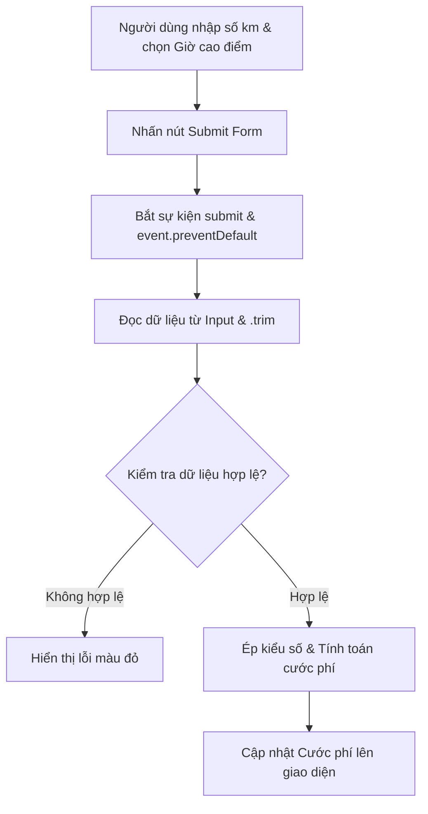

### 1. Mục tiêu bài tập
- **Phát hiện và sửa lỗi xử lý sự kiện (Event Handling)**: Nhận biết anti-pattern khi gắn sự kiện trực tiếp bằng thuộc tính (VD: `onclick`) và chuyển sang sử dụng `addEventListener` chuẩn hóa.
- **Xử lý Form & Ngăn chặn hành vi mặc định**: Kiểm soát sự kiện `submit` trên thẻ `<form>` và sử dụng `event.preventDefault()` để tránh làm reload trang web.
- **Quản lý thời điểm đọc dữ liệu DOM**: Sửa lỗi phổ biến đọc thuộc tính `.value` ngoài phạm vi Event Handler làm sai lệch dữ liệu.
- **Làm sạch & Ép kiểu dữ liệu**: Sử dụng `.trim()` và hàm chuyển đổi kiểu dữ liệu (`parseFloat`/`Number`) trước khi tính toán nghiệp vụ.

---


### 2. Bối cảnh & Mô tả bài toán
Hệ thống **GrabRide** đang phát triển mô-đun tính cước phí dự kiến cho hành khách trên giao diện Web. Khi người dùng nhập quãng đường (km) và chọn trạng thái thời tiết/giờ cao điểm, hệ thống sẽ tự động tính toán tổng số tiền cước mà hành khách phải trả.

Tuy nhiên, lập trình viên Junior vừa đẩy đoạn mã nguồn thử nghiệm nhưng ứng dụng liên tục gặp lỗi:
1. Khi nhấn nút tính tiền, trang web lập tức bị tải lại (reload) làm mất toàn bộ kết quả.
2. Giá trị cước phí hiển thị luôn bằng `0` hoặc báo kết quả không chính xác (`NaN`).
3. Logic kiểm tra điều kiện phụ phí giờ cao điểm không hoạt động đúng.

Dưới đây là sơ đồ luồng chuẩn mà hệ thống GrabRide cần đạt được:



Bạn được giao nhiệm vụ **đóng vai trò Senior Engineer**: Phân tích đoạn mã nguồn bị lỗi bên dưới, chỉ rõ ít nhất 4 lỗi kỹ thuật/nghiệp vụ và viết lại đoạn mã đã refactor hoàn chỉnh.

---


### 3. Quy tắc nghiệp vụ (Business Rules)
Hệ thống tính cước GrabRide áp dụng các quy tắc sau:
1. **Quãng đường di chuyển ($d$)**: Phải là một số hợp lệ lớn hơn 0 ($d > 0$).
2. **Giá cước cơ bản (Base Fare)**:
   - $d \le 2$ km: Giá cố định **12.000 VNĐ**.
   - $d > 2$ km: 2 km đầu tiên tính **12.000 VNĐ**, từ km thứ 3 trở đi tính **4.500 VNĐ/km**.
   - *Công thức tính cước gốc*: $\text{Cước gốc} = 12.000 + (d - 2) \times 4.500$
3. **Phụ phí Thời tiết xấu / Giờ cao điểm**:
   - Nếu checkbox "Giờ cao điểm / Mưa" được tích chọn: $\text{Tổng cước} = \text{Cước gốc} \times 1.2$.
4. **Hiển thị & Validation**:
   - Khoảng cách rỗng, chứa ký tự không phải số, hoặc $\le 0$: Hiển thị lỗi màu đỏ `"Vui lòng nhập quãng đường hợp lệ (số lớn hơn 0)!"`.
   - Kết quả hợp lệ: Làm tròn cước phí và hiển thị màu xanh với định dạng text rõ ràng.

---


### 4. Mã nguồn bị lỗi (Buggy Code) & Yêu cầu kỹ thuật


#### Đoạn mã nguồn bị lỗi do Lập trình viên Junior bàn giao:
```html
<!DOCTYPE html>
<html lang="vi">
<head>

  <title>Tính Cước Phí GrabRide</title>
  <style>
    .error { color: red; }
    .success { color: green; font-weight: bold; }
  </style>
</head>
<body>
  <h2>Hệ Thống Tính Cước Phí GrabRide</h2>

  <form id="fareForm">
    <div>
      <label for="distance">Quãng đường (km):</label>
      <input type="text" id="distance" placeholder="Nhập số km (VD: 5.5)">
    </div>
    <div>
      <label>
        <input type="checkbox" id="isPeakHour"> Thời tiết xấu / Giờ cao điểm (+20%)
      </label>
    </div>
    <button type="submit" id="btnCalculate">Tính Cước Phí</button>
    <p id="resultMessage"></p>
  </form>

  <script>
    // Truy vấn phần tử DOM
    const fareForm = document.querySelector("#fareForm");
    const distanceInput = document.querySelector("#distance");
    const isPeakHourInput = document.querySelector("#isPeakHour");
    const resultMessage = document.querySelector("#resultMessage");

    // LỖI 1: Lấy giá trị input ngay khi script vừa nạp
    const distanceValue = distanceInput.value;

    // LỖI 2: Đăng ký sự kiện bằng gán thuộc tính onclick trên button
    const btnCalculate = document.querySelector("#btnCalculate");
    
    btnCalculate.onclick = function() {
      // LỖI 3: Không ngăn chặn hành vi reload trang mặc định của Form

      // LỖI 4: Dùng dữ liệu sai thời điểm và sai logic phụ phí
      let totalFare = 0;
      
      if (distanceValue <= 2) {
        totalFare = 12000;
      } else {
        totalFare = distanceValue * 4500; // Lỗi logic nghiệp vụ
      }

      // LỖI 5: Sai thuộc tính kiểm tra trạng thái checkbox
      if (isPeakHourInput.value === "true") {
        totalFare = totalFare * 1.2;
      }

      resultMessage.className = "success";
      resultMessage.innerText = "Cước phí dự kiến: " + totalFare + " VNĐ";
    };
  </script>
</body>
</html>
```


#### Yêu cầu bài nộp:
1. **Phần 1: Báo cáo Debug (Text / Markdown)**
   - Liệt kê tối thiểu **4 lỗi** xuất hiện trong đoạn mã trên.
   - Giải thích nguyên nhân kỹ thuật tại sao đoạn mã bị lỗi và hậu quả của từng lỗi đối với ứng dụng.
2. **Phần 2: Mã nguồn đã sửa hoàn chỉnh (Refactoring Code)**
   - Viết lại toàn bộ đoạn mã HTML + JavaScript chuẩn hóa.
   - Phải lắng nghe sự kiện `'submit'` trên thẻ `<form>` bằng `addEventListener`.
   - Gọi `event.preventDefault()` đúng vị trí.
   - Lấy giá trị input và `.trim()` bên trong hàm xử lý sự kiện.
   - Ép kiểu dữ liệu sang `Number` (hoặc `parseFloat`), kiểm tra tính hợp lệ (`isNaN`, `<= 0`).
   - Kiểm tra trạng thái checkbox bằng thuộc tính `.checked`.
   - Tính toán chính xác giá cước theo đúng Quy tắc nghiệp vụ GrabRide.

---


### 5. Quy chuẩn nộp bài
- Đặt tên file mã nguồn: `debug_grabride_fare.html` (chứa cả HTML và thẻ `<script>` đã sửa lỗi).
- Đặt tên file báo cáo giải thích lỗi: `debug_report.md` (hoặc ghi phần giải thích dạng comment phía trên cùng của file `.html`).
- Mã nguồn JavaScript phải tuân thủ chuẩn CamelCase cho biến/hàm, thụt lề 2 spaces rõ ràng.