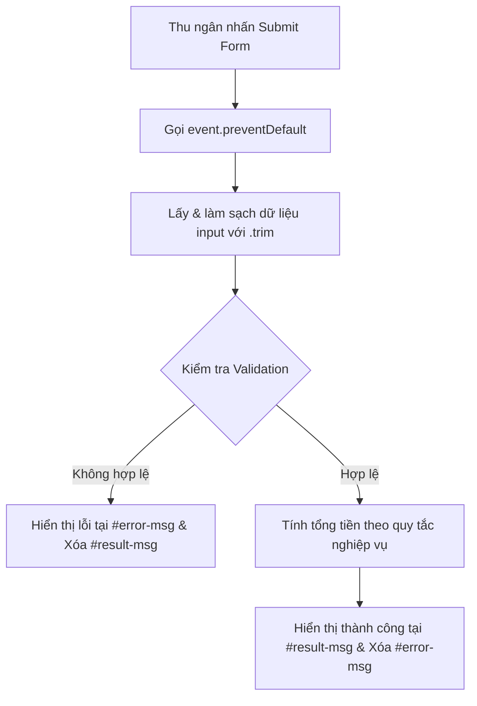

### 1. Mục tiêu bài tập
Sau khi hoàn thành bài tập này, học viên sẽ có khả năng:
- Áp dụng phương thức `addEventListener` để đăng ký sự kiện `submit` cho Form trong ứng dụng Web POS.
- Sử dụng `event.preventDefault()` để ngăn chặn hành vi tải lại trang mặc định của trình duyệt.
- Truy xuất và làm sạch dữ liệu đầu vào (`.value`, `.trim()`) từ các phần tử `input` và `select`.
- Thực hiện kiểm tra tính hợp lệ của dữ liệu (Validation) và xử lý logic nghiệp vụ tính toán đơn hàng.
- Cập nhật kết quả tính toán hoặc hiển thị thông báo lỗi động lên giao diện HTML dựa trên các kịch bản I/O (Input/Output).

---


### 2. Bối cảnh & Mô tả bài toán
Chuỗi cửa hàng cà phê **Highlands POS** đang triển khai màn hình tính tiền nhanh tại quầy (POS - Point of Sale) cho thu ngân. Hệ thống cần một mô-đun xử lý form order cho phép thu ngân nhập thông tin khách hàng, chọn kích thước ly (Size), số lượng topping kèm theo, số lượng ly và áp dụng giảm giá thành viên.

Bạn được giao nhiệm vụ viết mã JavaScript xử lý sự kiện khi thu ngân nhấn nút **"Xác nhận thanh toán"** (`submit` form). Hệ thống phải kiểm tra tính hợp lệ của dữ liệu đầu vào, tính toán tổng tiền thanh toán theo đúng quy tắc nghiệp vụ và hiển thị kết quả chính xác lên giao diện.


#### Sơ đồ luồng xử lý sự kiện (Event Flow)


---


### 3. Quy tắc nghiệp vụ (Business Rules)

1. **Mặt hàng cố định**: Đồ uống mặc định là **"Trà sữa Macchiato"** có giá nền (Base Price) là **35.000 VNĐ**.
2. **Phụ thu Kích thước (Size)**:
   - Size **S**: Phụ thu `0 VNĐ`
   - Size **M**: Phụ thu `6.000 VNĐ`
   - Size **L**: Phụ thu `10.000 VNĐ`
3. **Phụ thu Topping**:
   - Mỗi đơn vị topping chọn thêm có giá **8.000 VNĐ / topping**.
   - Phụ thu Topping = `Số lượng topping * 8.000 VNĐ`.
4. **Chiết khấu Thành viên (Membership Discount)**:
   - Nếu mã hạng thành viên là **"GOLD"** (không phân biệt hoa thường sau khi trim): Giảm **10%** trên tổng giá trị đơn hàng (trước giảm giá).
   - Các mã khác hoặc để rỗng: Giảm **0%**.
5. **Công thức tính tổng tiền thanh toán**:
   - $\text{Đơn giá 1 ly} = \text{Giá nền (35.000)} + \text{Phụ thu Size} + (\text{Số topping} \times 8.000)$
   - $\text{Tổng tiền chưa giảm} = \text{Đơn giá 1 ly} \times \text{Số lượng ly}$
   - $\text{Giảm giá} = \text{Tổng tiền chưa giảm} \times 0.1$ *(nếu là thành viên GOLD)*
   - $\text{Tổng thanh toán} = \text{Tổng tiền chưa giảm} - \text{Giảm giá}$

6. **Quy tắc Kiểm tra dữ liệu (Validation Rules)**:
   - **Tên khách hàng**: Không được rỗng sau khi loại bỏ khoảng trắng thừa (`.trim()`). Nếu rỗng, hiển thị thông báo lỗi: `"Lỗi: Họ và tên khách hàng không được để rỗng!"`.
   - **Số lượng ly**: Phải là số nguyên hợp lệ và $> 0$. Nếu $\le 0$ hoặc để rỗng, hiển thị thông báo lỗi: `"Lỗi: Số lượng ly phải lớn hơn 0!"`.
   - **Số lượng topping**: Phải là số nguyên $\ge 0$. Nếu $< 0$, hiển thị thông báo lỗi: `"Lỗi: Số lượng topping không được là số âm!"`.
   - Khi xảy ra lỗi validation: Hiển thị nội dung lỗi tương ứng tại thẻ `<p id="error-msg">`, dọn sạch nội dung thẻ `<p id="result-msg">`.

---


### 4. Yêu cầu kỹ thuật & Triển khai


#### 4.1. Cấu trúc Giao diện HTML (`index.html`)
Thu ngân sử dụng giao diện Form được cung cấp sẵn với cấu trúc ID như sau:

```html
<!DOCTYPE html>
<html lang="vi">
<head>
  <meta charset="UTF-8">
  <title>Highlands POS - Order Form</title>
  <style>
    .error { color: red; font-weight: bold; }
    .success { color: green; font-weight: bold; }
  </style>
</head>
<body>
  <h2>HỆ THỐNG POS - ĐẶT HÀNG TẠI QUẦY</h2>
  
  <form id="pos-order-form">
    <div>
      <label for="customer-name">Họ và tên khách hàng:</label>
      <input type="text" id="customer-name" placeholder="Nhập tên khách hàng">
    </div>
    
    <div>
      <label for="drink-size">Kích thước (Size):</label>
      <select id="drink-size">
        <option value="S">Size S (+0 VNĐ)</option>
        <option value="M">Size M (+6.000 VNĐ)</option>
        <option value="L">Size L (+10.000 VNĐ)</option>
      </select>
    </div>

    <div>
      <label for="topping-count">Số lượng Topping (8.000 VNĐ/phần):</label>
      <input type="number" id="topping-count" value="0">
    </div>

    <div>
      <label for="quantity">Số lượng ly:</label>
      <input type="number" id="quantity" value="1">
    </div>

    <div>
      <label for="member-code">Mã hạng thành viên:</label>
      <input type="text" id="member-code" placeholder="Nhập GOLD nếu có">
    </div>

    <button type="submit" id="btn-submit">Xác nhận thanh toán</button>
  </form>

  <!-- Vùng hiển thị thông báo -->
  <p id="error-msg" class="error"></p>
  <p id="result-msg" class="success"></p>

  <script src="main.js"></script>
</body>
</html>
```


#### 4.2. Mã nguồn JavaScript (`main.js`)
Yêu cầu bắt buộc trong file `main.js`:
- Truy vấn các phần tử DOM cần thiết thông qua `document.querySelector`.
- Đăng ký sự kiện `'submit'` trên biểu mẫu `#pos-order-form`.
- Gọi `event.preventDefault()` đầu tiên trong hàm xử lý sự kiện.
- Đọc và làm sạch dữ liệu nhập vào bằng `.value.trim()`.
- Chuyển đổi dữ liệu chuỗi số sang kiểu số nguyên bằng `parseInt()`.
- Thực hiện kiểm tra lỗi theo thứ tự ưu tiên: Tên khách hàng $\rightarrow$ Số lượng ly $\rightarrow$ Số lượng topping.
- Định dạng số tiền hiển thị theo dạng có dấu phân cách hàng nghìn (ví dụ: `98.000 VNĐ` hoặc sử dụng toán tử định dạng thích hợp).

---


### 5. Ma trận Kiểm thử I/O (Input/Output Test Cases)

Học viên cần chạy thực nghiệm và đảm bảo mã nguồn vượt qua **100% các Test Case** dưới đây:

| Test Case ID | Input: Họ tên (`#customer-name`) | Input: Size (`#drink-size`) | Input: Topping (`#topping-count`) | Input: Số lượng (`#quantity`) | Input: Mã TV (`#member-code`) | Expected Output tại `#error-msg` | Expected Output tại `#result-msg` |
| :--- | :--- | :--- | :--- | :--- | :--- | :--- | :--- |
| **TC-01** (Chuẩn) | `"  Nguyễn Văn A "` | `"M"` | `1` | `2` | `""` | `""` *(trống)* | `"Đặt hàng thành công cho khách hàng: Nguyễn Văn A. Tổng tiền thanh toán: 98.000 VNĐ"` |
| **TC-02** (Thành viên Gold) | `"Trần Thị B"` | `"L"` | `2` | `1` | `"  gold  "` | `""` *(trống)* | `"Đặt hàng thành công cho khách hàng: Trần Thị B. Tổng tiền thanh toán: 54.900 VNĐ"` |
| **TC-03** (Lỗi rỗng tên) | `"   "` | `"S"` | `0` | `1` | `""` | `"Lỗi: Họ và tên khách hàng không được để rỗng!"` | `""` *(trống)* |
| **TC-04** (Lỗi số lượng ly) | `"Lê Văn C"` | `"M"` | `1` | `0` | `""` | `"Lỗi: Số lượng ly phải lớn hơn 0!"` | `""` *(trống)* |
| **TC-05** (Lỗi số topping âm) | `"Phạm Văn D"` | `"S"` | `-1` | `2` | `"GOLD"` | `"Lỗi: Số lượng topping không được là số âm!"` | `""` *(trống)* |

---


### 6. Quy chuẩn nộp bài
- Tạo thư mục mã nguồn có tên: `pos-order-app`.
- Thư mục chứa 2 file chính:
  - `index.html`: Cấu trúc giao diện HTML POS.
  - `main.js`: Mã xử lý logic sự kiện người dùng và tính toán đơn hàng.
- Nộp bài dưới dạng tệp nén ZIP (`pos-order-app.zip`) lên hệ thống quản lý học tập (LMS).