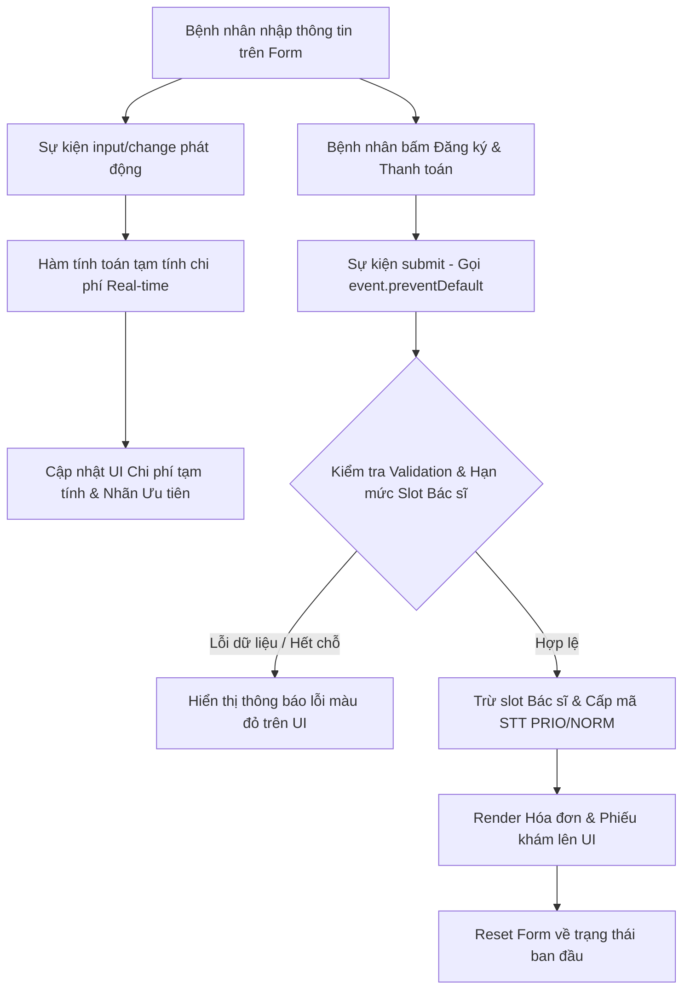

### 1. Mục tiêu bài tập
Sau khi hoàn thành bài tập này, học viên có khả năng:
- Áp dụng thành thạo `addEventListener` để bắt các sự kiện tương tác người dùng (`click`, `input`, `change`, `submit`).
- Xử lý các quy trình của Form trong ứng dụng thực tế: ngăn chặn hành vi mặc định bằng `event.preventDefault()`, trích xuất và làm sạch dữ liệu với `.trim()`.
- Lắng nghe và xử lý sự kiện realtime (`input`/`change`) để tính toán chi phí và cập nhật giao diện người dùng (UI) động trước khi người dùng gửi Form.
- Quản lý trạng thái dữ liệu phía Frontend (mảng đối tượng Bác sĩ, danh sách lượt khám) và kiểm soát ràng buộc điều kiện (Validation / Slot Capacity Limit).
- Render hóa đơn thanh toán và phiếu cấp số thứ tự động vào giao diện DOM sau khi đăng ký thành công.

---


### 2. Bối cảnh & Mô tả bài toán
Trong hệ thống quản lý phòng khám tích hợp thanh toán tự động (**FinTech HealthPay Portal**), việc đăng ký khám bệnh không chỉ là lưu thông tin mà còn đi kèm tính năng tính toán chi phí tự động dựa trên chính sách Bảo hiểm Y tế (BHYT), phân hạng ưu tiên cho bệnh nhân và kiểm soát hạn mức số lượng lượt khám trong ngày của từng Bác sĩ chuyên khoa.

Bạn được giao nhiệm vụ phát triển module Frontend cho **Hệ thống Đặt lịch & Thanh toán Chi phí Khám bệnh Tự động**. Module này có nhiệm vụ:
1. Cho phép bệnh nhân điền thông tin cá nhân và chọn Bác sĩ chuyên khoa.
2. Tự động tính toán tổng chi phí thanh toán tạm tính theo thời gian thực (Real-time) ngay khi người dùng thay đổi thông tin BHYT, Tuổi hoặc Phụ nữ mang thai.
3. Kiểm tra tính hợp lệ của thông tin và kiểm tra xem Bác sĩ được chọn có còn suất tiếp nhận hay không trước khi cấp số thứ tự.
4. Xuất phiếu số thứ tự khám (`Queue Ticket`) kèm hóa đơn thanh toán giao dịch (`Payment Receipt`) lên màn hình console/UI và cập nhật số lượt còn lại của Bác sĩ.


#### Sơ đồ luồng xử lý sự kiện (Event-driven Workflow):



---


### 3. Quy tắc nghiệp vụ (Business Rules)


#### A. Cấu trúc dữ liệu khởi tạo (State Management)
Hệ thống khởi tạo sẵn danh sách bác sĩ làm việc trong ngày:
```javascript
const doctorList = [
  { id: "DOC01", name: "BS. Nguyễn Văn An (Nội khoa)", maxSlot: 5, bookedSlot: 4 },
  { id: "DOC02", name: "BS. Trần Thị Bình (Nhi khoa)", maxSlot: 5, bookedSlot: 5 },
  { id: "DOC03", name: "BS. Lê Hoàng Cường (Tim mạch)", maxSlot: 5, bookedSlot: 2 }
];
```


#### B. Quy tắc tính toán chi phí thanh toán (Fee Calculation Matrix)
1. **Phí khám gốc**: $300,000$ VNĐ / lượt khám.
2. **Phí sổ khám & dịch vụ tiện ích số**: $20,000$ VNĐ / lần đăng ký.
3. **Giảm giá theo Bảo hiểm Y tế (BHYT)**:
   - Nếu bệnh nhân tích chọn "Có BHYT": Được miễn $80\%$ phí khám gốc (Chi phí khám gốc còn lại: $300,000 \times 20\% = 60,000$ VNĐ).
   - Nếu không chọn "Có BHYT": Chi trả $100\%$ phí khám gốc ($300,000$ VNĐ).
4. **Diện Ưu tiên (Priority Pass)**:
   - Bệnh nhân thỏa mãn ít nhất một trong 2 điều kiện: **Tuổi $\ge 70$** HOẶC tích chọn **"Đang mang thai"**.
   - Bệnh nhân thuộc diện Ưu tiên sẽ được **Miễn phí 100% phí sổ khám & dịch vụ tiện ích số** (Tiết kiệm $20,000$ VNĐ).
   - Mã số thứ tự sẽ mang tiền tố `PRIO-` (Ví dụ: `PRIO-101`). Nếu không thuộc diện ưu tiên, tiền tố là `NORM-` (Ví dụ: `NORM-102`).
5. **Công thức tính tổng tiền thanh toán**:
$$\text{Tổng thanh toán} = \text{Tiền khám sau BHYT} + \text{Phí dịch vụ tiện ích (nếu không ưu tiên)}$$


#### C. Quy tắc Validation & Ràng buộc khi Submit
1. **Họ tên**: Không được rỗng, tối thiểu $3$ ký tự sau khi loại bỏ khoảng trắng thừa bằng `.trim()`.
2. **Số điện thoại**: Không được rỗng, phải gồm đúng $10$ chữ số và bắt đầu bằng số `0`.
3. **Tuổi**: Phải là số nguyên hợp lệ trong khoảng từ $1$ đến $120$.
4. **Bác sĩ khám**: Bắt buộc phải chọn 1 bác sĩ từ danh sách.
5. **Kiểm tra Slot (Hạn mức Bác sĩ)**:
   - Nếu `bookedSlot >= maxSlot` của Bác sĩ được chọn: Chặn đăng ký, hiển thị thông báo lỗi màu đỏ: `"Bác sĩ [Tên Bác sĩ] đã hết lượt khám trong ngày! Vui lòng chọn bác sĩ khác."`

---


### 4. Yêu cầu kỹ thuật & Triển khai


#### A. Giao diện người dùng (HTML Structure Required)
Tạo tệp `index.html` với cấu trúc form và danh sách hiển thị như sau:
- Thẻ `<form id="clinicForm">`:
  - Input `#fullname` (text): Họ và tên bệnh nhân.
  - Input `#phone` (text): Số điện thoại.
  - Input `#age` (number): Tuổi.
  - Checkbox `#hasInsurance`: Có BHYT hay không.
  - Checkbox `#isPregnant`: Đang mang thai hay không.
  - Select `#doctorSelect`: Danh sách lựa chọn bác sĩ (được render động hoặc khởi tạo ứng với `doctorList`).
  - Container `#previewFee` (div/p): Hiển thị chi phí tạm tính realtime và trạng thái ưu tiên.
  - Button `type="submit"`: Nút "Đăng ký & Thanh toán".
  - Thẻ `<p id="errorMessage">`: Hiển thị thông báo lỗi validation.
- Container `#receiptContainer`: Vùng hiển thị phiếu khám và hóa đơn sau khi submit thành công.
- Container `#doctorStatusList`: Vùng hiển thị danh sách bác sĩ và số slot còn lại.


#### B. Yêu cầu xử lý JavaScript (`app.js`)
1. **Khởi tạo giao diện**:
   - Viết hàm `renderDoctorOptions()` để đổ danh sách Bác sĩ vào thẻ `<select id="doctorSelect">` và hiển thị thông tin trạng thái số chỗ còn lại (`maxSlot - bookedSlot`) ở khu vực `#doctorStatusList`.
2. **Xử lý sự kiện Realtime (`input` / `change`)**:
   - Lắng nghe các sự kiện `input` hoặc `change` trên các ô nhập liệu: `#age`, `#hasInsurance`, `#isPregnant`.
   - Viết hàm `calculateFeePreview()` tính toán số tiền tạm tính dựa theo Quy tắc BHYT & Diện ưu tiên.
   - Cập nhật thông tin tạm tính ngay lập tức lên element `#previewFee` (Ví dụ: *"Tạm tính: 60,000 VNĐ | Hạng: ƯU TIÊN"*).
3. **Xử lý sự kiện Submit Form (`submit`)**:
   - Bắt sự kiện `submit` trên `#clinicForm`. Gọi `event.preventDefault()` để ngừng việc tải lại trang.
   - Thu thập toàn bộ giá trị dữ liệu từ Form, tiến hành làm sạch dữ liệu chuỗi bằng `.trim()`.
   - Kiểm tra các quy tắc Validation dữ liệu đầu vào. Nếu có lỗi, hiển thị nội dung lỗi vào `#errorMessage` và dừng xử lý (`return`).
   - Kiểm tra xem bác sĩ đã hết slot hay chưa.
   - Nếu hợp lệ:
     - Tăng `bookedSlot` của bác sĩ thêm 1.
     - Sinh mã số thứ tự (Ví dụ: `PRIO-101` hoặc `NORM-102`).
     - Tạo phần tử HTML hóa đơn mới và chèn vào `#receiptContainer`.
     - Cập nhật lại giao diện số slot của các bác sĩ.
     - Gọi phương thức `.reset()` trên form để làm sạch dữ liệu nhập, đồng thời cập nhật lại vùng hiển thị tạm tính chi phí.

---


### 5. Quy chuẩn nộp bài

- **Cấu trúc thư mục dự án**:
  ```text
  clinic-fintech-app/
  ├── index.html
  ├── style.css
  └── app.js
  ```
- **Quy định đặt tên**:
  - Tên biến, tên hàm sử dụng kiểu `camelCase` (Ví dụ: `calculateFeePreview`, `doctorSelect`, `handleSubmit`).
  - Hằng số cấu hình dùng `UPPER_SNAKE_CASE` (Ví dụ: `BASE_EXAM_FEE = 300000`).
  - Mã nguồn phải chứa comment giải thích rõ từng bước xử lý sự kiện và DOM logic.