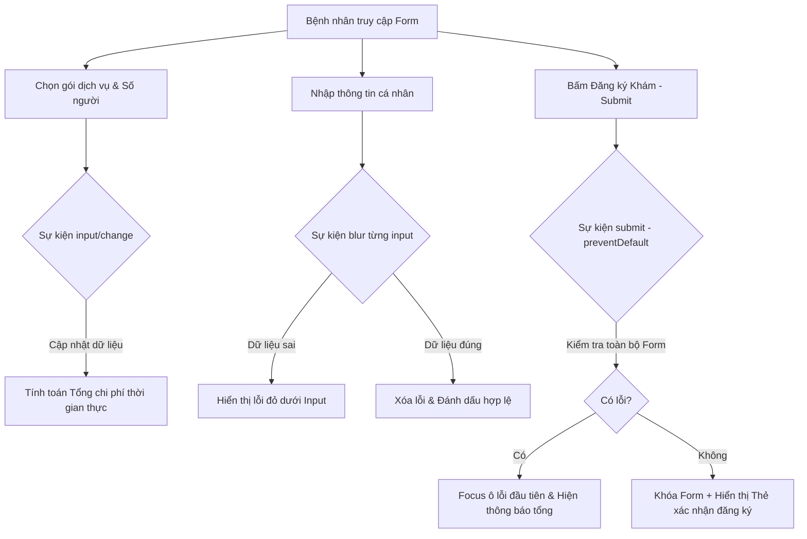

### 1. Mục tiêu bài tập
Sau khi hoàn thiện bài tập này, học viên có khả năng:
- **Xử lý sự kiện Form & Input chuyên sâu**: Sử dụng thành thạo `addEventListener` với các sự kiện `submit`, `input`, `change`, `blur`, `click`, và `dblclick` để tạo giao diện tương tác thời gian thực.
- **Ngăn chặn hành vi mặc định**: Áp dụng `event.preventDefault()` chính xác để kiểm soát luồng gửi dữ liệu của thẻ `<form>`.
- **Validation dữ liệu đa tầng**: Triển khai cơ chế kiểm tra dữ liệu theo từng trường khi mất tiêu điểm (`blur`) và kiểm tra toàn cục khi người dùng nộp form (`submit`).
- **Tính toán nghiệp vụ động (Real-time calculation)**: Lắng nghe sự kiện `input` và `change` trên nhiều phần tử điều khiển (radio, checkbox, input number) để cập nhật chi phí gói khám sức khỏe tức thì.
- **Điều khiển trạng thái DOM mượt mà**: Thay đổi động các class (`classList.toggle`, `classList.add`), ẩn/hiện thông báo lỗi, disable/enable phần tử giao diện theo trạng thái nghiệp vụ.

---


### 2. Bối cảnh & Mô tả bài toán
Bệnh viện Đa khoa Quốc tế MedCare đang triển khai module **"Đăng ký Gói Chăm sóc Sức khỏe Gia đình Trực tuyến"** (MedCare Family Health Subscription). Hệ thống này cho phép bệnh nhân hoặc đại diện gia đình tùy chọn gói khám sức khỏe định kỳ, điền thông tin các thành viên, đăng ký thêm các dịch vụ xét nghiệm phụ trợ và xem tổng chi phí cập nhật theo thời gian thực trước khi xác nhận.

Bạn được giao nhiệm vụ viết toàn bộ mã nguồn xử lý tương tác giao diện và logic form (Client-side Form Handling) bằng HTML/CSS và JavaScript thuần.



---


### 3. Quy tắc nghiệp vụ (Business Rules)


#### A. Quy tắc Gói Dịch vụ & Giới hạn Thành viên
Hệ thống cung cấp 3 gói khám chính:
1. **Gói Cá Nhân (BASIC)**:
   - Chi phí: `500,000 VNĐ / tháng`
   - Số lượng người đăng ký tối đa: Đúng **1 người**.
2. **Gói Gia Đình Standard (FAMILY_STD)**:
   - Chi phí: `1,200,000 VNĐ / tháng`
   - Số lượng người đăng ký tối đa: Từ **2 đến 4 người**.
3. **Gói Gia Đình VIP (FAMILY_VIP)**:
   - Chi phí: `2,500,000 VNĐ / tháng`
   - Số lượng người đăng ký tối đa: Từ **5 đến 8 người**.

> **Ràng buộc số lượng người**: 
> - Nếu người dùng chọn **Gói Cá nhân** nhưng nhập số người `> 1`, hoặc chọn **Gói Standard** nhưng nhập số người ngoài khoảng `[2, 4]`, hoặc chọn **Gói VIP** nhưng nhập ngoài khoảng `[5, 8]` -> Hiển thị thông báo lỗi ngay dưới ô nhập số lượng: `"Số lượng thành viên không phù hợp với gói đã chọn!"`.


#### B. Quy tắc Dịch vụ Bổ sung (Add-on Services) & Chu kỳ Thanh toán
- **Chu kỳ thanh toán**:
  - `Theo tháng` (`billing-cycle = 1`): Chi phí gói = Giá gói gốc * 1.
  - `Theo năm` (`billing-cycle = 12`): Chi phí gói = (Giá gói gốc * 12) * `0.9` (Giảm 10% tổng tiền gói chính khi đăng ký 1 năm).
- **Dịch vụ bổ sung (Checkbox)**:
  - `Xét nghiệm tổng quát tại nhà` (`#addon-testing`): `+300,000 VNĐ / 1 người`.
  - `Tầm soát ung thư sớm` (`#addon-cancer`): `+1,500,000 VNĐ / 1 người`.
- **Công thức tính Tổng tiền thanh toán dự tính**:
  $$\text{Tổng tiền} = (\text{Giá gói} \times \text{Số tháng} \times \text{Hệ số giảm giá}) + [(\text{Tổng tiền các Add-on}) \times \text{Số lượng người}]$$


#### C. Quy tắc Validation Thông tin Đại diện (Sự kiện `blur` và `submit`)
- **Họ và tên (`#fullname`)**: Không được rỗng, độ dài tối thiểu 3 ký tự (sau khi loại bỏ khoảng trắng dư thừa `.trim()`).
- **Số điện thoại (`#phone`)**: Không rỗng, phải đúng 10 chữ số và bắt đầu bằng số `0` (Ví dụ: `0912345678`).
- **Số CCCD / BHYT (`#identity`)**: Không rỗng, phải đúng 12 chữ số.
- **Email (`#email`)**: Phải chứa ký tự `@` và ít nhất một dấu chấm `.` sau ký tự `@`.


#### D. Tương tác Thẻ Gói Dịch vụ (Card Interaction)
- Khi **`click`** vào một thẻ thông tin gói y tế (`.package-card`), hệ thống tự động chọn radio button tương ứng của gói đó và kích hoạt tính toán lại chi phí.
- Khi **`dblclick`** (nhấp đúp chuột) vào thẻ thông tin gói, bật/tắt class `.expanded` trên thẻ đó để mở rộng/thu gọn danh sách chi tiết các quyền lợi bác sĩ.

---


### 4. Yêu cầu kỹ thuật & Triển khai


#### A. Cấu trúc Giao diện HTML (Mẫu chuẩn giao diện)
Tạo file `index.html` với danh sách id và class chuẩn như sau:

```html
<form id="healthForm" novalidate>
  <!-- Các thẻ Package Card tương tác -->
  <div class="package-cards">
    <div class="package-card" data-package="BASIC">
      <input type="radio" name="package" id="pkg-basic" value="BASIC" checked>
      <label for="pkg-basic">Gói Cá Nhân (500k/tháng)</label>
      <div class="details">Miễn phí 1 lần xét nghiệm máu, tư vấn online 24/7.</div>
    </div>
    <div class="package-card" data-package="FAMILY_STD">
      <input type="radio" name="package" id="pkg-std" value="FAMILY_STD">
      <label for="pkg-std">Gói Gia Đình Standard (1.2Tr/tháng)</label>
      <div class="details">Dành cho 2-4 thành viên, khám định kỳ 2 lần/năm.</div>
    </div>
    <div class="package-card" data-package="FAMILY_VIP">
      <input type="radio" name="package" id="pkg-vip" value="FAMILY_VIP">
      <label for="pkg-vip">Gói Gia Đình VIP (2.5Tr/tháng)</label>
      <div class="details">Dành cho 5-8 thành viên, bác sĩ thăm khám tận nhà.</div>
    </div>
  </div>

  <!-- Thông tin đại diện -->
  <div class="form-group">
    <label for="fullname">Họ và tên người đại diện (*):</label>
    <input type="text" id="fullname" placeholder="Nguyễn Văn A">
    <small class="error-msg" id="err-fullname"></small>
  </div>

  <div class="form-group">
    <label for="phone">Số điện thoại (*):</label>
    <input type="text" id="phone" placeholder="0912345678">
    <small class="error-msg" id="err-phone"></small>
  </div>

  <div class="form-group">
    <label for="identity">Mã CCCD / BHYT (12 số) (*):</label>
    <input type="text" id="identity" placeholder="001099123456">
    <small class="error-msg" id="err-identity"></small>
  </div>

  <div class="form-group">
    <label for="email">Email liên hệ (*):</label>
    <input type="email" id="email" placeholder="example@medcare.vn">
    <small class="error-msg" id="err-email"></small>
  </div>

  <!-- Số lượng thành viên & Chu kỳ -->
  <div class="form-group">
    <label for="memberCount">Số lượng thành viên tham gia (*):</label>
    <input type="number" id="memberCount" value="1" min="1" max="10">
    <small class="error-msg" id="err-memberCount"></small>
  </div>

  <div class="form-group">
    <label for="billingCycle">Chu kỳ thanh toán:</label>
    <select id="billingCycle">
      <option value="1">Thanh toán hàng tháng</option>
      <option value="12">Thanh toán theo năm (Giảm 10% gói chính)</option>
    </select>
  </div>

  <!-- Add-on Services -->
  <div class="form-group">
    <label>Dịch vụ bổ sung:</label>
    <div>
      <input type="checkbox" id="addon-testing" value="300000">
      <label for="addon-testing">Xét nghiệm tổng quát tại nhà (+300.000đ/người)</label>
    </div>
    <div>
      <input type="checkbox" id="addon-cancer" value="1500000">
      <label for="addon-cancer">Tầm soát ung thư sớm (+1.500.000đ/người)</label>
    </div>
  </div>

  <!-- Hiển thị tổng tiền -->
  <div class="price-summary">
    <h3>Tổng chi phí dự tính: <span id="totalPrice">500,000</span> VNĐ</h3>
  </div>

  <button type="submit" id="btnSubmit">Xác Nhận Đăng Ký Gói Y Tế</button>
</form>

<!-- Thẻ hiển thị kết quả sau khi đăng ký thành công -->
<div id="confirmationCard" class="hidden">
  <h2>ĐĂNG KÝ THÀNH CÔNG!</h2>
  <p id="summaryText"></p>
  <button id="btnReset">Đăng ký hồ sơ mới</button>
</div>
```


#### B. Yêu cầu xử lý Logic JavaScript (`script.js`)

1. **Đăng ký sự kiện tính toán tổng tiền tự động**:
   - Lắng nghe các sự kiện `change` hoặc `input` trên:
     - Các radio button chọn gói khám (`input[name="package"]`).
     - Ô chọn số lượng người (`#memberCount`).
     - Thẻ select chọn chu kỳ (`#billingCycle`).
     - Các checkbox dịch vụ bổ sung (`#addon-testing`, `#addon-cancer`).
   - Tạo hàm `calculateTotalPrice()` thực hiện đúng công thức nghiệp vụ và cập nhật chuỗi định dạng tiền tệ vào phần tử `#totalPrice` (Ví dụ: `1,500,000`).

2. **Đăng ký sự kiện `blur` để Validation từng Input**:
   - Gán `addEventListener("blur", ...)` cho các ô `#fullname`, `#phone`, `#identity`, `#email`, `#memberCount`.
   - Viết hàm trợ giúp `validateField(inputElement, regexPattern, errorElement, customMsg)`:
     - Lấy giá trị input và loại bỏ khoảng trắng bằng `.trim()`.
     - Nếu dữ liệu không hợp lệ: Thêm class `.invalid` cho input, hiển thị thông báo lỗi vào `errorElement`.
     - Nếu dữ liệu hợp lệ: Xóa class `.invalid`, xóa văn bản lỗi.

3. **Đăng ký sự kiện `click` và `dblclick` trên Thẻ Gói Dịch Vụ**:
   - Duyệt qua danh sách các phần tử `.package-card`:
     - Lắng nghe sự kiện `click`: Chọn radio button bên trong thẻ đó, kích hoạt lại hàm tính tổng tiền.
     - Lắng nghe sự kiện `dblclick`: Gọi `classList.toggle('expanded')` để hiện/ẩn phần thông tin chi tiết `.details`.

4. **Đăng ký sự kiện `submit` trên Form (`#healthForm`)**:
   - Gọi `event.preventDefault()` đầu tiên để chống reload trang.
   - Chạy lại kiểm tra toàn bộ tất cả các ô input.
   - Nếu có ít nhất 1 ô dữ liệu sai:
     - Hiển thị đầy đủ thông báo lỗi bên dưới các ô bị sai.
     - Sử dụng `.focus()` để đưa con trỏ chuột đến ô bị lỗi đầu tiên.
   - Nếu toàn bộ Form hợp lệ:
     - Ẩn form `#healthForm` (thêm class `.hidden` hoặc `display: none`).
     - Hiển thị phần tử `#confirmationCard`.
     - Tạo một mã đăng ký ngẫu nhiên dạng `MED-XXXXXX` (trong đó XXXXXX là 6 chữ số ngẫu nhiên) và hiển thị tóm tắt thông tin: Họ tên đại diện, Tên gói đăng ký, Số người, Tổng tiền thanh toán cuối cùng.

5. **Đăng ký sự kiện `click` trên nút Làm mới (`#btnReset`)**:
   - Khi bấm nút này, reset form về trạng thái ban đầu (`healthForm.reset()`), ẩn thẻ `#confirmationCard` và hiển thị lại form đăng ký.

---


### 5. Quy chuẩn nộp bài
- **Cấu trúc thư mục dự án**:
  ```text
  student-id_assignment4/
  ├── index.html
  ├── styles.css
  └── script.js
  ```
- **Quy định đặt tên**:
  - Hàm JavaScript sử dụng camelCase (VD: `calculateTotalPrice`, `validateField`, `checkMemberLimit`).
  - Đảm bảo mã nguồn có chú thích (comment) giải thích luồng xử lý cho từng sự kiện.
  - Không sử dụng các thư viện ngoài (JQuery, React, lodash, v.v.), chỉ dùng JavaScript thuần (Vanilla JS DOM API).