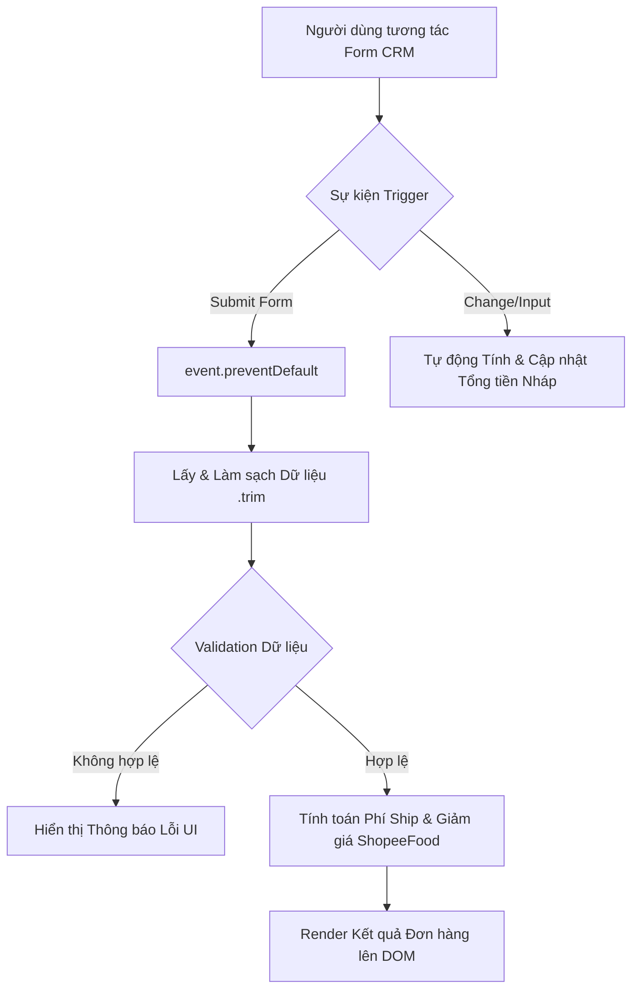

### 1. Mục tiêu bài tập
Sau khi hoàn thành bài tập tái cấu trúc này, học viên có khả năng:
- **Nhận diện & Khắc phục Anti-patterns**: Phát hiện các lỗi tư duy phổ biến trong xử lý sự kiện JS (gán trực tiếp `onclick`, đọc `.value` ngoài scope sự kiện, lắng nghe `click` trên Button thay vì `submit` trên Form).
- **Tái cấu trúc mã nguồn theo chuẩn Event Handling**: Sử dụng thành thạo `addEventListener`, kiểm soát luồng `event.preventDefault()`, loại bỏ dữ liệu thừa với `.trim()`.
- **Tối ưu kiến trúc xử lý sự kiện (Event Architecture)**: Tách biệt rõ ràng giữa logic Validation, logic Tính toán Nghiệp vụ (Business Calculation) và logic Cập nhật Giao diện (UI Rendering).
- **Thực thi Quy tắc Nghiệp vụ ShopeeFood CRM**: Áp dụng tính toán phụ phí giờ cao điểm, giảm giá phí giao hàng theo giá trị đơn, chặn đơn khi cửa hàng đóng cửa trên giao diện CRM.

---


### 2. Bối cảnh & Mô tả bài toán

Hệ thống CRM Chăm sóc Khách hàng & Tiếp nhận Đơn hàng của **ShopeeFood** đang gặp một sự cố nghiêm trọng trên giao diện tạo đơn thủ công do các Lập trình viên tập sự để lại. Mã nguồn hiện tại dính nhiều chống mẫu (anti-pattern):
1. Nhân viên CSKH bấm nút "Tạo đơn" thì trang web lập tức reload làm mất sạch dữ liệu đang nhập.
2. Nút bấm bị gán thuộc tính `onclick` chồng chéo khiến logic ghi log thao tác bị mất.
3. Khi thay đổi ô nhập liệu, giá trị không được cập nhật do code lấy `.value` ngay khi trang web vừa tải xong.

Bộ phận kỹ thuật yêu cầu bạn **Tái cấu trúc (Refactor) toàn bộ mô-đun Xử lý Sự kiện Form CRM** này để đảm bảo mã nguồn hoạt động chính xác, tối ưu hiệu năng và dễ bảo trì.



---


### 3. Quy tắc nghiệp vụ (Business Rules)

Hệ thống CRM ShopeeFood yêu cầu áp dụng các quy tắc nghiệp vụ sau khi người dùng tương tác:

1. **Trạng thái Quán ăn (Store Status)**:
   - Nếu trạng thái là `CLOSED` (Đóng cửa), **chặn ngay** hành vi submit và hiển thị lỗi: `"Cửa hàng hiện đang đóng cửa, không thể tạo đơn!"`.

2. **Tính toán Phí Giao hàng (Delivery Fee)**:
   - Khoảng cách $\le 3\text{km}$: Phí cố định là $15.000\,\text{VNĐ}$.
   - Khoảng cách $> 3\text{km}$: Cứ mỗi km tiếp theo (hoặc phần lẻ km) tính thêm $5.000\,\text{VNĐ/km}$.
     *(Ví dụ: 4.2 km = 3 km đầu + 1.2 km vượt = 15.000 + 2 * 5.000 = 25.000 VNĐ)*.

3. **Phụ phí Khung giờ Cao điểm (Peak Hour Surcharge)**:
   - Khung giờ cao điểm: `11:00 - 13:00` hoặc `18:00 - 20:00`.
   - Nếu đơn hàng rơi vào khung giờ này: Cộng thêm phụ phí $10.000\,\text{VNĐ}$ vào phí giao hàng.

4. **Ưu đãi Phí Giao hàng (Order Threshold Discount)**:
   - Giá trị tiền món ăn $\ge 100.000\,\text{VNĐ}$: Giảm $15.000\,\text{VNĐ}$ phí giao hàng (Phí ship sau giảm không được nhỏ hơn $0\,\text{VNĐ}$).

5. **Quy tắc Kiểm tra Dữ liệu (Form Validation)**:
   - **Số điện thoại khách**: Không rỗng, phải đúng 10 chữ số và bắt đầu bằng số `0`.
   - **Giá trị tiền món ăn**: Phải là số $> 0$.
   - **Khoảng cách giao hàng**: Phải là số $> 0$.

---


### 4. Yêu cầu kỹ thuật & Triển khai


#### A. Mã nguồn legacy bị lỗi (CẦN TÁI CẤU TRÚC)

Học viên nghiên cứu đoạn code kém chất lượng dưới đây để hiểu các lỗi sai và thực hiện viết mới/tái cấu trúc lại trong file `app.js`:

```html
<!-- index.html (Mã nguồn cũ dính Anti-pattern) -->
<form id="crmOrderForm">
  <div>
    <label>Tên khách hàng:</label>
    <input type="text" id="customerName">
  </div>
  <div>
    <label>Số điện thoại:</label>
    <input type="text" id="customerPhone">
  </div>
  <div>
    <label>Trạng thái quán:</label>
    <select id="storeStatus">
      <option value="OPEN">Đang mở cửa</option>
      <option value="CLOSED">Đã đóng cửa</option>
    </select>
  </div>
  <div>
    <label>Giá trị món ăn (VNĐ):</label>
    <input type="number" id="subtotal">
  </div>
  <div>
    <label>Khoảng cách (km):</label>
    <input type="number" id="distance" step="0.1">
  </div>
  <div>
    <label>Khung giờ đặt:</label>
    <select id="timeSlot">
      <option value="NORMAL">Giờ thường</option>
      <option value="PEAK_LUNCH">11:00 - 13:00 (Cao điểm trưa)</option>
      <option value="PEAK_DINNER">18:00 - 20:00 (Cao điểm tối)</option>
    </select>
  </div>

  <button type="submit" id="btnSubmit">Tạo Đơn Hàng ShopeeFood</button>
</form>

<div id="errorMessage" style="color: red;"></div>
<div id="orderSummary"></div>

<script>
  //  ANTI-PATTERN 1: Đọc giá trị ngay khi file load -> Luôn luôn rỗng!
  const nameVal = document.querySelector("#customerName").value;
  const phoneVal = document.querySelector("#customerPhone").value;
  const btnSubmit = document.querySelector("#btnSubmit");

  //  ANTI-PATTERN 2: Đăng ký sự kiện click trên Button thay vì submit trên Form
  //  ANTI-PATTERN 3: Sử dụng onclick gây ghi đè logic
  btnSubmit.onclick = function() {
    console.log("Log: Đang xử lý tạo đơn...");
  }

  btnSubmit.onclick = function() { // Vô tình ghi đè hàm log phía trên!
    if(nameVal === "") {
      alert("Lỗi nhập tên!"); // Sử dụng alert gây gián đoạn UX
    }
    // Thiếu event.preventDefault() -> Trang bị reload lại ngay lập tức!
  }
</script>
```

---


#### B. Nhiệm vụ Tái cấu trúc & Triển khai chi tiết

Viết lại toàn bộ logic JavaScript trong file `js/app.js` thỏa mãn các yêu cầu:

1. **Loại bỏ hoàn toàn thuộc tính `onclick` trực tiếp**:
   - Chuyển sang sử dụng `addEventListener` cho tất cả các sự kiện.
   - Đăng ký **nhiều listener độc lập** trên cùng một phần tử nếu có nhu cầu (ví dụ: 1 listener để ghi log thao tác hệ thống, 1 listener xử lý nghiệp vụ chính).

2. **Kiểm soát Sự kiện Form Submit chuẩn hóa**:
   - Đăng ký sự kiện `'submit'` trên thẻ `<form id="crmOrderForm">`.
   - Gọi `event.preventDefault()` ở ngay dòng đầu tiên của hàm xử lý submit.
   - Truy xuất và làm sạch dữ liệu đầu vào bằng `.trim()` bên trong scope của hàm xử lý sự kiện.

3. **Cấu trúc lại Mã nguồn thành các Hàm chức năng độc lập**:
   - `validateFormInputs(formData)`: Kiểm tra tính hợp lệ của dữ liệu đầu vào. Trả về object `{ isValid: boolean, message: string }`.
   - `calculateShopeeFoodFee(subtotal, distance, timeSlot)`: Tính toán tổng chi phí đơn hàng, phí giao hàng, phụ phí và số tiền được giảm theo đúng **Quy tắc nghiệp vụ**. Trả về object chứa chi tiết tiền.
   - `renderOrderSummary(summaryData)`: Cập nhật thông tin chi tiết đơn hàng lên thẻ `<div id="orderSummary">`.
   - `renderErrorMessage(message)`: Hiển thị lỗi lên thẻ `<div id="errorMessage">` (xóa thông báo lỗi nếu dữ liệu hợp lệ).

4. **Tính năng Nâng cao (Real-time Preview Event)**:
   - Đăng ký sự kiện `'change'` hoặc `'input'` trên các input số tiền, khoảng cách và khung giờ để tự động tính toán và hiển thị trước (preview) phí giao hàng tạm tính bên cạnh ô nhập liệu mà không cần bấm submit.

---


### 5. Quy chuẩn nộp bài

- **Cấu trúc thư mục dự án**:
  ```text
  shopeefood-crm-refactor/
  ├── index.html
  ├── css/
  │   └── style.css
  └── js/
      └── app.js
  ```
- **Quy tắc đặt tên**: Nén toàn bộ thư mục dự án thành file `.zip` theo định dạng: `[HO_TEN]_[MSNV]_HW19.zip` (Ví dụ: `NGUYEN_VAN_A_NV0123_HW19.zip`).
- **Yêu cầu mã nguồn**:
  - Không sử dụng bất kỳ thư viện ngoài (jQuery, React, Bootstrap...). Sử dụng JavaScript Vanilla thuần.
  - Mã nguồn phải có comment giải thích các vị trí đã tái cấu trúc và lý do (Ví dụ: `// REFACTORED: Sử dụng addEventListener thay cho onclick để tránh ghi đè logic`).