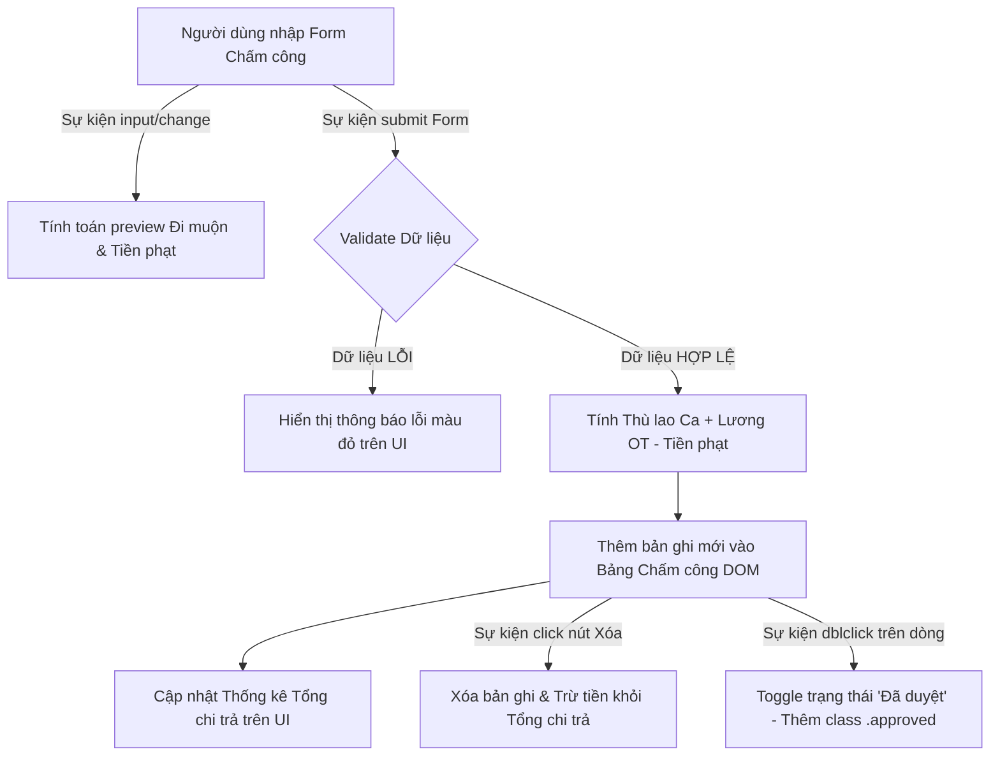

### 1. Mục tiêu bài tập
- **Thao tác sự kiện Form chuẩn hóa**: Làm chủ kỹ thuật xử lý sự kiện `submit` trên Form, bắt buộc sử dụng `event.preventDefault()` để kiểm soát luồng tải trang và thu thập dữ liệu bằng `.trim()`.
- **Đăng ký sự kiện tương tác đa dạng**: Thành thạo việc đăng ký nhiều lắng nghe sự kiện độc lập (`click`, `dblclick`, `input`, `mouseover`, `mouseleave`) thông qua `addEventListener` mà không gây ghi đè logic.
- **Tương tác và cập nhật DOM động**: Thực hành cập nhật danh sách bản ghi, tính toán tổng hợp dữ liệu real-time và thay đổi trạng thái giao diện (DOM manipulation) dựa trên phản hồi của người dùng.
- **Thiết kế Mini Module nghiệp vụ thực tế**: Xây dựng hoàn chỉnh module **EduShift & Payroll Manager** - Quản lý Chấm công & Tính thù lao cho Giảng viên/Trợ giảng trong hệ thống EduTech với các quy tắc kinh doanh phức tạp.

---


### 2. Bối cảnh & Mô tả bài toán
Tập đoàn Giáo dục **EduTech Global** đang nâng cấp hệ thống Quản trị Trung tâm (EdTech ERP). Bạn được giao nhiệm vụ phát triển **Mini Module Client-side Chấm công & Tính Thù lao Giảng dạy (EduShift Payroll Module)**. Module này cho phép Quản lý trung tâm nhập thông tin ca dạy của Giảng viên/Trợ giảng, tự động kiểm tra giờ đi muộn, tính thù lao ca dạy, tiền thưởng OT và tiền phạt vi phạm, đồng thời hiển thị bảng tổng hợp lương thời gian thực.



---


### 3. Quy tắc nghiệp vụ (Business Rules)


#### A. Ràng buộc Dữ liệu Đầu vào (Validation Rules)
1. **Mã nhân sự (`staffId`)**: Không được để rỗng, loại bỏ khoảng trắng thừa. Phải đúng định dạng `ET-xxxx` (trong đó `xxxx` là 4 chữ số, ví dụ: `ET-1024`).
2. **Họ và tên (`fullname`)**: Không được để rỗng sau khi `.trim()`.
3. **Vai trò (`role`)**: Chọn giữa `Giảng viên` hoặc `Trợ giảng`.
4. **Giờ vào ca dự kiến (`scheduledTime`) & Giờ điểm danh thực tế (`actualTime`)**: Nhập theo chuẩn `HH:mm` (ví dụ: `18:00` và `18:20`). Giờ thực tế không được để rỗng.
5. **Loại ngày làm việc (`dayType`)**: `Ngày thường` hoặc `Ngày Lễ/Tết`.
6. **Số phút OT (`otMinutes`)**: Phải là số nguyên lớn hơn hoặc bằng 0.


#### B. Quy tắc Tính toán Thù lao & Phạt Đi muộn
1. **Tính phút đi muộn (`lateMinutes`)**:
   - Khoảng cách thời gian = `actualTime` - `scheduledTime` (tính theo phút).
   - Nếu `lateMinutes > 15` phút: Nhân viên bị tính đi muộn và bị **Phạt 50.000 VNĐ / ca**.
   - Nếu `lateMinutes <= 15` phút: Được tính là đúng giờ (không bị phạt).

2. **Mức thù lao cơ bản theo ca (Giả định mỗi ca chuẩn = 2 giờ)**:
   - **Giảng viên**: 200.000 VNĐ / giờ (Tương đương **400.000 VNĐ / ca**).
   - **Trợ giảng**: 100.000 VNĐ / giờ (Tương đương **200.000 VNĐ / ca**).

3. **Hệ số Lượng ca làm theo Ngày (`dayType`)**:
   - `Ngày thường`: 100% Lương ca cơ bản.
   - `Ngày Lễ/Tết`: 300% Lương ca cơ bản (gấp 3 lần).

4. **Tính Thù lao OT (`otPay`)**:
   - Đơn giá 1 phút OT cơ bản = `(Thù lao giờ cơ bản) / 60`.
   - `Ngày thường`: OT tính **150%** đơn giá phút cơ bản.
   - `Ngày Lễ/Tết`: OT tính **300%** đơn giá phút cơ bản.
   - Công thức: `otPay = otMinutes * Đơn giá phút cơ bản * Hệ số OT`.

5. **Tổng thù lao thực nhận ca đó (`netSalary`)**:
   - `netSalary = (Lương ca làm) + otPay - (Tiền phạt đi muộn)`.
   - Nếu `netSalary < 0`, quy về `0 VNĐ`.

---


### 4. Yêu cầu kỹ thuật & Triển khai


#### A. Cấu trúc Giao diện HTML (Mẫu chuẩn)
Yêu cầu tạo các phần tử DOM có ID và Class cụ thể:
- Form đăng ký: `<form id="payrollForm">`
- Các ô nhập liệu: `#staffId`, `#fullname`, `#role`, `#scheduledTime`, `#actualTime`, `#dayType`, `#otMinutes`.
- Thẻ hiển thị lỗi Form: `<div id="formErrorMessage" class="error-msg"></div>`
- Thẻ hiển thị xem trước phạt: `<span id="latePreview"></span>`
- Bảng hiển thị kết quả: `<table id="payrollTable">` chứa `<tbody id="payrollList"></tbody>`
- Phần tử hiển thị Tổng chi trả: `<h3 id="totalBudget">Tổng chi trả: 0 VNĐ</h3>`


#### B. Các Sự kiện bắt buộc phải Đăng ký & Xử lý (Event Handling Requirements)

1. **Sự kiện `submit` trên `#payrollForm`**:
   - Phải gọi `event.preventDefault()` đầu tiên.
   - Trích xuất dữ liệu, gọi `.trim()` cho các ô nhập văn bản.
   - Validate dữ liệu theo Quy tắc nghiệp vụ A. Nếu sai, hiển thị lỗi vào `#formErrorMessage` (chữ màu đỏ) và dừng xử lý (không dùng `alert`).
   - Nếu đúng: Xóa sạch thông báo lỗi, tính toán thù lao, chèn một dòng `<tr>` mới vào `#payrollList`, cập nhật tổng tiền chi trả `#totalBudget` và reset form.

2. **Sự kiện `input` hoặc `change` trên `#actualTime` & `#scheduledTime` (Live Preview)**:
   - Ngay khi người dùng nhập hoặc thay đổi thời gian thực tế/dự kiến, tự động tính số phút lệch.
   - Hiển thị trực tiếp dòng chữ cảnh báo tại `#latePreview`:
     - *Ví dụ 1*: `"Đi muộn 20 phút (Bị phạt 50.000 VNĐ)"` (nếu > 15 phút, chữ màu đỏ).
     - *Ví dụ 2*: `"Đúng giờ (0 VNĐ phạt)"` (nếu <= 15 phút, chữ màu xanh).

3. **Sự kiện `click` trên nút "Xóa" của từng dòng**:
   - Mỗi dòng `<tr>` trong bảng có 1 nút bấm `<button class="btn-delete">Xóa</button>`.
   - Khi bấm "Xóa", xóa dòng `<tr>` tương ứng ra khỏi DOM và tự động **trừ số tiền của ca đó** khỏi `#totalBudget`.

4. **Sự kiện `dblclick` trên thẻ `<tr>` (Duyệt bảng lương)**:
   - Lắng nghe sự kiện `dblclick` trên mỗi dòng ca dạy.
   - Khi `dblclick`, toggle class `.approved` trên dòng đó (giúp đổi màu nền dòng sang màu xanh lá nhạt và hiển thị nhãn `"Đã duyệt"`).

5. **Sự kiện `mouseover` và `mouseleave` trên ô Tổng thù lao**:
   - Khi rê chuột (`mouseover`) vào ô hiển thị số tiền của dòng: Hiển thị một Tooltip hoặc đoạn chú thích nhỏ liệt kê chi tiết: `[Lương ca: X | OT: Y | Phạt: Z]`.
   - Khi di chuột ra ngoài (`mouseleave`): Ẩn đoạn chú thích đó.

---


### 5. Quy chuẩn nộp bài
- **Cấu trúc thư mục**:
  ```text
  student_id_session19/
  ├── index.html
  ├── styles.css
  └── script.js
  ```
- File HTML phải liên kết đúng file CSS và JS độc lập.
- Tất cả các thao tác sự kiện phải dùng `addEventListener` trong file `script.js`. **Tuyệt đối không** dùng thuộc tính HTML inline event như `onclick="..."`, `onsubmit="..."`.