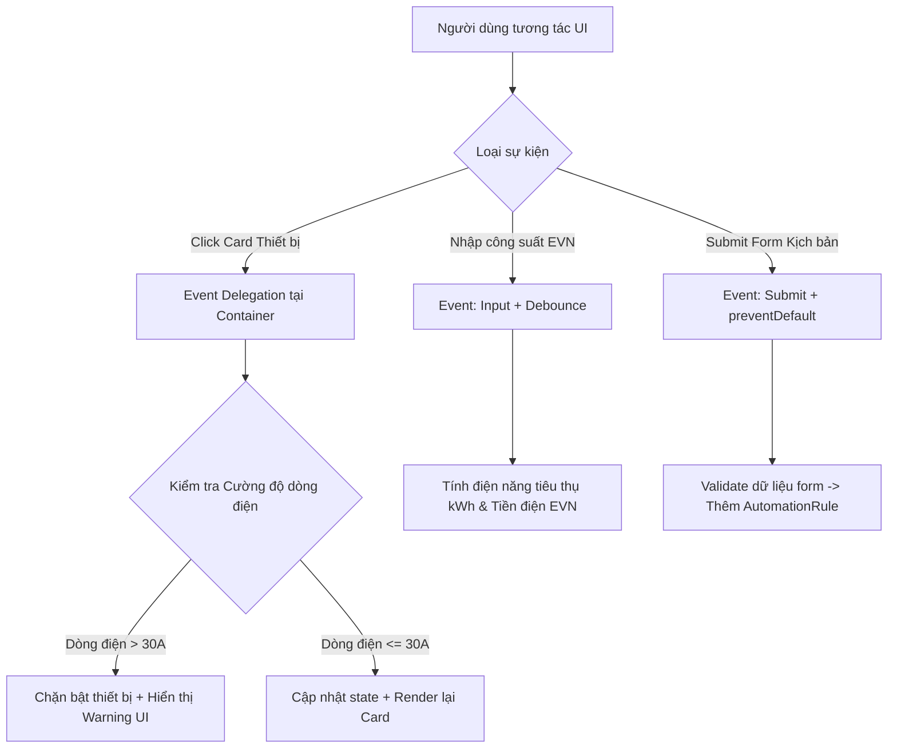

# Bài tập 11: CRM (Mức độ 4: Phân tích & Tối ưu - Tái cấu trúc)

### 1. Mục tiêu bài tập
Sau khi hoàn thành bài tập này, học viên có khả năng:
- **Phân tích & Phát hiện mã nguồn xấu (Code Smell):** Nhận biết các lỗi về hiệu năng và quản lý bộ nhớ khi gán sự kiện trực tiếp (inline event handling), lặp qua từng phần tử DOM để đính kèm `addEventListener`, hoặc thiếu kiểm soát sự kiện `input` gây ra hiện tượng giật lag UI (UI Freeze).
- **Tái cấu trúc mã nguồn với Event Delegation:** Áp dụng kỹ thuật Ủy quyền Sự kiện (Event Delegation) thông qua thuộc tính `event.target` và phương thức `closest()` để tối ưu hóa quản lý sự kiện cho các phần tử động (SmartDevice, AutomationRule).
- **Xử lý Sự kiện Form & Input Chuyên nghiệp:** Sử dụng triệt để `event.preventDefault()`, các sự kiện `submit`, `change`, `input` kết hợp với thuật toán hoãn xử lý (Debounce/Throttle đơn giản) để tính toán điện năng tiêu thụ và cảnh báo quá tải dòng điện.
- **Tối ưu hóa Trạng thái và Luồng dữ liệu:** Tách biệt mã xử lý sự kiện (Event Listener) và mã logic xử lý nghiệp vụ (Business Logic) để nâng cao tính bảo trì của hệ thống Smart Home IoT.

---


### 2. Bối cảnh & Mô tả bài toán
Bạn vừa tiếp quản hệ thống mã nguồn Frontend của bảng điều khiển **Smart Home IoT Dashboard**. Hệ thống hiện tại cho phép người dùng điều chỉnh trạng thái các thiết bị thông minh (`SmartDevice`), thiết lập kịch bản tự động hóa (`AutomationRule`) và tính toán hóa đơn điện năng dự kiến (`PowerUsageReport`).

Tuy nhiên, phiên bản cũ của hệ thống đang gặp các sự cố nghiêm trọng:
1. Mỗi khi tạo mới một card thiết bị thông minh, lập trình viên cũ lại dùng vòng lặp `forEach` đính kèm hàng loạt sự kiện `click` vào từng nút bấm, dẫn đến việc rò rỉ bộ nhớ (Memory Leak) và giật lag màn hình khi danh sách thiết bị lên tới hàng trăm phần tử.
2. Form đăng ký kịch bản tự động hóa không chặn hành vi tải lại trang mặc định của trình duyệt (`preventDefault`), dữ liệu nhập bị mất và không có phản hồi trực quan khi vi phạm quy tắc an toàn điện.
3. Sự kiện `input` trên ô nhập công suất tiêu thụ tính tiền điện theo bậc thang EVN bị gọi liên tục trên từng phím gõ, làm gián đoạn trải nghiệm người dùng.

Nhiệm vụ của bạn là **phân tích mã nguồn cũ, tái cấu trúc (refactor) và tối ưu hóa toàn bộ hệ thống xử lý sự kiện** theo tiêu chuẩn kỹ thuật enterprise.


#### Sơ đồ Luồng Xử lý Sự kiện (Event Architecture):


---


### 3. Quy tắc nghiệp vụ (Business Rules)


#### Quy tắc 1: Cảnh báo và Chặn Vượt Cường độ Dòng điện (Overload Protection)
- Điện áp mặc định của hệ thống là $U = 220\text{V}$.
- Cường độ dòng điện $I$ (Amperes) được tính theo công thức:
  $$I = \frac{\sum P_{\text{đang_bật}}}{220}$$
  *(Trong đó $\sum P_{\text{đang_bật}}$ là tổng công suất Watts của tất cả các `SmartDevice` đang ở trạng thái `ON`).*
- **Ràng buộc an toàn:** Nếu việc bật thêm một thiết bị khiến tổng cường độ dòng điện $I > 30\text{A}$, hệ thống phải:
  1. Hủy hành động bật thiết bị đó (giữ nguyên trạng thái `OFF`).
  2. Hiển thị thông báo cảnh báo màu đỏ: `"CẢNH BÁO: Cường độ dòng điện đạt X Amperes vượt quá giới hạn an toàn (30A)! Trạm ngắt tự động đã kích hoạt."` (Thay X bằng giá trị thực tế làm tròn 2 chữ số thập phân).


#### Quy tắc 2: Tính toán Điện năng Tiêu thụ & Tiền điện EVN
Khi người dùng nhập số kWh dự kiến tiêu thụ vào form tính toán, hệ thống sẽ tự động cập nhật số tiền điện phải trả (chưa bao gồm VAT) theo biểu giá điện sinh hoạt 6 bậc thang của EVN:
- **Bậc 1:** Cho kWh từ $0 - 50$: $1,893$ VNĐ/kWh
- **Bậc 2:** Cho kWh từ $51 - 100$: $1,956$ VNĐ/kWh
- **Bậc 3:** Cho kWh từ $101 - 200$: $2,271$ VNĐ/kWh
- **Bậc 4:** Cho kWh từ $201 - 300$: $2,860$ VNĐ/kWh
- **Bậc 5:** Cho kWh từ $301 - 400$: $3,197$ VNĐ/kWh
- **Bậc 6:** Cho kWh từ $401$ trở lên: $3,302$ VNĐ/kWh


#### Quy tắc 3: Kiểm duyệt Form Thêm Kịch bản Tự động hóa (`AutomationRule`)
Form tạo kịch bản tự động yêu cầu validation nghiêm ngặt khi bấm `Submit`:
1. **Tên kịch bản (`ruleName`):** Không được để trống, độ dài từ $5$ đến $50$ ký tự.
2. **Thiết bị mục tiêu (`targetDeviceId`):** Phải chọn một thiết bị hợp lệ trong danh sách.
3. **Thời gian chờ cảm biến không có người (`noMotionTimeout`):** Phải là số nguyên dương $> 0$ (phút) và $\le 120$ (phút).
4. Phải ngăn chặn tuyệt đối việc reload trang bằng `event.preventDefault()`.

---


### 4. Yêu cầu kỹ thuật & Triển khai


#### 4.1. Mã nguồn cũ cần Tái cấu trúc (Legacy Codebase Code Smell)
Hãy phân tích đoạn mã cũ dưới đây và tiến hành viết lại hoàn toàn trong file JS của bạn:

```javascript
// BAD PRACTICE CODE: Cần tái cấu trúc
var devices = [
  { id: 'DEV01', name: 'Điều hòa Phòng khách', power: 2200, status: 'OFF' },
  { id: 'DEV02', name: 'Bếp từ Đôi', power: 3500, status: 'OFF' },
  { id: 'DEV03', name: 'Bình nóng lạnh', power: 2500, status: 'OFF' }
];

// Lỗi: Gán listener riêng cho từng phần tử gây lãng phí bộ nhớ
function attachEventsLegacy() {
  var btns = document.querySelectorAll('.btn-toggle');
  for (var i = 0; i < btns.length; i++) {
    btns[i].onclick = function() {
      // Cập nhật DOM trực tiếp không kiểm soát state
      alert('Đã bấm thiết bị');
    }
  }
}
```


#### 4.2. Yêu cầu Tái cấu trúc & Triển khai Chi tiết

1. **Áp dụng Event Delegation cho Container Danh sách Thiết bị:**
   - Đăng ký **duy nhất 1 Event Listener** dạng `click` trên phần tử cha `#device-list-container`.
   - Sử dụng `event.target.closest('[data-action]')` để xác định chính xác người dùng đang tương tác với nút "Bật/Tắt" (`data-action="toggle"`) hay nút "Xóa thiết bị" (`data-action="delete"`).
   - Truy xuất `data-device-id` từ phần tử DOM để cập nhật mảng dữ liệu `devices`.

2. **Tối ưu Xử lý Sự kiện `input` Tính Tiền điện EVN:**
   - Đăng ký sự kiện `input` trên thẻ `<input id="kwh-input" />`.
   - Triển khai một hàm **Debounce** thủ công (hoặc kỹ thuật hoãn thực thi bằng `setTimeout`/`clearTimeout`) với khoảng thời gian chờ $300\text{ms}$ để tránh việc tính toán lại bảng giá EVN liên tục sau từng phím gõ.
   - Hiển thị kết quả chi tiết từng bậc thang và tổng tiền điện ra DOM.

3. **Quản lý Form `AutomationRule` và Validation Visual State:**
   - Đăng ký sự kiện `submit` trên `#automation-form`.
   - Kiểm tra toàn bộ các điều kiện trong Quy tắc 3.
   - Nếu có trường dữ liệu không hợp lệ: Add class `is-invalid` vào input đó, hiển thị thẻ `<small class="error-msg">` tương ứng và **không** thêm dữ liệu vào danh sách.
   - Nếu dữ liệu hợp lệ: Xóa toàn bộ trạng thái lỗi, thêm `AutomationRule` mới vào mảng dữ liệu, render lại danh sách kịch bản và gọi `form.reset()`.

4. **Phạm vi Công nghệ Nghiêm ngặt:**
   - CHỈ sử dụng JavaScript Thuần (Vanilla JS - ES6 standard DOM methods).
   - **TUYỆT ĐỐI KHÔNG** sử dụng `Fetch API`, `Async/Await` (Chưa học tới Session 21).
   - **TUYỆT ĐỐI KHÔNG** sử dụng `LocalStorage` hoặc `SessionStorage` (Chưa học tới Session 23).
   - **TUYỆT ĐỐI KHÔNG** sử dụng jQuery hay bất kỳ thư viện ngoài nào.

---


### 5. Quy chuẩn nộp bài


#### Cấu trúc Thư mục Dự án:
```text
smart-home-dashboard/
├── index.html
├── css/
│   └── style.css
└── js/
    ├── app.js        // File chứa toàn bộ logic tái cấu trúc và Event Handling
    └── data.js       // File chứa mảng dữ liệu khởi tạo ban đầu
```


#### Quy định Đặt tên & Format Code:
- Tên file JavaScript chính: `js/app.js`.
- Đặt tên hàm xử lý sự kiện theo chuẩn: `handleDeviceAction(event)`, `handleEvnCalculatorInput(event)`, `handleAutomationFormSubmit(event)`.
- Định dạng dữ liệu output tiền tệ: Định dạng số sử dụng `Intl.NumberFormat('vi-VN', { style: 'currency', currency: 'VND' })`.

### Tiêu chuẩn Đánh giá & Thang điểm (100đ)

| Tiêu chí | Điểm tối đa | Mô tả chi tiết |
| :--- | :--- | :--- |
| **Cấu trúc & Phong cách mã nguồn (Clean Code & Structure)** | **20đ** | - Áp dụng đúng kỹ thuật Tái cấu trúc (Refactoring): Loại bỏ hoàn toàn inline HTML events và vòng lặp gán `addEventListener` trên từng item.<br>- Đặt tên biến/hàm ngữ nghĩa (`camelCase`), thụt lề chuẩn 2 spaces.<br>- Tách biệt rõ ràng giữa logic tính toán (Business Logic) và logic tương tác DOM (Event Handlers). |
| **Xử lý Logic Nghiệp vụ & Event Delegation** | **40đ** | - **Event Delegation (15đ):** Đăng ký đúng 1 listener duy nhất tại container cha, dùng `event.target.closest()` xử lý chuẩn xác hành động `toggle` và `delete`.<br>- **Cảnh báo quá tải dòng điện 30A (15đ):** Tính chính xác $I = \frac{\sum P}{220}$, chặn đúng hành vi bật thiết bị làm $I > 30\text{A}$ và render banner cảnh báo.<br>- **Tính tiền điện EVN 6 bậc (10đ):** Tính đúng chính xác theo 6 bậc thang lũy tiến của EVN. |
| **Xử lý Sự kiện Form & Input (Debounce/Validation)** | **20đ** | - **Form Validation (10đ):** Sử dụng `preventDefault()` chuẩn xác, kiểm tra đủ 3 điều kiện validation, hiển thị/ẩn error message trực quan trên UI.<br>- **Tối ưu Input với Debounce (10đ):** Triển khai cơ chế hoãn xử lý ($300\text{ms}$) cho sự kiện `input` ô tính tiền điện, không bị giật lag giao diện. |
| **Xử lý Biên & Ngoại lệ (Edge Cases)** | **20đ** | - Xử lý trường hợp nhập số kWh là âm, chữ cái, hoặc để trống.<br>- Xử lý trường hợp danh sách thiết bị rỗng hoặc khi xóa toàn bộ thiết bị.<br>- Xử lý làm tròn số Amperes chính xác 2 chữ số thập phân (`toFixed(2)`). |