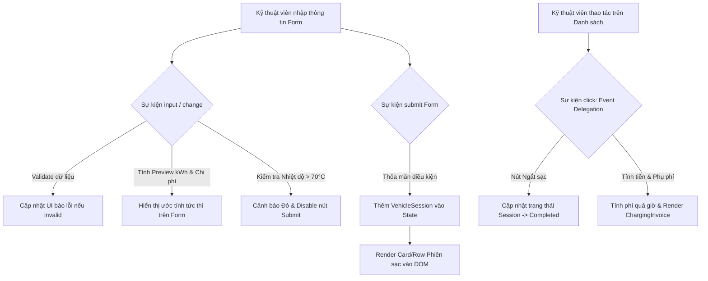

# Bài tập 13: E-Commerce (Mức độ 5: Sáng tạo - Thiết kế Mini Module)

### 1. Mục tiêu bài tập
Sau khi hoàn thành bài tập này, học viên sẽ có khả năng:
- **Quản lý & Xử lý Sự kiện DOM**: Thành thạo đăng ký sự kiện bằng `addEventListener` với các loại sự kiện form cốt lõi (`submit`, `input`, `change`, `blur`, `focus`).
- **Validation Form Thời gian thực (Real-time Validation)**: Xây dựng cơ chế kiểm tra dữ liệu đầu vào trực tiếp khi người dùng thao tác, hiển thị thông báo lỗi/cảnh báo động trên UI mà không làm gián đoạn trải nghiệm người dùng.
- **Kỹ thuật Event Delegation (Ủy quyền sự kiện)**: Áp dụng Event Bubbling & Delegation để bắt sự kiện từ các phần tử DOM được sinh ra động (Dynamic DOM elements) trong danh sách phiên sạc.
- **Tư duy Kiến trúc Mini Module**: Thiết kế ứng dụng dạng Event-Driven Module quản lý trạng thái bộ nhớ (In-memory State) và đồng bộ giao diện hiển thị không sử dụng thư viện ngoài.

---


### 2. Bối cảnh & Mô tả bài toán
Tập đoàn VinFast đang triển khai hạ tầng trạm sạc thông minh cho xe điện (`EV_CHARGING_STATION`). Bạn được giao nhiệm vụ phát triển một **Mini Module Quản lý Phiên Sạc Trực tuyến (EV Charging Management Console)** dành cho kỹ thuật viên tại trạm.

Ứng dụng cho phép kỹ thuật viên:
1. Nhập thông tin xe và thông số cổng sạc để **khởi tạo phiên sạc mới**.
2. **Tính toán trực tiếp (Real-time Preview)** dung lượng điện năng dự kiến (kWh) và chi phí ước tính ngay trong quá trình nhập liệu.
3. Kiểm soát **an toàn nhiệt độ cổng sạc** và cảnh báo tức thì.
4. Quản lý danh sách các phiên sạc đang hoạt động, thực hiện **ngắt sạc**, tính **phí phạt đỗ xe quá giờ** và xuất **hóa đơn thanh toán (`ChargingInvoice`)**.


#### Sơ đồ luồng xử lý sự kiện trong ứng dụng:


---


### 3. Quy tắc nghiệp vụ (Business Rules)


#### A. Quy tắc Đơn giá & Phí phạt
1. **Loại cổng sạc (`PortType`) & Đơn giá điện:**
   - **Sạc thường (`AC_STANDARD`)**: Đơn giá `3.850` VNĐ / kWh.
   - **Sạc siêu nhanh (`DC_SUPER_FAST`)**: Đơn giá `4.500` VNĐ / kWh.
2. **Quy tắc an toàn hệ thống:**
   - Nhiệt độ cổng sạc (`portTemp`) **> 70°C**: Hệ thống kích hoạt trạng thái **Quá nhiệt an toàn (Overheat Warning)**. Nút kích hoạt phiên sạc bị vô hiệu hóa (`disabled`), hiển thị thông báo nguy hiểm màu đỏ.
3. **Quy tắc Phí phạt đỗ xe quá giờ (`Overstay Penalty`):**
   - Sau khi sạc đầy (đạt dung lượng mục tiêu), xe được miễn phí đỗ trong **30 phút đầu**.
   - Từ phút thứ **31** trở đi: Tính phí phạt đỗ xe **1.000 VNĐ / phút**.
   - *Công thức phí phạt:* 
     $$\text{Phí phạt} = \max(0, \text{Số phút đỗ} - 30) \times 1.000\text{ VNĐ}$$


#### B. Quy tắc Validation Form (Xử lý sự kiện `input` & `blur`)
- **Biển số xe (`vehiclePlate`)**: Không được rỗng, phải đúng chuẩn biển số xe Việt Nam (Ví dụ: `29A-123.45`, `51H-999.99`, `30E-567.89`). *Gợi ý Regex: `/^[0-9]{2}[A-Z]-[0-9]{3}\.[0-9]{2}$/` hoặc `/^[0-9]{2}[A-Z]-[0-9]{4,5}$/`*.
- **Dung lượng pin hiện tại (`currentBattery`)**: Giá trị số nguyên từ `0` đến `99` (%).
- **Dung lượng pin mục tiêu (`targetBattery`)**: Giá trị số nguyên phải **lớn hơn** `currentBattery` và **nhỏ hơn hoặc bằng** `100` (%).
- **Dung lượng pin tối đa của xe (`batteryCapacity`)**: Giá trị số dương (tính bằng kWh, ví dụ: VinFast VF8 là 87.7 kWh, VF9 là 123 kWh).


#### C. Công thức tính toán dự kiến:
- $\text{Năng lượng cần sạc (kWh)} = \frac{(\text{targetBattery} - \text{currentBattery})}{100} \times \text{batteryCapacity}$
- $\text{Tiền điện dự kiến (VNĐ)} = \text{Năng lượng cần sạc (kWh)} \times \text{Đơn giá theo loại cổng sạc}$

---


### 4. Yêu cầu kỹ thuật & Triển khai


#### A. Cấu trúc HTML & Giao diện Form
Tạo giao diện bao gồm 3 khu vực chính:
1. **Form Khởi Tạo Phiên Sạc (`#charging-form`)**:
   - Input Biển số xe (`#vehicle-plate`), Dung lượng pin xe kWh (`#battery-capacity`).
   - Input Pin hiện tại (%) (`#current-battery`), Pin mục tiêu (%) (`#target-battery`).
   - Select Chọn loại cổng sạc (`#port-type`: `AC_STANDARD` hoặc `DC_SUPER_FAST`).
   - Input Nhiệt độ cổng sạc hiện tại (°C) (`#port-temp`).
   - Nút Submit (`#btn-submit-session`).
   - Khối Real-time Preview (`#preview-box`): Hiển thị kWh dự kiến và Chi phí ước tính khi người dùng đang nhập liệu.
2. **Bảng / Danh sách Phiên Sạc Động (`#session-list-container`)**:
   - Khhu vực hiển thị danh sách các phiên sạc dưới dạng Card hoặc Dòng trong Bảng.
   - Mỗi phiên sạc gồm: Biển số, Loại cổng, % Pin, Năng lượng tiêu thụ (kWh), Trạng thái (`CHARGING` / `COMPLETED`), Nút "Ngắt sạc", Input nhập số phút đỗ quá giờ, Nút "Xuất hóa đơn".
3. **Khu vực Hóa đơn Thanh toán (`#invoice-modal-content` hoặc `#invoice-display`)**:
   - Hiển thị chi tiết Hóa đơn `ChargingInvoice` gồm: Mã hóa đơn, Biển số, Tiền điện, Phí đỗ quá giờ, Tổng tiền thanh toán.


#### B. Yêu cầu Xử lý Sự kiện trong JavaScript (`app.js`)

1. **Sự kiện Real-time Calculation & Validation (`input`, `change`, `blur`)**:
   - Lắng nghe sự kiện `input` hoặc `change` trên các trường của Form để tự động tính toán lại số kWh và Chi phí dự kiến, cập nhật vào `#preview-box`.
   - Kiểm tra nhiệt độ cổng sạc ngay khi người dùng gõ vào `#port-temp`. Nếu > 70°C: Hiển thị message cảnh báo và đặt `#btn-submit-session.disabled = true`.
   - Lắng nghe sự kiện `blur` trên `#vehicle-plate` để validate định dạng biển số xe. Nếu sai format, thêm class css lỗi và hiển thị text thông báo ngay dưới input.

2. **Sự kiện Submit Form (`submit`)**:
   - Thêm event listener `submit` cho `#charging-form`.
   - Sử dụng `event.preventDefault()` để chặn hành vi reload trang mặc định.
   - Validate lại toàn bộ dữ liệu. Nếu hợp lệ:
     - Tạo một đối tượng `VehicleSession` mới lưu vào mảng dữ liệu trong bộ nhớ (`sessions = []`).
     - Gọi hàm render để thêm card phiên sạc mới vào `#session-list-container`.
     - Reset form về trạng thái ban đầu (`form.reset()`).

3. **Sự kiện Ủy quyền (Event Delegation) trên Danh sách Phiên Sạc (`click`)**:
   - **BẮT BUỘC**: Không gắn listener trực tiếp vào từng nút sạc/ngắt sạc khi render.
   - Đăng ký **ĐƠN LẺ** một event listener `click` duy nhất trên container cha `#session-list-container`.
   - Sử dụng `event.target` (hoặc `event.target.closest()`) để xác định hành động của người dùng:
     - Nếu click nút `btn-stop-charging`: Đổi trạng thái phiên sạc thành `COMPLETED`, disable nút dừng.
     - Nếu click nút `btn-generate-invoice`: Lấy giá trị số phút quá giờ từ input cùng card, áp dụng công thức tính phí phạt, sinh mã Hóa đơn và hiển thị giao diện Hóa đơn chi tiết (`ChargingInvoice`).


#### C. Phạm vi Công nghệ Nghiêm ngặt:
- **KHÔNG SỬ DỤNG**: Fetch API, `async/await`, `Promise` (Nội dung Session 21).
- **KHÔNG SỬ DỤNG**: `localStorage`, `sessionStorage` (Nội dung Session 23).
- **KHÔNG SỬ DỤNG**: Thư viện ngoài như jQuery, Bootstrap JS, React, Vue, Tailwind JS.
- Tất cả xử lý lưu trữ dữ liệu thực hiện trên Mảng/Đối tượng JavaScript trong bộ nhớ (In-memory State).

---


### 5. Quy chuẩn nộp bài
- **Cấu trúc thư mục dự án**:
  ```text
  EV_Charging_Module/
  ├── index.html
  ├── style.css
  └── app.js
  ```
- **Quy định mã nguồn**:
  - Mã HTML/CSS sạch sẽ, định dạng chuẩn.
  - JavaScript phân tách rõ ràng thành các hàm đảm nhận nhiệm vụ riêng: `validateForm()`, `calculatePreview()`, `renderSessions()`, `handleSessionAction()`, `calculateInvoice()`.
  - Tên biến, hàm sử dụng tiếng Anh chuẩn camelCase (ví dụ: `currentBattery`, `calculatePenaltyFee`).
  - Đóng gói ứng dụng trong IIFE hoặc ES Class/Module đơn giản để tránh ô nhiễm global namespace.

### Tiêu chuẩn Đánh giá & Thang điểm (100đ)

| Tiêu chí | Điểm tối đa | Mô tả chi tiết đánh giá |
| :--- | :--- | :--- |
| **Cấu trúc & Phong cách mã nguồn** | **20đ** | - Cấu trúc HTML semantics, CSS sạch sẽ dễ nhìn (5đ).<br>- Code JS đặt tên rõ nghĩa (`camelCase`), có comment giải thích luồng xử lý sự kiện (5đ).<br>- Phân chia hàm hợp lý (Modular pattern/Clean Code), không viết toàn bộ logic trong event handler (10đ). |
| **Xử lý Logic & Đăng ký Sự kiện (Event Handling)** | **40đ** | - Sử dụng đúng `preventDefault()` ngăn reload trang khi submit (5đ).<br>- Lắng nghe và xử lý chuẩn xác các sự kiện `input`, `change`, `blur` để tính toán real-time preview (10đ).<br>- Thực hiện đúng kỹ thuật Event Delegation (`click`) trên container cha cho các nút động (15đ).<br>- Tính toán chính xác đơn giá điện (AC/DC) và công thức phí phạt đỗ quá giờ (10đ). |
| **Xử lý Biên & Ngoại lệ (Edge Cases & Validation)** | **20đ** | - Validate đúng định dạng biển số xe và các khoảng giá trị % pin (5đ).<br>- Ngăn chặn submit khi Pin mục tiêu <= Pin hiện tại (5đ).<br>- Xử lý chuẩn an toàn quá nhiệt (> 70°C): vô hiệu hóa nút submit và hiển thị cảnh báo trực quan (5đ).<br>- Kiểm soát số phút quá giờ (nhập số âm, nhập chữ, hoặc chưa ngắt sạc đã bấm xuất hóa đơn) (5đ). |
| **Tối ưu Hiệu năng & Trải nghiệm Người dùng (UX)** | **20đ** | - Áp dụng Event Delegation tối ưu tài nguyên bộ nhớ thay vì gán nhiều listeners (10đ).<br>- Trải nghiệm UI/UX mượt mà: Thông báo lỗi hiển thị rõ ràng bên dưới input, tự động cập nhật preview không trễ (10đ). |