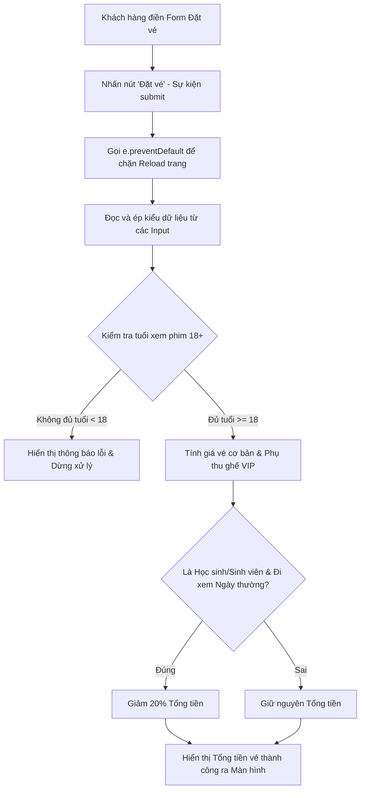

# Bài tập 2: Logistics (Mức độ 1: Cơ bản - Debug lỗi)

### 1. Mục tiêu bài tập
- **Kỹ năng Event Handling:** Bắt và xử lý thành công sự kiện `submit` trên Form và sự kiện `change`/`input` trên các phần tử HTML Input.
- **Kỹ năng Debug & Sửa lỗi:** Phát hiện và xử lý triệt để các lỗi phổ biến khi làm việc với Web DOM: ngăn chặn hành vi mặc định của form (`e.preventDefault()`), phân biệt giữa thuộc tính `.value` và `.checked`, khắc phục lỗi ép kiểu dữ liệu từ chuỗi sang số.
- **Áp dụng Quy tắc Nghiệp vụ:** Đảm bảo hệ thống tính chính xác tổng tiền vé xem phim (bao gồm phụ thu ghế VIP, giảm giá học sinh/sinh viên) và chặn truy cập đối với khán giả chưa đủ tuổi xem phim mác 18+.

---


### 2. Bối cảnh & Mô tả bài toán
Hệ thống rạp chiếu phim CGV / Lotte Cinema đang phát triển một mô-đun **"Đặt vé nhanh tại quầy Kiosk tự phục vụ"**. Lập trình viên Junior đã viết thử nghiệm mã nguồn HTML và JavaScript để xử lý việc chọn suất chiếu, loại ghế và tính tổng tiền vé. 

Tuy nhiên, khi đưa vào chạy thử nghiệm (UAT), hệ thống liên tục gặp sự cố:
1. Khi nhấn nút "Đặt vé", trang web lập tức bị tải lại (reload) và mất toàn bộ thông tin đã nhập.
2. Tổng tiền vé bị tính sai thành các chuỗi văn bản kéo dài (ví dụ: `9000015000` thay vì `105000`).
3. Khán giả 16 tuổi vẫn đặt được vé cho phim nhãn 18+.
4. Chọn/Bỏ chọn ô "Học sinh / Sinh viên" không có hiệu lực giảm giá hoặc giảm giá sai đối tượng.

Dưới đây là sơ đồ luồng xử lý sự kiện đặt vé đúng chuẩn mà bạn cần đạt được sau khi hoàn thành debug:



---


### 3. Quy tắc nghiệp vụ (Business Rules)
1. **Giá vé chuẩn (Standard Base Price):** 
   - Giá vé niêm yết mặc định cho tất cả các suất chiếu: `90.000 VNĐ`.
2. **Phụ thu Loại ghế (Seat Category Fee):**
   - Ghế Thường (`STANDARD`): Không phụ thu (`+ 0 VNĐ`).
   - Ghế VIP (`VIP`): Phụ thu thêm `15.000 VNĐ` vào giá vé cơ bản.
3. **Giảm giá Học sinh / Sinh viên (Student Discount):**
   - Áp dụng giảm `20%` trên **tổng giá vé (sau khi đã tính phụ thu ghế)** nếu người mua tick chọn "Học sinh / Sinh viên" **VÀ** ngày xem phim là ngày thường (Thứ 2 đến Thứ 6, tương ứng với giá trị từ `1` đến `5`).
   - Cuối tuần (Thứ 7 = `6`, Chủ Nhật = `7`): Không áp dụng giảm giá sinh viên.
4. **Giới hạn độ tuổi (Age Limit / Rating Constraint):**
   - Đối với các phim có mác 18+ (`data-is18="true"`), khán giả bắt buộc phải từ **18 tuổi trở lên** (`age >= 18`). 
   - Nếu khán giả dưới 18 tuổi đặt phim 18+, hệ thống phải hiển thị thông báo lỗi bằng chữ màu đỏ: `"Rất tiếc! Phim này chỉ dành cho khán giả từ 18 tuổi trở lên."` và dừng không tính tiền.

---


### 4. Yêu cầu kỹ thuật & Triển khai


#### Mã nguồn bị lỗi (Buggy Code) do Junior cung cấp:

**File `index.html`:**
```html
<!DOCTYPE html>
<html lang="vi">
<head>
  <meta charset="UTF-8">
  <title>CGV / Lotte Ticket Kiosk</title>
  <style>
    .error { color: red; font-weight: bold; }
    .success { color: green; font-weight: bold; }
  </style>
</head>
<body>
  <h2>Hệ Thống Đặt Vé Xem Phim CGV / Lotte</h2>

  <form id="ticketForm">
    <div>
      <label for="movieSelect">Chọn phim:</label>
      <select id="movieSelect">
        <option value="MOV_01" data-is18="false">Doraemon (Mác: P)</option>
        <option value="MOV_02" data-is18="true">Mai - Phim 18+</option>
      </select>
    </div>

    <div>
      <label for="audienceAge">Tuổi của bạn:</label>
      <input type="number" id="audienceAge" value="16">
    </div>

    <div>
      <label for="seatType">Loại ghế:</label>
      <select id="seatType">
        <option value="STANDARD">Ghế Thường (90.000 VNĐ)</option>
        <option value="VIP">Ghế VIP (+15.000 VNĐ)</option>
      </select>
    </div>

    <div>
      <label>
        <input type="checkbox" id="isStudent"> Là Học sinh / Sinh viên (Giảm 20% ngày thường)
      </label>
    </div>

    <div>
      <label for="dayOfWeek">Ngày xem trong tuần (1: Thứ 2 ... 7: Chủ Nhật):</label>
      <input type="number" id="dayOfWeek" value="3" min="1" max="7">
    </div>

    <button type="submit" id="btnSubmit">Đặt Vé Ngay</button>
  </form>

  <div id="resultMessage" style="margin-top: 15px;"></div>

  <script src="main.js"></script>
</body>
</html>
```

**File `main.js` (Chứa các đoạn lỗi nghiêm trọng):**
```javascript
// Đoạn mã chứa lỗi cần Debug
const ticketForm = document.getElementById("ticketForm");

ticketForm.addEventListener("submit", function(e) {
  // LỖI 1: Thiếu ngăn chặn hành vi reload mặc định của Form

  const movieSelect = document.getElementById("movieSelect");
  const ageInput = document.getElementById("audienceAge").value; // LỖI 2: Dữ liệu lấy về bị sai kiểu
  const seatType = document.getElementById("seatType").value;
  const isStudent = document.getElementById("isStudent").value; // LỖI 3: Dùng sai thuộc tính của Checkbox
  const dayOfWeek = document.getElementById("dayOfWeek").value;
  const resultMessage = document.getElementById("resultMessage");

  let basePrice = 90000;

  // Kiểm tra độ tuổi 18+
  const selectedOption = movieSelect.options[movieSelect.selectedIndex];
  const is18Plus = selectedOption.getAttribute("data-is18"); 

  // LỖI 4: Vấn đề so sánh kiểu dữ liệu giữa String và Boolean
  if (is18Plus == true && ageInput < 18) { 
    resultMessage.className = "error";
    resultMessage.innerText = "Rất tiếc! Phim này chỉ dành cho khán giả từ 18 tuổi trở lên.";
    return;
  }

  // Tính giá ghế
  let totalPrice = basePrice;
  if (seatType === "VIP") {
    totalPrice = totalPrice + "15000"; // LỖI 5: Phép cộng bị biến thành nối chuỗi
  }

  // Tính giảm giá sinh viên
  if (isStudent && dayOfWeek >= 1 && dayOfWeek <= 5) {
    totalPrice = totalPrice * 0.8;
  }

  resultMessage.className = "success";
  resultMessage.innerText = "Đặt vé thành công! Tổng tiền thanh toán: " + totalPrice + " VNĐ";
});
```


#### Nhiệm vụ của học viên:
1. **Báo cáo Debug (Debug Report):** Liệt kê ít nhất **5 lỗi** đã phát hiện trong đoạn code trên. Giải thích rõ ràng nguyên nhân dẫn đến từng lỗi và hậu quả của nó.
2. **Sửa lỗi Code:** Viết lại hoàn chỉnh file `main.js` sao cho xử lý đúng toàn bộ quy tắc nghiệp vụ.
3. **Yêu cầu bổ sung (Validation):**
   - Đảm bảo tuổi nhập vào là một số nguyên dương hợp lệ (`> 0`). Nếu nhập tuổi `<= 0` hoặc để trống, hiển thị thông báo lỗi màu đỏ: `"Vui lòng nhập tuổi hợp lệ!"`.
   - Định dạng tổng tiền hiển thị dạng số đẹp mắt hoặc đúng số nguyên (ví dụ: `105.000 VNĐ` hoặc `84.000 VNĐ`).

*Lưu ý cấm:* Không sử dụng `Fetch API`, `Async/Await` hay `LocalStorage`. Chỉ dùng kiến thức DOM và Event Handling đã học từ Session 19 trở về trước.

---


### 5. Quy chuẩn nộp bài
- **Cấu trúc thư mục nộp bài:**
  ```text
  [HoVaTen]_HW19_Debug/
  ├── index.html
  ├── main.js
  └── README.md (Báo cáo giải thích 5 lỗi đã debug)
  ```
- **Quy định đặt tên file & nộp bài:**
  - Nộp file nén `.zip` với tên: `NguyenVanA_HW19_Debug.zip`.
  - File `README.md` cần trình bày rõ ràng 5 lỗi theo bảng hoặc danh sách có gạch đầu dòng.

### Tiêu chuẩn Đánh giá & Thang điểm (100đ)

| Tiêu chí | Điểm tối đa | Mô tả chi tiết |
| :--- | :--- | :--- |
| **Báo cáo Debug & Giải thích lỗi (Debug Report)** | 20đ | Xác định đúng và giải thích chính xác nguyên nhân của 5 lỗi trong code mẫu (Form reload, String type casting, Checkbox property, Loose equality check, String concatenation). |
| **Xử lý Sự kiện Form & Ngăn ngừa mặc định** | 20đ | Sử dụng đúng `e.preventDefault()`, lắng nghe đúng sự kiện `submit` trên Form và đọc dữ liệu chính xác từ các phần tử DOM. |
| **Xử lý Logic Nghiệp vụ & Ép kiểu** | 30đ | Ép kiểu dữ liệu chuẩn xác (`parseInt`/`Number`). Tính đúng giá vé cơ bản, phụ thu ghế VIP (15.000đ), giảm giá 20% cho sinh viên ngày thường, và chặn phim 18+ chính xác. |
| **Xử lý Biên & Validation Đầu vào** | 15đ | Kiểm tra tuổi hợp lệ (`> 0`), không để trống. Hiển thị thông báo lỗi với CSS class `error` đúng theo yêu cầu khi có sự cố. |
| **Cấu trúc Mã nguồn & Phong cách viết Code** | 15đ | Mã nguồn sạch sẻ, thụt lề chuẩn, đặt tên biến rõ ràng theo chuẩn camelCase, comment giải thích code đầy đủ, tuân thủ đúng cấu trúc thư mục nộp bài. |