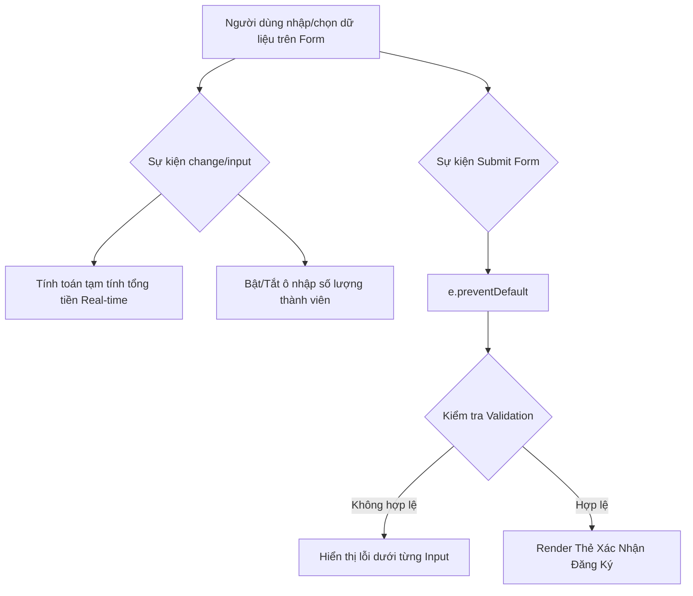

# Bài tập 4: Healthcare (Mức độ 2: Cơ bản - Kiểm thử I/O)

### 1. Mục tiêu bài tập
- **Thao tác sự kiện Form:** Sử dụng thành thạo `addEventListener` để lắng nghe các sự kiện `submit`, `input`, và `change` trên các phần tử HTML Form.
- **Ngăn chặn hành vi mặc định:** Áp dụng `e.preventDefault()` để xử lý dữ liệu form mà không làm tải lại trang (page reload).
- **Kiểm thử I/O & Validation:** Xây dựng logic kiểm tra tính hợp lệ của dữ liệu đầu vào (Input Validation) và hiển thị thông báo lỗi/kết quả phản hồi tức thì trên giao diện (Output Rendering).
- **Ứng dụng logic nghiệp vụ:** Mô phỏng bài toán đăng ký gói dịch vụ chăm sóc sức khỏe trực tuyến (HealthCare SaaS Subscription) áp dụng công thức tính phí và phân quyền tính năng.

---


### 2. Bối cảnh & Mô tả bài toán
Nền tảng Y tế Số **MedCare+** đang triển khai hệ thống cho phép bệnh nhân đăng ký các gói tư vấn và theo dõi sức khỏe trực tuyến theo định kỳ (SaaS Healthcare Subscription). 

Bạn được giao nhiệm vụ triển khai mô-đun xử lý phía Front-end (Vanilla JavaScript) cho **Form Đăng ký Gói Sức khỏe**. Hệ thống cần bắt các sự kiện người dùng tương tác với form, tự động tính toán tổng chi phí hiển thị theo thời gian thực (Real-time), kiểm tra dữ liệu đầu vào và hiển thị thẻ xác nhận đăng ký thành công khi submit form.


#### Sơ đồ luồng xử lý sự kiện (Event Handling Flow)


---


### 3. Quy tắc nghiệp vụ (Business Rules)


#### A. Danh sách gói dịch vụ (`SubscriptionPlan`)
1. **Gói Cá nhân (`BASIC`):**
   - Đơn giá: `200,000 VNĐ / tháng`.
   - Giới hạn: Tối đa 01 người dùng (Chỉ áp dụng cho chủ tài khoản).
   - Khi chọn gói này: Ô nhập số lượng thành viên phụ (`memberCount`) bị **Disable** và tự động gán giá trị = `1`.
2. **Gói Gia đình (`FAMILY`):**
   - Đơn giá: `600,000 VNĐ / tháng`.
   - Giới hạn: Cho phép đăng ký tối đa `5` thành viên (bao gồm cả chủ tài khoản).
   - Khi chọn gói này: Ô nhập số lượng thành viên phụ (`memberCount`) được **Enable** để người dùng chọn từ `1` đến `5`.


#### B. Chu kỳ thanh toán (`BillingCycle`)
1. **Theo tháng (`MONTHLY`):** Tổng tiền = `Đơn giá gói x 1`.
2. **Theo năm (`ANNUAL`):** Tổng tiền = `Đơn giá gói x 12 x 0.8` (Áp dụng chính sách giảm giá 20% khi đăng ký 1 năm).


#### C. Quy định Validation dữ liệu đầu vào
- **Họ và tên (`fullName`):** Không được để trống, độ dài từ 3 ký tự trở lên.
- **Email (`email`):** Đúng định dạng email (ví dụ: `nguyenvana@gmail.com`).
- **Số điện thoại (`phone`):** Đúng định dạng số điện thoại Việt Nam (10 chữ số, bắt đầu bằng số `0`).
- **Số lượng thành viên (`memberCount`):** Nếu là gói `FAMILY`, giá trị phải trong khoảng từ `1` đến `5`.

---


### 4. Yêu cầu kỹ thuật & Triển khai


#### A. Cấu trúc HTML giao diện (Tham khảo / Yêu cầu chuẩn ID)
File `index.html` cần chứa các thẻ HTML với các `id` chính xác sau:
- Form đăng ký: `<form id="subscriptionForm">`
- Các ô input: `#fullName`, `#email`, `#phone`, `#planSelect`, `#cycleSelect`, `#memberCount`
- Vùng hiển thị lỗi: `#fullNameError`, `#emailError`, `#phoneError`, `#memberCountError`
- Vùng hiển thị tạm tính tổng tiền: `<span id="totalPricePreview">0 VNĐ</span>`
- Vùng hiển thị kết quả xác nhận: `<div id="confirmationCard">`


#### B. Yêu cầu xử lý JavaScript (`script.js`)

1. **Xử lý sự kiện `change` trên `#planSelect`:**
   - Nếu chọn `BASIC`: Đặt `memberCount.disabled = true`, gán `memberCount.value = 1`.
   - Nếu chọn `FAMILY`: Đặt `memberCount.disabled = false`.

2. **Xử lý sự kiện `input` / `change` trên các trường `#planSelect`, `#cycleSelect`:**
   - Tự động tính toán lại `totalPricePreview` và hiển thị dạng tiền tệ Việt Nam (VD: `5,760,000 VNĐ`).

3. **Xử lý sự kiện `submit` trên `#subscriptionForm`:**
   - Gọi `e.preventDefault()` để ngăn reload trang.
   - Xóa toàn bộ thông báo lỗi cũ trên giao diện.
   - Thực hiện Validation từng trường dữ liệu:
     - Nếu có lỗi: Hiển thị nội dung lỗi tương ứng vào các thẻ chứa lỗi (`#...Error`) và thêm border màu đỏ cho ô input đó.
     - Nếu tất cả hợp lệ: Ẩn form hoặc xóa form, hiển thị thẻ xác nhận `#confirmationCard` chứa đầy đủ thông tin:
       - Họ tên, Email, Số điện thoại.
       - Tên gói dịch vụ đã chọn (Cá nhân / Gia đình).
       - Chu kỳ thanh toán (Theo tháng / Theo năm).
       - Tổng tiền cần thanh toán.


####  Phạm vi nghiêm cấm (Forbidden Scope)
- Không sử dụng `Fetch API` hoặc `Async/Await` (Kiến thức Bài 21).
- Không sử dụng `LocalStorage` / `SessionStorage` (Kiến thức Bài 23).
- Không sử dụng thư viện ngoài (jQuery, React, Bootstrap JS,...). Chỉ dùng Pure JavaScript / DOM API.

---


### 5. Quy chuẩn nộp bài
- **Cấu trúc thư mục:**
  ```text
  bai_tap_19/
  ├── index.html
  ├── style.css
  └── script.js
  ```
- **Đặt tên file:** Đúng chuẩn chữ thường, không khoảng trắng, không dấu.
- Mã nguồn JavaScript phải có comment giải thích rõ từng hàm xử lý sự kiện và đoạn logic tính toán.

### Tiêu chuẩn Đánh giá & Thang điểm (100đ)

| Tiêu chí | Điểm tối đa | Mô tả chi tiết |
| :--- | :--- | :--- |
| **Cấu trúc & Phong cách mã nguồn** | **20đ** | - Đặt tên biến/hàm theo chuẩn `camelCase`, phân tách file HTML/CSS/JS rõ ràng (5đ).<br>- Comment mã nguồn đầy đủ, giải thích rõ các sự kiện DOM (5đ).<br>- Thụt lề chuẩn xác, mã nguồn sạch sẽ, không dư thừa code rác (10đ). |
| **Xử lý Logic nghiệp vụ & DOM Event** | **40đ** | - Sử dụng đúng `e.preventDefault()` trong sự kiện `submit` (10đ).<br>- Xử lý đúng sự kiện `change` bật/tắt ô nhập thành viên theo gói dịch vụ (10đ).<br>- Tính toán chính xác tổng chi phí (áp dụng giảm 20% cho năm) và hiển thị định dạng tiền tệ (10đ).<br>- Render chính xác Thẻ Xác Nhận thông tin khi tất cả dữ liệu hợp lệ (10đ). |
| **Xử lý Biên & Validation Input** | **20đ** | - Validate đúng tất cả các trường: Họ tên, Email (regex), Số điện thoại Việt Nam, Số lượng thành viên (1-5) (15đ).<br>- Hiển thị/xóa thông báo lỗi trực quan đúng vị trí bên dưới ô input khi dữ liệu không hợp lệ (5đ). |
| **Trải nghiệm người dùng (UX) & Tối ưu** | **20đ** | - Cập nhật tạm tính tổng tiền Real-time khi người dùng thay đổi Lựa chọn (10đ).<br>- Đơn giản, giao diện trực quan, không gặp lỗi console khi thao tác liên tục (10đ). |