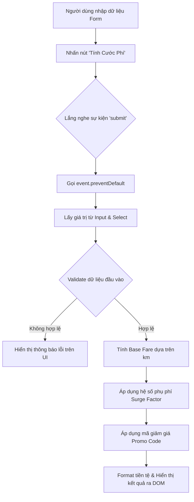

# Bài tập 5: CRM (Mức độ 2: Cơ bản - Kiểm thử I/O)

### 1. Mục tiêu bài tập
Sau khi hoàn thành bài tập này, học viên có thể:
- Làm chủ kỹ thuật đăng ký và xử lý sự kiện Form Input (`submit`, `input`, `change`) bằng `addEventListener`.
- Áp dụng thành thạo `event.preventDefault()` để kiểm soát hành vi mặc định của Form trong ứng dụng Web Single Page.
- Đọc, chuyển đổi kiểu dữ liệu (data parsing) và validate các trường nhập liệu từ DOM Elements (`<input>`, `<select>`).
- Triển khai thuật toán tính toán cước phí dịch vụ đặt xe công nghệ GrabRide theo đúng quy tắc nghiệp vụ thực tế.
- Hiển thị kết quả tính toán và phản hồi lỗi linh hoạt trên giao diện người dùng (DOM Manipulation) mà không cần tải lại trang.

---


### 2. Bối cảnh & Mô tả bài toán
Trong hệ thống quản lý và chăm sóc khách hàng của ứng dụng gọi xe công nghệ **GrabRide (GRAB_RIDE CRM)**, bộ phận CSKH cần một công cụ **Tính Cước Phí Dự Kiến (Trip Fare Estimator)** trực tiếp trên trình duyệt. Công cụ này giúp tổng đài viên nhanh chóng tra cứu và báo giá cho hành khách trước khi xác nhận chuyến đi.

Hành khách hoặc nhân viên CRM sẽ nhập số km dự định di chuyển, chọn tình trạng giao thông/thời tiết hiện tại và nhập mã giảm giá (nếu có). Hệ thống sẽ ngay lập tức lắng nghe sự kiện từ giao diện và hiển thị cước phí chính xác.



---


### 3. Quy tắc nghiệp vụ (Business Rules)


#### 3.1. Quy tắc tính cước phí nền tảng (Base Fare)
Cước phí gốc được tính lũy tiến dựa trên tổng khoảng cách di chuyển $d$ (đơn vị: km, chấp nhận số thực):
- **2 km đầu tiên**: Giá cố định **12.000 VNĐ**. (Dù di chuyển dưới 2 km, ví dụ $0.5$ km hay $1.8$ km vẫn tính là $12.000$ VNĐ).
- **Từ km thứ 3 trở đi ($d > 2$)**: Mức giá là **4.500 VNĐ / km** cho toàn bộ số km vượt quá 2 km.
  $$\text{Base Fare} = 12.000 + (d - 2) \times 4.500 \quad (\text{VNĐ})$$


#### 3.2. Quy tắc phụ phí theo điều kiện (Surge Pricing)
Tùy thuộc vào thời tiết và khung giờ được chọn trong dropdown `<select>`:
- **Thời tiết / Giờ bình thường (`normal`)**: Hệ số $1.0\times$ (Không tăng giá).
- **Mưa lớn / Giờ cao điểm (`surge`)**: Áp dụng hệ số nhân **$1.2\times$** trên cước phí gốc.
  $$\text{Fare After Surge} = \text{Base Fare} \times 1.2$$


#### 3.3. Quy tắc áp dụng Mã giảm giá (Promo Code)
Sau khi tính toán cước phí đã bao gồm phụ phí, hệ thống kiểm tra chuỗi mã ưu đãi nhập vào (không phân biệt chữ hoa/chữ thường, tự động xóa khoảng trắng thừa ở 2 đầu):
- Mã **`GRABNEW`**: Giảm trực tiếp **10.000 VNĐ** vào tổng cước phí.
- Mã **`TIETKIEM`**: Giảm **10%** trên cước phí (sau phụ phí).
- Trường hợp mã không đúng hoặc để trống: Không áp dụng giảm giá.
- **Ràng buộc**: Tổng cước phí thanh toán cuối cùng không được phép nhỏ hơn **0 VNĐ** (nếu cước phí sau khi giảm < 0 thì lấy bằng 0 VNĐ).


#### 3.4. Ràng buộc kiểm tra dữ liệu (Input Validation)
- Khoảng cách di chuyển ($d$): Không được để trống, không được là chuỗi ký tự không phải số, và phải **hơn 0 km** ($d > 0$).
- Nếu dữ liệu không hợp lệ: Hiển thị thông báo lỗi tương ứng tại khu vực hiển thị lỗi, ẩn khu vực kết quả.

---


### 4. Yêu cầu kỹ thuật & Triển khai


#### 4.1. Cấu trúc HTML bắt buộc
Tạo file `index.html` chứa các thẻ với đúng `id` và `name` theo quy định sau:
```html
<form id="fare-form">
  <!-- Input khoảng cách -->
  <input type="number" id="distance" step="0.1" placeholder="Nhập số km (VD: 5.5)">
  
  <!-- Select điều kiện chuyến đi -->
  <select id="condition">
    <option value="normal">Thời tiết bình thường</option>
    <option value="surge">Mưa lớn / Giờ cao điểm (1.2x)</option>
  </select>

  <!-- Input mã giảm giá -->
  <input type="text" id="promo-code" placeholder="Mã giảm giá (nếu có)">

  <!-- Nút Submit -->
  <button type="submit" id="btn-submit">Tính Cước Phí</button>
</form>

<!-- Khu vực hiển thị thông báo lỗi -->
<div id="error-message" class="hidden"></div>

<!-- Khu vực hiển thị kết quả -->
<div id="result-box" class="hidden">
  <p>Cước phí dự kiến: <span id="final-fare">0 VNĐ</span></p>
</div>
```


#### 4.2. Yêu cầu xử lý JavaScript (`js/app.js`)
1. Lắng nghe sự kiện `submit` trên `<form id="fare-form">`.
2. Sử dụng `event.preventDefault()` để chặn sự kiện gửi form mặc định của trình duyệt.
3. Viết hàm `calculateTripFare(distance, condition, promoCode)` nhận vào 3 tham số và trả về số tiền cước cuối cùng.
4. Định dạng hiển thị số tiền theo chuẩn Việt Nam (ví dụ: `27.540 VNĐ` hoặc `27.540đ`).
5. Quản lý trạng thái giao diện: Hiển thị/Ẩn khối lỗi `#error-message` và khối kết quả `#result-box` bằng cách thêm/bớt class CSS hoặc thuộc tính `style.display`.


#### 4.3. Bảng dữ liệu Kiểm thử I/O (Test Cases)

| STT | Khoảng cách (`distance`) | Điều kiện (`condition`) | Mã giảm giá (`promoCode`) | Kết quả mong đợi (`final-fare`) | Ghi chú |
| :--- | :--- | :--- | :--- | :--- | :--- |
| **TC1** | `1.5` | `normal` | `""` | `12.000 VNĐ` | Dưới 2km, giá cố định 12.000đ |
| **TC2** | `5` | `normal` | `""` | `25.500 VNĐ` | $12.000 + (5-2) \times 4.500 = 25.500$ |
| **TC3** | `5` | `surge` | `""` | `30.600 VNĐ` | $25.500 \times 1.2 = 30.600$ |
| **TC4** | `5` | `surge` | `"GRABNEW"` | `20.600 VNĐ` | $30.600 - 10.000 = 20.600$ |
| **TC5** | `5` | `surge` | `"TIETKIEM"` | `27.540 VNĐ` | $30.600 \times 0.9 = 27.540$ |
| **TC6** | `0` hoặc `-3` | `normal` | `""` | Lỗi: "Khoảng cách di chuyển phải lớn hơn 0 km!" | Xử lý dữ liệu biên không hợp lệ |
| **TC7** | `""` (trống) | `normal` | `""` | Lỗi: "Vui lòng nhập khoảng cách di chuyển!" | Xử lý input rỗng |

---


### 5. Quy chuẩn nộp bài
- Cấu trúc thư mục dự án:
```text
exercise-5-grabride/
├── index.html
├── css/
│   └── style.css
└── js/
    └── app.js
```
- File `app.js` phải chứa mã nguồn được comment giải thích rõ ràng từng bước (đọc DOM, validate, tính toán, render).
- Không sử dụng Fetch API, Async/Await hoặc LocalStorage trong bài tập này.

### Tiêu chuẩn Đánh giá & Thang điểm (100đ)

| Tiêu chí | Điểm tối đa | Mô tả chi tiết |
| :--- | :--- | :--- |
| **Cấu trúc & Phong cách mã nguồn** | **20đ** | - Cấu trúc HTML/CSS/JS tách biệt rõ ràng.<br>- Đặt tên biến, hàm theo chuẩn `camelCase` (ví dụ: `calculateTripFare`, `distanceInput`).<br>- Sử dụng `const`/`let` đúng phạm vi, không dùng `var`.<br>- Code được comment đầy đủ, thụt lề chuẩn. |
| **Xử lý Logic đúng nghiệp vụ** | **40đ** | - Sử dụng đúng `event.preventDefault()` khi submit form (10đ).<br>- Tính toán chính xác Base Fare theo khoảng cách lũy tiến (10đ).<br>- Áp dụng chính xác hệ số phụ phí cao điểm / mưa (10đ).<br>- Xử lý chuẩn xác các trường hợp mã giảm giá `GRABNEW`, `TIETKIEM` và đưa tiền về tối thiểu 0 VNĐ (10đ). |
| **Xử lý Biên & Ngoại lệ** | **20đ** | - Bắt chính xác lỗi khi khoảng cách trống, bằng 0 hoặc số âm (10đ).<br>- Hiển thị thông báo lỗi rõ ràng trên UI và ẩn khối kết quả khi gặp lỗi (10đ). |
| **Tối ưu hiệu năng & Thao tác DOM** | **20đ** | - Truy xuất phần tử DOM chính xác thông qua ID/Class.<br>- Render kết quả hiển thị mượt mà, định dạng tiền tệ Việt Nam (`VNĐ`) trực quan.<br>- Xử lý chuỗi mã giảm giá linh hoạt (loại bỏ khoảng trắng `trim()`, chuyển thành chữ hoa `toUpperCase()`). |