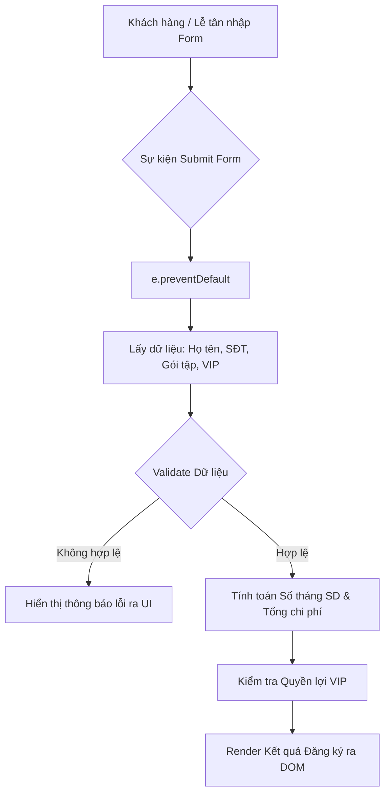

# Bài tập 6: EdTech (Mức độ 2: Cơ bản - Kiểm thử I/O)

### 1. Mục tiêu bài tập
Sau khi hoàn thiện bài tập này, học viên sẽ đạt được các mục tiêu kỹ năng:
- **Xử lý sự kiện Form**: Bắt và xử lý sự kiện `submit` của Form, áp dụng `e.preventDefault()` để ngăn chặn hành vi load lại trang mặc định của trình duyệt.
- **Lắng nghe sự kiện Input/Change**: Sử dụng `addEventListener` để lắng nghe sự kiện thay đổi dữ liệu trên các ô nhập liệu (`input`, `select`, `checkbox`).
- **Thao tác DOM Dynamic**: Đọc dữ liệu từ form, thực hiện tính toán nghiệp vụ và cập nhật kết quả hiển thị giao diện động (DOM Manipulation).
- **Kiểm lỗi dữ liệu đầu vào (Validation)**: Kiểm tra ràng buộc dữ liệu cơ bản trước khi xử lý logic nghiệp vụ.

---


### 2. Bối cảnh & Mô tả bài toán
Hệ thống **Quản lý Phòng tập Gym & Fitness (GYM_FITNESS)** cần phát triển mô-đun **Đăng ký Gói tập Hội viên**. Lễ tân sẽ nhập thông tin đăng ký của khách hàng trên giao diện Web. Hệ thống phải tự động tính toán tổng số tháng sử dụng (bao gồm các tháng tặng kèm theo chương trình ưu đãi), tổng chi phí cần thanh toán và hiển thị các quyền lợi đi kèm (như dịch vụ VIP).



---


### 3. Quy tắc nghiệp vụ (Business Rules)

1. **Ràng buộc Đầu vào (Validation Rules)**:
   - **Họ và tên (`fullname`)**: Không được để trống (sau khi xóa khoảng trắng đầu/cuối bằng `.trim()`).
   - **Số điện thoại (`phone`)**: Phải là chuỗi gồm đúng 10 chữ số và bắt đầu bằng số `0` (Ví dụ hợp lệ: `0912345678`).

2. **Bảng giá & Ưu đãi Gói tập (`package-type`)**:
   - **Gói 1 tháng (`1_MONTH`)**: 
     - Giá gốc: `500,000` VNĐ
     - Số tháng sử dụng thực tế: `1` tháng.
   - **Gói 6 tháng (`6_MONTH`)**: 
     - Giá gốc: `2,700,000` VNĐ
     - Số tháng sử dụng thực tế: `6` tháng.
   - **Gói 12 tháng (`12_MONTH`)**: 
     - Giá gốc: `4,800,000` VNĐ
     - **Ưu đãi đặc biệt**: Tặng thêm **2 tháng** sử dụng miễn phí $\rightarrow$ Tổng thời hạn sử dụng là **14 tháng**.

3. **Hạng VIP (`is-vip`)**:
   - Nếu tích chọn VIP (`is-vip = true`): 
     - Phụ phí VIP: Cộng thêm `500,000` VNĐ vào tổng chi phí.
     - Quà tặng/Quyền lợi đi kèm: `"Tủ đồ cá nhân & Khăn tắm miễn phí"`.
   - Nếu không tích chọn VIP (`is-vip = false`):
     - Phụ phí VIP: `0` VNĐ.
     - Quà tặng/Quyền lợi đi kèm: `"Không có"`.

4. **Công thức tính toán**:
   - $\text{Tổng tiền} = \text{Giá gốc gói tập} + \text{Phụ phí VIP (nếu có)}$.
   - $\text{Tổng số tháng} = \text{Số tháng đăng ký} + \text{Số tháng tặng (2 tháng nếu chọn gói 12 tháng)}$.

---


### 4. Yêu cầu kỹ thuật & Triển khai


#### 4.1. Cấu trúc Giao diện HTML
Tạo file `index.html` chứa thẻ Form và các thẻ hiển thị với đúng các `id` sau:
- Thẻ `<form id="member-form">` chứa toàn bộ input.
- Input họ tên: `<input type="text" id="fullname">`
- Input số điện thoại: `<input type="text" id="phone">`
- Select chọn gói tập: `<select id="package-type">` với các option `value="1_MONTH"`, `value="6_MONTH"`, `value="12_MONTH"`.
- Checkbox VIP: `<input type="checkbox" id="is-vip">`
- Nút Submit: `<button type="submit" id="btn-submit">Đăng ký</button>`
- Thẻ thẻ div hiển thị thông báo lỗi: `<div id="error-message" style="color: red;"></div>`
- Thẻ div hiển thị kết quả xác nhận: `<div id="result-container"></div>`


#### 4.2. Xử lý JavaScript (`main.js`)
- Lắng nghe sự kiện `submit` trên thẻ `#member-form`.
- Gọi `e.preventDefault()` để chặn hành vi reload trang mặc định.
- Lấy giá trị từ các trường input, thực hiện kiểm tra lỗi. Nếu có lỗi, ẩn thẻ `#result-container`, hiển thị câu thông báo lỗi chi tiết vào `#error-message`.
- Nếu dữ liệu hợp lệ, ẩn thẻ `#error-message`, tính toán các thông số và chèn đoạn HTML xác nhận vào `#result-container`.

> **LƯU Ý NGHIÊM CẤM**: Không sử dụng Fetch API, Async/Await hoặc LocalStorage trong bài tập này.

---


### 5. Quy chuẩn nộp bài
- Cấu trúc thư mục dự án:
  ```text
  gym-member-registration/
  ├── index.html
  ├── style.css
  └── main.js
  ```
- Nộp file nén `.zip` với tên theo định dạng: `HoTen_MSSV_Session19.zip`.

---


### 6. Kịch bản kiểm thử I/O (Test Cases)

Hệ thống của bạn phải vượt qua các test cases sau:

| Mã TC | Đầu vào (Input) | Kết quả kỳ vọng (Expected Output) |
| :--- | :--- | :--- |
| **TC-01** | `fullname`: `"   "`<br>`phone`: `"0912345678"`<br>`package`: `"1_MONTH"` | `#error-message`: `"Họ và tên không được để trống!"`<br>`#result-container`: Trống |
| **TC-02** | `fullname`: `"Nguyễn Văn A"`<br>`phone`: `"123456789"` (9 số, không bắt đầu bằng 0)<br>`package`: `"6_MONTH"` | `#error-message`: `"Số điện thoại phải có đúng 10 chữ số và bắt đầu bằng số 0!"`<br>`#result-container`: Trống |
| **TC-03** | `fullname`: `"Lê Văn B"`<br>`phone`: `"0901234567"`<br>`package`: `"1_MONTH"`<br>`isVIP`: `false` | `#error-message`: Trống<br>`#result-container` chứa nội dung:<br>- Họ tên: Lê Văn B<br>- SĐT: 0901234567<br>- Gói đăng ký: Gói 1 tháng<br>- Thời gian sử dụng: 1 tháng<br>- Tổng tiền thanh toán: 500,000 VNĐ<br>- Quà tặng: Không có |
| **TC-04** | `fullname`: `"Phạm Thị C"`<br>`phone`: `"0988776655"`<br>`package`: `"12_MONTH"`<br>`isVIP`: `false` | `#error-message`: Trống<br>`#result-container` chứa nội dung:<br>- Họ tên: Phạm Thị C<br>- SĐT: 0988776655<br>- Gói đăng ký: Gói 12 tháng (Tặng 2 tháng)<br>- Thời gian sử dụng: 14 tháng<br>- Tổng tiền thanh toán: 4,800,000 VNĐ<br>- Quà tặng: Không có |
| **TC-05** | `fullname`: `"Hoàng Anh D"`<br>`phone`: `"0911223344"`<br>`package`: `"12_MONTH"`<br>`isVIP`: `true` | `#error-message`: Trống<br>`#result-container` chứa nội dung:<br>- Họ tên: Hoàng Anh D<br>- SĐT: 0911223344<br>- Gói đăng ký: Gói 12 tháng (Tặng 2 tháng)<br>- Thời gian sử dụng: 14 tháng<br>- Tổng tiền thanh toán: 5,300,000 VNĐ<br>- Quà tặng: Tủ đồ cá nhân & Khăn tắm miễn phí |

### Tiêu chuẩn Đánh giá & Thang điểm (100đ)

| Tiêu chí | Điểm tối đa | Mô tả chi tiết |
| :--- | :--- | :--- |
| **Cấu trúc & Phong cách mã nguồn** | **20đ** | - Đặt đúng các ID HTML theo yêu cầu bài toán (5đ).<br>- Đặt tên biến, hàm theo chuẩn `camelCase`, mã nguồn sạch sẻ, thụt lề chuẩn (10đ).<br>- Có ghi chú (comments) giải thích các đoạn xử lý logic (5đ). |
| **Xử lý Logic đúng nghiệp vụ** | **40đ** | - Sử dụng đúng `addEventListener` và `e.preventDefault()` để chặn submit form (10đ).<br>- Tính toán chính xác ưu đãi tặng 2 tháng cho gói 12 tháng (10đ).<br>- Tính đúng tổng chi phí khi có/không có phụ phí VIP (10đ).<br>- Đạt 100% kết quả từ bảng Kịch bản kiểm thử Test Cases (10đ). |
| **Xử lý Biên & Ngoại lệ (Validation)** | **20đ** | - Kiểm tra lỗi chuỗi rỗng/khoảng trắng đối với Họ và tên (10đ).<br>- Kiểm tra chính xác định dạng số điện thoại (10 chữ số, bắt đầu bằng số 0) (10đ). |
| **Tối ưu & Tương tác DOM** | **20đ** | - Hiển thị/ẩn chính xác các thẻ thông báo lỗi (`#error-message`) và kết quả (`#result-container`) tương ứng với từng trạng thái (10đ).<br>- Định dạng số tiền hiển thị rõ ràng, dễ đọc (VD: `5,300,000 VNĐ` hoặc `5.300.000 VNĐ`) (10đ). |