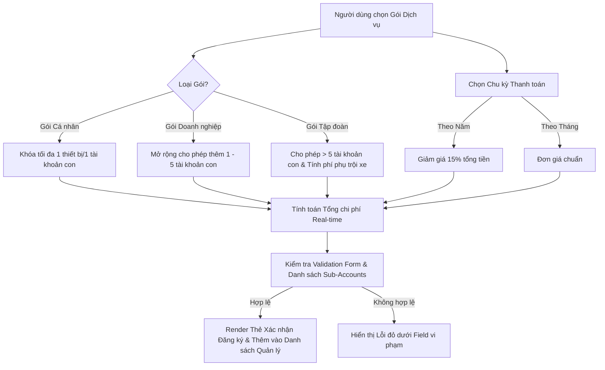

# Bài tập 8: Logistics (Mức độ 3: Nâng cao - Xây dựng tính năng mới)

### 1. Mục tiêu bài tập
- **Thành thạo Đăng ký & Xử lý Sự kiện (Event Handling):** Lắng nghe và xử lý các sự kiện giao diện người dùng như `click`, `change`, `input`, `blur` và `submit` bằng `addEventListener`.
- **Thành thạo Tương tác Form & Real-time Validation:** Kiểm soát luồng nhập liệu của Form đăng ký dịch vụ, ngăn chặn hành vi mặc định bằng `event.preventDefault()`, hiển thị thông báo lỗi tức thì khi người dùng gõ hoặc rời ô nhập liệu.
- **Áp dụng Event Delegation:** Tối ưu hiệu năng khi gắn sự kiện cho các danh sách phần tử dynamic (thêm/xóa tài khoản con) phát sinh trong DOM.
- **Tương tác DOM & Xây dựng Trạng thái (In-Memory State):** Quản lý trạng thái gói đăng ký (Subscription State) hoàn toàn trên bộ nhớ đệm JavaScript (Memory State) mà không sử dụng các công nghệ bất đồng bộ hoặc lưu trữ nâng cao chưa học.

---


### 2. Bối cảnh & Mô tả bài toán
Bạn là một Chuyên viên Phát triển Phần mềm Frontend tại một công ty công nghệ cung cấp giải pháp **LogiSaaS - Nền tảng Phần mềm Quản lý Chuỗi Cung ứng & Đội xe Vận tải theo dạng Gói Đăng ký Dịch vụ (SaaS Subscription)**. 

Hệ thống cho phép các doanh nghiệp vận tải chọn mua các gói phần mềm giám sát lộ trình container, quản lý tài xế và theo dõi xe theo các cấp độ khác nhau. Nhiệm vụ của bạn là xây dựng **Giao diện Đăng ký & Cấu hình Gói Dịch vụ Tương tác Real-time (LogiSaaS Subscription Configurator)**.



---


### 3. Quy tắc nghiệp vụ (Business Rules)


#### A. Định cấu hình các Gói Dịch vụ (Subscription Plans)
1. **Gói Cá nhân (Personal Fleet):**
   - Giá gốc: **50 USD / tháng**.
   - Hạn ngạch tài khoản con (Sub-accounts / Driver accounts): **Đúng 1 tài khoản**.
   - Khi chọn gói này, hệ thống phải vô hiệu hóa (disable) hoặc ẩn nút "Thêm tài khoản con", và chỉ cho phép giữ 1 tài khoản mặc định.

2. **Gói Doanh nghiệp (Business Fleet):**
   - Giá gốc: **200 USD / tháng**.
   - Hạn ngạch tài khoản con: **Tối đa 5 tài khoản con**.
   - Nếu người dùng cố gắng thêm tài khoản con thứ 6, hệ thống phải hiển thị thông báo cảnh báo lỗi và chặn hành động thêm.

3. **Gói Tập đoàn (Enterprise Fleet):**
   - Giá gốc: **500 USD / tháng** (bao gồm sẵn 20 xe / thiết bị GPS).
   - Hạn ngạch tài khoản con: **Không giới hạn**.
   - Quy tắc phí phụ trội: Từ thiết bị/tài khoản thứ 21 trở đi, tính thêm **15 USD / tháng cho mỗi tài khoản phụ trội**.


#### B. Chu kỳ Thanh toán & Ưu đãi (Billing Cycles)
- **Thanh toán Theo Tháng (Monthly):** Giữ nguyên tổng giá trị đăng ký theo tháng.
- **Thanh toán Theo Năm (Yearly):** Tính tổng tiền 12 tháng và **chiết khấu 15%** trên tổng hóa đơn năm. 
  $$\text{Tổng tiền năm} = (\text{Giá tháng} \times 12) \times (1 - 0.15)$$


#### C. Quy tắc Ràng buộc & Dynamic Validation (Real-time Errors)
1. **Tên Doanh nghiệp / Chủ tài khoản:** Không được để trống, độ dài từ 3 đến 50 ký tự.
2. **Email liên hệ:** Phải đúng định dạng email (`^[^\s@]+@[^\s@]+\.[^\s@]+$`). Phát hiện lỗi ngay khi người dùng rời ô nhập liệu (`blur`).
3. **Danh sách Tài khoản con (Sub-accounts List):**
   - Mỗi tài khoản con gồm: *Họ tên tài xế/nhân viên* và *Mã số bằng lái/GPS ID*.
   - Không được để trống bất kỳ trường thông tin nào của tài khoản con.
   - Không được phép trùng Mã số bằng lái/GPS ID trong cùng một đơn đăng ký.
4. **Trạng thái Thanh toán & Gia hạn (Renewal Status Simulation):**
   - Trạng thái mặc định khi đăng ký thành công: `ACTIVE`.
   - Nếu chọn tùy chọn mô phỏng "Thanh toán thất bại" (Failed Payment): Hệ thống đánh dấu trạng thái gói là `PAST_DUE`. Nếu quá 3 giây (mô phỏng 3 ngày) không bấm "Thanh toán lại", hệ thống tự động chuyển trạng thái về `EXPIRED` (Gói Miễn phí / Đã hủy).

---


### 4. Yêu cầu kỹ thuật & Triển khai


#### A. Cấu trúc DOM / HTML bắt buộc
Form đăng ký phải bao gồm đầy đủ các thẻ nhập liệu với ID/Class chuẩn hóa:
- Form đăng ký: `<form id="subscription-form">`
- Chọn gói: `<select id="plan-select">` (Options: `personal`, `business`, `enterprise`)
- Chu kỳ thanh toán: Thẻ radio hoặc select `<input type="radio" name="billing-cycle" value="monthly">` và `value="yearly"`
- Container chứa danh sách Sub-accounts: `<div id="sub-accounts-container">`
- Nút thêm tài khoản con: `<button type="button" id="btn-add-account">Thêm tài khoản con</button>`
- Khu vực hiển thị giá Dynamic: `<span id="total-price-display">$0</span>`
- Khu vực hiển thị danh sách gói đã đăng ký (Dashboard preview): `<div id="active-subscriptions-list">`


#### B. Yêu cầu Xử lý Sự kiện & JavaScript Logic
1. **Lắng nghe sự kiện `change` trên `#plan-select` và `billing-cycle`:**
   - Cập nhật số lượng tài khoản con hợp lệ.
   - Tính toán lại tổng chi phí ngay lập tức và render lên `#total-price-display`.

2. **Dynamic UI Rendering & Event Delegation:**
   - Khi bấm `#btn-add-account`, tạo động 1 HTML Row gồm 2 inputs (Tên, Mã GPS) và 1 nút "Xóa" `<button class="btn-remove-account">Xóa</button>`.
   - Sử dụng **Event Delegation** trên `#sub-accounts-container` để bắt sự kiện `click` vào nút `.btn-remove-account` để xóa đúng dòng đó khỏi DOM và tính toán lại giá.

3. **Lắng nghe sự kiện `input` / `blur` trên các ô dữ liệu:**
   - Hiển thị thẻ `<small class="error-message">` màu đỏ ngay bên dưới ô nhập liệu nếu dữ liệu sai quy tắc.
   - Xóa thông báo lỗi khi người dùng sửa đúng.

4. **Lắng nghe sự kiện `submit` trên `#subscription-form`:**
   - Gọi `e.preventDefault()` để dừng hành vi reload trang mặc định.
   - Chạy hàm validate tổng thể. Nếu có lỗi, focus vào ô lỗi đầu tiên và ngắt tiến trình.
   - Nếu dữ liệu hợp lệ:
     1. Khởi tạo đối tượng Subscription Data và thêm vào danh sách quản lý (In-memory Array `subscriptions = []`).
     2. Render thẻ Thông tin Gói đăng ký thành công vào `#active-subscriptions-list`.
     3. Reset Form về trạng thái mặc định.

5. **Giới hạn Phạm vi Kỹ thuật (Forbidden Scope):**
   - **TẬP TRUNG HOÀN TOÀN VÀO JS thuần DOM & Event Handling.**
   - **KHÔNG** sử dụng `fetch()`, `axios`, `async/await` (Chủ đề này dành cho Session 21).
   - **KHÔNG** sử dụng `localStorage` / `sessionStorage` (Chủ đề này dành cho Session 23). Tất cả dữ liệu lưu trong biến/mảng JS toàn cục.

---


### 5. Quy chuẩn nộp bài
- Cấu trúc thư mục dự án:
  ```text
  student-id_assignment8/
  ├── index.html
  ├── css/
  │   └── styles.css
  └── js/
      └── main.js
  ```
- File HTML phải liên kết chính xác với CSS và JS.
- Mã nguồn JavaScript cần đặt tên biến, hàm theo chuẩn CamelCase (ví dụ: `calculateTotalPrice`, `validateFormInput`, `renderSubAccountRow`).

### Tiêu chuẩn Đánh giá & Thang điểm (100đ)

| Tiêu chí | Điểm tối đa | Mô tả chi tiết |
| :--- | :--- | :--- |
| **Cấu trúc & Phong cách mã nguồn** | **20đ** | - Cấu trúc HTML5 semantic, CSS sắp xếp khoa học.<br>- Mã JS sạch sẽ, chia hàm nhỏ gọn theo đúng nguyên tắc Single Responsibility.<br>- Đặt tên biến/hàm gợi nhớ, có comment giải thích các đoạn xử lý logic phức tạp. |
| **Xử lý Logic & Nghiệp vụ Gói Dịch vụ** | **40đ** | - Tính toán chính xác giá tiền theo từng Gói (Personal, Business, Enterprise) và Chu kỳ thanh toán (Monthly/Yearly - giảm 15%).<br>- Xử lý đúng hạn ngạch số lượng tài khoản con theo từng gói (Personal = 1, Business <= 5, Enterprise > 20 tính phụ trội $15/tài khoản).<br>- Render chính xác thẻ đăng ký thành công lên DOM bằng JS. |
| **Xử lý Sự kiện & Real-time Validation** | **20đ** | - Sử dụng thành thạo `addEventListener` cho các sự kiện `submit`, `input`, `blur`, `change`.<br>- Sử dụng `preventDefault()` để ngăn reload trang.<br>- Áp dụng **Event Delegation** chuẩn xác cho thao tác Xóa tài khoản con dynamic.<br>- Báo lỗi thời gian thực chi tiết (Email sai định dạng, trùng mã GPS ID, thiếu thông tin). |
| **Tối ưu Hiệu năng & Trải nghiệm Người dùng** | **20đ** | - Cập nhật giá Real-time không giật lag.<br>- Disable/Enable thông minh các nút bấm (Ví dụ: vô hiệu hóa nút thêm tài khoản khi đạt giới hạn gói).<br>- Xử lý trạng thái thông báo rõ ràng, trực quan cho người dùng. |